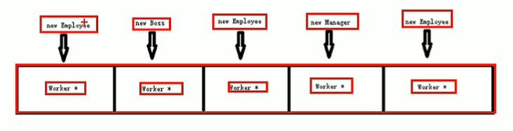

# C++ 使用手册

## 语法基础

注释：

- 行注释：//
- 块注释：/**/

### 一、内存模型

1、代码区：存放函数的二进制代码，由操作系统管理

2、全局区：存放全局变量和静态变量以及常量

- 全局变量、静态变量、常量区、字符串常量、const定义的常量

3、栈区：由编译器自动分配释放，川航函数参数、局部变量

4、堆区：程序员控制，程序结束自动释放

- 使用new运算符

### 二、引用（&）

#### 1、引用的基本用法

理解：给变量起别名，他们都指向同一块内存。

语法：数据类型 &别名 = 原名

① 普通变量引用

``` c++
int a = 100;
// 相当于 int *b = &a;
int &b = a; 
// 修改b，a的值也修改，他们是同一块内存
b = 20;

/* 错误引用 */ 
// 引用必须是一个合法的空间
int &b = 100;
```

② 数组引用

``` c++
int a[10] = {0};
//给数组起别名,arr指向a的空间
int (&arr)[10] = a; 
```

③ 函数引用

``` c++
int &cc = func(); //引用类型的函数
```

#### 2、引用的注意事项

- 引用必须初始化
- 引用初始化后不可修改
- 并没有引用变量（与指针不同），当去掉&符号，就是普通变量（而指针，只要声明了指针变量，他就一直是指针变量，不论带不带*）

``` c++
/* 引用必须初始化 */ 
int &a; //错误，没有初始化

/* 引用后不能修改 */
int b = 200;
int &c = b;
&c = 300; //错误，引用已经指向了b
c = 300;  //这是赋值操作，不是引用，正确
```

#### 3、引用做函数参数

- 本质还是指针传值，但比指针传值简单

``` c++
/* 声明 */ 
void swap(int &a, int &b);
void func(int (&arr)[], Player &p1, Player *p2);

/* 定义 */
// 定义引用传值，注意这里的&
void swap(int &a, int &b)
{
	// 引用传值，操作与普通变量操作相同
	int temp = a;
	a = b;
	b = tmp;
}
// 其他的引用方式
void func(int (&arr)[], Player &p1, Player *p2){
    // 数组
    arr[2] = 30;
    // 引用-结构体
    p1.name = 2;
    // 正常传递结构体指针
    // 既然都传递指针了，也就没有必要使用引用传递结构体
    p2->name = 3;
}

int main(){
    /* 普通调用 */
    // 引用传递，这里放的是值
    // 这样就与其他高级语言一样简单
    int a=200;
	int c=100;
	swap(a, b);
    
    // 数组和结构引用
    int arr[10] = {1,2,3,4};
	// 结构体
    Player p1;
    Player *p2 = new Player;  // Player类型的结构体
	func(arr, p1, p2);
}
```

#### 4、引用做函数的返回值

- 不要返回局部变量的引用，因为这个引用会销毁
- 函数的调用可以做左值

``` c++
/* 局部变量不要返回 */ 
int & test(){
    int a = 10;
    return a;
}
int &ref = test();
cout << ref << endl; //打印错误，第一次可能成功

/* 函数的引用可以做为 */
int & test(){
    // 全局区，程序结束后释放
    static int a = 10;
    return a;
}
int &ref = test();
cout << ref << endl; //打印10，因为他是static变量
// 这里test返回一个引用，相当于&ref = 1000
test() = 1000;
cout << ref << endl; // 打印1000
```

#### 5、常量引用

``` c++
//
const int & ref = 10;
// ref不能修改
ref = 20;

void test(const int &val)
{
    val = 100; //错误不能修改
}
```

### 三、HelloWorld

- <> ：系统头文件
- "" ：自定义头文件，当前文件所在的目录
- .h：是c语言的库，c++的库是不带.h

``` c++
// 标准输入输出流
#include <iostream> 
// 使用命名空间，可以省略std::的书写
// 不建议大面积使用，只在局部使用
useing namespace std;
// 因为iostream中有引入string库，所以可以不引用string而使用string定义变量
// 但要是使用string,应写上#include <string>
#include <string>

int main(int argc, const char * argv[]){
    // 标准的命名空间std
    // cout标准输出
    // << 左运算符，拼接基础类型，字符串
    // endl换行
	std::cout << “hello world” << std::endl;
	system(“pause”);//阻塞

	return EXIT_SUCCESS; // 返回正常退出
}
```

## 作用域

### 一、:: 运算符

- 作用域运算符
- 子类调用父类方法的运算符

```c++
// 作用域运算符
// 全局atc ::atc 
int atc=100;
void function()
{
	cout << ::atc <<endl //使用全局atc
	std::cout //std作用域下的cout方法
}
```

### 二、namespace关键字

- 使用命名空间，可以省略std::的书写
- 不建议大面积使用，只在局部使用

```c++
//命名空间必须定义在全局作用下
//命名空间可以嵌套命名空间
//命名空间可以放函数，变量，结构体类
//命名空间是开放的，可以随时添加进原来的命名空间，**同一个命名空间名会合并**
namespace LOL  // 声明一个命名空间
{
	void goattc();//函数
	int a;//变量
	struct Person{};//结构体
class B{};//类
namespace D{};//命名空间LOL::D::
}

//无名称的命名空间
namespace
{
int a; //相当于static int a;
}
```

### 三、using关键字

``` c++
//using编译指令
using namespace name 
//use声明，在函数内使用会有二义性，声明原则比编译指令高，
using name 
```

## 标准输入输出

### 一、键盘输出cout

``` c++
// 跳过回车，空格
// 默认按十进制输出
cout << 0b00001010 << endl; //输出10
cout << 0123 <<endl; //输出83
cout << 0xab << endl; //输出171

// 输出8进制
cout << bitset<8>(0b00001010) << endl; // 输出00001010
cout << oct << 0123<< endl; // 0123
cout << hex << 0xab << endl; //输出ab
//刷新缓冲区linux有用
cout.flush()
//放入缓冲区
cout.put(‘a’).put() 
// 
cout.write()
cout.width(20)
cout.fill(“*”)
//卸载10进制显示
cout.unsetf(ios::dec)
//十进制显示
cout.setf(ios::dec)
```

### 二、键盘输入cin

``` c++
// cin 输入设备，默认为键盘
char data;
// cin会根据输入的类型自动判断输入类型
cin >> data; //将输入值放入data变量
// 输入多个变量
cin >> num >> data
//获取一个字符，接收换行\n
char c = cin.get() 
//将字符放到buf变量中，获取1024个字符,读取字符串不会拿走\n需要在读取一次
cin.get(buf, 1024)
//读取换行符，并把换行扔掉
cin.getline(buf, 1024)
//忽略一个字符
cin.ignore()
//忽略了n个字符
cin.ignore(n)
//查看，然后再放入缓存区，用cin.get()可获取
cin.peek()
//将字符串返回缓冲区
char c = cin.get();
cin.putback(c); 
```

## New运算符

### 一、创建空间

- 返回的是该类型的**指针**

``` c++
// 创建10个int类型的空间
int *p = new int(10);
    
// 开辟数组,10个连续空间的数组
int *arr = new int[10];
    
// 函数
int * func(){}
int *p = func()
```

### 二、删除空间

```c++
/* 普通变量 */ 
int *p = new int(10)
// 删除
delete p;

/* 释放数组 */ 
// 新建数组
int *p = new int[10];
// 释放整个数组
delete [] arr;
// 释放数组中的一个值
delete arr[2];
```

## string类型

参考STL $\to$ 二、string-字符串

## 函数高级

### 一、默认参数

- 如果有一个值有默认参数，从这个位置开始，到最后面都必须有默认参数
- 定义和声明，只能有1个默认参数。

``` c++
// 声明
int func(int a = 1111);
// 从b开始到最后都必须有默认参数
int func(int a, int b =1, int c=2);

// 定义
int func(int a = 1111){
    return a;
}

/* 定义-实现 */
// 声明中含有默认参数
int func(int a=1);
int func(int a){
    return 1;
}
// 定义中含有默认参数
int func(int a);
int func(int a=1){
    return 1;
}
```

### 二、占位参数

``` c++
// 第二个参数是占位参数
void func(int a, int){
    return 1;
}
func(1,2)
    
// 占位参数的默认值
void func(int = 10){
    return 1;
}
func()
```

### 三、函数重载

函数名相同，但参数不同，从而根据参数选择不同的函数

- 参数不同包括，个数、类型、顺序、引用类型
- 函数的返回值，不能变成重载方式
- 重载，不加默认参数

#### 1、正常调用

``` c++
void func(int a){
    count << "func的调用——1"
}
void func(){
    count << "func的调用——2"
}

// 输出func的调用——1
func(1);
// 输出func的调用——2
func();
```

#### 2、常量

``` c++
/* 常量 */
void func(int a){
    count << "func的调用——1"
}
void func(const int a){
    count << "const int a"
}
int v = 10;
// 输出func的调用——1
func(v);
// 输出 const int a
func(10);
```

#### 3、引用传值

引用传值只能传递变量

``` c++
// 函数定义
void func(int &a){
    count << "func的调用——1"
}
// 无法引用，因为相当于int &a=10，非法
// 引用 只能引用变量
func(A);

void func(const int &a){
    count << "const int a"
}
// 合法，因为const是常量
func(10);
```

引用传值定义调用

``` c++
/* 常量引用 */
// 类中声明
void func(int &a);
void func(int &);

// 函数定义
void func(int &a){
    count << "func的调用——1"
}

// 使用，使用时不用加&
func(A);
```

## 类和对象

### 类的调用方法集合

1.  **应当使用带括号的构造方式**（`AA *a = new AA();`）

2. 有构造函数的类，不论有没有括号，都用构造函数进行初始化；

3. 没有构造函数的类

    不加括号的new只分配内存空间，不进行内存的初始化`AA *a = new AA;`;

    加括号的new会在分配内存的同时初始化为0  `AA *a = new AA();`

类方法调用（栈中创建）

``` C++
// WorkManager自定义类
class WorkManager{ ... };

// 方法一
WorkManager worker = WorkManager();
// 方法二
WorkManager worker;

worker.print_title(); //调用
```

指针方法调用（堆中创建）

``` c++
// WorkManager自定义类
class WorkManager{ ... }

WorkManager *worker = new WorkManager();
worker->print_title();
```

### 一、封装

#### 1、分文件编写类

①、创建类的头文件（NPC.h）

``` c++
#ifndef __xxx
#define __xxx
class NPC 
{
    // 构造和析构，必须在public下，或者什么都每没加的地方
	NPC()；  //构造方法,与类名相同
	~NPC()； //析构方法
private:
protected:
public:
    //成员属性
	int Name；
    //定义一个方法
	void move(int a); 
}
#endif //宏定义
```

②、创建类的.cpp文件（NPC.cpp）

``` c++
// 引入头文件
#include “NPC.h” 

NPC::NPC(){} //实现构造方法
NPC::~NPC(){ //析构方法
	delete this->a; //释放空间a
} 

//::成员操作符
void NPC::move(int a){ 
	std::cout << “1”;
}
```

③、在其他文件中使用类

``` c++
// 引入类的头文件
#include “NPC.h”

int main() {
    /* 普通方法 */
	NPC n1    // 实例化
	n1.move(1) // 调用NPC类中的方法move
	
    /* 使用new方法创建类 */
	NPC *n2；
    // 为什么要用指针，因为new返回一个该类型的指针
	n2 = new NPC() 
    n2 = &n1     // 可以指向一个已经创建的对象
        
	/* 构造函数调用 */
	NPC n3(1) //调用构造函数
	NPC * n3 = new NPC(1)
}
```

#### 2、类引用第三方类

``` c++
#ifndef __xxx
#define __xxx
// 第三方类
class Rect{ ... } 
// 引用的类
class NPC 
{
    //引用另外的类
	Rect * a; 
}
#endif //宏定义
```

#### 3、类的访问权限

- public

  方法，属性类外类内都可以使用

- protected

  方法、属性类内可以，类外不能访问

  子类可以访问父类的protected方法

- private

  默认权限，方法、属性类内可以，类外不能访问

  子类不可以访问父类的protected方法

另外：静态方法，属性不属于类的对象

``` c++
class AA(){
    static int m; //静态成员不属于类
	static void func3(); //静态成员函数不属于对象
}
```

#### 4、结构体和类的区别

主要区别就是默认权限不同，struct默认为公共，class默认权限是私有

#### 5、将成员属性设为私有

优势：可以自己控制读写权限，可以检查数据的有效性

``` c++
class Person
{
// 设置属性权限为私有
private:
    string name;
    int age;
// 提供修改属性的公共方法
public:
    // 修改名称方法，类外调用
    void fix_name(string a){
        // 这里可以验证字符串是否符合要求
    }
}
```

### 二、对象特性

#### 1、构造函数

``` c
class NPC 
{
    // 构造方法,与类名相同,自动调用
    // 构造函数可以有参数，可以重载
	NPC()；  
}

/* 单文件 */
class NPC 
{
	NPC(){
        count<< "构造函数调用"；
    }  
}
```

#### 2、析构函数

``` c++
class NPC 
{
    // 析构方法，与类名相同，自动调用
	~NPC();
}
```

#### 3、构造函数的分类

- 按参数分为：有参数构造和无参数构造
- 按类型分为：普通构造和拷贝构造

#### 4、有参构造函数

定义：

``` c++
/* 有参数构造函数 */
class NPC 
{
	NPC(int a);
}
```

调用方法：

``` c++
/* 括号法 */
//默认构造函数, 不要加小括号
NPC p1; 
// 有参数构造函数
NPC p2(10); 

/* 显示法 */
// 有参数构造
NPC p4 = NPC(10);

/* 隐试转换法 */
// 相当于 NPC p6 = NPC(10)
NPC p6 = 10
```

#### 5、拷贝构造函数

定义：

``` c++
/* 拷贝构造函数 */
class NPC 
{
    // 固定写法
    // 拷贝构造函数，需要把类传入
	NPC(const NPC &n);
}
```

调用：

``` c++
NPC p2;

/* 括号法 */
NPC p3(p2);

/* 显示法 */
// 不要使用拷贝函数初始化匿名对象
// 例：NPC(p5) 
// NPC(p5) 等价于 NPC p5,这时p5与13行对象名相同
NPC p5 = NPC(p2);

/* 隐试转换法 */
NPC p7 = p2;
```

#### 6、深拷贝和浅拷贝

浅拷贝：并没有正在的拷贝，而是用指针指向了同一块空间，是由于析构（释放）内存时，浅拷贝在第一次就把资源释放，第二次释放就出错了

深拷贝：在堆中重新申请空间

``` c++
NPC(const NPC & N){
    // 自己在构造时自定义一个
    m_Height = new int(*N.m_Height)
}
~NPC(){
    if(m_Height !=NULL){
        delete m_Height;
    }
}
```

#### 7、拷贝构造函数使用时机

1. 用已经创建好得对象初始化新类(Person p2(p1))
2. 值传递，将类作为参数（值传递，都会调用拷贝构造）
3. 以值得方式返回局部对象（会占用更多内存）
4. relese与debug模式运行结果不同

#### 8、初始化列表

- 给类的属性赋值的操作

①、传统操作

``` c++
class Person{
	//Person中定义属性
    // 建议使用_标注类属性
	int m_A; // int _m_A;
    int m_B;
    
	Person(int a, int b){
        m_A = a;
        m_B = b;
    }
}
```

②、使用初始化列表

``` c++
class Person {
	//Person中定义属性
	int m_A; 
    int m_B;
    /* 方法一 */
    //直接将m_A赋值为10，m_B=20
    Person():m_A(10), m_B(20) {
        ... 
    } 
    
    /* 方法二 */
    // 将变量a的值赋值给m_A，将变量b的值赋值给m_B
    Person(int a, int b): m_A(a), m_B(b) { 
        ... 
    }
}
```

#### 9、类对象作为类成员

##### 不使用类声明指针

构造流程：以下例子，先构造A的对象，再构造B的对象

析构流程：以下例子，先析构B的对象，再构造A的对象

``` c++
/* 多个类赋值例子 */ 
class A {
    string name;
    A(string b_na){
    	name = b_na
    }
}
// 在B中定义一个属性，这个属性是自定义的一个类
class B {
    A b_name;
    int b_b;
    // 构造函数中赋值
    // 注意这里的b_name(n)等价于
    // A b_name = n;
    B(int a, string n):b_b(a), b_name(n){
		... 
    }
}

// 调用
B p(1, 'name')
```

##### 前置声明（类指针）

常见错误：

- `class “xxxx“ does not name a type` 
- `declare class does not name a type` 

产生原因：在一个源文件中，要声明或定义一个类的指针时，必须在使用前声明或定义该类

``` c++
/**---------------错误范例--*/
/*== 文件：A.h == */
class ABCDE {...}
/*== 文件B.h ==*/
class B
{	
    // 不可运行，没有在本类中声明ABCDE
    ABCDE *a; 
}
/**---------------错误范例--*/

/**---------------正确范例--*/
/*== 文件：A.h == */
class ABCDE {...}
/*== 文件：B.h ==*/
class ABCDE; //
class B
{	
    // 正确，已经在本类中声明ABCDE
    ABCDE *a; 
}
/**---------------错误范例--*/
```

#### 10、静态成员变量

- 所有静态成员共享同一份数据

    ``` c++
    class B{...}
    class A{
    public:
        static int AA;
    }
    int A::AA = 10;
    // 所有静态成员共享同一份数据
    B b;
    cout << b::AA// 与classA中的AA是一个,也是10
    ```

- 静态变量在编译的时候就已经创建，且值为0

- **必须类内声明，并在类外初始化**，使用前必须初始化

- **静态数据成员不属于某个对象，在为对象分配空间中不包括静态成员所占空间**

- 可以在程序的任意位置访问，赋值

``` c++
/* --------------文件：A.h */
class A {
public:
    // 声明
	static int m_age; 
    static int *b; 
}
/* --------------文件：A.h */

/*---------------文件：A.cpp */
// 类内声明，类外初始化加定义
// 且不用加static
int A::m_age = 100;
// 指针的定义方法
int * A::b = 200;

// 方法二，直接通过类名访问（常用）
A::m_age = 300;

// 方法一，通过对象访问（普通方法）
// 先初始化类，再调用类
A value；
value.m_age = 200;
```

#### 12、静态方法

1. 静态方法只能操作静态变量、其他静态方法
2. 静态方法没有 this 指针
3. 类中普通方法可用调用静态方法
4. 静态方法也是全局可用，内存中只有一份

``` c++
/* --------------文件A.h */
class A {
public:
    // 静态成员函数只能访问静态成员变量
	static void func(); 
}
/* --------------文件A.h */
/* --------------文件A.cpp */
// 定义静态成员函数
#include "A.h"
void A::func()
{
    // 其中不能使用非静态成员变量
}
/* --------------文件A.cpp */

// 调用一，通过对象
A a;
a.func();
// 调用二，通过类名
A::func();
```

#### 13、静态与非静态互相调用

方法一：

1. 这种方法，调用的时候必须传入 `A a = new A()` 中的A

``` c++
/* A.h */  
// 通过传递类的地址调用非静态
class A {
public:
    static void test(A *a);
private:
    int m_a；
};
/* A.cpp */
void A::test(A *a) {
    a->m_a += 1;
}
```

静态成员函数可以访问静态成员，在类是单例类的情况下，可以在创建的时候把this指针赋值给那个静态成员，然后在静态成员函数内部访问this指向的静态成员：

``` c++
/* A.h */
class A {
public:
    A();
    static void test() 
private:
    // 利用静态方法可以访问静态成员，保存一个静态变量
    static A *m_gA;
    int m_a
}
/* A.cpp */
// 静态变量必须声明,不然不可使用
A * A::m_gA = NULL;

A::A(){
    A::m_gA = this;
}
void A::test(){
	A::m_gA.m_a += 1;
}
```

#### 14、this指针

1. this指针指向被调用的成员函数（谁调用，就指向谁）
2. this指针用途：
    - 当形参和成员变量同名时，可用this区分
    - 在类的非静态成员函数中返回对象本身，可使用`return *this`

①、解决名称冲突

``` c++
class Person {
	int age;
    Person(int age){
        // 属性名与方法名重名
        this->age = age
    }
}
// this指针指向的时p1
Person p1(18);
```

②、返回类本身（可进行链式编程）

```c++
class Person
{
public:
    int age;
    // 若返回值(Person func(int a))，就不会进行累加操作
    Person & func(int a){
        this->age +=a;
        return * this
    }
}

Person p1;
p1.func(10).func(20).func(30);
```

#### 15、空指针

``` c++
class Person
{
public:
    int age;
    // 若返回值(Person func(int a))，就不会进行累加操作
    void func(){
        cout << "this this kong";
    }
    void func2(){
        // 因为默认成员属性前面有this->
        // 当空指针类的时候，就变成NULL->age
        cout << age;
    }
}

Person *p1 = NULL;
p1.func(); // 没错
p1.func2();// 报错
```

#### 16、const修饰

①、常函数

- 限制修改类属性的值

``` c++
class Person{
    // 加了mutable，就可以修改
    // 灿han'shu
	mutable int B;
	int a;
    //常函数，不允许修改类的成员属性
	void showInfo() const {
        // 错误，不能修改
		this->a = 100;
        // 正确，mutable是可以修改的
        this->B = 100;
	}
}
```

②、常对象

- 常对象可以调用常函数，不能调用普通方法

``` c++
class Person{
	mutable int B;
	int a;
    //常函数，不允许修改类的成员属性
	void showInfo() const {
        // 错误，不能修改
		this->a = 100;
        // 正确，mutable是可以修改的
        this->B = 100;
	}
    // 普通方法
    void func(){...}
}

const Person p2; 
p2.a = 100; // 错误，不能修改
p2.B = 100; //正确，mutable修饰，可以修改
cout << p2.name // 可以读
    
const Person p3;
p3.func(); // 错误，不能调用
p3.showInfo();// 正确，可以调用常函数
```

#### 17、类中枚举

- 类中枚举是定义在静态区

``` c++
class A {
    public:
    	enum type{one,two,tree};
}
type i;// 定义一个类枚举
type i = A::one;//给枚举类i赋值A::one
```

### 三、友元函数

可以访问指定类中的私有方法、属性

①、全局函数做友元

``` c++
// 定义
class Buliding {
    // 告诉编译器，允许goodGay() 函数访问私有属性
	friend void goodGay(Buliding &bul);
}

//全局友元函数
// void goodGay(buliding * bul)
void goodGay(buliding &bul）{
	//这里可以调用Buliding访问私有方法属性
}
```

②、类做友元

``` c++
// 定义
class Buliding{
    // 告诉编译器，允许goodGy 类访问私有属性
	friend class goodGy；//类做友元
}
class GoodGay {
    void visite(){  }
}
```

③、成员函数做友元

``` c++
// 定义
class Buliding{
    // 告诉编译器，允许GoodGay类下的visit方法访问
	friend void GoodGay::visit()；//类做友元
}
class GoodGay {
    void visit(){  }
}
```

### 四、运算符重载

对已有的运算符进行重新定义，赋予另外一种功能

#### 1、加法重载

①、通过成员函数重载

``` c++
class Person {
public:
    int a;
    int b;
    //重载+号运算
	Person operator+(Person &p){
        return this.a+ p.b;
    } 
}

// 初始值
Person p1;
p1.a = 10;
Person p2;
p2.b = 20;

// 调用
// 本质是Person p3 = p1.operator+(p2);
Person p3 = p1+p2;
```

②、通过全局函数重载

``` c++
class Person{
    int a;
    int b;
}
// 全局函数重载
Pserson operator+(Person &p1, Person &p2){
    return p1.a+p2.b;
}

// 初始值
Person p1;
p1.a = 10;
Person p2;
p2.b = 20;

// 调用
// 本质：Person p3 = operator+(p1, p2);
Person p3 = p1+p2;
```

#### 2、左移运算符

只通过全局函数重载

``` c++
// 全局函数重载
void operator<< (ostream &cout, Person p){
    cout << p.m_a
}


// 重写左移运算符
Person p;
p.m_a = 100;
cout << p;

/* 链式调用 */
// 链式返回
ostream operator<< (ostream &cout, Person p){
    cout << p.m_a;
    return cout;
}
cout <<p <<p << endl;
```

#### 3、递增运算符重载

``` c++
```

#### 4、赋值运算符重载

#### 5、关系运算符重载

#### 6、函数运算符重载

### 五、继承

1. 父类子类中同名函数，优先调用父类中的函数
2. 父类子类中同名函数，父类中是虚函数，则调用子类函数

#### 1、基本语法

①、父类 base.h

``` c++
class Base {}
```

②、子类 

继承方式：

- public：父类的public、protected权限到子类中不变
- protected：父类的public、protected到子类中都变protected权限
- private：父类的public、protected到子类中权限都变为private
- 父类的private权限不允许继承

``` c++
// 引入要父类的头文件
#include “base.h” 
// 继承base类，默认是private继承
class chile : Base {} 
// 继承多个父类,Base、Base2
class chile : Base, Base2 {} 

/* 继承方式 */
// 公众继承
class chile : public Base {} 
// Base中的类public protected private不变
class chile : protected Base {} //保护继承
// Base中的public 变为 protected
class chile : private Base {} //父类属性变为private
// Base中的private protected变为private
```

#### 2、调用父类构造函数

``` c++
class Base{
    int s;
    Base(int a){}
}

class Son:public Base{
    int s;
    Son(int a) : Base(a){} //调用父类构造函数
}
```

#### 3、继承中的对象模型

父类中的所有非静态成员属性都会被子类继承，但private权限的属性被编译器隐藏了

``` shell
# 查看类的分布图
# 打开开发人员命令提示工具查看对象模型
cl /d1 reportSingleClassLayout类名 文件名
```

#### 3、继承构造析构顺序

- 构造先创建父类，再构造子类
- 析构先析构子类，再析构父类

#### 4、继承同名函数

- 访问子类同名成员，直接访问即可
- 访问父类同名成员，需要添加作用域

``` c++
class base{
    void func(){...}
}

class son:public base {
    void func(){ ... }
}

// 创建一个类
son s1;
// 默认调用子类中的属性，
// 子类会隐藏掉所有的同名函数（父类重载的函数都不会被调用）
// 要想调用父类的重载函数，需要添加作用域
s1.func(); 
// 想调用父类的方法需要添加作用域,调用父类Base中的属性
s1.Base::func();
```

#### 5、同名静态成员

``` c++
class Base{
public:
	static int m_A;    
}
// 类外赋值
int Base::m_A = 100;

class son: public Base{
public:
	static int m_A;    
}
// 类外赋值
int son::m_A = 200;

// 方法一，通过对象访问
son s1;
s.m_A; //访问son类自己的m_A
s.Base::m_A; //访问父类base的m_A属性

// 方法二、通过类名访问
son::m_A; //不用初始化对象
son::Base::m_A //通过子类的父类访问
```

#### 6、多继承

实际开发中不见时使用多继承，因为会有父类函数重名的危险

``` c++
class Base1{}
class Base2{}
// 多继承写法
class son: public Base1, public Base2{
public:
	static int m_A;    
}
```

#### 7、菱形继承

解决方法：使用作用域

### 六、多态（虚函数）

多态分为2类，一是静态多态和动态多态

- 静态多态：函数重载、运算符重载、函数名复用
- 动态多态：派生类、虚函数

静态多态和动态多态的区别

- 静态多态的函数地址-编译的时候确定
- 动态多态的函数地址-运行的时候确定

#### 1、多态的基本语法

多态满足条件：

- 必须有继承关系
- 子类必须重写父类的虚函数（注意，重写是完全相同）

##### 地址早绑定

无法实现多态，样例

``` c++
class Animal {
	void speak(){ printf("动物在说话") }
}

class A:public Animal{
    // 重写了父类的speak
	void speak() { printf("A在说话") }
}

// 这里是已经与Animal类绑定的，不能修改
void dospeak(Animal & animal){
	animal.speak(); 
}

int main(){
	A cat;
    // 这里打印的是,动物在说话
	dospeak(cat)
}
```

##### 地址晚绑定

多态，样例

``` c++
class Animal {
    // 这个函数就是虚函数
    // 这个函数可以被其他同名函数替代
	virtual int speak(){ printf("动物在说话") }
}

class A:public Animal{
	int speak(){ printf("A在说话")}
}

// 使用，父类的指针或引用执行子类的对象
void dospeak(Animal& animal){
	animal.speak(); 
}

int main(){
    // 可以理解为cat是参数
	A cat;
    // 调用的是Animal中的speak方法，打印的却是cat中的speak方法
	dospeak(cat)
}
```

##### 多态使用，样例三

``` c++
class Animal {
	virtual int speak()=0;
}

class cat:public Animal{
	int speak(){ printf("A在说话") }
}

int main(){
    Animal *A = new cat();
    // 打印的都是cat中的方法
    A->speak();
}
```

#### 2、多态的原理

待补充

#### 3、抽象类（纯虚函数）

只要类中含有一个纯虚函数，那么这个类就是抽象类。抽象类特点

- 无法实例化对象
- 子类必须重写抽象类中的纯虚函数，否则子类也是抽象类
- 抽象类只用.h文件即可，不需要.cpp文件
- 特点：必须有 virtual与=0

##### 多文件结构

纯虚函数定义.h文件，不需要.cpp文件

``` c++
class NPC {
    // 纯虚函数，子类必须实现
    virtual void fire(int a) =0; 
}
```

继承虚函数，其他.cpp文件

``` c++
#include "func.h"
// One.h 文件
class One:public NPC {
    // 重写虚函数，virtual可以写也可以不写
    /*
    void fire(int a); 等价于virtual void fire(int a);
    */ 
    virtual void fire(int a);
    
}    
// One.cpp文件，实现虚函数
virtual One::fire(){
    ...
}

/* 调用 */
One o1;
o1.fire(1);
```

##### 单文件结构

``` c++
class One:public NPC {
    // 使用，必须重写类中的纯虚函数
    void fire(int a){
        ....
    }
}

/* 调用 */
One o1;
o1.fire(1);
```

#### 4、虚析构和纯虚析构

在使用多态的时候，父类指针无法调用子类的的析构函数

``` c++
/* 纯虚析构的定义 */
class Animal {
    // 方式一、虚析构必须实现
    // virtual ~Animal(){ ... }
    
    // 方式二、必须定义，定义虚构函数后，让子类重写
    // 这样子类析构的时候，就会调用子类的析构函数
	virtual ~Animal() = 0;
    // 父类虚函数，不重要
    virtual void speak()=0;
} 

// 纯虚析构，需要在内中声明，在类外实现
// 纯虚析构必须得有实现
Animal::~Animal(){
	cout << “animal纯虚析构”;
}

/* 使用虚构函数 */
class Cat:public Animal {
public:
    char *name;
    void Cat(const* name){
        this->name = new char[strlen(name)+1]; 
        strcpy(this->name, name);
    }
	// 注意，这里并未重写父类析构，
    // 但只要父类定义了虚析构函数，就可以调用这里的析构函数
	~Cat() {
		if (this->name !=NULL){
			delete [] this->name;
		}
	}
}

/* 
发生问题原因：
创建的是父类的指针animal,释放的也是父类animal,而我们则是利用多态创建的子类cat，调用的也是子类cat中的speak方法，而没有释放掉子类cat中的堆空间
*/
Animal * animal = new Cat(“TOM”); 
//多态，调用Cat类的speak方法
Animal->speak(); 
delete animal;
```

#### 5、多态的应用

（1）、将不同类型的指针放到同一个数组中（使用父类的指针，子类是不同的）



使用时需要二级指针：`worker **k = new worker *[5]` 

- 注意这里与数组指针的意思不同不能混淆，这里是创建5个worker\*指针类型的数组。

## 文件操作

文件类型分为两种

- 文本文件：文件以ASCII码形式存放在计算机中
- 二进制文件：文件以文本的二进制形式存储在计算机中

文件操作三大类

- ofstream：写操作
- ifstream：读操作
- fstream：读写操作

### 一、文本文件

文件操作方式：

- ios::in：  读文件的方式打开
- ios::out： 写文件的方式打开
- ios::ate： 初始位置：文件尾
- ios::app： 追加方式写
- ios::trunc： 如果文件存在，先删除在创建
- ios::binary： 二进制方式
- 多方式打开：ios:out | ios::trunc 使用2种方式

#### 1、写操作

``` c++
/* 导入头文件 */ 
#include<fstream>

/*  创建流对象 */
ofstream ofs;
/* 打开文件 */ 
ofs.open(“路径”, ios::in);
/* 写数据 */ 
ofs<< “想要向文本输入的” << endl;
/* 关闭 */ 
ofs.close();
    
/* 判断打开时候成功 */
// 成功返回1,失败返回0
ofs.is_open();
```

#### 2、读文件

``` c++
/* 导入头文件 */ 
#include<fstream>

/* 创建流对象 */
ifstream ifs;
/* 打开文件 */ 
ifs.open(“路径”, ios::out);
/* 读数据、方式一 */ 
char buf[1024] = {0};
// 读的数据放到buf中
while(ifs >> buf){
    //读取完成后，输出
	couf<< buf <<endl; 
}
/* 读数据、方式二 */ 
char buf[1024] = {0};
while( ifs.getline(buf, sizof(buf)) ){
	couf<< buf <<endl; //读取完成后，输出
}
/* 读数据、方式三 */ 
string buf;
while( getline(ifs, buf) ){
	couf<< buf <<endl; //读取完成后，输出
}

/* 关闭 */ 
ofs.close();

/* 判断打开时候成功 */
// 成功返回1,失败返回0
ofs.is_open();

/* 获取数据，放到buf中，每次读取sizfo(buf)个大小 */
ifs.getline(buf, sizeof(buf))
/* 每次获取1个字符 */
char c = ifs.get();
/**/
ifs.eof()
```

### 二、进制文件

文件类型特定为：ios::binary

二进制写文件不建议使用string类型，会有不可预料的错误

#### 1、写文件

``` c++
/* 导入头文件 */ 
#include<fstream>

/* 创建流对象 */
ofstream ofs;
/* 打开文件 */ 
ofs.open(“路径”, ios::out | ios::binary);
/* 写数据 */
Person p = {'张三', 18}；
// 将p类型强转换为char指针类型
ofs.write((const char *)&p, sizeof(Person))
/* 关闭 */ 
ofs.close();
```

#### 2、读文件

``` c++
/* 导入头文件 */ 
#include<fstream>

/* 创建流对象 */
ifstream ifs;
/* 打开文件 */ 
ifs.open(“路径”, ios::in| ios::binary);
/* 读数据*/ 
if (!ifs.is_open()){
    cout<< "打开失败"
        return;
}
// 用于存放数据
Person p;
// 读取的数据放到p中，大小是sizeof(Person)
ifs.read( (char *)&p, sizeof(Person))

/* 关闭 */ 
ofs.close();
```

## 模板-泛型编程

C++使用模板实现范式编程，模板的目的是提高程序的复用性（类似于PPT什么的）

### 一、模板基本语法

``` c++
// template 声明创建一个模板
// typename 表明这是一个数据类型，可以使用class代替
// T 通用的数据类型，名称可以替换，通常为大写字母
template <typename T>
函数声明或定义

// class与typename没有区别
template <class T>
函数声明或定义
```

#### 1、函数模板

``` c++
// 一般的例子，对照组：
void swapInt(int &a, int &b){
    int temp = a;
    a = b;
    b = temp;
}
/* 改写成模板 */ 
// 声明一个模板，告诉编译器不要出错
template <typename T>
void mySwap(T &a, T&b){
    T temp = a;
    a = b;
    b = T;
}
// 使用模板
// 编译器自动推导
int a = 10;
int b = 20;
mySwap(10, 20);

// 显示指定类型
int a = 10;
int b = 20;
// <>告诉模板是int类型
mySwap<int>(a, b)
```

模板必须指定T的类型

``` c++
// 声明一个模板，告诉编译器不要出错
template <typename T>
void mySwap(){ cout << "xxx"; }
// 因为mySwap中没有参数，但必须在模板中指定类型
mySwap<int>()
```

#### 2、类模板

``` c++
template <class T>
class mySwap{
public:
    mySwap();
}

//可以添加默认类型
template<class T,class T2=int>
class LinkList{
	T name;
	T2 age;
	LinkList(T name, T2 age){}
}

int main(){
	string a; int 1;
    //必须使用显示转换，函数模板可以自动推导，类模板不能推导
	LinkList<string, int>(a, b) 

}
```

### 三、普通函数与模板的调用规则

- 优先调用普通函数

  ``` c++
  // 优先调用
  void mySwap(T &a, T&b){
      cout << "xxx"
  }
  
  template <typename T>
  void mySwap(T &a, T&b){
      cout << "xxx"
  }
  ```

- 通过空模板参数列表来强制调用函数模板

- 函数模板可以发生重载

  ``` c++
  template <typename T>
  void mySwap(T &a, T&b){
      cout << "xxx"
  }
  template <typename T>
  void mySwap(T &a, T&b, T&c){
      cout << "xxx"
  }
  ```

  

- 函数模板可以产生更好的匹配优先调用函数模板


### 模板做函数参数

``` c++
void doWork(Person<string, int> &p) {
	P.show()
}

//参数模板化
template<class T1, class T2>
void doWork(Person<T1, T2>&p){...}
```

### 具体化模板

因为某些特定的数据，无法通过模板传递

### 三、类模板与继承

template<class T>

class Base

{

public:

T m_A;

}

 

//必须告诉child类型,否则不能分配内存

class Child: public Base<int> {}

 

//由用户指定类型

template<class T1, class T2>

class Child: pulbic Base<T2>

{}

### 四、模板的分文件编写

1、模板的文件是.hpp

2、方法实现与声明放到同一个文件中

因为C语言是份文件编译，但模板文件类型是在运行时确定，所以不能使用.h方法引入

可以直接引入.cpp文件，

模板文件编译在运行时会出错

 

### 五、模板与友元函数

## 异常

### 一、基本语法

``` c++
try{} catch(int) {}//捕获int类型异常

try{} catch(){} catch(){} //捕获多个异常

try{} catch(...){} //捕获其他类型异常

 

throw 1//抛出异常，可被catch抓到

throw 3.14//抛出double异常

 自定义异常类

class my Exception

{

public:

void myException();

}

 

throw MyException(); //抛出异常类

catch(MyException e)
```

### 二、栈解旋

从try开始，到throw抛出异常之前，所有栈上的对象都会被释放

### 三、异常接口声明

void func() throw() //不能抛出任何异常

void func() throw(int) //抛出int类型异常,当前函数只能抛出int错误

{

throw 1;

}

### 四、异常生命周期

throw new MyException();

catch(MyException *e)

{

delete e;

}

### 五、异常多态

### 六、标准异常库

\#include<stdexcept>

throw out_of_range(“年龄越界”); //越界异常

e.what() //异常信息
