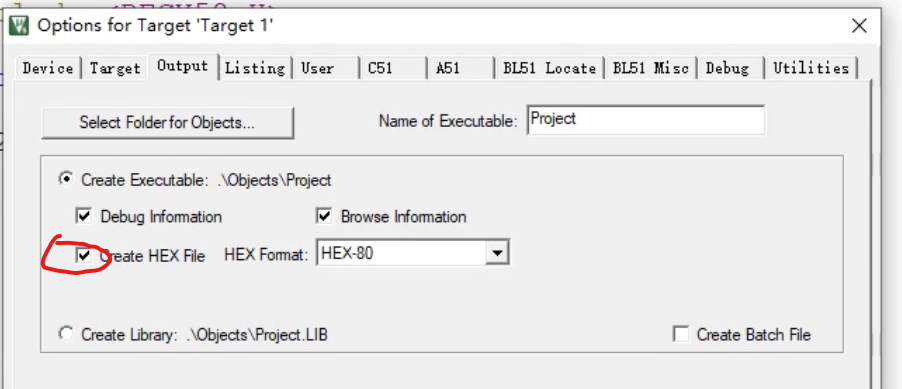
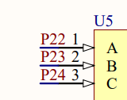
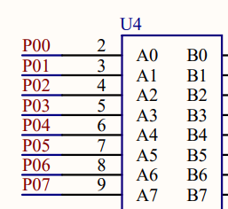
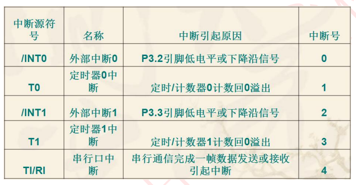

# 51单片机（MCU）

## 说明

单片机（Micro Controller Unit）内部集成了CPU、RAM、ROM、定时器、终端系统、通讯接口等一些内电脑常用硬件功能

### 一、单片机信息

STC 89  C  52  35  i-DIP 40  HRN514.X 90C

- STC：公司
- 89：单片机的系列
- C：工作电压
    1. C：5.5~3.8v
    2. LE：3.6\~2.4V/3.4V\~2.4V
- 52:工作空间及RAM空间大小
    1. 51：4K程序空间及512B RAM
    2. 52：8K程序空间及512B RAM
    3. 54：16K程序大小及1280B RAM
- 35：工作频率，35HZ
- i：工作温度，-40\~85
- DIP：封装类型
- 40：阵脚数
- 90C（最后几个数）：STC89C52区分为90C版本和HD版本
    1. 90C版本：无EA、PSEN阵脚
    2. HD：无p4.6/p4.5/p4.4接口，有EA\PSEN针脚

### 二、单片机图例说明

电源引脚：Vcc（电源正极）、Gnd（电源负极）

时钟引脚（晶振引脚）：XTAL1、XTAL2

编程引脚：PST（复位引脚）、PSEN、ALE/PROG、EA/Vpp

IO引脚（GPIO）：P0、P1、P2....

### 三、常用芯片功能说明

1. 74HC595（移位寄存器）：串行输入并行输出的寄存器（常用于接口扩展）

2. DS1302（实时时钟芯片）：可以对年、月、日、周、时、分、秒进行计算

    RTC：实时时钟，一种集成电路

3. 三极管：

    NPN高电平开关，高电平接通

    PNP低电平开关，底电平接通

4. ULN2003（达林顿晶体管）：高电压高电流集成电路，重要用于继电器驱动器、字锤驱动器、灯驱动器、显示驱动器、线路驱动器（给信号，就能驱动设备）

    DIP-16：同类，

    ULN2003D：常用于驱动步进电机

## 基础应用

### 一、软件

- Keil5：（编程开发工具）

    MDK-Arm：对应ARM设备

    C51：对应8051设备（51单片机）

    C251：对应80251设备（）

    C166：对应c166，xc166等设备

- STC-ISP：（程序下载工具，烧录软件）

### 二、安装51驱动

此电脑：右击 $\to$ 设备管理器 $\to$ 其他设备 

### 三、烧录过程

接口说明：

1. 专业使用Pis32接口
2. 一般使用USB转TTL接口，使用CH340G（外带晶振）芯片（CH340C内置晶振）

#### Ⅰ、STC-ISP使用说明

1. 生成HEX文件

     

2. 选择单片机型号STC89C52-RC： 

    板子不同，单片机型号不同，错误的型号是无法写入板子的

    错误信息：卡在 `正在检测目标单片机 ...`  

3. 选择串口号USB-SERIAL CH340(com18)： 

4. 选择：打开程序文件，选择生成好的.hex文件

5. 点击：下载/编程

6. 复位单片机

### 四、最小单片机应用

构成：电源电路、晶振电路、复位电路、下载电路

### 五、创建项目

Project $\to$ new Project $\to$ 选择项目文件夹 $\to$ 选择开发芯片“STC51”（兼容版本：AT89C52、AT89C51） $\to$ `copy standard 8051 startup code to Project Folder and add file to Project` 是否需要复制启动文件：选NO（编译器会自动添加） $\to$ 右击 `Add New item to Group "Source Group1"` ；选择.c文件 

### 六、51单片机头文件

 AT89C52中寄存器的头文件：`#include <REGX52.H>` 

- 此头文件定义了 P0、P1、P2 的地址，可通过P0、P1、P2直接操作对应接口

左移右移头文件：`#include <intrins.h>` 

### 七、数据类型

``` c
// 单片机多用unsigned类型，char正好是8位
unsigned char i
```

## 功能实现

### 一、LED

#### Ⅰ、简单LED点亮

Ⅰ、原理

1. 区分正负极
2. 1为高电平，0为低电平，LED通过高低电平控制亮
3. 单片机输出低电平即为亮灯

Ⅱ、操作LED

``` c
#include <REGX52.H>

void main(){
    /* 通过16进制操作 */
    // 操作P2口，实现LED灯亮灯灭；
    // 0xFE 对应的二进制为 1111 1110 ；对应P2口的8个针脚（查看原理图） 
    P2=0xFE;
    // 全灭
    P2=0xFF;
    
    /* 通过 REGX52中定义的接口，操作指定接口 */
    // 0是亮灯，1灭灯
    P2_0 = 0;
	P2_7 = 1;
    
    /* 通过左移右移操作LED */
    // 0000 0001 向左移1位
    P2=0x01 << 1;
}
```

#### Ⅱ、LED点阵屏


### 二、按键操作

1. 按下接地，电压为0，所以0为接通，1为断开
1. 矩阵键盘：逐行扫描进行确定按键

Ⅱ、独立开关

``` c
#include <REGX52.H>

void main(){
    /* 通过 REGX52中定义的接口，操作指定接口 */
    // 由开发原理图得知，P30-P33是独立按键控制
    // 0为接通，1为断开
    while(1){
        // 独立按键k2按下
        if(P3_0 == 0){
            // LED灯07量
            P2_7 = 0;
        }
    }
}
```

Ⅲ、矩阵键盘

调用BaseLib.h中的方法


### 三、数码管

Ⅰ、原理

- 构成：138译码器、数码管、74HC245（双向数据缓冲器）

    138译码器：通过3个接口控制数码管多个接口

    - 原理：3个位二进制数可以表示0-7（共8个数），所以138译码器通过3个口输入二进制组合，经译码器转化为10进制确定控制的是哪一个数码管接口，再将10进制数转换为8位二进制数，从而控制数码管的二进制数

- 数码管分为共阴极、共阳极，不同得构造亮得代码不同

- 由图例得P22、P23、P24是控制哪个灯亮、P0-P7控制显示什么数据

      

- 使用专用的驱动芯片：TM1640

    专门用于数码管显示的芯片，可以节省单片机性能

Ⅱ、静态数码管显示

``` c
#include <REGX52.H>

void main(){
    // 选择数码管哪一个亮
    // 001 =》十进制1，LED01亮 
    P2_2 = 1;
	P2_3 = 0;
	P2_4 = 0;
	while(1){
        // 显示数据，0x6 => 0000 0110
        // 0000 0110根据原理图是bc亮
		P0 = 0x6;
	}
   
}

// 数码管显示
unsigned char NixieTable = {
    // 对应数码管中的a,b,c,d,e,f,g（注意不同的物理结构，以下数据也应不同）
    0x3f,0x06,0x5b,0x4f,0x66,0x6d,0x7d,0x07
}
// 样例 控制
void f(int n){
    switch(n){
        case 1: P2_2=1;P2_3 = 0;P2_4 = 0;break;
        case 2: P2_2=0;P2_3 = 1;P2_4 = 0;break;
    }
    /* 清影 */
    // 因为单片机速度很快，当选中显示的数码管后，显示的数据没有跟上
    // 这时会造成重印,使用delay暂停1毫秒，在把数码管显示灭掉
    delay(1);
    P0 = 0x00;
}
```

### 四、LCD1602液晶屏

直接调用LCD1602.h文件

### 五、定时器

Ⅰ、原理

STC89C52的T0和T1均有4种计数模式

1. 模式0：13位定时器
2. 模式1：16位定时器（2字节，最大数65535）常用
3. 模式2：8位定时器
4. 模式3：2个8位定时器

中断号说明：

Ⅱ、操作方法

``` c
void TimerInit()
{
    /* 设置工作方式计时器, 模式只能选择1种
    -  GATE=0，只要TCON中TR0=1或TR1=1即可启动计时器
    -  GATE=1，需要TCON中TR0=1或TR1=1和外部中断引脚INT0/1也为高电平才可以使用
    -  TMOD低四位用于T0
    -  TMOD高四位用于T1
    */ 
    TMOD &= 0x0F; //高4位清零，底4位不变
    // 定时模式 
    // 0000 0001: 定时器T0，使用定时模式，16位计时器
    // 为什么要使用 |= 运算：
    //   因为TMOD只有1个，若是同时使用2个定时器（T0T1），
    //   等号赋值会刷掉一个，用逻辑|=运算，则可保留
    TMOD |= 0x01;
    // 计数模式
    // 0000 0101: 定时器T0，使用计数模式，16位计时器
    TMOD |= 0x5;
    
    /* 设置控制寄存器
    -  TCOM底4位用于控制外部中断 ---- 0000
    -  TCOM高4位用于控制计数器   0000 ----
    -  也可使用专用控制位TF0，TR0，TF1，TF1单独设置
    -  TF：溢出中断请求标志位；
           由于16位最大可显示65535，超过时TF会中断系统任务，此时TF值为1，0正常工作
    -  TR：定时器启动开关，1开始工作，0停止工作
    */
    TR0 = 1;
    TF0 = 0;
    
    /* 给定时器赋初值，定时 1ms
    -  0xfc 0x18 => 1111 1100 0001 0111 => 64536与65535就差1000
    -  当计数器溢出时就出发中断TF, 此时正好1000us=1ms，
    **/
    TH0=0XFC; 
    TL0=0X18;
    
    /* 系统中断配置（1启用，0关闭）
    -  EX：外部中断
    -  ET：定时器中断
    -  ES：串口中断
    -  EA：CPU允许中断
    */
    // 当计时器结束时向CPU发送中断信号
    ET0 = 1;
    EA = 1; 
}

/* 中断触发的方法 */
// interrupt是关键字
// 1是T0的中断号，参考原理中的中断号说明
unsigned int Tcount = 0;
void Time_自定义名() interrupt 1
{
    TH0=0XFC; 
    TL0=0X18;
   	Tcount++;
    if(Tcount > 1000){
        Tcount = 0;
        // 1秒
    }
}
```

### 六、串口通信

Ⅰ、原理

1. 波特率：数据采样的时间间隔
2. 校验位：用于数据验证
3. 停止位：数据帧的间隔

Ⅱ、操作实验

``` c
/**
 * @brief  串口初始化方法
 * @param  
 * @retval 
 **/
void UARTInit(){
    /* serial control（串行接口控制）
    -  SM0/SM1: 工作方式选择
            00：方式0，移位寄存器，波特率f/12
            01: 方式1，10位异步收发器，波特率可变（常用）
            10: 方式2，11位异步收发器，f/64或f/32
            11：方式3，11位异步收发器，波特率可变
    -  SM2：
            0不管RB8的数据，收到信息放入SBUF中，激活RI
            1，RB8=0，丢弃信息
            1，RB8=1，收到信息放入SBUF中，激活RI
    -  REN： 
            1启用串口接收数据
            0关闭串口接收数据（只发不收）
    -  TB8：在方式2、3中起奇偶校验、地址帧、数据帧
    -  RB8：工作方式1中需要接受数据1，不需要接收数据0
    -  TI：发送数据中断
    -  RI：接受数据中断
    */
    SCON = UART_SCON;
    
    /* Power control（电源控制）*/ 
    PCON = UART_PCON;
    
    /* 设置波特率 
    -  串口定时器只能使用T1
    -  串口使用双8位自动重装计时器
    */ 
    TMOD &= 0x0F;
    // 0010 0000:8位自动重装
    TMOD |= 0x20;
    
    /* 定时器初始值设置 */
    //给定时器赋初值，定时 1ms
    TL1 = UART_TL;
    TH1 = UART_TH;
    
    /* 其他配置 */
    // 默认为0，不需要中断函数
    ET1 = UART_ET;
    // 启动定时器1
    TR1 = 1;  
    
#if UART_ET
    EA = 1;
    PT1 = 0;
    ES = 1;
#endif
}

// 发送数据
void sendbtye(unsigned char Byte){
    // SBUF是数据缓冲区，只要往里写就可以
    SBUF = Byte;
    // 判断是否发送成功，1发送完成，0尚未完成
    while(TI == 0);
    // 必须手动设置TI=0
    TI = 0;
}

// 单片机接收函数
void 自定义名() interrupt 4
{
    // RI=1确保是接收中断
    if(RI==1){
        // 从SBUF中获取数据
        P2 = SBUF;
        // 必须手动复位
        RI = 0;
    }
}
```

### 七、蜂鸣器

1. 有源蜂鸣器：内部自带震荡源，将正负极连接上直流电压即可持续发音，频率固定
2. 无源蜂鸣器：内部不带震荡源，需要控制器提供震荡脉冲才可发声，可发出不同频率的声音

``` c
/* 有源蜂鸣器 */
// 方式一
// for循环、Delay方式用于控制每次响的时间
// 因为蜂鸣器通过ULN2003D直接连接在P25阵脚，所以直接反转给信号即可
for(i = 0; i<200; i++){
    P2_5 = !P2_5; // 核心
    Delay(1);
}

//方式二
sbit BB = P2_5;
for(i = 0; i<200; i++){
    BB = !BB;
    Delay(1);
}
// 方式三
sbit BB = P2^5;
for(i = 0; i<200; i++){
    BB = !BB;
    Delay(1);
}
```

