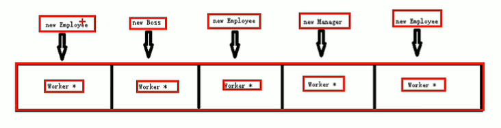

# C++ 使用手册

## 语法基础

注释：

- 行注释：//
- 块注释：/**/

### 一、内存模型

1、代码区：存放函数的二进制代码，由操作系统管理

2、全局区：存放全局变量和静态变量以及常量

- 全局变量、静态变量、常量区、字符串常量、const定义的常量

3、栈区：由编译器自动分配释放，川航函数参数、局部变量

4、堆区：程序员控制，程序结束自动释放

- 使用new运算符

### 二、引用

#### 1、引用的基本用法

理解：给变量起别名，他们都指向同一块内存。

语法：数据类型 &别名 = 原名

① 普通变量引用

``` c++
int a = 100;
// 例子：
int &b = a; 
// 修改b，a的值也修改，他们是同一块内存
b = 20；
printf("%d", a);

// 错误引用，引用必须是一个合法的空间
int &b = 100;
```

② 数组引用

``` c++
int a[10] = {0};
//给数组起别名,arr指向a的空间
int (&arr)[10] = a; 
```

③ 函数引用

``` c++
int &cc = func(); //引用类型的函数
```

#### 2、引用的注意事项

- 引用必须初始化
- 引用初始化后不可修改
- 并没有引用变量（与指针不同），当去掉&符号，就是普通变量（而指针，只要声明了指针变量，他就一直是指针变量，不论带不带*）

``` c++
/* 引用必须初始化 */ 
int &a; //错误，没有初始化

/* 引用后不能修改 */
int b = 200;
int &c = b;
&c = 300; //错误，引用已经指向了b
c = 300;  //这是赋值操作，不是引用，正确
```

#### 3、引用做函数参数

- 本质还是指针传值，但比指针传值简单

``` c++
// 定义引用传值，注意这里的&
void swap(int &a, int &b)
{
	//通过别名的方式操作数据，本质也是操作地址
	int temp = a;
	a = b;
	b = tmp;
}

int main(){
	int a=200;
	int c=100;
    // 引用传递，这里放的是值
    // 这样就与其他高级语言一样简单
	swap(a, b);
}
```

#### 4、引用做函数的返回值

- 不要返回局部变量的引用，因为这个引用会销毁
- 函数的调用可以做左值

``` c++
/* 局部变量不要返回 */ 
int & test(){
    int a = 10;
    return a;
}
int &ref = test();
cout << ref << endl; //打印错误，第一次可能成功

/* 函数的引用可以做为 */
int & test(){
    // 全局区，程序结束后释放
    static int a = 10;
    return a;
}
int &ref = test();
cout << ref << endl; //打印10，因为他是static变量
// 这里test返回一个引用，相当于&ref = 1000
test() = 1000;
cout << ref << endl; // 打印1000
```

#### 5、常量引用

``` c++
//
const int & ref = 10;
// ref不能修改
ref = 20;

void test(const int &val)
{
    val = 100; //错误不能修改
}
```

### 三、hello world

``` c++
// <> 系统头文件
// "" 自定义头文件，当前文件所在的目录
#include <iostream> //标准输入输出流
//使用命名空间
useing namespace std； 

int main(int argc, const char * argv[]){
    // 标准的命名空间std
    // cout标准输出
    // << 左运算符，拼接基础类型，字符串
    // endl换行
	std::cout << “hello world” << std::endl;
	system(“pause”);//阻塞

	return EXIT_SUCCESS; // 返回正常退出
}
```

## 

## 作用域

### 一、:: 运算符

```c++
// 作用域运算符
// 全局atc ::atc 
int atc=100;
void function()
{
	cout << ::atc <<endl //使用全局atc
	std::cout //std作用域下的cout方法
}
```

### 二、namespace关键字

```c++
//命名空间必须定义在全局作用下
//命名空间可以嵌套命名空间
//命名空间可以放函数，变量，结构体类
//命名空间是开放的，可以随时添加进原来的命名空间，**同一个命名空间名会合并**
namespace LOL  // 声明一个命名空间
{
	void goattc();//函数
	int a;//变量
	struct Person{};//结构体
class B{};//类
namespace D{};//命名空间LOL::D::
}

//无名称的命名空间
namespace
{
int a; //相当于static int a;
}
```

### 三、using关键字

``` c++
//using编译指令
using namespace name 
//use声明，在函数内使用会有二义性，声明原则比编译指令高，
using name 
```

## 标准输入输出

### 一、键盘输出cout

``` c++
// 跳过回车，空格
// 默认按十进制输出
cout << 0b00001010 << endl; //输出10
cout << 0123 <<endl; //输出83
cout << 0xab << endl; //输出171

// 输出8进制
cout << bitset<8>(0b00001010) << endl; // 输出00001010
cout << oct << 0123<< endl; // 0123
cout << hex << 0xab << endl; //输出ab
//刷新缓冲区linux有用
cout.flush()
//放入缓冲区
cout.put(‘a’).put() 
// 
cout.write()
cout.width(20)
cout.fill(“*”)
//卸载10进制显示
cout.unsetf(ios::dec)
//十进制显示
cout.setf(ios::dec)
```

### 二、键盘输入cin

``` c++
// cin 输入设备，默认为键盘
char data;
// cin会根据输入的类型自动判断输入类型
cin >> data; //将输入值放入data变量
// 输入多个变量
cin >> num >> data
//获取一个字符，接收换行\n
char c = cin.get() 
//将字符放到buf变量中，获取1024个字符,读取字符串不会拿走\n需要在读取一次
cin.get(buf, 1024)
//读取换行符，并把换行扔掉
cin.getline(buf, 1024)
//忽略一个字符
cin.ignore()
//忽略了n个字符
cin.ignore(n)
//查看，然后再放入缓存区，用cin.get()可获取
cin.peek()
//将字符串返回缓冲区
char c = cin.get();
cin.putback(c); 
```

字符类型 

## New运算符

### 一、创建空间

- 返回的是该类型的指针

``` c++
// 创建10个int类型的空间
int *p = new int(10);
    
// 开辟数组,10个连续空间的数组
int *arr = new int[10];
    
// 函数
int * func(){}
int *p = func()
```

### 二、删除空间

```c++
/* 普通变量 */ 
int *p = new int(10)
// 删除
delete p;

/* 释放数组 */ 
// 新建数组
int *p = new int[10];
// 释放整个数组
delete [] arr;
// 释放数组中的一个值
delete arr[2];
```

## string类型

参考STL $\to$ 二、string-字符串

## 函数高级

### 一、默认参数

- 如果有一个值有默认参数，从这个位置开始，到最后面都必须有默认参数
- 定义和声明，只能有1个默认参数。

``` c++
// 声明
int func(int a = 1111);
// 从b开始到最后都必须有默认参数
int func(int a, int b =1, int c=2);

// 定义
int func(int a = 1111){
    return a;
}

/* 定义-实现 */
// 声明中含有默认参数
int func(int a=1);
int func(int a){
    return 1;
}
// 定义中含有默认参数
int func(int a);
int func(int a=1){
    return 1;
}
```

### 二、占位参数

``` c++
// 第二个参数是占位参数
void func(int a, int){
    return 1;
}
func(1,2)
    
// 占位参数的默认值
void func(int = 10){
    return 1;
}
func()
```

### 三、函数重载

函数名相同，但参数不同，从而根据参数选择不同的函数

- 参数不同包括，个数、类型、顺序、引用类型
- 函数的返回值，不能变成重载方式
- 重载，不加默认参数

#### 1、正常调用

``` c++
void func(int a){
    count << "func的调用——1"
}
void func(){
    count << "func的调用——2"
}

// 输出func的调用——1
func(1);
// 输出func的调用——2
func();
```

#### 2、常量

``` c++
/* 常量 */
void func(int a){
    count << "func的调用——1"
}
void func(const int a){
    count << "const int a"
}
int v = 10;
// 输出func的调用——1
func(v);
// 输出 const int a
func(10);
```

#### 3、常量引用

``` c++
/* 常量引用 */
void func(int &a){
    count << "func的调用——1"
}
// 无法引用，因为相当于int &a=10，非法
// 引用 只能引用变量
func(10);

void func(const int &a){
    count << "const int a"
}
// 合法，因为const是常量
func(10);
```


## 类和对象

### 类的调用方法集合

类方法调用

``` C++
class WorkManager{ ... }

WorkManager worker;
worker.print_title();
```

指针方法调用

``` c++
class WorkManager{ ... }

WorkManager *worker = new WorkManager;
worker->print_title();
```

### 一、封装

#### 1、分文件编写类

①、创建类的头文件（NPC.h）

``` c++
#ifndef __xxx
#define __xxx
class NPC 
{
    // 构造和析构，必须在public下，或者什么都每没加的地方
	NPC()；  //构造方法,与类名相同
	~NPC()； //析构方法
private:
protected:
public:
    //成员属性
	int Name；
    //定义一个方法
	void move(int a); 
}
#endif //宏定义
```

②、创建类的.cpp文件（NPC.cpp）

``` c++
// 引入头文件
#include “NPC.h” 

NPC::NPC(){} //实现构造方法
NPC::~NPC(){ //析构方法
	delete this->a; //释放空间a
} 

//::成员操作符
void NPC::move(int a){ 
	std::cout << “1”;
}
```

③、在其他文件中使用类

``` c++
// 引入类的头文件
#include “NPC.h”

int main() {
    /* 普通方法 */
	NPC n1    // 实例化
	n1.move(1) // 调用NPC类中的方法move
	
    /* 使用new方法创建类 */
	NPC *n2；
    // 为什么要用指针，因为new返回一个该类型的指针
	n2 = new NPC() 
    n2 = &n1     // 可以指向一个已经创建的对象
        
	/* 构造函数调用 */
	NPC n3(1) //调用构造函数
	NPC * n3 = new NPC(1)
}
```

#### 2、类引用第三方类

``` c++
#ifndef __xxx
#define __xxx
// 第三方类
class Rect{ ... } 
// 引用的类
class NPC 
{
    //引用另外的类
	Rect * a; 
}
#endif //宏定义
```

#### 3、类的访问权限

- public

  方法，属性类外类内都可以使用

- protected

  方法、属性类内可以，类外不能访问

  子类可以访问父类的protected方法

- private

  默认权限，方法、属性类内可以，类外不能访问

  子类不可以访问父类的protected方法

另外：静态方法，属性不属于类的对象

``` c++
class AA(){
    static int m; //静态成员不属于类
	static void func3(); //静态成员函数不属于对象
}
```

#### 4、结构体和类的区别

主要区别就是默认权限不同，struct默认为公共，class默认权限是私有

#### 5、将成员属性设为私有

优势：可以自己控制读写权限，可以检查数据的有效性

``` c++
class Person
{
// 设置属性权限为私有
private:
    string name;
    int age;
// 提供修改属性的公共方法
public:
    // 修改名称方法，类外调用
    void fix_name(string a){
        // 这里可以验证字符串是否符合要求
    }
}
```

### 二、对象特性

#### 1、构造函数

``` c
class NPC 
{
    // 构造方法,与类名相同,自动调用
    // 构造函数可以有参数，可以重载
	NPC()；  
}

/* 单文件 */
class NPC 
{
	NPC(){
        count<< "构造函数调用"；
    }  
}
```

#### 2、析构函数

``` c++
class NPC 
{
    // 析构方法，与类名相同，自动调用
	~NPC();
}
```

#### 3、构造函数的分类

共2种分类方式：

- 按参数分为：有参数构造和无参数构造
- 按类型分为：普通构造和拷贝构造

#### 4、有参构造函数

定义：

``` c++
/* 有参数构造函数 */
class NPC 
{
	NPC(int a);
}
```

调用方法：

``` c++
/* 括号法 */
//默认构造函数, 不要加小括号
NPC p1; 
// 有参数构造函数
NPC p2(10); 

/* 显示法 */
// 有参数构造
NPC p4 = NPC(10);


/* 隐试转换法 */
// 相当于 NPC p6 = NPC(10)
NPC p6 = 10
```

#### 5、拷贝构造函数

定义：

``` c++
/* 拷贝构造函数 */
class NPC 
{
    // 固定写法
    // 拷贝构造函数，需要把类传入
	NPC(const NPC &n);
}
```

调用：

``` c++
NPC p2;

/* 括号法 */
NPC p3(p2);

/* 显示法 */
// 不要使用拷贝函数初始化匿名对象
// 例：NPC(p5) 
// NPC(p5) 等价于 NPC p5,这时p5与13行对象名相同
NPC p5 = NPC(p2);

/* 隐试转换法 */
NPC p7 = p2;
```

#### 6、深拷贝和浅拷贝

浅拷贝：并没有正在的拷贝，而是用指针指向了同一块空间，是由于析构（释放）内存时，浅拷贝在第一次就把资源释放，第二次释放就出错了

深拷贝：在堆中重新申请空间

``` c++
NPC(const NPC & N){
    // 自己在构造时自定义一个
    m_Height = new int(*N.m_Height)
}
~NPC(){
    if(m_Height !=NULL){
        delete m_Height;
    }
}
```

#### 7、拷贝构造函数使用时机

1、用已经创建好得对象初始化新类(Person p2(p1))

2、值传递，将类作为参数（值传递，都会调用拷贝构造）

3、以值得方式返回局部对象（会占用更多内存）

relese与debug模式运行结果不同

#### 8、初始化列表

给类的属性赋值的操作

①、传统操作

``` c++
class Person{
	//Person中定义属性
	int m_A; 
    int m_B;
    
	Person(int a, int b){
        m_A = a;
        m_B = b;
    }
}
```

②、使用初始化列表

``` c++
class Person {
	//Person中定义属性
	int m_A; 
    int m_B;
    /* 方法一 */
    //直接将m_A赋值为10，m_B=20
    Person():m_A(10), m_B(20) {
        ... 
    } 
    
    /* 方法二 */
    // 将变量a的值赋值给m_A，将变量b的值赋值给m_B
    Person(int a, int b): m_A(a), m_B(b) { 
        ... 
    }
}
```

#### 9、类对象作为类成员

构造流程：以下例子，先构造A的对象，再构造B的对象

析构流程：以下例子，先析构B的对象，再构造A的对象

``` c++
/* 多个类赋值例子 */ 
class A {
    string name;
    A(string b_na){
    	name = b_na
    }
}
// 在B中定义一个属性，这个属性是自定义的一个类
class B {
    A b_name;
    int b_b;
    // 构造函数中赋值
    // 注意这里的b_name(n)等价于
    // A b_name = n;
    B(int a, string n):b_b(a), b_name(n){
		... 
    }
}

// 调用
B p(1, 'name')
```

#### 10、静态成员变量

静态成员变量

- 所有对象共享同一份数据
- 静态变量在编译的时候就已经创建
- 类内声明，类外初始化
- 类也有访问权限的private下的静态成员变量，类外只能初始化，不能使用

``` c++
class A {
public:
    // 声明
	static int m_age; 
}

// 类内声明，类外初始化
int A::m_age = 100;

// 方法一，通过对象访问
// 先初始化类，再调用类
A value；
value.m_age = 200;

// 方法二，通过类名访问
A::m_age = 300;
```

#### 11、静态成员函数

静态成员函数

- 所有对象共享一个函数
- 静态成员函数只能访问静态成员变量（因为）

``` c++
class A {
public:
    // 静态成员函数只能访问静态成员变量
	static void func(); 
}

// 调用一，通过对象
A a;
a.func();
// 调用二，通过类名
A::func();
```

#### 12、this指针

this指针指向被调用的成员函数（谁调用，就指向谁）

this指针用途：

- 当形参和成员变量同名时，可用this区分
- 在类的非静态成员函数中返回对象本身，可使用return *this

①、解决名称冲突

``` c++
class Person {
	int age;
    Person(int age){
        // 属性名与方法名重名
        this->age = age
    }
}
// this指针指向的时p1
Person p1(18);
```

②、返回类本身（可进行链式编程）

```c++
class Person
{
public:
    int age;
    // 若返回值(Person func(int a))，就不会进行累加操作
    Person & func(int a){
        this->age +=a;
        return * this
    }
}

Person p1;
p1.func(10).func(20).func(30);
```

#### 13、空指针

``` c++
class Person
{
public:
    int age;
    // 若返回值(Person func(int a))，就不会进行累加操作
    void func(){
        cout << "this this kong";
    }
    void func2(){
        // 因为默认成员属性前面有this->
        // 当空指针类的时候，就变成NULL->age
        cout << age;
    }
}

Person *p1 = NULL;
p1.func(); // 没错
p1.func2();// 报错
```

#### 14、const修饰成员函数\属性

①、常函数

- 限制修改类属性的值

``` c++
class Person{
    // 加了mutable，就可以修改
    // 灿han'shu
	mutable int B;
	int a;
    //常函数，不允许修改类的成员属性
	void showInfo() const {
        // 错误，不能修改
		this->a = 100;
        // 正确，mutable是可以修改的
        this->B = 100;
	}
}
```

②、常对象

- 常对象可以调用常函数，不能调用普通方法

``` c++
class Person{
	mutable int B;
	int a;
    //常函数，不允许修改类的成员属性
	void showInfo() const {
        // 错误，不能修改
		this->a = 100;
        // 正确，mutable是可以修改的
        this->B = 100;
	}
    // 普通方法
    void func(){...}
}

const Person p2; 
p2.a = 100; // 错误，不能修改
p2.B = 100; //正确，mutable修饰，可以修改
cout << p2.name // 可以读
    
const Person p3;
p3.func(); // 错误，不能调用
p3.showInfo();// 正确，可以调用常函数
```

### 三、友元函数

可以访问指定类中的私有方法、属性

①、全局函数做友元

``` c++
// 定义
class Buliding {
    // 告诉编译器，允许goodGay() 函数访问私有属性
	friend void goodGay(Buliding &bul);
}

//全局友元函数
// void goodGay(buliding * bul)
void goodGay(buliding &bul）{
	//这里可以调用Buliding访问私有方法属性
}
```

②、类做友元

``` c++
// 定义
class Buliding{
    // 告诉编译器，允许goodGy 类访问私有属性
	friend class goodGy；//类做友元
}
class GoodGay {
    void visite(){  }
}
```

③、成员函数做友元

``` c++
// 定义
class Buliding{
    // 告诉编译器，允许GoodGay类下的visit方法访问
	friend void GoodGay::visit()；//类做友元
}
class GoodGay {
    void visit(){  }
}
```

### 四、运算符重载

对已有的运算符进行重新定义，赋予另外一种功能

#### 1、加法重载

①、通过成员函数重载

``` c++
class Person {
public:
    int a;
    int b;
    //重载+号运算
	Person operator+(Person &p){
        return this.a+ p.b;
    } 
}

// 初始值
Person p1;
p1.a = 10;
Person p2;
p2.b = 20;

// 调用
// 本质是Person p3 = p1.operator+(p2);
Person p3 = p1+p2;
```

②、通过全局函数重载

``` c++
class Person{
    int a;
    int b;
}
// 全局函数重载
Pserson operator+(Person &p1, Person &p2){
    return p1.a+p2.b;
}

// 初始值
Person p1;
p1.a = 10;
Person p2;
p2.b = 20;

// 调用
// 本质：Person p3 = operator+(p1, p2);
Person p3 = p1+p2;
```

#### 2、左移运算符

只通过全局函数重载

``` c++
// 全局函数重载
void operator<< (ostream &cout, Person p){
    cout << p.m_a
}


// 重写左移运算符
Person p;
p.m_a = 100;
cout << p;

/* 链式调用 */
// 链式返回
ostream operator<< (ostream &cout, Person p){
    cout << p.m_a;
    return cout;
}
cout <<p <<p << endl;
```

#### 3、递增运算符重载

``` c++
```

#### 4、赋值运算符重载

#### 5、关系运算符重载

#### 6、函数运算符重载

### 五、继承

#### 1、基本语法

①、父类 base.h

``` c++
class Base {}
```

②、子类 

继承方式：

- public：父类的public、protected权限到子类中不变
- protected：父类的public、protected到子类中都变protected权限
- private：父类的public、protected到子类中权限都变为private
- 父类的private权限不允许继承

``` c++
// 引入要父类的头文件
#include “base.h” 
// 继承base类，默认是private继承
class chile : Base {} 
// 继承多个父类,Base、Base2
class chile : Base, Base2 {} 

/* 继承方式 */
// 公众继承
class chile : public Base {} 
// Base中的类public protected private不变
class chile : protected Base {} //保护继承
// Base中的public 变为 protected
class chile : private Base {} //父类属性变为private
// Base中的private protected变为private
```

#### 2、调用父类构造函数

``` c++
class Base{
    int s;
    Base(int a){}
}

class Son:public Base{
    int s;
    Son(int a) : Base(a){} //调用父类构造函数
}
```

#### 3、继承中的对象模型

父类中的所有非静态成员属性都会被子类继承，但private权限的属性被编译器隐藏了

``` shell
# 查看类的分布图
# 打开开发人员命令提示工具查看对象模型
cl /d1 reportSingleClassLayout类名 文件名
```

#### 3、继承构造析构顺序

构造先创建父类，再构造子类

析构先析构子类，再析构父类

#### 4、继承同名函数

- 访问子类同名成员，直接访问即可
- 访问父类同名成员，需要添加作用域

``` c++
class base{
    void func(){...}
}

class son:public base {
    void func(){ ... }
}

// 创建一个类
son s1;
// 默认调用子类中的属性，
// 子类会隐藏掉所有的同名函数（父类重载的函数都不会被调用）
// 要想调用父类的重载函数，需要添加作用域
s1.func(); 
// 想调用父类的方法需要添加作用域,调用父类Base中的属性
s1.Base::func();
```

#### 5、同名静态成员

``` c++
class Base{
public:
	static int m_A;    
}
// 类外赋值
int Base::m_A = 100;

class son: public Base{
public:
	static int m_A;    
}
// 类外赋值
int son::m_A = 200;

// 方法一，通过对象访问
son s1;
s.m_A; //访问son类自己的m_A
s.Base::m_A; //访问父类base的m_A属性

// 方法二、通过类名访问
son::m_A; //不用初始化对象
son::Base::m_A //通过子类的父类访问
```

#### 6、多继承

实际开发中不见时使用多继承，因为会有父类函数重名的危险

``` c++
class Base1{}
class Base2{}
// 多继承写法
class son: public Base1, public Base2{
public:
	static int m_A;    
}
```

#### 7、菱形继承

解决方法：使用作用域

### 六、多态（虚函数）

多态分为2类，一是静态多态和动态多态

- 静态多态：函数重载、运算符重载、函数名复用
- 动态多态：派生类、虚函数

静态多态和动态多态的区别

- 静态多态的函数地址-编译的时候确定
- 动态多态的函数地址-运行的时候确定

#### 1、多态的基本语法

多态满足条件：

- 必须有继承关系
- 子类必须重写父类的虚函数（注意，重写是完全相同）

##### 地址早绑定

无法实现多态，样例

``` c++
class Animal {
	void speak(){ printf("动物在说话") }
}

class A:public Animal{
    // 重写了父类的speak
	void speak() { printf("A在说话") }
}

// 这里是已经与Animal类绑定的，不能修改
void dospeak(Animal & animal){
	animal.speak(); 
}

int main(){
	A cat;
    // 这里打印的是,动物在说话
	dospeak(cat)
}
```

##### 地址晚绑定

多态，样例

``` c++
class Animal {
    // 这个函数就是虚函数
    // 这个函数可以被其他同名函数替代
	virtual int speak(){ printf("动物在说话") }
}

class A:public Animal{
	int speak(){ printf("A在说话")}
}

// 使用，父类的指针或引用执行子类的对象
void dospeak(Animal& animal){
	animal.speak(); 
}

int main(){
    // 可以理解为cat是参数
	A cat;
    // 调用的是Animal中的speak方法，打印的却是cat中的speak方法
	dospeak(cat)
}
```

##### 多态使用，样例三

``` c++
class Animal {
	virtual int speak()=0;
}

class cat:public Animal{
	int speak(){ printf("A在说话") }
}

int main(){
    Animal *A = new cat();
    // 打印的都是cat中的方法
    A->speak();
}
```


#### 2、多态的原理

待补充

#### 3、抽象类（纯虚函数）

只要类中含有一个纯虚函数，那么这个类就是抽象类。抽象类特点

- 无法实例化对象
- 子类必须重写抽象类中的纯虚函数，否则子类也是抽象类
- 抽象类只用.h文件即可，不需要.cpp文件

##### 多文件结构

纯虚函数定义.h文件，不需要.cpp文件

``` c++
class NPC {
    // 纯虚函数，子类必须实现
    virtual void fire(int a)=0; 
}
```

继承虚函数，其他.cpp文件

``` c++
#include "func.h"
// One.h 文件
class One:public NPC {
    // 重写虚函数，virtual可以写也可以不写
    /*
    void fire(int a); 等价于virtual void fire(int a);
    */ 
    virtual void fire(int a);
    
}    
// One.cpp文件，实现虚函数
virtual One::fire(){
    ...
}

/* 调用 */
One o1;
o1.fire(1);
```

##### 单文件结构

``` c++
class One:public NPC {
    // 使用，必须重写类中的纯虚函数
    void fire(int a){
        ....
    }
}

/* 调用 */
One o1;
o1.fire(1);
```

#### 4、虚析构和纯虚析构

在使用多态的时候，父类指针无法调用子类的的析构函数

``` c++
/* 纯虚析构的定义 */
class Animal {
    // 方式一、虚析构必须实现
    // virtual ~Animal(){ ... }
    
    // 方式二、必须定义，定义虚构函数后，让子类重写
    // 这样子类析构的时候，就会调用子类的析构函数
	virtual ~Animal() = 0;
    // 父类虚函数，不重要
    virtual void speak()=0;
} 

// 纯虚析构，需要在内中声明，在类外实现
// 纯虚析构必须得有实现
Animal::~Animal(){
	cout << “animal纯虚析构”;
}

/* 使用虚构函数 */
class Cat:public Animal {
public:
    char *name;
    void Cat(const* name){
        this->name = new char[strlen(name)+1]; 
        strcpy(this->name, name);
    }
	// 注意，这里并未重写父类析构，
    // 但只要父类定义了虚析构函数，就可以调用这里的析构函数
	~Cat() {
		if (this->name !=NULL){
			delete [] this->name;
		}
	}
}

/* 
发生问题原因：
创建的是父类的指针animal,释放的也是父类animal,而我们则是利用多态创建的子类cat，调用的也是子类cat中的speak方法，而没有释放掉子类cat中的堆空间
*/
Animal * animal = new Cat(“TOM”); 
//多态，调用Cat类的speak方法
Animal->speak(); 
delete animal;
```

#### 5、多态的应用

（1）、将不同类型的指针放到同一个数组中（使用父类的指针，子类是不同的）



使用时需要二级指针：`worker **k = new worker *[5]` 

- 注意这里与数组指针的意思不同不能混淆，这里是创建5个worker\*指针类型的数组。

## 文件操作

文件类型分为两种

- 文本文件：文件以ASCII码形式存放在计算机中
- 二进制文件：文件以文本的二进制形式存储在计算机中

文件操作三大类

- ofstream：写操作
- ifstream：读操作
- fstream：读写操作

### 一、文本文件

文件操作方式：

- ios::in：  读文件的方式打开
- ios::out： 写文件的方式打开
- ios::ate： 初始位置：文件尾
- ios::app： 追加方式写
- ios::trunc： 如果文件存在，先删除在创建
- ios::binary： 二进制方式
- 多方式打开：ios:out | ios::trunc 使用2种方式

#### 1、写操作

``` c++
/* 导入头文件 */ 
#include<fstream>

/*  创建流对象 */
ofstream ofs;
/* 打开文件 */ 
ofs.open(“路径”, ios::in);
/* 写数据 */ 
ofs<< “想要向文本输入的” << endl;
/* 关闭 */ 
ofs.close();
    
/* 判断打开时候成功 */
// 成功返回1,失败返回0
ofs.is_open();
```

#### 2、读文件

``` c++
/* 导入头文件 */ 
#include<fstream>

/* 创建流对象 */
ifstream ifs;
/* 打开文件 */ 
ifs.open(“路径”, ios::out);
/* 读数据、方式一 */ 
char buf[1024] = {0};
// 读的数据放到buf中
while(ifs >> buf){
    //读取完成后，输出
	couf<< buf <<endl; 
}
/* 读数据、方式二 */ 
char buf[1024] = {0};
while( ifs.getline(buf, sizof(buf)) ){
	couf<< buf <<endl; //读取完成后，输出
}
/* 读数据、方式三 */ 
string buf;
while( getline(ifs, buf) ){
	couf<< buf <<endl; //读取完成后，输出
}

/* 关闭 */ 
ofs.close();

/* 判断打开时候成功 */
// 成功返回1,失败返回0
ofs.is_open();

/* 获取数据，放到buf中，每次读取sizfo(buf)个大小 */
ifs.getline(buf, sizeof(buf))
/* 每次获取1个字符 */
char c = ifs.get();
/**/
ifs.eof()
```

### 二、进制文件

文件类型特定为：ios::binary

二进制写文件不建议使用string类型，会有不可预料的错误

#### 1、写文件

``` c++
/* 导入头文件 */ 
#include<fstream>

/* 创建流对象 */
ofstream ofs;
/* 打开文件 */ 
ofs.open(“路径”, ios::out | ios::binary);
/* 写数据 */
Person p = {'张三', 18}；
// 将p类型强转换为char指针类型
ofs.write((const char *)&p, sizeof(Person))
/* 关闭 */ 
ofs.close();
```

#### 2、读文件

``` c++
/* 导入头文件 */ 
#include<fstream>

/* 创建流对象 */
ifstream ifs;
/* 打开文件 */ 
ifs.open(“路径”, ios::in| ios::binary);
/* 读数据*/ 
if (!ifs.is_open()){
    cout<< "打开失败"
        return;
}
// 用于存放数据
Person p;
// 读取的数据放到p中，大小是sizeof(Person)
ifs.read( (char *)&p, sizeof(Person))

/* 关闭 */ 
ofs.close();
```

## 模板-泛型编程

C++使用模板实现范式编程，模板的目的是提高程序的复用性（类似于PPT什么的）

### 一、模板基本语法

``` c++
// template 声明创建一个模板
// typename 表明这是一个数据类型，可以使用class代替
// T 通用的数据类型，名称可以替换，通常为大写字母
template <typename T>
函数声明或定义

// class与typename没有区别
template <class T>
函数声明或定义
```

#### 1、函数模板

``` c++
// 一般的例子，对照组：
void swapInt(int &a, int &b){
    int temp = a;
    a = b;
    b = temp;
}
/* 改写成模板 */ 
// 声明一个模板，告诉编译器不要出错
template <typename T>
void mySwap(T &a, T&b){
    T temp = a;
    a = b;
    b = T;
}
// 使用模板
// 编译器自动推导
int a = 10;
int b = 20;
mySwap(10, 20);

// 显示指定类型
int a = 10;
int b = 20;
// <>告诉模板是int类型
mySwap<int>(a, b)
```

模板必须指定T的类型

``` c++
// 声明一个模板，告诉编译器不要出错
template <typename T>
void mySwap(){ cout << "xxx"; }
// 因为mySwap中没有参数，但必须在模板中指定类型
mySwap<int>()
```

#### 2、类模板

``` c++
template <class T>
class mySwap{
public:
    mySwap();
}

//可以添加默认类型
template<class T,class T2=int>
class LinkList{
	T name;
	T2 age;
	LinkList(T name, T2 age){}
}

int main(){
	string a; int 1;
    //必须使用显示转换，函数模板可以自动推导，类模板不能推导
	LinkList<string, int>(a, b) 

}
```

### 三、普通函数与模板的调用规则

- 优先调用普通函数

  ``` c++
  // 优先调用
  void mySwap(T &a, T&b){
      cout << "xxx"
  }
  
  template <typename T>
  void mySwap(T &a, T&b){
      cout << "xxx"
  }
  ```

- 通过空模板参数列表来强制调用函数模板

- 函数模板可以发生重载

  ``` c++
  template <typename T>
  void mySwap(T &a, T&b){
      cout << "xxx"
  }
  template <typename T>
  void mySwap(T &a, T&b, T&c){
      cout << "xxx"
  }
  ```

  

- 函数模板可以产生更好的匹配优先调用函数模板


### 模板做函数参数

``` c++
void doWork(Person<string, int> &p) {
	P.show()
}

//参数模板化
template<class T1, class T2>
void doWork(Person<T1, T2>&p){...}
```

### 具体化模板

因为某些特定的数据，无法通过模板传递

### 三、类模板与继承

template<class T>

class Base

{

public:

T m_A;

}

 

//必须告诉child类型,否则不能分配内存

class Child: public Base<int> {}

 

//由用户指定类型

template<class T1, class T2>

class Child: pulbic Base<T2>

{}

### 四、模板的分文件编写

1、模板的文件是.hpp

2、方法实现与声明放到同一个文件中

因为C语言是份文件编译，但模板文件类型是在运行时确定，所以不能使用.h方法引入

可以直接引入.cpp文件，

模板文件编译在运行时会出错

 

### 五、模板与友元函数

## 异常

### 一、基本语法

``` c++
try{} catch(int) {}//捕获int类型异常

try{} catch(){} catch(){} //捕获多个异常

try{} catch(...){} //捕获其他类型异常

 

throw 1//抛出异常，可被catch抓到

throw 3.14//抛出double异常

 自定义异常类

class my Exception

{

public:

void myException();

}

 

throw MyException(); //抛出异常类

catch(MyException e)
```

### 二、栈解旋

从try开始，到throw抛出异常之前，所有栈上的对象都会被释放

### 三、异常接口声明

void func() throw() //不能抛出任何异常

void func() throw(int) //抛出int类型异常,当前函数只能抛出int错误

{

throw 1;

}

### 四、异常生命周期

throw new MyException();

catch(MyException *e)

{

delete e;

}

### 五、异常多态

### 六、标准异常库

\#include<stdexcept>

throw out_of_range(“年龄越界”); //越界异常

e.what() //异常信息

## STL（标准模板库）

基本全部使用了模板类或者模板函数

- 容器：各种数据结构，vector、list、map等
  1. 序列容器：强调值得排序，每个元素有固定位置
  2. 关联容器：二叉树结构，元素之间没有严格得物理顺序关系
- 算法：各种常用算法
  1. 质变算法：指运算过程中会改变元素得内容，例：拷贝、删除
  2. 非质变算法：不会改变区间元素内容，例：查找、计数、遍历
- 迭代器：容器与算法之间的胶合剂
  1. 输入迭代器：对数据得只读访问
  2. 输出迭代器：对数据只写访问
  3. 前进迭代器：读写操作
  4. 双向迭代器：读写操作
  5. 随机访问迭代器：读写操作
- 仿函数：行为劣势番薯，可作为算法的某种策略
- 适配器：一种用来修饰容器或者仿函数的策略
- 空间配置器：负责空间的配置和管理

### 一、vector-动态数组-连续空间

- vector与数组不同的地方在于，vector是可以动态扩展的数组，vector的迭代器支持随机访问
- 随机访问
- 多用于访问，多插入删除使用list

#### 1、构造方法

``` c++
// 必须包含头文件
#include <vector>

/* 创建一个vector容器 */
// 保存的是int类型，名字是v
vector<int> v1;

/* 利用区间 */
vector<int> v2(v1.begin(), v1.end())
    
/* 用n个elem方式构造 */
// 创造10个100元素
vector<int> v3(10, 100)
    
/* 拷贝构造 */
vector<int> v4(v3)
```

#### 2、vector赋值

重载了=号

``` c++
vector<int> v1;
// 向vector中存储数据
v1.push_back(a);

vector<int> v2;
// vector与vector之间的赋值方式
v2 = v1;
```

使用assign

``` c++
vector<int> v3;
v3.assign(v1.begin(), v1.end());

// 使用10个a赋值
v3.assign(10, 'a');
```

#### 3、迭代器说明

``` c++
/* 容器起始位置 */
// itBegin：自定义变量名
// v.begin()：vector内置的方法,v是vector的对象
// vector<int>::iterator：vector内置的方法
vector<int> v;
vector<int>::iterator itBegin = v.begin();

/* 结束迭代器 */
// itEnd：自定义变量名
// v.end()：容器最后一个元素的下一个
vector<int>::iterator itEnd = v.end();
```

#### 4、vector数据存取

普通操作

``` c++
vector<int> v;
/* 返回索引idx所指的对象 */
// 使用[]，和数组使用方法一样
int a = v[1];
// 使用at
int b = v.at(1);

/* 返回容器中的第一个元素 */
v.front()
/* 返回容器中的最后一个元素 */
v.back()
```

利用迭代器循环遍历方法

``` c++
/* for循环 利用迭代器 */ 
for(
 vector<int>::iterator it=v.begin();it!=v.end();it++
){
    //*it是取值
	cout<< *it<<endl;
}

/* while循环利用迭代器 */ 
while(it != itEnd){
	cout<< *it;
	it++;
}

/* 使用算法中的for_each遍历 */
#include <algorithm>
int myPrint(){
    
}
// myprint回调函数
for_each(v.begin(), v.end(), myPrint);
```

#### 4、存放自定义数据类型

``` c++
#include <vector>

// 自定义一个数据类型，比如类
class Person{
public:
    Person(string name, int age)(
    	this->m_Name = name;
    )
    string m_Name;
}

// 使用vector保存数据
vector<Person> v;
// 创建Person数据
Person p1("aaaa");
// 向vector中添加数据
v.push_back(p1);
// 遍历vector
for (vector<Person>::iterator it=v.begin(); it!=v.end();it++){\
    // 两种访问模式
    cout <<"姓名"<<(*it).m_name;
    cout <<"姓名"<<it->m_Name;
}
```

#### 5、存放指针

``` c++
#include <vector>

// 自定义一个数据类型，比如类
class Person{
public:
    Person(string name, int age)(
    	this->m_Name = name;
    )
    string m_Name;
}

// 不同点
// 使用vector保存数据
vector<Person*> v;

// 创建Person数据
Person p1("aaaa");

// 不同点
// 向vector中添加数据
v.push_back(&p1);

// 不同点
// 遍历vector
for (vector<Person*>::iterator it=v.begin(); it!=v.end();it++){\
    // 两种访问模式
    cout <<"姓名"<<(*it)->m_Name;
}
```

#### 6、vector嵌套

``` c++
#include <vector>
// 嵌套定义
vector<vector<int>> v;
// 创建小容器
vector<int>v1;
vector<int>v2;
//将小容器添加到大容器中
v.push_back(v1);
v.push_back(v2);
// 遍历vector
for (vector< vector<int>>::iterator it=v.begin(); it!=v.end();it++){
    // *it：小容器
    for (vector< vector<int>>::iterator vit=(*it).begin(); it!=(*it).end();vit++){
    	cout <<"姓名"<<(*vit)->m_Name;
    }
}
```

#### 7、容量方法

``` c++
/* 获取容器的容量 */
// 容量会大于元素个数
v.capacity()
    
/* 返回容器中元素的个数 */ 
v.size()
    
/* 判断容器是否为空 */
// 空返回true
v.empty()
    
/* 重新指定容器长度为 */
// 重新指定容器长度为num，
// 若容器变长则以默认值（0）填充
v.resize(int num);
// 使用指定值(n)填充
v.resize(int num, int n)
```

#### 8、插入和删除

``` c++
/* 尾插 */ 
// 向容器中插入数据10
v.push_back( 10 )

/* 删除最后一个元素 */
v.pop_back()
    
/* 插入元素 */
// 注意：第一个元素是vector的迭代器
// 在v的头部添加数据
v.insert(v.begin(), 10)
// 在头部插入2个1000元素
v.insert(v.begin(), 2, 1000)
    
/* 删除 */
// 注意：第一个元素是vector的迭代器
v.erase(v.begin())
// 从begin删除到end
v.erase(v.begin(), v.end())

/* 删除所有元素 */
v.clear()
```

#### 9、互换容器

- 利用互换容器可以收缩内存空间

``` c++
/* 基本使用 */
vector<int> v1;
vector<int> v2;
// 存放元素
v1.push_back(1);
v1.push_back(2);
v2.push_back(3);
v2.push_back(4);
// 交换
v1.swap(v2);

/* 收缩容器空间 */
// vector<int>(v1)：匿名对象
vector<int>(v1).swap(v1)
```

#### 10、预留空间

因为vector是动态开辟空间，使用预留空间可以减少vector重新开辟空间的次数

``` c++
vector<int> v;
// 预留空间10000000
v.reserve(10000000)
```

### 二、string-字符串

C风格字符串太过复杂，不适合大程序开发； string封装了很多实用成员方法，不用考虑内存释放和越界

- char* 是一个指针，
- string是一个类，string内部管理一个char*

#### 1、字符串定义方法

``` c++
// 头文件
#include<string>
 
/* 默认构造 */
// str是个字符串变量
string str;

/* 拷贝构造 */ 
// str2的字符串是str中的内容
const char * str = "hello world";
string str2(str)
    
/* 使用相同的字符创建字符串 */
// 使用10个a字符创建字符串
string str4(10, 'a')
```

#### 2、赋值方法

string类重写了=号等符号

``` c++
// 方法1
string str1;
str = "aaaaa";
// 同理方法
string str3 = “abcd”;
string str3 = string(“123”)
    
// 方法2，将已付值得str1赋值给str2
string str2 = str1;
// 方法3, 单个字符赋值
string str3 = 'a';
```

string另外提供了assign方法进行赋值

``` c++
// 将字符串赋值给str
string str;
str.assign("hhhhhhh");

// 将字符串前n个字符赋值给字符串
string str;
//将前2个字符赋值给str
str.assign("xxxxxxx", 2);

// 通过其他字符串赋值
string str1;
string str2 = "1aaaa";
str1.assign(str2)
    
// 使用10个w给str赋值
string str;
str.assign(10, 'w');
```

#### 3、字符串拼接

重写+=方法

``` c++
// 方法一，追加字符串
string s1 = "xxx"
// 使用+=号
s1 += "cvvv";

// 方法二，追加字符
string s1 = "xxx"
// 使用+=号
s1 += "c";

// 方法二，string类型拼接
string s1 = "xxx";
string s2 = "aaaa";
// 将s2加到s1后面
s1 += s2;
```

使用append函数方法

``` c++
// 尾部追加
string str;
str.append(“xxxx”) 
    
// 将xxxxbbbb前4个字符拼接到str后
string str;
str.append("xxxxbbbb", 4)
    
// 将str2添加到str1后面
string str1;
string str2;
str.append(str2)
    
// 截取字符添加
string str;
// 从0位置开始截取3个字符
str.append("xxxxbbxxx", 0,3)
```

#### 4、查找替换

查找方法

``` c++
string str = "abcdefg";
// 查找从0开始，返回最先查找位置的下标，没找到返回-1
str.find("b"); 
// 从指定下标开始查询
str.find("b", 3);
// rfind从右往左查找，find从左往右查找
str.rfind("b");


// 字符串大小
str.size()


str.substr(0, 3)//返回从0开始的3个字符串
const char * p = s.c_str(); //转换为C风格字符串
string s2(p) //转换为string类型的字符串
//隐式类型能从const char * 转换为string.但不能从string转换为const char*
toupper(a) //将字符转换为大写
tolower(a) //转换为小写
注意
string a = “123456”;
a[1] =’a’//这样修其中的字符
a = ‘1234567890’;//这里字符过长，内存重新分配
```

替换方法

``` c++
string str = "xxxz23456";
// 从下标1开始，替换2个字符，
str.replace(1, 2, "11");
// 若参数3的个数>参数2的个数，会把参数3全写进去
// 结果：x111z23456
str.replace(1, 2, "111");
```

#### 5、字符串比较

比较字符的ASCII的值，相等返回0；>返回1；<返回-1

``` c++
string str1 = "xxx";
string str2 = "bbb";
// 字符串根据ASCII码对比
str.compare(str2)
```

#### 6、字符串存取

``` c++
string str = "helloworld"
// 使用[],修改某个字符
str[1] = 'c'
char c = str[2];

// 使用at
str.at(1) = 'c'
char c = str.at(2);
```

#### 7、字符串插入删除

``` c++
string str = "xxxxx";
// 在指定位置插入
str.insert(1, "aaa");

// 插入string类型字符串
string str2 = "bbb";
str.insert(1, str2);

// 在下标10的位置插入个c
str.insert(1, 10, 'c');
// 删除下标1开始的，5个字符
str.erase(1, 5);
```

#### 8、字符串截取

``` c++
string str = "aaaaaaa";
// 从下标1开始，截取3个字符
string substr = str.substr(1, 3)
    
// 获取用户名
string str = "tianxia@126.com";
int pos = str.find("@");
string name = str.substr(0, pos)
```

### 三、deque-双端队列-随机访问

#### 1、构造函数

``` c++
#include<deque>

// 定义方式与vector相同
deque<int> d;
deque<int> v2(v1.begin(), v1.end());
// 创造10个100元素
deque<int> v3(10, 100);
/* 拷贝构造 */
deque<int> v4(v3);
```

#### 2、赋值操作

与vector容器操作类似

``` c++
// 重载了=号
deque<int> v1;
// 向容器中存储数据
v1.push_back(a);

// deque与deque之间的赋值方式
deque<int> v2;
v2 = v1;

/* 使用assign */
deque<int> v3;
v3.assign(v1.begin(), v1.end());
// 使用10个a赋值
v3.assign(10, 'a');
```

#### 3、容量方法

``` c++
/* 返回容器中元素的个数 */ 
v.size();
    
/* 判断容器是否为空 */
// 空返回true
v.empty();
    
/* 重新指定容器长度为 */
// 重新指定容器长度为num，
// 若容器变长则以默认值（0）填充
v.resize(int num);
// 使用指定值(n)填充
v.resize(int num, int n);
```

#### 4、插入删除

##### 两端插入删除

``` c++
#include<deque>
deque<int> v;

/* 插入 */
// 尾插：向容器中插入数据10
v.push_back(10);
// 头插
v.push_front(10);

/* 删除 */
// 尾部删除一个元素
v.pop_back();
// 头删
v.pop_front();
```

##### 插入元素

``` c++
#include<deque>
deque<int> v;

/* 头部插入元素 */
// 注意：第一个元素是deque的迭代器
// 在v的头部添加数据
v.insert(v.begin(), 10);
// 在头部插入2个1000元素
v.insert(v.begin(), 2, 1000);
// 在一个区间插入元素
// 在v容器中开始位置，插入v2的开始元素到v2的end
v.insert(v.begin(), v2.begin(), v2.end());
```

##### 删除元素

``` c++
 #include<deque>
deque<int> v;

/* 删除 */
// 注意：第一个元素是vector的迭代器
v.erase(v.begin())
// 从begin删除到end
v.erase(v.begin(), v.end())

/* 删除所有元素 */
v.clear()
```

#### 5、迭代器

- 普通迭代器：iterator
- 逆序迭代器：reverse_iterator
- 只读迭代器：const_iterator

``` c++
// deque迭代器
deque<int>::iterator it = d.begin();
// 不可修改的迭代器,常量迭代器
deque<int>::const_iterator it = d.begin();
```

#### 6、数据存取

``` c++
deque<int> v;
/* 返回索引idx所指的对象 */
// 使用[]，和数组使用方法一样
int a = v[1];
// 使用at
int b = v.at(1);

/* 返回容器中的第一个元素 */
v.front()
/* 返回容器中的最后一个元素 */
v.back()
```

#### 7、数据排序

利用了排序算法sort

``` c++
#include<deque>
#include<algorithm>
deque<int> d;
// 默认从小到大
// 只要支持随机访问，即可使用sort排序
sort(d.begin(), d.end())
```

### 四、stack-栈

- 先进后出的容器（**不允许有遍历行为**）-没有迭代器

``` c++
#include<stack>

// 构造方法
stack<T> a; 
// 拷贝构造
stack(a);

// 添加元素
a. push(10);
// 删除元素，弹出一个数据
a. pop();
// 访问栈顶元素-不弹出
a. top(); 

// 读取stack大小， 
// while(s.size() !=0 )
a. size();
// 判断是否为空
a.empty();
```

### 五、queue-队列

- 先进先出（**只能再队尾添加，队头删除**）-没有迭代器

``` c++
#include<queue>
// 构造方法
queue<int> a;

// 队尾添加元素
a. push(10);
// 对头弹出
a. pop();

// 判断是否为空
a. empty();
// 查看队头元素
a. front();
// 查看队尾元素
a. back();
```

### 六、list-双向循环链表

- 动态分配（**不会造成内存浪费和溢出**）-提供双向迭代器（只支持后移和前进）
- 不支持随机访问
- 可以在任意位置快速插入删除

#### 1、构造方法

``` c++
#include <list>

// 构造方法
list<int> m; 
// 赋值m的数据
list<int> m1(m.begin()， m.end());
list<int> m2(m);
// 创建10个1000
list<int> m3(10, 1000);
```

##### assign方法

``` c++
list<int> L;
list<int> L2;

// 将beg，end区间的数据拷贝给L2
L2.assign(L.begin(), L.end())
//将10个aaa拷贝给L2
L2.assign(10, 'aaa')
//重载等号操作
L2 = L;
// 交换L与L2
L2.swap(L);
```

#### 2、添加删除数据

``` c++
#include<list>
list<int> m;

/* 添加元素 */
// 尾插
m.push_back(elem);
// 头插
m.push_front(elem); 

/* 删除元素 */
// 删除元素，开头
m.pop_front(elem); 
// 删除元素，尾
m.pop_back(elem);
// 清空数据
m.clear();
// 删除list区间元素
m.arase(m.begin(), m.end());
// 删除pos位置元素,返回下一个元素
m.arase(pos);
// 删除与elem匹配的元素
m.remove(elem);

/* 插入元素 */ 
// 在pos位置添加元素，返回元素位置
m.insert(pos, elem);
// 在pos位置添加n个elem元素，无返回
m.insert(pos, n, elem);
// 在pos位置添加list迭代器元素
m.insert(pos, L.begin(), L.end());
```

#### 3、list大小操作

``` c++
list<int> L;

// 返回容器中的元素个数
L.size();
// 判断是否为空
L.empty();

/* 重新指定容器长度，容器变短会删除元素 */
// 重新指定容器长度为num
L.resize(num);
// 重新指定容器长度为num，容器变长使用elem填充
L.resize(num, elem)
```

#### 4、数据存取

链表不支持随机访问，没有[]访问方式

``` c++
list<int> L;

// 访问链表的第一个元素
L.front();
// 访问链表最后一个元素
L.back()
```

#### 5、反转和排序

sort只支持随机访问的容器

``` c++
list<int> L;

/* 反转排序 */
L.reverse();

/* 排序 */
// 默认从小到大，升序
L.sort();
```

自定义类型排序

``` c++
list<int> L;

// 自定义排序规则
L.sort(my_compare);
// int是可修改的
bool my_compare(int v1, int v2){
    // 降序：v1>v2，升序：v2>v1;
    return v1 > v2;
}
```

#### 迭代器

``` c++
// 普通迭代器
list<int>iterator it;
// 不可修改的迭代器，const list<int> L
list<int>::const_iterator it;

list<int> L;
// 起始迭代器
L.begin();
// 结束迭代器
L.end();

/* 验证迭代器支持随机访问 */
list<int>::iterator it = L.begin();
// 双向访问
it++;
it--;
// 随机访问
it = it + 1;
```

### 七、set/multiset容器-二叉树

- 会自动排序
- set不允许有重复数据，multiset允许重复元素

#### 1、构造赋值

``` c++
#include <set>

// 声明
set<int> s1;
// 拷贝构造
set<int> s2(s1);
```

#### 2、大小交换

``` c++
#include <set>
set<int> s1;

// 返回容器中元素的数目
s1.size();
// 判断是否为空
s1.empty();
// 交换容器
s1.swap(s2);
```

#### 3、插入删除

``` c++
set<int> s1;

// 插入值,只有1种插入方式
s1.insert(elem); 

// 清空所有元素
s1.clear();

// 删除值为elem的元素，可传值
s1.erase(elem); 

// 删除pos迭代器所指的对象
// s1.erase(s.begin())
s1.erase(pos);
// 删除区间内的所有元素
s1.erase(beg, end);
```

#### 4、查找和统计

``` c++
/* 
return：成功返回当前元素迭代器，失败返回end()
判断是否找到：if(pos != s1.end()){}
*/
// 使用迭代器接收位置
set<int>::iterator pos = s1.find(elem);
// 获取元素
*pos;

// 统计元素个数,对set而言意义不大（结果只能为1或0）
s1.count(30);
```

#### 5、排序

set存放内置数据类型

``` c++
class MyCompare {
public:
    // 重载了（）运算符
    bool operator() (int v1, int v2) {
        // 由大到小排序
		return v1 > v2;
    }
}

// 指定排序规则，set默认升序排序
set<int, mycompare> s1;
```

修改自定义数据类型

``` c++
class Person {
public:
    // 初始值
    string name;
    int age;
    Person(sting name, int age){
        this->name = name;
        this->age = age;
    }
}

class MyCompare {
public:
    // 重载了（）运算符
    bool operator() (const Person v1, const Person v2) {
        // 按Person元素的age排序
		return v1.age > v2.age;
    }
}
// 指定排序规则，set默认升序排序
set<Person, MyCompare> s1;

// 创建person对象
Person p1("xx", 30);
// 插入容器
s1.insert(p1);
```

#### 迭代器

``` c++
// set<int>::iterator it=s.begin()
set<int>::iterator it;

```

### 八、map/multiset-散列表

- map中存储的是pair类型数据
- pair第一个元素为key，第二个元素为value
- 所有元素都会根据键值自动排序
- map不允许右重复的key元素，multimap允许有重复的key值
- **根据key快速找到value值**

#### 1、构造方法

``` c++
#include <map>

// 第一元素key，第二个value
map<int, int> m;
// 拷贝构造
map<int, int> m1(m);

// 插入,一个匿名pair元素
m.insert(pair<int, int>(1, 10))
```

#### 2、大小交换

``` c++
#include <map>
map<int, int> s1;

// 返回容器中元素的数目
s1.size();
// 判断是否为空
s1.empty();
// 交换容器
s1.swap(s2);
```

#### 3、插入删除

``` c++
map<int, int> m;

/* 插入元素 */
// 第一种
m.insert(pair<int, int>(1, 1111));
// 第二种插入函数    
m.insert(make_pair(2, 20));
m.insert(map<int, int>::value_type(3,20));
// map重写了[], 如果没有会自动创建，多用于访问
m[4] = 40;
         
// 清空所有元素
m.clear();

// 删除值为key的元素，可传值
m.erase(key); 

// 删除pos迭代器所指的对象
// s1.erase(s.begin())
m.erase(pos);
// 删除区间内的所有元素
m.erase(beg, end);
```

#### 4、查找和统计

``` c++
map<int, int> m;
map<int, int> m2;
m.insert(pair<int, int>(1, 1111));

// 获取一个元素
int a = m[1];
// 使用find
map<int, int>iterator pos = m.find(1);
if (pos != m.end()) cout << "NO";

// 统计元素个数,对map而言意义不大（结果只能为1或0）
s1.count(30);
```

#### 5、排序

map存放内置数据类型（使用关系仿函数更简单）

``` c++
class MyCompare {
public:
    // 重载了（）运算符
    bool operator() (int v1, int v2) {
        // 由大到小排序
		return v1 > v2;
    }
}

// 指定排序规则，set默认升序排序
map<int, int, mycompare> m1;
// 使用关系仿函数
map<int, int, less<int>()> m1;
```

修改自定义数据类型

``` c++
class Person {
public:
    // 初始值
    string name;
    int age;
    Person(sting name, int age){
        this->name = name;
        this->age = age;
    }
}

class MyCompare {
public:
    // 重载了（）运算符
    bool operator() (const Person v1, const Person v2) {
        // 按Person元素的age排序
		return v1.age > v2.age;
    }
}
// 指定排序规则，set默认升序排序
map<Person, Person, MyCompare> s1;

// 创建person对象
Person p1("xx", 30);
// 插入容器
s1.insert(pair<int, Person>(1,p1));
```

#### 迭代器

``` c++
for(
	map<int, int>::iterator it = m.begin();
    it != m.end();
    it ++
){
   	cout<< "key=" (*it).first;
    cout<< "value=" it->second;
}
```


### 九、pair对数组

- 返回多个数据

``` c++
// 定义
//pair<type, type>p(value1, value2);
pair<string, int> p("tom", 100);
// 获取第一个元素
p.first;

pair<string, int> p2 = make_pair("tom" , 10);
p.first;
p.second;
    
```

### 函数对象

- 重载函数调用操作符的类，其对象为函数对象
- 函数对象使用重载 （）时，行为类似函数调用，也叫仿函数

函数对象在使用时，可以像普通函数那样调用，也可有参数，可以有返回值

``` c++
class MyAdd{
public:
    // 重载()
    int operator() (int v1, int v2) {
        return v1 + v2;
    }
}

MyAdd m;
// 调用，普通函数调用
m(10, 10);
```

函数对象超出普通函数对象，函数对新有自己的状态

``` c++
class M_print{
public:
    // 重载()
    int operator() (string t) {
        cout << test;
        this->count++;
    }
    // 自定义状态
    int count;
    M_print(){
        // 初始化
        this->count = 0;
    }
}

M_print m;
// 调用，
m("xxxxxxx");
// 内部状态
m->count;
```

函数对新可以做参数传递

``` c++

```

### 概念谓词

- 仿函数返回类型是布尔类型
- operator() 接收一个参数，一元谓词
- operator() 接收二个参数，二元谓词

## 算法

 ### 一、functional内建函数对象（谓词）

STL内建了很多函数对象，必须使用functional头文件

#### 1、算数仿函数

- 加法：plus
- 减法：minus
- 乘法：multiplies
- 除法：divides
- 取模：modulus
- 取反：negate

``` c++
#include <functional>

/* 取反 */
// 创建取反对象
negate<int> n;
// 使用,输出-50
n(50); 

/* 加法 */
// 只允许同类型相加，所以只要1个int即可
plus<int> n;
// 使用 
n(10, 50);
```

#### 2、关系仿函数

- 等于：equal_to
- 不等于：not_equal_to
- 大于：greater
- 大于等于：greater_equal
- 小于：less
- 小于等于：less_equal

``` c++
#include <functional>

/* 大于 */
greater<int>()
```

#### 3、逻辑仿函数

- 逻辑与：logical_and
- 逻辑或：logical_or
- 逻辑非：logical_not

``` c++
#include <functional>


```

### 二、遍历算法

- algorithm：头文件中最大的一个，比较交换查找遍历复制等等
- numeric：简单数学运算模板
- function：函数对象

#### 1、for_each-遍历

遍历容器的算法

``` c++
#include <algorithm>

// 准备一些数据
vector<int> v;
v.push_back(1);
v.push_back(2);
// ----------

/* 利用普通函数遍历 */ 
// foreach(起始迭代器，结束迭代器，函数名)
for_each(v.begin(), v.end(), oridin);
// 自定义普通输出函数
void ordin(int v){
    cout << v;
}

/* 利用仿函数 */
// foreach(起始迭代器，终止迭代器， 仿函数对象)
// 必须放函数对象-带（）
for_each(v.begin(), v.end(), ordin())
// 自定义仿函数
class ordin{
public:
    void operator() (int val) {
        cout << val;
    }
}

```

#### 2、transform-搬运

将一个容器搬运到另一个容器中，搬运过程中可通过仿函数修改数据

``` c++
#include <algorithm>

// 准备一些数据
vector<int> v;
v.push_back(1);
v.push_back(2);
vector<int> target;
// 目标容器必须提前开启空间
target.resize(v.size())
// ----------

/* 利用普通函数遍历 */ 
// transform(容器开始位置, 容器结束位置, 目标容器开始位置, 仿函数）;
transform(v.begin(), v.end(), target.begin(), ordin());
// 仿函数
class ordin{
public:
    // 只有重写()，必须有返回值，因为要把数据放到target容器中
    int operator() (int val) {
        return val;
    }
}
```

### 三、查找算法

#### 1、find-查找元素

- 成功返回：指定元素迭代器
- 失败返回：end()迭代器

``` c++
#include <algorithm>
//准备数据
vector<int> v;
//----

/* 内置数据类型 */
// find(开始迭代器，结束迭代器，查找元素)
// 因为返回的是迭代器，使用迭代器定义it
vector<int>::iterator it = find(v.begin(), v.end(), 10);
if(it == v.end()) cout<< 没有找到; 

/* 自定义数据类型 */
// 自定义数据
class Per {
public:
    PP(string name, int age){
        this->name = name;
        this->age = age;
    }
    string name;
    int age;
}
// 存放自定义数据
vector<int> v;
Per p1("nnn", 10);
per P2("ccc", 20);
v.push_back(p1);
v.push_back(p2);

// find(开始迭代器，结束迭代器，查找元素)
// 因为返回的是迭代器，使用迭代器定义it
// 查找自定义数据p2
vector<int>::iterator it = find(v.begin(), v.end(), P2);
if(it == v.end()) cout<< 没有找到; 
```

#### 2、find_if-按条件查找

`find_if(起始迭代器，结束迭代器， 函数或谓词)`

``` c++
#include <algorithm>
//准备数据
vector<int> v;
//----

/* 内置查找迭代器 */
class greaterFice {
public:
    // 条件是val>5
    bool operator() (int val) {
        return val > 5;
    }
}

vector<int>::iterator it = find_if(v.begin(), v.end(), greaterFice());
if(it == v.end()) cout<< 没有找到; 

/* 自定义迭代器 */
class greaterFice {
public:
    string name;
    int age;
    greaterFice(string name, int age){
        this->name = name;
        this->age = age;
    }
    // 条件是val>5
    bool operator() (greaterFice &val) {
        return val.age > 5;
    }
}
// 创建数据
greaterFice g1("11", 10);
greaterFice g2("22", 20);
// 添加元素进容器
v.push_back(g1);
v.push_back(g2);
// 查找
vector<int>::iterator it = find_if(v.begin(), v.end(), greaterFice());
```

#### 3、adjacent_find-查找相邻重复元素

`adjacent_find(开始迭代器，结束迭代器)` 

``` c++
// 查找相邻的重复元素，返回相邻元素的第一个位置的迭代器
// 例如：1991234，中99是相邻重复元素
vector<int>::iterator pos = adjacent_find(v.begin(), v.end());
```

#### 4、binary_search-二分查找

``` c++
/* 
bool binary_search(开始迭代器，结束迭代器，查找的元素)
无序序列不能使用
成功返回true，失败返回false
*/
#include <algorithm>
vector<int> v;

binary_search(v.begin(), v.end(), 3);
```

#### 5、count-统计元素

``` c++
/* 
count(迭代器开始，结束迭代器， 统计的元素)
*/
#include <algorithm>
vector<int> v;

/* 统计内置数据类型 */
// 统计元素40的个数
int num = count(v.begin(), v.end(), 40);

/* 统计自定义数据类型 */
class Person{
public:
    Person(string name, int age){
        this->name = name;
        this->age = age;
    }
    string name;
    int age;
    // 注意这里是重载了==号
    bool operatror == (const Person &p){
        if(this->age == p.age){
            return true;
        }else{
            return false;
        }
    }
}
// 准备数据
vector<Person> v;
Person p1("11", 20);
Person p2("22", 30);
v.push_back(p1);
v.push_back(p2);
// 这个是与vector中元素进行对比的元素
Person P("应该对比的元素", 30);
// 统计
int num = count(v.begin(), v.end(), P)
```

#### 6、count_if-按条件统计

``` c++
/* 
count_if(开始迭代器，结束迭代器，谓词)
*/
// 统计内置数据类型
class greaterFice {
public:
    // 统计值val>5的元素个数
    bool operator() (int val) {
        return val > 5;
    }
}
// 准备数据
vector<int> v;
v.push_back(10);
v.push_back(20);
// 查找
int num = count_if(v.begin(), v.end(), greaterFice());

/* 统计自定义数据类型 */
// 自定义数据类型
class Person{
public:
    Person(string name, int age){
        this->name = name;
        this->age = age;
    }
    string name;
    int age;
}
// 谓词
class AgeGreater {
public:
    // 统计元素age属性>20的
    bool operatror () (const Person &p){
        return P.age > 20;
    }
}

// 准备数据
vector<Person> v;
Person p1("11", 20);
Person p2("22", 30);
v.push_back(p1);
v.push_back(p2);
// 统计条件
count_if(v.begin(), v.end(), AgeGreater())
```

### 四、排序算法

#### 1、sort-排序

`sort(起始迭代器，结束迭代器，谓词)`

- 对容器元素进行排序
- 谓词，可填可不填，不填，默认从小到大排序
- 排序必须是可以随机访问的数据结构才能使用sort

``` c++
#include <algorithm>
#include <vector>
// 准备数据
vector<int> v;
v.push_back(10);
v.push_back(20);
// 使用
sort(v.begin(), v.end());
// 使用内置谓词排序
#include <functional>
sort(v.begin(), v.end(), greater<int>());
```

#### 2、random_shuffle-随机调整

`random_shuffle(起始迭代器，结束迭代器)`

- 对方范围内元素随机调整次序

``` c++
#include <algorithm>
#include <vector>
// 准备数据
vector<int> v;
v.push_back(10);
v.push_back(20);

// 使用
random_shuffle(v.begin(), v.end());
// 使用随机种子
#include <ctime>
stand((unsigned int)time(NULL));
random_shuffle(v.begin(), v.end());
```

#### 3、merge-元素合并

`merge(起始迭代器1，结束迭代器1，起始迭代器2，结束迭代器2，目标容器开始迭代器)`

- 容器元素合并，并存储在另一容器中
- 两个容器必须有序，合并后依然有序

``` c++
#include <algorithm>
#include <vector>
// 准备数据
vector<int> v1;
vector<int> v2;
// 将v1，v2合并到dec容器中
vector<int> dec;
// 提前给容器分配空间
dec.resize(v1.size() + v2.size());

// 使用
merge(v1.begin(), v1.end(), v2.begin(), v2.end(), dec.begin());
```

#### 4、reverse-反转

`reverse(开始迭代器，结束迭代器)`

- 反转指定范围内的元素

``` c++
#include <algorithm>
#include <vector>
// 准备数据
vector<int> v1;
// 使用
reverse(v.begin(), v.end());
```

### 五、拷贝和替换

#### 1、copy-复制

`copy(起始迭代器，结束迭代器，目标迭代器)`

``` c++
#include <algorithm>
#include <vector>
// 准备数据
vector<int> v1;
// 目标迭代器
vector<int> dec;
dec.resize(v1.size());
// 使用
copy(v1.begin(), v1.end(), dec.begin());
```

#### 2、replace-替换

`replace(起始迭代器，结束迭代器，旧元素，新元素)`

- 替换容器中的所有元素

``` c++
#include <algorithm>
#include <vector>
// 准备数据
vector<int> v1;
// 使用，将20替换成200
replace(v.begin(), v.end(), 20, 200)
```

#### 3、replace_if-条件替换

`replace_if(起始迭代器，结束迭代器，谓词，新元素)`

``` c++
#include <algorithm>
#include <vector>
// 准备数据
vector<int> v1;

// 自定义谓词
class Greater30 {
public:
    // 大于等于30的元素返回给replace_if，让器替换
    // 返回真，替换这个元素
    bool operator() (){
        return val >= 30;
    }
}
// 使用, 将大于等于30的元素替换成3000
replace_if(v.begin(), v.end(), Greater30, 3000);
// 使用谓词-仿函数不能提供大于某个数
#include <functional>
replace_if(v.begin(), v.end(), Greater30, 3000);

```

#### 4、swap-交换

`swap(起始迭代器，结束迭代器，)`

- 必须是同类型的容器

``` c++
#include <algorithm>
#include <vector>
// 准备数据
vector<int> v1;
vector<int> v2;
// 使用
swap(v1, v2);
```

### 六、算数生成

#### 1、accumulate-累加

`accumulate(开始迭代器，结束迭代器，起始累加值)`

- 计算指定区间内容器元素的累加总和

``` c++
#include <numeric>
#include <vector>
// 准备数据
vector<int> v1;

// 使用，一般从0开始加起
accumulate(v1.begin(), v2.end(), 0);
// 从1000开始加起
accumulate(v1.begin(), v2.end(), 1000);
```

#### 2、fill-添加元素

`fill(开始迭代器，结束迭代器，向容器中填充的值)`

- 向容器中填充元素

``` c++
#include <numeric>
#include <vector>
// 准备数据
vector<int> v1;
// 初始化空间，并不赋值
v1.resize(10);
// 使用，向容器中填充200
fill(v1.begin(), v1.end(), 200);
```

### 七、集合算法

#### 1、set_intersection-交集

`set_intersection(开始迭代器1，结束迭代器1，开始迭代器2，结束迭代2，目标容器的迭代器)`

- 返回一个迭代器的结束位置

``` c++
#include <algorithm>
#include <vector>
// 准备数据
vector<int> v1;
vector<int> v2;
// 目标容器
vector<int> dec;

// 人工计算2个容器中较小的容器大小
dec.resize(v2.size());
// 使用min算法
#include <algorithm>
dec.resize(min(v1.size(), v2.size()));

// 使用，返回值是迭代器结束位置
vector<int>::iterator itEnd = set_intersection(v1.begin(), v1.end(), v2.begin(), v2.end(), dec.begin());
// 遍历，结束位置使用返回的itEnd，而不使用dec.end()，因为差集不一定是全的
for_each(dec.begin(), itEnd);
```

#### 2、set_union-并集

`set_union(开始迭代器1，结束迭代器1，开始迭代器2，结束迭代2，目标容器的迭代器)`

- 求集合1，集合2的并集并放到目标容器中
- 两个集合必须是有序序列

``` c++
#include <algorithm>
#include <vector>
// 准备数据
vector<int> v1;
vector<int> v2;
// 目标容器
vector<int> dec;
// 最特殊情况，没有交集，就是2个容器合并
dec.resize(v1.size() + v2.size());

// 使用，返回值是迭代器结束位置
vector<int>::iterator itEnd = set_union(v1.begin(), v1.end(), v2.begin(), v2.end(), dec.begin());
// 遍历，结束位置使用返回的itEnd，而不使用dec.end()，因为差集不一定是全的
for_each(dec.begin(), itEnd);
```

#### 3、set_difference-差集

`set_difference(开始迭代器1，结束迭代器1，开始迭代器2，结束迭代2，目标容器的迭代器)`

- 求容器1，容器2的差集，差集放到目标容器中
- 2个集合必须是有序序列

``` c++
#include <algorithm>
#include <vector>
// 准备数据
vector<int> v1;
vector<int> v2;
// 目标容器
vector<int> dec;
// 最特殊情况，没有交集，取容器大的大小
dec.resize(max(v1.size(),v2.size()));

// 使用，返回值是迭代器结束位置
vector<int>::iterator itEnd = set_difference(v1.begin(), v1.end(), v2.begin(), v2.end(), dec.begin());
// 遍历，结束位置使用返回的itEnd，而不使用dec.end()，因为差集不一定是全的
for_each(dec.begin(), itEnd);
```

