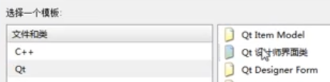
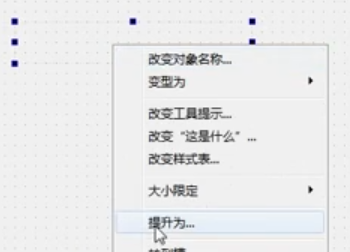
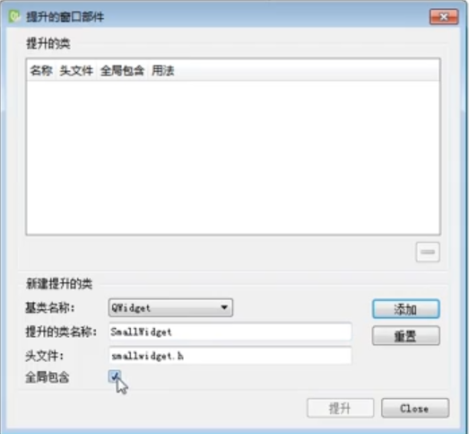

# QT/QT_create

1、支持平台windows、Unix/X11、MAC OS 、Embedded

## 基本功能

### 一、新建项目说明

带GUI项目创建：New Project 新建工程 $\to$ Projects $\to$ Application(Qt)

- Qt widgets Applicaion：空窗口项目
- Qt Console Application：命令行项目
- Qt Quick Application：快速创建项目

基类选择（Class Information）：Base class下拉选项（根据需求选择）

- QWidget -- 空窗口
- QMainWindow-- 提供工具栏、状态栏、侧边栏
- QDialog -- 对话框

###  二、GUI程序设计基础

#### 1、文件说明

- .pro文件：qmake构建系统的项目配置文件，存储各种项目配置

- .txt文件：CMake文件

- main.cpp：主程序入口文件

  ``` c++
  #include "widget.h"
  #include <QApplication>
  int main(int argc char* argv[]){
      // 创建应用程序
      QApplication a(argc, argv);
      // 创建窗口
      Widget w;
      // 显示窗口
      w.show();
      // 应用程序运行，开始消息循环和事件处理
      return a.exec();
  }
  ```

- widget.ui：使用XML格式描述元件及布局的界面

- widget.h：窗口类定义的头文件，使用了.ui文件

  ``` c++
  // 防止头文件重复引用
  #ifndef WIDGET_H
  #define WIDGET_H
  // 窗口类Qwidget
  #include <QWidget>
  // 命名空间
  QT_BEGIN_NAMESPACE
  namespace Ui { class Widget; }
  QT_END_NAMESPACE
  
  class Widget : public QWidget{
      // QT定义的宏，允许使用类中的信号和槽机制
      Q_OBJECT
  public:
      // 构造函数
      Widget(QWidget *parent = nullptr);
      // 析构函数
      ~Widget();
  
  private:
      Ui::Widget *ui;
  };
  
  #endif // WIDGET_H
  ```

- widget.cpp：实现文件

  ```c++
  #include "widget.h"
  // GUI文件
  #include "./ui_widget.h"
  
  Widget::Widget(QWidget *parent)
      // 初始化列表语法
      // 将parent赋值给Qwidget，新建对象ui::widget赋值给UI
      : QWidget(parent), ui(new Ui::Widget) {
      // 初始化ui类
      ui->setupUi(this);
      // 这里可以添加功能，初始按钮等操作
  	QPushButton *btn = new QPushButton;
  }
  
  Widget::~Widget() {
      delete ui;
  }

- ui_widget.h：根据组件信号自动生成

#### 2、项目管理-pro文件

建议使用CMake方式（CMakeLists.txt）

#### 3、UI窗体属性

QObject $\to$ QWidget $\to$ QFrame $\to$ QLabel 

#### 4、实现ui控件的功能

#### 5、坐标

qt的坐标在屏幕的左上角（0，0）；x以右为正方向，y以下为正方向

#### 6、UI控件名称

所有通过UI添加的控件他们都有一个属性 QObject $\to$ objectName，objectname是当前点击的控件名称（`ui->控件名称` ）

### 三、添加资源文件

1、应先将资源文件复制到项目类

2、创建资源文件夹：功能栏File  $\to$ New File... $\to$ Files and Classes中的Qt $\to$ Qt Resource File

3、添加资源文件：Projects栏 $\to$ Resources文件夹 $\to$ 找到.qrc文件 $\to$ 右键.qrc文件，open in Editor $\to$ add Files（添加前缀用于资源分类）

4、使用资源：`QIcon(":/资源文件位置")`

### 四、对象树

简单来讲，当使用qt创建对象时都是继承QObject对象（例：QWidget,QMainWindow,），子类创建对象时会在QObject中自动维护一个children列表，当窗口释放时，会自动释放

### 新建项目大量警告

Help $\to$ About Plugins $\to$ C++ $\to$ ClangCodeModel 将其勾选掉

## 信号

使用观察者模式实现，connect 是QObject类型下的

### 一、系统信号

``` c++
// 退出方法 
&Qwidget::close
```

### 二、信号连接

#### 1、连接系统槽

``` c++
Widget::Widget(QWidget *parent): QWidget(parent), ui(new Ui::Widget) {
    ui->setupUi(this);
    
    // 创建一个按钮，这个按钮触发一个信号
	QPushButton *btn = new QPushButton;
	/* 
	参数列表：信号发送者，发送的信号，信号的接收者，处理的槽函数 
	功能说明：给btn按钮绑定一个信号（clicked单击信号），当点击时触发关闭方法
	*/ 
	connect(btn, &QPushButton::clicked, this，&Qwidget::close);
    
    /* Lambda表达式 */
	// []:表示lambda的开始,
	connect(btn, &Mybutten::clicked, [=](){ 
        // 这里直接写处理方法 
    })
}
```

#### 2、连接自定义槽

``` c++
Widget::Widget(QWidget *parent): QWidget(parent), ui(new Ui::Widget) {
    ui->setupUi(this);
    // 创建一个按钮
	QPushButton *btn = new QPushButton;
	
    // 触发自己写的函数
	connect(btn, &QPushButton::clicked, this，&widget::classOver);
}

void widget::classOver() {
    cout << "触发";
}
```

#### 3、断开信号

``` c++
Widget::Widget(QWidget *parent): QWidget(parent), ui(new Ui::Widget) {
    ui->setupUi(this);
    // 创建一个按钮
	QPushButton *btn = new QPushButton;
	
    // 触发自己写的函数
	disconnect(btn, &QPushButton::clicked, this，&widget::classOver);
}
```

### 三、自定义信号

#### 1、创建自定义信号

``` c++
/* 继承的类可以是Qwidget类， */
class Teach: public QObject {

/* 
1、自定义信号必须在 signals
2、返回类型必须时 void
3、信号只需要声明，不用实现
4、信号可以有参数，可以重载
*/
signals:
	void hungry();
}
```

#### 2、创建槽函数（信号处理函数）

``` c++
/* 声明 */
class Student : public QObject{
public:
    // 早期槽函数只能放到public slots中，现在直接放到public中即可
    // 返回值必须是void
    void treat();
};

/* 实现 */
void student::treat() {
    cout << "xxx";
}
```

#### 3、信号连接

``` c++
// 引入自定义的槽和信号
#include "student.h"
#include "Teacher.h"

Widget::Widget(QWidget *parent): QWidget(parent), ui(new Ui::Widget) {
    Teacher *zt = new Teacher(this);
    student *st = new student(this);
    // 将信号连接
    connect(zt, &Teacher::hungry, st, &student::treat);
    
    // 调用hungry函数, 即可触发信号
    // emit 触发信号
    emit zt->hungry();
}
```

### 四、自定义信号传参

1、创建有参数信号

``` c++
/* 继承的类可以是Qwidget类， */
class Teach: public QObject {
signals:
	void hungry(int foodName);
}
```

2、槽函数

``` c++
/* 声明 */
class Student : public QObject{
public:
    void treat(int foodName);
};

/* 实现 */
void student::treat(int foodName) {
    cout << foodName;
}
```

3、连接没有重载的信号

``` c++
// 引入自定义的槽和信号
#include "student.h"
#include "Teacher.h"

Widget::Widget(QWidget *parent): QWidget(parent), ui(new Ui::Widget) {
    Teacher *zt = new Teacher(this);
    student *st = new student(this);
    
    // 将信号连接
   	connect(zt, &Teacher::hungry, st, &student::treat);
    
    // 调用hungry函数, 即可触发信号
    // emit 触发信号,携带参数
    emit zt->hungry("xxxxx");
}
```

4、重载的信号

``` c++
// 引入自定义的槽和信号
#include "student.h"
#include "Teacher.h"

Widget::Widget(QWidget *parent): QWidget(parent), ui(new Ui::Widget) {
    Teacher *zt = new Teacher(this);
    student *st = new student(this);
    
    // 重载带参的函数
    void(Teacher::*th_info)(int) = &Teacher::hunqry;
    void(Teacher::*st_info)(int) = &Teacher::hunqry
    // 将信号连接
    connect(zt,th_info, st, st_info);
    
    // 调用hungry函数, 即可触发信号
    // emit 触发信号,携带参数
    emit zt->hungry("xxxxx");
}
            
```

### 五、信号连接信号

``` c++
Widget::Widget(QWidget *parent): QWidget(parent), ui(new Ui::Widget) {
    Teacher *zt = new Teacher(this);
    
    // 重载带参的函数
    void(Teacher::*th_info)(int) = &Teacher::hunqry;
    // 将信号连接
    connect(btn, &QPushButton::clicked, zt, th_info);
    
    // 调用hungry函数, 即可触发信号
    // emit 触发信号,携带参数
    emit zt->hungry("xxxxx");
}
```

## QMainWindows

带有菜单栏（menu bar）、任务栏（tool bars）、铆接部件（dock widgets）、状态栏（status bar）、中心部件（central widget）的主窗口程序类，是许多应用程序的基础

### 一、菜单栏

``` c++
// 菜单栏头文件
#include <QMenuBar>

Widget::Widget(QWidget *parent): QWidget(parent), ui(new Ui::Widget) {
    // 创建菜单栏，只能有1个
    QMenuBar *bar = menuBar();
    // 将菜单栏设置到窗口中
	this->setMenuBar(bar);
    // 添加菜单项，没有菜单项，菜单栏不会显示
    QMenu *fileMenu = bar ->addMenu("文件");
    QMenu *editMenu = bar ->addMenu("编辑");
    // 为文件菜单项添加内容
    QAction *NewAction = fileMenu->addAction("新建");
    // 添加分割线
    fileMenu->addSwparator();
    
    /* 添加子菜单 */ 
    QMenu *subMenu = New Qmenu;
    subMenu->addAction("zcid");
    // 挂载到新建菜单下
    newAction->setMenu(subMenu);
}
```

### 二、工具栏

``` c++
// 菜单栏头文件
#include <QToolBar>

Widget::Widget(QWidget *parent): QWidget(parent), ui(new Ui::Widget) {
    // 工具栏可以有多个
    // this指定依附的对象，亦可以省略
    QToolBar *toolBar = new QToolBar(this);  
    
    /* 添加工具栏到窗口 */ 
    addToolBar(toolBar);
    // 设置添加位置,其他位置查看手册
    addToolBar(Qt::LeftToolBarArea, toolBar);
    // 只允许在左停靠
    toolBar->setAllowedAreas(Qt::LeftToolBarArea);
    // 设置禁止浮动
    toolBar->setFloatable(false);
    // 设置禁止移动
    toolBar->setMovable(false);
    
    /* 添加菜单项 */ 
    // 准备菜单
    QMenuBar *bar = menuBar();
    QMenu *fileMenu = bar->addMenu("文件");
    // 添加菜单到工具栏
    toolBar->addAction(fileMenu);
    
}
```

### 三、状态栏

``` c++
Widget::Widget(QWidget *parent): QWidget(parent), ui(new Ui::Widget) {
    // 状态栏只能有1个，
    // QStatusBar可以直接创建
    QStatusBar * stBar = new statusBar();
    // 将状态栏添加到页面
    setStatusBar(stBar);
    
    /* 给状态栏添加信息 */ 
    // 标签头文件
	#include <QLabel>
    // 创建标签
    QLabel *label = new QLabel("提示信息", this);
    // 将标签添加到状态栏，左侧
    stBar->addWidget(label);
    /* 添加右侧信息 */
    QLabel *labe12 = new QLabel("右侧提示信息", this);
    stBar->addPermanentWidget(labe12);
    
    /* 插入信息 */
    QLabel *labe4 = new QLabel("插入提示信息", this);
    // 0 是标注位置，
    stBar->insertWidget(0,labe12);
}
```

### 四、铆接（浮动窗口）

``` c++
// 头文件
#include <QDockWidget>

Widget::Widget(QWidget *parent): QWidget(parent), ui(new Ui::Widget) {
    // 创建铆接对象
    QDockWidget *dock = new QDockWidget;
    // 将铆接到窗口
    // Qt::BottomDockWidgetArea：底部，更多位置查看手册
    addDockWidget(Qt::BottomDockWidgetArea, dock);
    // 设置只允许下方设置
    dock->setAllowedAreas(Qt::BottomDockWidgetArea)
    
    /* 核心部件 */
    // 核心部件只能有1个，铆接位置根据中心部件确定
    #include <QTextEdit>
    QTextEdit *edit = new QTextEdit(this);
    setCentralWidget(edit);
}
```

## 对话框

对话框分为：模态对话框（弹出后不可对其他位置操作），非模态对话框（可以对其他窗口操作）

### 一、模态对话框

``` c++
#include <QDialog>

Widget::Widget(QWidget *parent): QWidget(parent), ui(new Ui::Widget) {
    /* 初始化ui类 */
    ui->setupUi(this);
    
    // 创建模态对话框
    QDialog dlg(this);
    dlg.exec();
    // 重置模态框大小
    dlg.resize(117, 31);
}
```

### 二、非模态对话框

``` c++
#include <QDialog>

Widget::Widget(QWidget *parent): QWidget(parent), ui(new Ui::Widget) {
    /* 初始化ui类 */
    ui->setupUi(this);
    
    // 创建非模态
    // 创建模态对话框
    QDialog *dlg = new QDialog(this);
    dlg->show();
    // 重置模态框大小
    dlg->resize(117, 31);
    // 设置属性，结束后释放内存，查看手册
    dlg->setAttribute(Qt::WA_DeleteOnClose);
}
```

### 三、弹出对话框

``` c++
Widget::Widget(QWidget *parent): QWidget(parent), ui(new Ui::Widget) {
    /* 初始化ui类 */
    ui->setupUi(this);
    
    /* UI控件发出信号 */
    // &QAction::triggered：触发动作，triggered类似于click
    connect(ui->控件名称, &QAction::triggered, [=](){
        // lambda表达式触发
    });
    // 触发自定义的方法处理
    connect((ui->控件名称, &QAction::triggered, this, &widget::myclick);
}
            
void Widget::myclick() {
    cout << 自定义的方法;
}
```

### 四、消息对话框

警告、错误等提醒对话框

``` c++
#include <QMessageBox>

Widget::Widget(QWidget *parent): QWidget(parent), ui(new Ui::Widget) {
    /* 初始化ui类 */
    ui->setupUi(this);
    
   	/* 消息对话框是静态属性，可以直接使用（不用New） */ 
    // 错误提示
    QMessageBox::critical(this, "标题", "内容");
    // 消息提示
    QMessageBox::information(this, "标题", "内容");
    // 警告提示
    QMessageBox::warning(this, "标题", "内容");
    
    /* 询问提示, 带有yes，no按钮 */ 
    // 参数4：
    // 	QMessageBox::Save：保存按钮，更多按钮查看手册
    // 参数5：
    // 	默认选项,QMessageBox::Save默认点击保存
    QMessageBox::question(this, "标题", "内容", QMessageBox::Save | QMessageBox::Cancel, QMessageBox::Save);
    // 判断当前选择
    if (QMessageBox::Save == QMessageBox::question(....)){}
}
```

### 五、颜色对话框

``` c++
#include <QColorDialog>

Widget::Widget(QWidget *parent): QWidget(parent), ui(new Ui::Widget) {
    QColor color = QColorDialog::getColor();
    // 设置默认色彩
    QColor color = QColorDialog::getColor(QColor(255,233,200));
    // 打印选中颜色
    cont << color.red();
    cont << color.green();
    cont << color.blue();
}
```

### 六、字体对话框

``` c++
#include <QFontDialog>

Widget::Widget(QWidget *parent): QWidget(parent), ui(new Ui::Widget) {
    bool ok;
    QFont Qfont = QFontDialog::getFont(&ok, QFont("华文彩云", 字号));
    // 结果
    cont << Qfont.family();
    cont << Qfont.pointSize();
    cont << Qfont.bold();
    cont << Qfont.italic();
}
```

### 七、文件对话框

``` c++
#include <QFileDialog>

Widget::Widget(QWidget *parent): QWidget(parent), ui(new Ui::Widget) {
    // 只能查看.txt文件
    QString path = QFileDialog::getOpenFileName(this, "标题", "默认打开目录", "*.txt");
    // 用户打开的目录
    qDebug() << path;
}
```

## UI Design

### 注意

``` c++
Widget::Widget(QWidget *parent): QWidget(parent), ui(new Ui::Widget) {
    /* 初始化ui类 */
    // 1、这个方法必须在最上方
    // 2、所有通过图形界面添加的控件都属于ui类
    ui->setupUi(this);
}
```

### 一、窗口属性

必须在qt的Qwidget、Qdigt、QMainWindow等类中使用

#### 1、修改窗体属性

``` c++
// 设置窗体名称
setWindowTitle(“sss”)

// 窗体图标
setWindowIcon(QPixmap(“:/images/t.png”))

// 固定大小窗体大小
setFixedSize(400, 300)

// 设置当前窗体大小，当前代码所在的窗体**
this->resize(600,400);
resize(600, 400);

// 设置无边框
this->setWindowFlag(Qt::FramelessWindowHint);
```

#### 2、设置图标

``` c++
Widget::Widget(QWidget *parent): QWidget(parent), ui(new Ui::Widget) {
    /* 初始化ui类 */
    ui->setupUi(this);
    
    /* 通过UI名设置图标 */
    ui->控件名称->setIcon(QIcon(":/image/luffy.png"));
}
```

### 二、QPushButton-按钮

1、头文件：`#include <QPushButton>`

2、创建按钮

``` c++
/* 第一种方法 */ 
QPushButton *btn = new QPushButton;

/*第二种方法*/
// 按照窗体创建按钮
QPushButton *btn = new QPushButton(“按钮名称”, this)
```

3、功能

``` c++
QPushButton *btn = new QPushButton;

/* 设置按钮文件 */
btn->setText(“按钮名称”);
/* 移动 */
btn->move(100, 100);
/* 调整大小 */
btn->resive(50,50);

/* 显示到窗体哪个位置 */
// 顶层弹出，单独一个窗口
btn->show();      
// 显示在当前窗体，this是当前的类
btn->setParent(this) 
// 向布局Layout中添加
ui->vLayout->addWidget(btn) 
```

4、支持的信号

``` c++
// 点击
&QPushButton::clicked 
```

### 三、Tool Button

功能与QPushButton相同，主要用于显示图片

其属性 autoRaise 是透明效果

 ### 四、Radio Button

``` c++
// 默认选中
ui->控件名->setChecked(true);

// 监听用户选中
connect(ui->控件名， &QRadioButton::clicked, [=](){
    选中状态
})
```

### 五、CheckBox

``` c++
// 默认选中
ui->控件名->setChecked(true);

// 监听用户选中
connect(ui->控件名， &QCheckBox::stateChanged, [=](int state){
    //选中状态
})
```

### 六、list_widget（ItemBase）

基于用户自定义数据，用于展示列表数据

``` c++
Widget::Widget(QWidget *parent): QWidget(parent), ui(new Ui::Widget) {
    /* 创建控件 */
    // listwidget每一行都是一个item
    QListWidgetItem *item = new QListWidgetItem("锄禾日当午");
    // 设置对齐方式
    item->setTextAlignment(Qt::AlignHCenter);
    // 将数据添加进ui的指定的QList控件中
    ui->控件名称->addItem(item);
    
    /* 添加多条数据 */
    // 必须使用QStringList类型
    QStringList list;
    // 2中添加数据形式,不能设置居中
    list.push_back("xxx");
    list << "xxxx" << "cccc";
    ui->控件名称->addItem(list);
}
```

### 七、tree_widget（ItemBase）

可展开的列表，有斜三角符号的列表

``` c++
Widget::Widget(QWidget *parent): QWidget(parent), ui(new Ui::Widget) {
    // 生成数据
    QStringList list;
    list << "英雄" << "x";
    // 创建tree控件头部
 	ui->控件名称->setHeaderLabels(list);
    // 生成tree内部数据，使用匿名对象
    QTreWidgetItem *liItem = new QTreeWidgetItem(QStringList() << "xxx");
    // 将数据添加进UI
    ui->控件名称->addTopLevelTiem(liItem);
    
    // 创建子列表
    QTreWidgetItem *otherItem = new QTreeWidgetItem(QStringList() << "子列表");
    // 将子列表添加到liItem项下
    liTtem->addChild(otherItem);
}
```

### 八、table_widget（ItemBase）

带有横线、竖线的普通表格

``` c++
Widget::Widget(QWidget *parent): QWidget(parent), ui(new Ui::Widget) {
    // 创建表头数据
    QStringList list;
    list << "xx" << "www" << "aaa";
    // 告诉tablewidget有几列
    ui->控件名称->setColumnCount(list.size());
    // 设置表格头数据
    ui->控件名称->setHorizontalHeaderLabels(list);
    // 设置行数
    ui->控件名称->setRowCount(5);
    // 向表格中添加内容,QTableWidgetItem只能用QString类型
    ui->控件名称->setItem(行, 例, new QTableWidgetItem("数据"));
    
    /* 循环添加 */ 
    QStringList Name;
    Name << "xxx " << "sdfdf" << "sdf";
    for (int i=0; i<5; i++){
        int cot = 0;
        ui->控件名称->setItem(i, col++, new QTableWidgetItem(Name[i]));
    }
    
    /* table查找元素 */
    // isEmpty()：返回true，false
    // Qt::MatchExactly：匹配方式，向前查看手册
    bool em = ui->控件名称->findItem("查找的元素名",Qt::MatchExactly).isEmpty();
    
    /* 删除元素 */
    // .first()：查找元素第一次匹配的位置
    // .row()：返回行号
    int rownum = ui->控件名称->findItem("查找的元素名",Qt::MatchExactly).first()->row();
    // 根据行号删除元素
    ui->控件名称->removeRow(rownum);
    
    // 将int 转换为QString
    QString::number(18+i);
}
```

### 九、stacked Widget

``` c++
// 设置默认页
ui->控件名称->setCurrentIndex(0);

/* 实现栈切换功能 */
// statckedWidget必须使用button按钮操作他的页面切换
connect(ui->控件名称, &QPushButton::clicked, [=](){
    ui->控件名称->setCurrentIndex(1);
})
```

### 十、comboBox-下拉框

``` c++
/* 给下拉框添加内容 */
ui->控件名称->addItem("选项1");
ui->控件名称->addItem("选项2");

/* 点击按钮，修改下拉框显示内容 */
connect(ui->控件名称, &QPushButton::clicked, [=](){
    ui->控件名称->setCurrentText("xxx");
})

```

### 十一、QLineEdit-输入框

密码不显示设置：design界面 $\to$ QLineEdit $\to$ echoMode

- NoEcho：什么都不显示
- Password：显示圆圈
- PasswordEchoOnEdit：输入时显示，焦点切换后显示圆圈

### 十二、Text Edit与Plain TextEdit

文本输入框，Text Edit带有文本样式，Plain TextEdit不带样式

``` c++
//输入框内简单文本， QString
ui->QTextEdit/QPlainTextEdit ->toPlainText() ;
//带有样式的内容
ui->QTextEdit->toHtml() ;

// 清空输入框
ui->text->clear();
// 返回光标
ui->text->setFocus() ;
```

### 十三、Qlabel-标签

``` c++
/* 显示图片 */ 
ui->控件名称->setPixmap(QPixmap(":/image/u.png"));
// 设置图片宽高
QPixmap pix;
pix.load(":/image/u.png");
ui->控件名称->setPixmap(pix);
ui->控件名称->setFixedSize(pix.width(), pix.height());

/* 显示Gif图片 */ 
QMovie *movie = new QMove(":/Image/o.gif");
ui->控件名称->setMovie(movie);
// 播放
movie->start();
// 设置速度
movie->setSpeed(300);
// 播放完停止
connect(movie, &QMovie::frameChanged, [=](int frameId){
    if(frameId == movie->frameCount()-1){
        movie->stop();
    }
})
```

### 十四、封装控件

1、右键项目 $\to$ 添加新文件 $\to$ 选中模板：Qt $\to$ Qt设计师界面类（）

2、选择Widget（空的界面）$\to$ 下一步，完成 $\to$ 在设计页面中组合控件

3、在其他页面添加自定义封装的控件，

- 添加Widget控件

- 在widget控件上右键 $\to$ 提升为... （）

- 设置属性

  

4、点击添加 $\to$ 提升（设计时没有效果，运行时有效果）

## QT内置对象

### 一、数据类型

为了统一不同平台相同类型的大小统一而定义的类型

### 二、QPixmap -用于加载图片

``` c++
QPixmap(“:/images/time.png”);
btn->setIcon(QPixmap(“:/image/time.png”));
```

### 三、容器

#### 1、QVector 

QVector在6.2版本后与QList合并，查看QList

#### 2、QList

``` c++
#include <Qlist>

// 存放QString类型的Qlist容器
QList<QString> namelist; //QList类型数组
// 添加数据
nameList << “sss” << “添加数据”;
nameList.back_push("ssss");
// 使用
nameList[1]; 

/* 可用方法*/
// 获取长度
nameList.lenght();
```

#### 3、QTStringList

``` c++
QStringList iconNameList; //字符串数组
iconNameList << “这样添加数据” ;
iconNameList.at(1); 使用数据
```

### 四、数据类型

#### 1、QString

``` c++
QString str //声明

//格式化字符串

QString(“:/images/%1.png”).arg(nameList[1]);

 

str.toInt() //转数字

str.toUtf8() // 转QByteArray类型
```

#### 2、QByteArray 

``` c++
**可隐式转换为QString****类型**

QByteArray array = QByteArray(size, 0);

类型转换

.toUtf8() //转QByteArray类型

.toInt()
```

### QDebug

`qDebug() << "sssss";` 

### 五、QSound

``` c++
QSound *ss = new QSound(":/sss.wav");
// 播放音效
ss->play();
```

### 六、Socket


udp = QudpSocket(this);

udp->bind();

udp->writeDatagram(“wenben”, QHostAddress(192.168..), 111）；

 

接收数据

connect(udp, &QUdpSocket::readyRead, [=](){

qint64 size = udp->pendingDatagramSize();

QByteArray array = QByteArray(size, 0);

udp->readDatagram(array.data(), size);

})

## 事件

### 一、鼠标事件

``` c++
Widget::Widget(QWidget *parent): QWidget(parent), ui(new Ui::Widget) {
}
```

### 二、定时器事件


### 三、事件拦截

## 绘图

## 文件操作

### 一、读取文件信息

``` c++
// 文件对话框
#include <QFileDialog>
// 点击选择文件按钮
connect(ui->控件名称, &QPushButton::clicked, [=](){
    // 弹出文件对话框，选择文件
    QString path = QFileDialog::getOpenFileName(this, "打开文件", "默认路径");
    if(path.isEmpty()){
        // 没有选择文件，设置默认路径为C:/
    	ui->控件名称->setText("C:/");
    }else {
        // 给输入框设置选中的路径
    	ui->控件名称->setText(path);
        
        /* 读取文件 */
        #include <QFile>
        QFile file(path);
        // 使用指定方式打开
        file.open(QIODevice::ReadOnly);
        // 读取全部数据
        QByteArray arr = file.readAll();
        // 将数据放到UI中，这里是隐式转换，由QByteArray转Qstring
        ui->控件名称->setText(arr);
        
        /* 读取一行 */
        QByteArray arr = file.readLine();
        // file.atEnd：判断是否读到文件尾
        while(!file.atEnd()) {
            QByteArray arr = file.readLine();
        }
        
        /* 关闭文件 */
        file.close();
    }
})
```

### 二、写文件

``` c++
/* 读取文件 */
#include <QFile>
QFile file(path);
// 覆盖写
file.open(QIODevice::WriteOnly);
file.write("ccccc");
file.close();

/* 追加写 */
file.open(QIODevice::Append);
```

### 三、文件信息类

``` c++
#include <QFileInfo>
string path = "C://";
QFileInfo info(path);
// 后缀名
info.suffix();
// 大小
info.size();
// 文件名
info.fileName();
// 文件路径
info.filePath();
// 创建时间
info.created().toString("yyyy-MM-dd hh:mm:ss");
```

### 文件流

#### 1、数据量小

#### 2、数据量大


## 打包发布

1、qt打包方式

修改 debug 模式到 Release 模式 $\to$ 编译运行 $\to$ 找到Release目录下的exe文件 $\to$ 复制到新文件夹 $\to$ 在文件夹下运行 `windeployqt **.exe` （windeploypt是qt自带的软件，要运行它）

2、hm nis edit（第三方打包）
