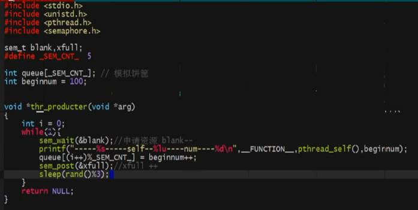

\#include<stdlib.h>

exit(1)

获取环境变量

char* getenv(const char* name)

char* setenv(const char* name)

export key=value; //在.bashrc 启动时配置环境变量

# fork

\#include<unistd.h>

**pid_t** fork(void) //新建一个进程

失败返回-1，成功,父进程返回子进程id； 子进程返回0

ex: pid_t pid = fork() 

fork()会分叉成2个进程,fork（）之后的代码会运行2便

if (pid<0){//error};

if (pid==0){printf(“子进程”)}

if(pid > 0) {printf(“父进程”)}

## 父进程与子进程相同地方

全局变量，data，text，栈、堆、环境变量、用户ID、宿主目录、进程工作目录、信号处理方式

不同点：进程ID， fork返回值， 父类ID 进程运行时间

全局变量也是读时共享，写时复制

 

## 循环生成子进程

循环fork每次循环都要把所有已分配的在

for(i=0;i<5;i++)

{

pid = fork();

if(pid==0){**break;** //防止子进程再次fork}

if(pid>0){printf(“aaa”); // 父进程}

}

**精确控制**

sleep(i) //因为子进程break所以i的值不同

if(i<5){printf(“子进程”)}else{printf（“父进程”）//父进程循环5次}

## 缓冲区

printf(“begin”);

fork();

printf(“end..\n”);

这时会输出2个beginend..，因为子进程也拥有**缓冲区的内容****,****需要在fork****前清空缓冲区，或\n;linux****特有**

 

\#include<sys/types.h>

\#include<unistd.h>

**pid_t** getpid(void) //获取当前进程id

**pid_t** getppid(void)//获取当前进程父id

 

ps aux

ps ajx 可以查看进程的父类进程

kill -l 查看所有信号 -9杀死进程

ps aux|grep a.out |grep -v grep |wc -l统计

 

## execl执行其他程序

execl不会新建一个进程，他是在原有进程的基础上把text代码段替换，只有失败才返回，（不需要判断返回值）

\#include <unistd.h>

int execl(const char *path, const char* arg)

execl(“/bin/ls”, “ls”, “-l”, NULL); //参数是从0开始

 

使用系统环境变量，执行命令时不用加路径

int execlp(const char* file,const char* arg)

 

## 回收资源（父类回收子进程资源）

\#include<sys/types.h>

\#include<sys/wait.h>

WIFEXITED 真，正常退出

信号杀死

 

pid_t wait(int* status);

判断是如何死亡

int a;

pid_t wpid = wait(&a);

printf(“%d”,wpid)

if(WIFEXITED(status)){//正常退出

printf(WEXIFSTATUS(status))

}

if(WIFSIGNALED (status)){//信号

printf(WTERMSIG(status))

}

 

status传出参数，判断是怎么结束的，成功返回子进程id，失败返回-1

当子进程没死，等待死亡

pid_t waitpid(pid_t pid, int* status,int option);

返回值 -1回收结束

\>0 回收的子进程的pid

 

pid<-1 组内id

-1 任意回收

0 回收和调用进程组id相同的组内子进程

\>0 回收指定id

option：

0与wait相同，阻塞

WNOHANG会立即返回0，有子进程退出返回子进程pid，失败返回-1

## 回收多个子进程回收

 

# 进程间通信

## 管道(只能与有血缘关系的进程通信）

\#incldue<unistd.h>

int pipe(int pipefd[2])

pipefd读写文件操作符，0-读 1-写

成功返回0，失败返回-1

int main()

{

int fd[2];

pipe(fd);//必须提前分割

//创建子进程，必须在fork之前

pid_t pid = fork();

 

if(pid==0){

//子进程

write(fd[1], “hallo”, 5); 将信息写入管道

}else{

//父进程读取

char buf[12]={0};

int ret = read(fd[0], buf, sizeof(buf)) //read默认是阻塞的

if (ret>0){

//读到信息

write(STDOUT_FILENO, buf, ret)

}

}

}

//如果子进程或父进程同时拥有读端或写端，他们会等待另一个操作

//所以说要及时关闭不使用的端口

close(fd[0])

 

读管道

写端全部关闭 read读到0 ，相当于读到末尾。

写端没有全部关闭

有数据-read读取

没有数据-read阻塞 fcntl函数可以更改非阻塞

 

写管道

读端全部关闭 -- 产生一个信号 SIGPIPE,程序异常

没全部关闭：

管道已满 -- write阻塞

管道未满 -- write正常

查看管道大小

ulimit

long fpathconf()

管道有点：

简单，使用方便；只能有血缘关系进程通信，父子进程需要2个管道才能双向通信（全双工）

## FIFO（无血缘通信）

创建一个管道伪文件（mkfifo myfifo, 

int mkfifo(const char* path, mode_t mode);

内核会针对file文件开辟一个缓冲区，操作fifo文件，可以操作缓冲区，实现进程之间通信

1创建一个fifo文件

2通过open方法进行读写

2个进程必须读取统一fifo文件，当open fifo文件时会阻塞，直到另一端也打开

 

## mmap（操作内存速度最快）

\#include<sys/mman.h>

创建一个映射区

void* mmap(void *addr, size_t length, int prot, int flags,

int fd, off_t offset);

addr NULL

映射长度

PROT_READ, PROT_WRITE

MAP_SHARED映射区共享 对内存的修改会影响到源文件， MAP_PRIVATE私有的，进程通信必须使用MAP_AHARED

fd 文件描述符

offset 偏移量

 

成功返回可用内存首地址，失败返回MAP_FAILED

 

释放映射区

int munmap(void* addr, size_t length);

mmap的返回地址，

 

\#include<stdio.h>

\#include<unistd.h>

\#include<sys/types.h>

\#include<sys/stat.h>

\#include<fcntl.h>

\#include<sys/mman.h>

int main()

{

int fd = open(“man.txt”, O_RDWR); //加载到内存，等待共享

//创建一个映射区

char* men = mmap(NULL,8,PROT_READ|PROT_WRITE,MAP_SHARED,fd,0)

if(men == MAP_FAILED){

printf(“mmaperr”);

}

strcpy(men, “hello”) ;//修改了man.txt文件

*men = 100; //修改映射区

munmap(men,8); //释放

close(fd);

}

如果默认打开的文件是空文件，会报总线错误

文件大小，对操作区有影响，文件多大才能操作多大

offset必须是4的整数倍

open文件不能只是写操作，会没有权限权限

## 匿名映射

**MAP_ANONYMOUS = MAP_ANAO**

char* men = mmap(NULL,8,PROT_READ|PROT_WRITE,MAP_SHARED|**MAP_ANONYMOUS**,-1,0)

对于unix系统，可能不存在MAP_ANONYMOUS这个宏定义，这时可以使用/dev/zero，这个文件可以是无限大 /dec/null 回收站，放进去就没了

# 信号

未决信号集与阻塞信号集关系

kill -l 查看信号

信号四要素：编号，名称，事件，默认处理动作

信号特点：简单，不能携带大量信息，特定条件下产生，

信号也叫软终端，可能会有延迟

man sige

9,19 信号不能捕捉、不能忽略、不能阻塞

信号产生

ctrl+c 2)SIGINT(中断、终止）

ctrl+z 20)SIGISTP(暂停、停止）

ctrl+\ 3)SIGIQUIT(退出）

除0操作 8)SIGFPE(浮点数除外

非法访问内存 11）SIFSEGV (段错误）

总线错误 7）SIGBUS

 

\#include<sys/type.h>

\#include<signal.h>

\#include<unistd.h> sleep函数

int kill(pid_t pid, int sig);发送信号

pid > 0 要发送的进程ID

pid = 0 当前调用进程组内所有进程

pid =-1 当前有权限，所有能发的进程（广播）

 

\# 给自己发信号

int raise(int sig);

// kill(getpid(), sig);

 

\#include<stdlib.h>

void abort(void); //给自己发一个异常信息 SIGABRT

 

\#定义多少时间后给自己发送一个信号，信号传入0代表终止定时

\#发送的是SIGALRM,默认是多少秒后终止进程，

\#include<unistd.h>

unsigned int alarm(unsigned int seconds);

返回剩余秒数

 

\#可以周期性的发送信号

\#include<sys/time.h>

int getitime(int which, struct itimerval* curr_value);

int setitime(int which, const struct itimerval* new_value,

const struct itimerval* old_value);

which:ITIMER_REAL 自然时间（SIGALRM)

ITIMER_VIRTUAL (SIGVTALRM)

ITIMER_PROF ITIMER_VIRTUAL

 

struct itimerval myit = {{0,0},{3,0}}

setitime(ITIMER_REAL, &myit, NULL); //3秒发送

 

 

 

 

函数名是函数指针

int a();

void (*a)();

结构体要传递地址

 

清空信号寄

int sigemptyset(sigset_t *set);

填充信号及

int sigfillset(sigset_t* set);

添加某个信号到信号集

int sigaddset(sigset_t* set, int signum);

从信号集中删除某信号

int sigdelset(sigset_t* set, int signum);

 

int sigismember()

//设置阻塞或解除阻塞信号集

int sigprocmask(int how, const sigset_t* set,sigset_t* oldset)

how, SIG_BLOCK设置阻塞

SIG_UNBLOCK解除阻塞

SIG_SETMASK设置set为新的阻塞信号

set，信号集，上面的函数设置

oldset旧的信号集，传出

 

//获取当前系统未决信号集

int sigpending(sigset_t* set);

0成功，-1失败

 

sigemptyset() //清空信号集

sigaddset()//添加一个信号集

sigprocmack()//设置信号阻塞

 

## 信号捕捉

typeof void (*sighandler_t)(int);

 

sighandler_t signal(int signum,sighandler_t handler);

signum要捕捉的信号，

handler捕捉信号调用的方法，函数应声明void func(int); 

 

\#include<signal.h>

注册捕捉函数

int sigaction(int signum, const struct sigaction* act, struct sigaction* old);

signum 要捕捉的信号

act 传入的动作

struct sigaction{

void (*sa_handler)(int),

void (*sa_sig...),

sigset_t sa_mask;//执行捕捉期间，临时屏蔽的信号集

int sa_flags; //一般填0会调用第一函数

void (*sa_restorer)(void);//无效

}

 

struct sigaction act;

act.sa_flags = 0;

act.sa_hander = catch; //catch是一个自定函数

sigemptyset(&act.sa_mask);//清空信号集

sigaction(SIGIII, &act, NULL)

 

## 通过信号回收

void catch(int mum){

//因为信号无阻塞，无队列，如果同时有多个信号，结果只处理1个

pid_t pid; 

while(pid = waitpid(-1, NULL,WNOHANG) > 0)

{

//结束回收

}

}

# 守护进程

创建守护进程

子进程中创建新会话setsid()

改变当前目录为根目录chdir() /home

重设文件权限密码umask()

关闭文件描述符

启动守护进程核心工作

\#include<sys/type.h>

\#include<sys/stat.h>

\#include<time.h>

 

time_t = time(NULL) //当前时间戳

sprintf(“%s %s”, ss);

int main()

{

umask(0)

chdir(getenv(“HOME”))

close(0)

close(1)

close(2)

}

# 线程

线程不使用信号进行通信，因为太复杂

char* strerror(int errnum);

创建一个进程

编译的时候要加入 -lpthread参数

\#include<pthread.h>

int pthread_create(pthread_t* thread, const pthread_attr_t* attr,

void* (*start_routine)(void*), void* arg)

thread 传出参数，线程id

attr 线程参数

void* func(void)

函数参数

成功0，失败error num

主进程一定不能提前结束，提前结束会造成一系类问题

\--------

返回线程ID

pthread_t pthread_self(void);

退出一个线程

void pthread_exit(void* retval)

线程注意事项：不使用exit会将进程退出

 

线程回收函数

int pthread_join(pthread_t thread, void **retval)

thread 线程pid

void* 类型变量， 线程返回结果

线程回收阻塞等待线程完成

杀死线程

pthread_cancel(pid)

失败返回error，成功返回0

返回值是一个宏定义，如果强转一下就是-1

强转设置取消点，防止线程无法取消

pthread-testcancel()

 

线程分离-系统自动回收

pthread_detach(pthread_t thread)

判断2个线程是否相等

在进程内部唯一，整个系统不唯一

int pthread_equal(pthread_t t1, pthread_t t2)

 

线程属性-设置线程分离的时候使用

初始化线程属性

int pthread_attr_init(pthread_attr_t *attr)

销毁线程属性

int pthread_attr_destroy(pthread_attr_t *attr) 

设置属性分离

int pthread_attr_setdetachstate(pthread_attr_t *attr, int detachstate);

attr 

detachstate

PTHREAD_CREATE_DETACHED线程分类

PTHREAD_CREATE_JOINABLE允许回收，必须调用join

 

getconf GNU_LIBPTHREAD_VERSION 查看线程库版本

创建多少线程合适

cpu*2+2

# 线程同步

## 互斥锁

pthread_mutex_init(pthread_mutex_t *restrict mutex, const pthread_mutextattr_t *restrict att)

restrict关键字，只能通过mutex修改

attr属性：NULL

 

//加锁

pthread_mutex_lock（pthread_mutex_t *mutex)

//使用常量定义硕

pthread_mutex_t mutex = PTHREAD_MUTEX_INITIALIZER

pthread_mutex_lock(&mutex)

pthread_mutex_unlock(&mutex)

 

//销毁

pthread_mutex_destroy()

 

//尝试加锁

int ret = pthread_mutex_trylock(&mutex)

返回值大于0,报错strerror(ret)错误信息include<string.h>

 

死锁，2次加锁，读共享，写独占

 

## 读写锁-适合读线程比较多的锁

pthread_rwlock_init(pthread_rwlock *restrict rwlock, const pthread_rwlockattr_t *restrict attr)

pthread_rwlock rwlock = PTHREAD_RWLOCK_INITIALIZER;

 

pthread_rwlock_destroy(&rwlock)

pthread_rwlock_unlock(&rwlock)

pthread_rwlock_wrlock(&rwlock)

pthread_rwlock_rdlock(&rwlock)//写

 

__FUNCTION__ 宏定义函数名

pthread_self() //线程号

## 信号量-加强版的互斥锁

编译添加 -lpthread 信号量 进程可用

适用于多资源，多线程访问。

sem_init(sem_t *sem，int pshared, unsigned int value)

sem传出

pshared 0代表线程信号量，非0代表进程信号

value 允许的信号量的个数数

sem_destory(sem_t *sem)

sem_timedwait()

sem_wait() //申请信号量，申请信号量成功，信号减，减到0阻塞

sem_post() //释放信号量，成功信号量++

 

## 生产者消费者模型

pthread_cond_t cond = PTHREAD_COND_INITIALIZER

pthread_cond_timedwait() //超时等待

pthread_cond_wait() //阻塞等待

先释放锁，再阻塞到cond变量上

//唤醒至少一个阻塞在条件cond上的线程

pthread_cond_signal(pthread_cont_t *cond) //通知是否阻塞的信号

//唤醒所有阻塞的线程

pthread_cond_broadcast()

 

 

## 文件锁

\#include<unistd.h>

int fcntl()