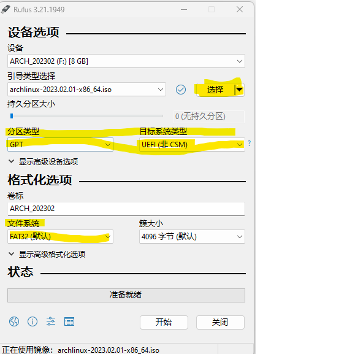
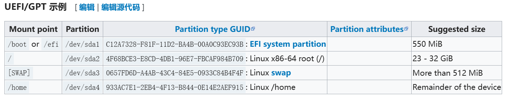
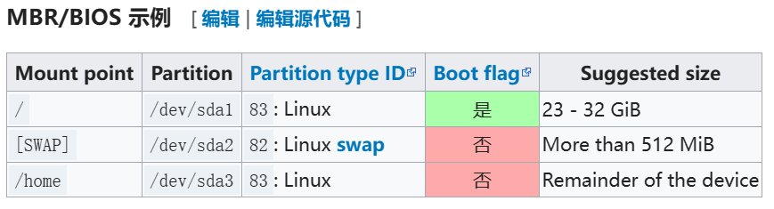
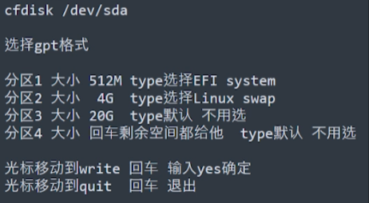

# Archlinux

## 知识点

### 一、UEFI与BIOS说明

#### 1、UEFI

- Unified Extensible Firmware Interface（统一的可扩展固件接口）
- 这种接口用于操作系统自动从预启动的操作环境，加载到一种操作系统上。
- UEFI 系统中使用 GPT，使用[parted](https://wiki.archlinux.org/index.php/Parted_(简体中文))命令

#### 2、BIOS

- Basic Input/Output System（基本输入/输出系统）
- 负责在开机时做硬件启动和检测等工作，并且担任操作系统控制硬件时的中介角色。
- BIOS 系统中使用 MBR，使用fdisk命令

### 二、fstab

文件负责配置Linux开机时自动挂载的分区，某些时候当Linux系统下划分了新的分区后，需要将这些分区设置为开机自动挂载，否则，linux是无法使用新建的分区的。磁盘分区都必须挂载到目录树中的某个具体的目录上才能进行读写操作，而fstab正是负责这一配置。

## 创建启动盘

### 一、启动盘选择

MBR BIOS是大多数系统默认的启动项，可以不配置。

- 硬盘空间不能超过2T，
- GRUB legacy 作为引导程序，必须使用 MBR。
- 使用传统的 BIOS，并且双启动中包含 Windows （无论是 32位版还是 64 位版），必须使用 MBR。

GPT UEFI需要配置BIOS启动项比较复杂，GPT UEFI代表未来，将来一定会替换MBR。

- UEFI支持硬盘大小超过2T

### 二、镜像下载

Archlinux镜像分为网络版（Arch linux Netboot）与ISO文件，这里我们选择ISO文件（magent link 或者 torrent）

### 三、创建启动盘

#### 1、linux系统

使用dd命令

#### 2、Rufus-windos

下载地址：[Rufus - 轻松创建 USB 启动盘](https://rufus.ie/zh/) 



#### 2、软碟通选择RAW方式写入

## 安装前置配置

### 一、配置系统启动模式

进入系统BOIS中设置启动模式（boot）

### 二、验证启动模式

``` shell
# 如果命令结果显示了目录且没有报告错误，则系统以 UEFI 模式引导。
ls /sys/firmware/efi/efivars
```

### 三、配置键盘（选作）

默认是英文键盘

### 五、更新系统时间

timedatectl set-ntp true

### 六、分区

swap分区：swap为内存的2倍，最大4G

#### 1、分区目标

##### UEFI GPT分区

- swap 分区：2G或者4G
- 主分区（/）：
- EFI分区（/boot）：EFI分区最大512M



##### MBR BIOS分区

- swap分区：
- 主分区（/）：



#### 2、查看分区信息

`/dev/sdX` 是块设备，依不同物理设备有不同的格式：

- `/dev/sda` 是 SATA 设备（普通磁盘）
- `/dev/nvme0n1` 是 NVMe 设备
- `/dev/mmcblk0` 是 eMMC 设备

```shell
# 可选命令一
parted /dev/sda print
# 可选命令二
fdisk -l /dev/sda
```

#### 3、分区工具

##### parted：可以划分所有分区

- parted /dev/sdX：进入/dev/sdX磁盘

- mklabel  label_type ：设置分区格式（MBR，GPT）

- mkpart part-type [fs-type] start end(单位Mb)设置分区

- print：查看分区信息

- help [command]：查看命令[command]如何使用

- rm [ num ]：删除一个分区

- set num flag status 

  num：分区序号，print可以查看

  flag：boot，root，

  status：swap状态，可选on或off

- quit：退出

``` shell
# 进入分区程序，默认选择/dev/sda磁盘
root@archiso~# parted 
# 指定磁盘，进入分区程序
(parted) parted /dev/sda

# 选择磁盘
(parted) select /dev/sda 

# 设置分区格式-GPT分区表
(parted) mklabel gpt 
# 设置分区格式-MBR分区表
(parted) mklabel msdos

# 开始创建分区
(parted) mkpart ESP fat32 0M 512M
(parted) mkpart swap linux-swap 512M 4.5G 
(parted) mkpart primary ext4 4.5G -1 

# 设置boot开关
# 说明： 1 磁盘编号；boot on //设置boot启动标志
(parted) set 1 boot on 

# 退出
(parted) q
```

##### cfdisk：图形界面



### 七、格式化磁盘

``` shell
# 格式化EFI（boot）分区，EFI分区必须是fat格式
mkfs.fat -F32 /dev/sdaX
# 或者，这2个命令都可以，二选一
# 不指定-F32会生成-F16格式
mkfs.vfat -F32 /dev/sdaX

# 格式化普通分区
mkfs.ext4 /dev/sdaX

# 初始交换分区
mkswap /dev/sdaX # 格式化swap分区，
swapon /dev/sdaX # 初始化swap分区(不需要挂载）
```

### 八、检查磁盘类型和分区

命令：`fdisk -l` 

文件系统Type必须是EFI System、Linux swap、Linux filesystem

### 九、挂载

#### 1、命令

swap分区不用挂载

``` shell
# 必须先挂载根目录，才能挂载其他分区
mount /dev/sdaX /mnt

# 创建/home目录（没有home分区，不同挂载）,boot目录
mkdir /mnt/boot

# 挂载boot目录，将EFI分区挂载到boot
mount /dev/sdaX /mnt/boot 

#如果有其它分区，分别进行挂载，例如home分区
mkdir /mnt/home
mount /dev/sdaX /mnt/home
```

#### 2、检查挂载是否成功

如果/mnt/boot与/mnt目录大小相同，需要先挂载/mnt再挂载/mnt/boot

``` shell
# 成功样例
lsblk -f
sda1 vfat FAT32  581.9M /mnt/boot
sda2 swap 1             [swap]
sda3 ext4 1.0    431.7G /mnt
```

## 开始系统安装

### 一、连接网络

#### 1、连接wifi

验证能ping通archlinux.com，确保自己能联网，设置动态IP

- 使用手机USB联网：手机开启USB共享，输入命令dhcpcd

- wifi-menu：使用wifi-menu命令，进入图形界面联网

- iwctl：

  iwctl：进入命令行

  device list：列出设备名

  station wlan0 scan：扫描网络

  station wlan0 get-networks：列出网络

  station wlan0 connect 名称：连接网络

  exit：退出

#### 2、设置网络同步时间

timedatectl set-ntp true

#### 3、新中国源

加快系统安装速度

``` shell
# 禁止更新，不禁止会更新掉自己设施的源地址
systemctl stop reflector.service

# 修改软件源，把中国地址源地址放到前面
# 可以使用nano系统自带编辑器
vi /etc/pacman.d/mirrorlist
```

#### 4、更新源

只同步仓库：`pacman -Syy` 

### 二、安装命令

- 联网软件：iwd、dhcpcd（基础）、NetworkManager
- 登录的shell：base、zsh

``` shell
# 最小化安装，会缺少基本的软件
pacstrap /mnt base 
# 基础安装
pacstrap /mnt base base-devel linux linux-firmware
# 安装大部分软件
pacstrap /mnt base base-devel linux linux-firmware dhcpcd iwd vim sudo bash-completion net-tools openssh man git wget zsh
```

### 三、生成fstab文件

命令：`genfstab -U /mnt >> /mnt/etc/fstab` 

查看：`cat /mnt/etc/fstab`

- 注意查看swap、vfat、ext4这几个文件类型，以及所有的分区是否都正常存在

### 五、切换系统，命令提示符会变

命令：`arch-chroot /mnt`  

## 配置系统

### 一、设置时区

```shell
ln -sf /usr/share/zoneinfo/Asia/Shanghai  /etc/localtime
# 设置硬件时间
hwclock --systohc 
```

### 二、配置语言环境

``` shell
# vi /etc/locale.gen
# 去掉 ‘#’ 注释
zh-CN utf-8
en-us utf-8

# 执行命令，更新
# locale.conf文件是全局设置，在这里设成中文或者其他非英语环境，桌面环境下会正常显示，但是命令行模式下会变成乱码。中文的问题在后面用其他方法解决。
locale-gen

# 向locale.conf添加语句
echo LANG=en_US.UTF-8 > /etc/locale.conf
```

### 三、修改hosts、hostname

1、创建/etc/hosts文件

``` shell
127.0.0.1 localhost
::1       localhost
```

2、echo 主机名 > /etc/hostname

### 五、修改root密码

``` shell
# 修改root密码
passwd root
```

### 六、安装CPU微码

``` shell
# inter的CPU需要安装，cpu微码补丁
pacman -S intel-ucode

# 通用安装
pacman -S amd-ucode os-prober
```

### 七、联网

错误：Temporary failure in name resolution

解决：dhcpcd没有开启

#### dhcpcd-必须配置项

``` shell
# 必须使用手机、网线或者其他物理设备
# 安装的软件
pacman -S dhcpcd

# archlinux安装后无法联网，检查解决方法
# 查看网卡名称，如enp4s0或eth0
ip link 
# 启动网卡
ip link set enp4s0 up 
# 自动配置有线网络
dhcpcd 网卡名 
# 配置开机启动有线网络
systemctl enable dhcpcd@网卡名
```

#### 1、iwctl-可选

``` shell
# 安装命令
pacman -S iwd
# 开启iwd服务
systemctl start iwd

# 进入iwd
iwctl
# 列出设备名
device list
# 扫描网络
station wlan0 scan
# 列出网络
station wlan0 get-networks
# 连接网络
station wlan0 connect 名称
# 查看连接状态
station list
#退出
exit

# 开机自启动
systemctl enable iwd
```

常见问题

1、device list 输出的Powered字段为off（断电）

2、device list 输出为空

``` shell
# 检查网卡信息
ip link
# 启动网卡
ip link set 网卡名 up
```

#### 2、NetworkManager-可选

``` shell
# 安装命令
pacman -S NetworkManager

# 启动
NetworkManager 
# 图形界面配置网络
nmtui
# 开机启动
systemctl enable NetworkManager
systemctl start NetworkManager
```

### 八、配置中国源

可去中科大镜像、网易开源镜像、清华开源镜像获取最新地址

``` shell
# vim /etc/pacman.conf
# 1、搜索Color，彩色提示功能
# 2、搜索[multilib],去掉注释
# 3、添加源
[archlinux]
Server = https://mirrors.ustc.edu.cn/archlinuxcn/$arch
Server = http://mirrors.163.com/archlinux-cn/$arch
```

添加源成功后运行`pacman -Syyu`命令，可以看到archlinux，multilib库在更新

## 安装引导程序

grub是一个引导器，同时支持UEFI和BIOS启动，还支持Windows系统，以下三种选择一种即可

### 一、BIOS

1、pacman -S grub    #安装grub命令

2、grub-install --target=i386-pc /dev/sda  #/dev/sda根据自己的硬盘确定

3、grub-mkconfig -o /boot/grub/grub.cfg   #配置？

### 二、UEFI安装

#### 1、安装引导软件

命令：`pacman -S grub efibootmgr` 

#### 2、写入硬盘引导区

grub-install 

- --target=x86_64-efi：安装64位引导文件，efi引导方式
- --efi-directory=/boot：挂载EFI系统分区的目录（根据前面配置设置）
- --bootloader-id=GRUB：UEFI启动菜单选项

!!!如果提示系统不是EFI需要exit重写设置磁盘挂载目录，

#### 3、生成引导文件

`grub-mkconfig -o /boot/grub/grub.cfg`

### 三、常见安装错误

#### 1、invalid or corrupted package (PGP signature)

``` shell
# 删除gnupg目录及其文件
sudo rm -R /etc/pacman.d/gnupg/ 
sudo pacman-key --init
sudo pacman-key --populate archlinux
sudo pacman-key --populate archlinuxcn
```

## 最后

\# exit //退出chroot到安装环境

\# umount -R /mnt //取消挂载 

\# reboot //重启

## 优化系统

### 一、添加普通用户

``` shell
# 添加一个username用户，用户组wheel, -m创建家目录
# 创建完成后，需要登录tree账号并修改一次密码
# 不然可能无法登录
useradd -m -g wheel tree

# 安装sudo,如果安装了就不用安装
pacman -S sudo

# 配置用户可用sudo
vi /etc/sudoers 
# 找到 root ALL=(ALL) ALL 
# 添加 tree ALL=(ALL) ALL
```

### 二、连接网络

查看 配置系统-七、连接网络

### 三、feh桌面背景、图片查看

pacman -S feh //显示桌面背景设置

feh --bg-scale “/path/to/image.file”

### 三、游览器

#### 1、火狐

``` shell
# 安装火狐
pacman -S firefox
# 中文语言包
pacman -S firefox-i18n-zh-cn 

# 配置在全屏浏览模式下保留工具栏和标签栏
# 1、在Firefox地址栏中输入about:config，回车。
# 2、找到键值 browser.fullscreen.autohide，双击改为 false 。
# 3、重启浏览器。
```

### 四、声音

pacman -S  sof-firmware alsa-firmware alsa-ucm-conf

### 五、开机启动

systemctl enable NetworkManager

systemctl enable 

# 5、输入法

pacman -S fcitx5-im

pacman -S fcitx5-chinese-addons

pacman -S fcitx5-pinyin-moegirl

pacman -S fcitx5-pinyin-zhwiki

pacman -S fcitx5-material-color

``` shell
# 终端运行
EDITOR=vim sudoedit /etc/environment

# 打开的文件添加
GTK_IM_MODULE=fcitx
QT_IM_MODULE=fcitx
XMODIFIERS=@im=fcitx
SDL_IM_MODULE=fcitx
```

# 6、调整目录颜色

~/.bashrc

alias ls=”ls --color” #起别名

# 8、如何查找i3的class

xprop | grep WM_CLASS

然后点击响应的窗口

### 9、其他shell配置安装

``` shell
# 查看当前shell
echo $SHELL
# 查看所有shell
cat /etc/shells
```

#### 1、zsh

①、配置文件：\~/.zshrc（默认）；\~/.zshenv；\~/.zprofile；\~/.zlogin

``` shell
# 安装
pacman -S zsh

# 切换shell，重启后生效
chsh -s /bin/zsh
# 若不知道zsh位置可以使用，进行切换shell
chsh -s `which zsh`
```

②、安装Oh-my-zsh

- 官网：https://ohmyz.sh

使用官网提供的下载安装命令（如果不能下载，可以去github上下载项目）会自动下载安装配置（前提是提前配置了zshrc文件）

③、修改主题，只要名字对，就可正确更好主题

修改ZSH_THEME关键字

可选主题：clond，bira，random  //随机主题

更新source ~/.zshrc 

# 10、安装QT

pacman -S qt5-base qt5-doc

pacman -S qtcreator 

qtcreator启动

pacman -S qt5-translations //中文汉化，需要在设置中设置

 

# 11、安装mysql

**（1****）安装MariaDb****和其客户端工具**

pacman -S mariadb mariadb-clients

**（2****）MariaDb****的数据目录-****按这个来，目录名称没查**

mysql_install_db --user=mysql --basedir=/usr --datadir=/var/lib/mysql

**（3****）启动MariaDb**

 systemctl start mysqld

**（4****）为root****用户设置一个新密码**

sudo mysqladmin -u root password '' 

**（5****）尝试登录MariaDb****，如果登录成功，说明配置完成了**

mysql -uroot -p  #默认密码为空

**（6****）如果想要MariaDb****开机自动启动，那么就运行以下命令**

sudo systemctl enable mysqld

# 12、调整archlinux亮度

\# 屏幕亮度调到1000

echo 1000 > /sys/class/backlight/intel_backlight/brightness 

# 13、切换回终端

ctrl + alt + F2 切换终端

ctrl + alt + esc 退出

# 14、设置archlinuxcn源

/etc/pacman.conf //配置文件

/etc/pacman.c/mirrorlist //镜像列表

pacman -Syy //更新

https://www.archlinux.org/mirrorlist/ 获取所有中国源

# 15、软件

pacman -S yaourt

**pacman -S netease-cloud-music //****网易云**

pacman -S google-chrome //google

pacmans -S shadowsocks-qt5 //代理

pacman -S wps-office ttf-wps-fonts //wps，字体

yaourt -S otf-font-awesome //图标

pacman -S nautilus //打开文件管理器

pacman -S compton //透明特效

pacman -S polaybar //任务栏

pacman -S aria2  //xia

# 16、字体

pacman -S otf-fira-code //英文等宽

pacman -S ttf-fira-code //据说很火的字体

fc-cache -fv //更新字体

pacman –S wqy-microhei  中文字体

pacman -S ttf-dejavu   英文字体

pacman -S adobe-source-code-pro-fonts

 

当然你也可以针对不同的用户名来配置~/.config/locale.conf

\#vim /etc/profile

..... 省略......

//最后加入

export LANG=zh_CN.UTF-8

export LANGUAGE=zh_CN:en_US

export LC_CTYPE=en_US.UTF-8

# 安装播放器mplayer

Pacman -S mplayer smplayer mencoder

mencoder 简单的解码器

Smplayer 是前端页面，并没有播放解码功能，需要mplayer支持

Smplayer需要配置播放器是mplayer还是mpv，在设置里可以看到选项，默认是指定一个第三方路径，没有解码器会播放失败

 

Mplayer 

错误一：

mplayer: could not connect to socket

mplayer: No such file or directory

Failed to open LIRC support. You will not be able to use your remote control

没有远程控制器，一般禁用即可

```
配置文件： ~/.mplayer/config 
加入lirc=no
 
错误二：
接下来需要安装解码器。
从下面的网页下载一个最新的解码器。
http://www1.mplayerhq.hu/MPlayer/releases/codecs/
并且把其中的文件解压之后放入/usr/lib/codecs目录下。
tar xvjf all-20061022.tar.bz2 -C /tmp
cp /tmp/all-20061022/* /usr/lib/codecs
 
```

# AppImage文件

一个新的全平台软件

前提pacman -S fuse

运行直接加./xxxx.appimage

# 蓝牙

[安装](https://wiki.archlinux.org/title/Install) [bluez](https://archlinux.org/packages/?name=bluez)，这个软件包提供蓝牙的协议栈。

[安装](https://wiki.archlinux.org/title/Install) [bluez-utils](https://archlinux.org/packages/?name=bluez-utils)， 其提供 bluetoothctl 工具。 bluetoothctl 蓝牙终端

2款蓝牙图形界面

sudo pacman -S bluedevil

sudo pacman -S blueman

蓝牙音频驱动

pacman -S pulseaudio-bluetooth

 

通用蓝牙驱动是 btusb 内核模块。[检查](https://wiki.archlinux.org/title/Kernel_module_(简体中文)#获取信息) 模块是否加载了。如果没有就先[加载模块](https://wiki.archlinux.org/title/Kernel_module_(简体中文)#手动加载卸载)。

systemctl [Start/enable](https://wiki.archlinux.org/title/Start/enable) bluetooth.service。

 

需要重启系统

blueman-manage启动程序，首次启动会提示开启应用，确定后会退出，应多次启动

连接成功后可退出blueman-manage程序

这个程序默认开机启动。但经常发生开机后能连接音响，却不是用音响输出声音的情况。

执行

```
$ pulseaudio -k
$ ulseaudio --start
```

 

 