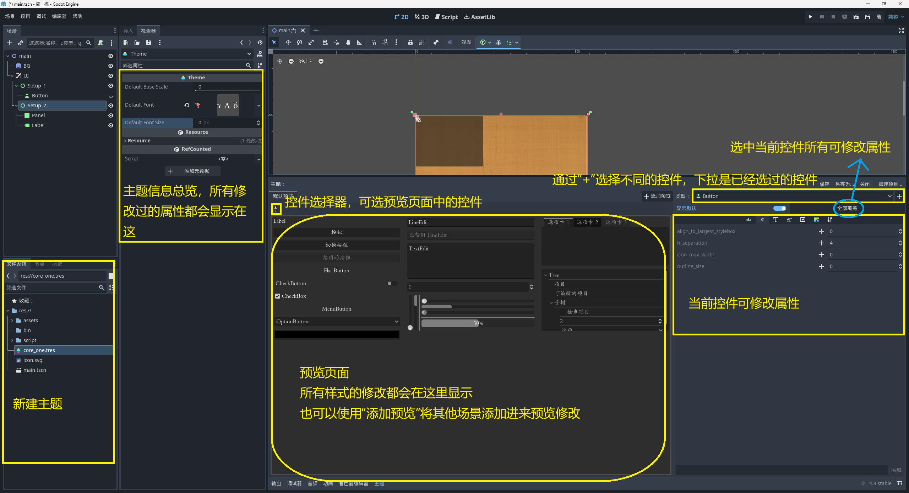

# Godot使用说明

## 概述

- 版本：4.21
- 基于C++
- GDExtension不支持Godot4以下的版本

### 一、程序参考代码

遇到不会的信息，可以参考github上Godot源码，其代码参考位置

1. 错误宏使用方法：`/core/error`
2. 使用样例：`/test/core/`

### 二、不同游戏设置数据

#### Ⅰ、Android设置

1. 游戏界面设置比例：19.5：9

   宽度：540

   高度：1170

   窗口宽度覆盖：360

   窗口高度覆盖：780

   拉伸模式：canvas_items

   比例：expand

2. 异形屏幕问题

   锚点全屏$\to$Control \ 锚点偏移$\to$ 顶：1170$\times$0.06 

3. 元素居中

   新建一个control节点$\to$设置锚点 \ 居中 $\to$ 将需要居中的元素（位置xy为0），变成其子节点 

4. 设置app朝向

   项目$\to$显示$\to$窗口$\to$手持设备、朝向：（Landscape横屏，portralt竖屏）

#### Ⅱ、windows常用配置

1. 原图大小：3200 $\times$ 2400

2. 画面分辨率（视口大小）：640$\times$360 

3. 窗口大小：（窗口覆盖大小）

   - 1920$\times$1080：640$\times$360的3倍
   - 1280$\times$720：640$\times$360的2倍

4. 拉伸模式：canvas_items

5. 画面模糊

   $项目\to 常规\to 渲染\to 纹理\to 画布纹理\to 默认纹理:Nearest$ 

#### Ⅲ、游戏人物大小

星露谷游戏大小

1. 画布：180$\times$320pix
2. 物品植物（基础单位）：16$\times$16pix
3. 角色大小（成人）：14$\times$29pix-2个基础单位大小

风来之国大小

1.  人物大小（成人）：33$\times$65pix
2.  人物大小（小朋友）：33$\times$44pix
3.  树：2倍成人、3倍成人

#### Ⅳ、自动图块

1. 需要64x96像素大小，平铺，内拐角
2. 192\*192=树木 - 画布大小384\*216 ,树木要缩小到05~0.4，0.4是成人大小
3. 0.4=76*76，
4. 人物：64*64
5. 320*240

### 三、导出设置

#### 下载构建模板

- 方式一：项目$\to$安装Android构建模板$\to$管理模板$\to$下载安装
- 方式二：从官网下载导出模板（Godot无法下载情况）
- [模板下载地址](https://godotengine.org/download/windows/) $\to$编辑器$\to$管理导出模板$\to$导入下载好的模板文件
- 方式三：编辑器$\to$管理导出模板$\to$下载安装

#### Ⅰ、Android

- 功能标签设置：[查看标签](https://docs.godotengine.org/zh-cn/4.x/tutorials/export/feature_tags.html#doc-feature-tags) 

  platform：平台（windows、Linux、android、ios、web）

  target：目标（debug：含有debug信号、release：不含debug信号的优化构造）

  arch：架构（x86_64、x86_32、arm64：、arm32：）

  generate_apk=yes：更改正在构建的架构列表、一般不需要使用

  ```shell
  scons platform=android target=release arch=arm32
  ```

- `.gdextension`文件中`[libraries]`与导出中的架构参数一一对应，

  > 当其参数不对应会出现提示：
  >
  > No suitable library found for GDExtension:res://bin/XXX.gdextension. Possible feature flags for your platform: mobile, android, etc2, astc, arm64, template, release, template_release, single

  | 库的关键字             | 导出-架构的参数 |
  | ---------------------- | --------------- |
  | android.release.x86_32 | x86             |
  | android.release.x86_64 | x86_64          |
  | android.release.arm32  | armeabi-v7a     |
  | android.release.arm64  | arm64-v8a       |

一些注意事项

1. 若正常导出软件，安装后无法使用，闪退，可能是架构参数错误，

   优先使用armeabi-v7a选项，

基础配置信息：

1. 下载Java SDK、安装Java SDK（安装到C盘可能会出现权限不够问题）

   地址：[Latest Releases | Adoptium](https://adoptium.net/zh-CN/temurin/releases/?variant=openjdk17) 

   - 平台：windows 

   - 版本：17长期支持版，LTS

2. 安装Android_SDK

   - 下载：[Android Studio](https://developer.android.com/studio?hl=zh-cn) 命令行工具（下拉页面，到最后有下载地址）

   - 在D盘根目录创建文件夹Android_SDK（Android_SDK目录不能有空格，不然会产生错误）

   - Android_SDK$\to$将**Android Studio命令行工具**解压到Android_SDK目录

3. 设置环境变量，重启系统

   1. `JAVA_HOME`：Java_SDK的安装目录（填写<Java_SDK> / bin目录即可）

   2. 添加Java_SDK的bin目录：环境变量$\to$ 系统环境变量$\to$ Path项
   3. `ANDROID_HOME`：其位置为 Android_SDK的根目录（GDExtension 导出模板需要的变量）

4. 配置Godot设置，打开编辑器

   1. 编辑器$\to$导出$\to$Android，Java SDK Path：添加Java_SDK的根目录
   2. 编辑器$\to$导出$\to$Android，Android SDK Path：设置为Android_SDK的根目录

5. 打开cmd，验证是否正常运行，测试命令：java

一般的生成Godot Android程序流程

1. 生成密钥，打开`openJDK/bin`目录下运行命令

   -alias：填写用户名

   -validity：密钥有效期，单位天

   -keystore：密钥文件文件名，若不使用此项，也会要求输入密码

   -storepass：密码

   -dname：cn-开发者名称，O-组织名称，C-国家或组织代码

   `keytool -v -genkey -keystore tree.keystore -alias tree -keyalg RSA -validity 10000 -dname "CN=tree,O=Android,C=CN" `

2. 运行命令后，会在当前目录生成tree.keystore文件

3. 切换到Android_SDK目录，打开cmd，运行命令：注意sdkmanager的位置

   ` ./cmdline-tools/bin/sdkmanager --sdk_root="." "platform-tools" "build-tools;34.0.0" "platforms;android-34" "cmdline-tools;latest" "cmake;3.10.2.4988404" "ndk;23.2.8568313"`

4. 导出即可

设置软件图标

生成GDExtension Android 模板方法

1. 切换到Android_SDK目录下，android_sdk_path是Android_SDK的目录

   运行命令：`./cmdline-tools/bin/sdkmanager --sdk_root="." --licenses`

   运行命令：`./cmdline-tools/bin/sdkmanager --sdk_root="." "platform-tools" "build-tools;34.0.0" "platforms;android-34" "cmdline-tools;latest" "cmake;3.10.2.4988404" "ndk;23.2.8568313"`

2. 回到Godot-cpp 源码目录中，编译模板（模板只需要源码即可）

   target参数：template_release标准模板，template_debug调试模板

   运行命令：`scons platform=android target=template_release arch=arm32` 

   运行命令：`scons platform=android target=template_release arch=arm64 generate_apk=yes`  

3. 生成Godot模板，切换到`Godot项目/demo/android/build`

   运行命令：` ./gradlew generateGodotTemplates`

   若下载失败

   - 可以手动下载gradlew，

   - 切换到目录：`C:\Users\<用户名>\.gradle\wrapper\dists\gradle-8.2-bin\bbg7u40eoinfdyxsxr3z4i7ta` 

   - 可以看到有两个文件分别为`gradle-8.2-bin.zip.park`和`gradle-8.2-bin.zip.lck` 

   - 将下载的gradlew解压到当前目录并修改`gradle-8.2-bin.zip.park`名称

     ``` shell
     bbg7u40eoinfdyxsxr3z4i7ta #目录结构
     ├─ gradle-8.2 # 文件夹，解压的文件 
     ├─ gradle-8.2-bin.zip.park # 修改名称为 gradle-8.2-bin.zip.ok
     └─ gradle-8.2-bin.zip.lck 
     ```


#### Ⅱ、Windows

1. 下载RC：[Releases · electron/rcedit](https://github.com/electron/rcedit/releases) 
2. 配置RC：编辑器$\to$编辑器设置$\to$Export \ Windows $\to$ rcedit，设置rcedit路径位置

### 四、安卓远程调试

不同安卓模拟器有不同的设置方式（这里使用网易的MuMu模拟器）

1. 可查看MuMu模拟器开发者指南

   MuMu模拟器$\to$常见问题$\to$开发者指南$\to$ADB连接$\to$MuMu模拟器12如何连接adb

2. 查看ADB端口：设置$\to$问题诊断$\to$ADB诊断

3. 执行连接ADB，进入MuMu目录$\to$shell$\to$adb.exe

   命令：`adb.exe connect 127.0.0.1:<ADB端口>`

4. 回到Godot，Godot右上角$\to$运行旁边的远程调试就可以使用了

## 开发环境配置

### 一、win-SCons配置

#### Ⅰ、环境配置

1. 下载Godot可执行文件

    注意：Godot可执行文件版本要与godot-cpp版本相同

2. 下载Godot-cpp源文件：[godot-cpp](https://github.com/godotengine/godot-cpp) 

    **《是Godot-CPP项目，不是Godot的源码》**

    注意：godot-cpp版本要与Godot可执行文件版本相同

3. 下载安装python（不建议使用微软商店安装）

    设置环境变量

4. 使用python安装SCons 

    > SCons是由python编写的自动化构建工具

    安装命令：`pip install SCons`  

    测试命令：`scons -v` 

5. 下载安装MSYS2

    下载路径：[Releases · niXman/mingw-builds-binaries (github.com)](https://github.com/niXman/mingw-builds-binaries/releases) 

    版本选择：

    1. x86_64：64位操作系统
    2. win32：windows程序
    3. seh：异常处理模型，无脑选seh即可
    4. msvcrt：是一个过时的C++运行库，主要是C99之前的标准
    5. ucrt：是一个通用的C运行库，支持最新C++语法
    6. posix：可移植版本

6. 运行`MSYS2 MSYS` 

    更新：`pacman -Syu`

    安装GCC和make：`pacman -S --needed base-devel mingw-w64-x86_64-toolchain` 

    设置环境变量，GCC位置：`msys64\mingw64\bin` 

    验证命令：`gcc -v` 

#### Ⅱ、新建项目目录

```shell
# 项目根目录
 ├─ demo `Godot项目目录`
 │  └─bin `dll文件目录` 
 │     └─example.gdextension #扩展启动文件
 |
 ├─Godot-cpp `Godot源码目录`
 ├─src `C++代码目录` 
 │  ├─register_types.cpp # 注册文件
 │  ├─register_types.h   # 注册文件
 │  ├─test.cpp # 开发代码
 │  └─test.h   # 开发代码
 └─SConstruct  # SCons构建脚本
```

#### Ⅲ、编写SCons

参考SConstruct注释：`whiteZe\F_游戏开发\A_Godot\Godot项目目录样例\SConstruct`

#### Ⅳ、编写C++代码

1. 编写C++代码：

   参考：`whiteZe\F_游戏开发\A_Godot\Godot项目目录样例\src\t_example.cpp`

2. 注册C++代码：

   参考：`whiteZe\F_游戏开发\A_Godot\Godot项目目录样例\src\register_types.h`

   参考：`whiteZe\F_游戏开发\A_Godot\Godot项目目录样例\src\register_types.cpp`

#### Ⅴ、生成动态链接库（.dll）

1. 切换到目录：SConstruct文件所在目录
2. 运行命令：`SCons -j6 -Q platform=windows`  

``` shell
# 推荐
# 多线程编译-6是6核应与CPU核心相同
SCons -j12 platform=windows  

# 默认去寻找VS的编译环境，找不到会寻找MinGW的编译环境
scons platform=windows  

#-- 用不到的命令
# 强制使用mingw编译
scons platform=windows use_mingw=yes 
# 软件是64位还是32位置，bits=64 或者 bits=32
scons platform=windows bits=32 
```

#### Ⅴ、修改.gdextension

1. 复制生成的.dll文件到example.gdextension文件指定的位置

   若SConstruct中已经设置好路径，则不用复制

2. example.gdextension

   example名字可以修改

   .gdextension不可修改

3. 可参考文件：
   - `godot-cpp/test/example.gdextension` 
   - `godot-cpp/test/project/example.gdextension` 

``` shell
[configuration]
# entry_symbol就是register_types.cpp中example_library_init函数名
entry_symbol = "example_library_init"
# Godot4.1版本以上必须有的参数
compatibility_minimum = "4.1"

[libraries]
# 步骤5生成的lib路径
windows.debug.x86_64 = "res://libgodot.debug.x86_64.lib"
```

### 二、win-cmake配置

### 三、编辑器配置

#### Ⅰ、vscode-scons

1. 安装vscode的C/C++扩展

2. 安装LLDB扩展（CodeLLDB）

3. 安装GCC编译器（配置编译器路径，若是没有提示）

   下载路径：[Releases · niXman/mingw-builds-binaries (github.com)](https://github.com/niXman/mingw-builds-binaries/releases) 

   验证命令：`gcc --version` 

4. 创建task.json文件

   $Ctrl + Shift + P\to输入:configure Task\to 选择:task.json\to 选择:other$​ 

   ``` json
   {
       "version": "2.0.0",
       "tasks": [
           {
               "label": "build", // launch.json中配置对应
               "type": "shell", // 在shell中启动
               "command": "scons", //执行命令
               "args": [ // 命令参数
                   "-j12",
                   "target=template_debug", //debug设置
                   "debug_symbols=yes"//debug设置
               ]
           }
       ]
   }
   ```

5. 运行$Debug\to LLDB$ 创建launch.json

   ``` json
   {
       "version": "0.2.0",
       "configurations": [
           {
               "name": "Debug", // debug中显示的名称
               "type": "lldb",
               "preLaunchTask":"build",// 执行上一步的操作task.json
               "request": "launch",
               // Godot可执行文件的位置，C:\\User\\Godot.exe
               "program": "${workspaceFolder}/<executable file>",
               // 要编译的项目目录
               "args": ["--editor","--path","C:\\user\\demo"],
               "cwd": "${workspaceFolder}"
            }
       ]
   }
   ```

6. 设置Godot主场景

7. 下断点，调试项目

#### Ⅱ、VisualStudio-scons

### 四、cmd输出乱码

设置$\to$ 时间和语言$\to$语言和区域$\to$管理语言设置$\to$更改系统区域设置$\to$选中：Beta版，使用UTF-8提供全球语言支持

## Godot核心

### 一、生命周期

1. enterTree：节点添加到节点树时调用，每一个节点加入树都会调用

2. ready：`_ready`方法，优先初始化子类，再初始化父类（子类顺序是由上到下初始化）

3. process：

   1. _process每一帧都运行；delta = 1/帧数
   2. 移动距离$\times$delta可以使移动距离与帧率无关；1$\times$delta可以简单理解为每秒移动1像素

4. physic_process：物理计算一次调用，一般调用物理引擎时使用

5. exitTree：节点销毁调用

6. input：有输入时调用

   ``` c++
   /* 只要键盘或鼠标按动，就触发当前方法 */
   void _input(const Ref<InputEvent> &event);//输入按键调用
   
   void T::_input(const Ref<InputEvent> &event){
       //UtilityFunctions::print("_input");
   	// 判断p是否按下
       if(event->is_action_pressed("p")){
           UtilityFunctions::print("stop");
       }  
       //C++示例方法，转换inputevent
       const InputEventKey *key_event = Object::cast_to<const InputEventKey>(*event);
       
   }
   
   /* _unhandled_key_input */
   void T::_unhandled_key_input(const Ref<InputEvent> &event){}
   ```

其他注意事项

1. 生命周期方法，初始化顺序是从上到下
2. C++的方法与GD脚本的方法函数名相同
3. 生命周期方法需要写在public下

### 二、宏定义

错误宏：

``` c++
```

检查宏

``` c++
// 检查类型，可以检查任何宏
CHECK(int(map["Hello"]) == 0);
```


### 三、内存分配

1. 4.3开始，Godot不能使用new、delete、malloc等C++关键字；

2. Godot提供了`memalloc()、memrealloc()、memfree()`对应C中`malloc()、realloc()、free()` 

3. `memnew()、memdelete()`对应C++中`new()、delete()` 

4. 对于动态内存, 提供了PoolVector<>模板.PoolVector是一个标准的Vector类

   PoolVectors允许快速读/写并保持锁定直到它们超出作用域.

   PoolVectors应该用于小型动态内存操作, 因为read()和write()对于大量访问来说太慢了

   ``` c++
   PoolVector<int> data; //创建PoolVector缓冲区
   // 读取
   PoolVector<int>::Read r = data.read()
   int someint = r[4];
   // 写入
   PoolVector<int>::Write w = data.write()
   w[4] = 22;
   ```

### 四、Variant类型

- 数组和字典都是Variant实现的

- 优先使用GODOT容器，其他情况优先使用C++容器

  将容器字段序列化，导出到引擎编辑器窗口 时

  需要将容器作为参数或其他方式提供给GODOT API

- 优先使用Array、Dictionary类型，Godot的Array、Dictionary由Map、vector、list实现

#### Ⅰ、Dictionary

- 头文件：`#include "core/variant/array.h"` 

Dictionary使用方法

``` c++
Dictionary map;
map["Hello"] = 0;
map[StringName("HelloName")]; //使用StringName效率好像要高一些
map[Vector2(10, 20)] = 30;

map.find_key(6).get_type();
map.make_read_only();
map.size();
map.get_key_list(ptr);

Variant val = map.get_key_at_index(0);
if(int(val) == 4);
```

#### Ⅱ、Array

- 头文件：`#include "core/variant/array.h"`

- Array可以存放任意类型（**可同时存放不同的类型，但只能是Godot内部支持对象**）

- Array必须先使用`push_back\push_front`添加元素，才能使用`arr[i]`修改元素的值，不然会数组溢出

- 一些宏定义

  ``` c++
  CHECK_EQ(a1, a1); // compare self
  CHECK_FALSE(a1 != a1);
  CHECK_EQ(a1, a2); // different equivalent arrays
  CHECK_FALSE(a1 != a2);
  CHECK_NE(a1, other_a); // different arrays with different content
  CHECK_FALSE(a1 == other_a);
  ```

Array使用方法：

``` c++
Array arr;
arr.push_bach(1);
arr.pop_front();
arr.pop_back()
arr.append_array(arr2); // 追加数组
arr.size(); 
arr[1]; // 读取
arr.insert(0, 2); //插入元素
arr.erase(3); // 删除
arr.resize(2); // 重置大小
arr.front();
arr.back();
arr.remove_at();
arr.has(1);
arr.count(2);
arr.max();
arr.min();
arr.slice();
```

#### Ⅲ、Variant

- Godot的万能类型，可以转换为Godot的任意类型
- Variant中只有Object的派生类需要使用cast_to转换

``` c++
// 准备一个Variant类型变量
Variant temp = tg.pop_back();

/* 转换样例，cast_to方法 */
// 转换类型到Node *，
// cast_to<目标类型>(待转换的变量);
Node *t = cast_to<Node>(temp);
```

#### Ⅳ、TypedArray

TypedArray使用方法

``` c++
/* 存放一般数据 */
TypedArray<int> w;
w.push_back(1);

/* 存放字典类型 */ 
Dictionary w2; // 定义一个字典
TypedArray<Dictionary> w1;
w1.push_back(w2);

/* 存放类 */
TypedArray<TResNode> w3;
w3.push_back(this);
```


### 四、Templates类型

#### Ⅰ、Map

1. Map分为AHashMap、HashMap、OAHashMap

#### Ⅱ、CommandQueue

#### Ⅲ、List

- List可以存放类、自定义类等

``` c++
List<String> args; 
List<Variant> keys;
List<Variant> *ptr = &keys;

args.push_back("xxx"); // 添加字符
args.find("xxx"); // 查找
args.is_empty();
args.front()->get()
```

#### Ⅳ、vector


#### Ⅴ、HashSet


### 三、Object

1. 所以类的基类，这意味Object中的方法可以直接调用

#### Ⅰ、注册对象

1. 普通注册：`ClassDB::register_class<MyCustomClass>()` 
2. 注册为虚拟类：`ClassDB::register_class<m_class>(true)` 
3. 注册为抽象类，不能被实例化：`ClassDB::register_abstract_class<m_class>()` 
4. 注册为内核类：`ClassDB::register_internal_class<m_class>()` 

#### Ⅱ、常量绑定

``` c++
// 定义一个常量
enum SomeMode {
   MODE_FIRST,
   MODE_SECOND
};
// 绑定
VARIANT_ENUM_CAST(MyClass::SomeMode); 
// 在_bind_methods中绑定
BIND_CONSTANT(MODE_FIRST);
BIND_CONSTANT(MODE_SECOND);
```

#### Ⅲ、PropertyInfo

1. 定义：`PropertyInfo(type, name, hint, hint_string, usage_flags)`

2. 样例：

   `PROPERTY_HINT_RANGE`：范围，0-49，步长1

   ``` c++
   PropertyInfo(
       Variant::INT, "amount", 
       PROPERTY_HINT_RANGE, "0,49,1", 
       PROPERTY_USAGE_EDITOR)
   ```

3. 样例：

   `PROPERTY_HINT_ENUM`：枚举，只接收`Enabled,Disabled,Turbo`

   ```
   PropertyInfo(
   	Variant::STRING, "modes", 
   	PROPERTY_HINT_ENUM, "Enabled,Disabled,Turbo")
	```

ARRAY数组类型定义

``` c++
/* 方法绑定 */
void TEST::_bind_methods() {
    ClassDB::bind_method(
        D_METHOD("set_enemy", "r"), &TEnemyContainer::set_enemy);
    ClassDB::bind_method(
        D_METHOD("get_enemy"), &TEnemyContainer::get_enemy);
    // 绑定元素，选择Variant::ARRAY
    ClassDB::add_property("TEST",
    	PropertyInfo(Variant::ARRAY, "Array"),
        "set_enemy",
        "get_enemy");
}
/* 保存数据的变量，Array，Godot的类型 */
Array m_enemy_array;
/* 保存Array的数据 */
void TEST::set_enemy(Variant a){
    m_enemy_array = a;
};
Variant TEST::get_enemy(){
    return m_enemy_array;
};
```

#### Ⅳ、Reference

1. Reference继承自Object并保存引用计数. 它是引用计数对象类型的基础. 必须使用Ref<>模板来声明它们. 
2. 例如:

``` c++
class MyReference: public Reference {
    GDCLASS(MyReference, Reference);
};

// myref是引用计数. 当没有更多Ref<>模板指向它时, 它将被释放.
Ref<MyReference> myref(memnew(MyReference));
```

#### Ⅴ、ResourceLoader

1. 头文件：`#include <godot_cpp/classes/resource_loader.hpp>` 

2. 类型头文件：

   场景资源：`#include <godot_cpp/classes/packed_scene.hpp>`

3. 类型：

   PackedScene：场景资源（.tscn）
   Texture2D：图片纹理，图片资源

4. 如果先前已加载对该资源的引用并且该引用在内存中（已实例化）, 则资源加载器将返回该引用. 这意味着只能同时从磁盘上引用的文件加载一个资源.

``` c++
/* 方法一
load("路径","类型"); // 加载
*/ 
ResourceLoader *R = new ResourceLoader();
Ref<PackedScene> scene = R->load("res://game2.tscn","PackedScene");
// 判断节点是否加载成功
scene.is_valid()
// 把资源初始化，然后就可以调用了
Node *b = scene->instantiate();
// 将b节点转变为指导想调用节点
Button *b = scene->instantiate()->get_node<Button>(".");
// 将b节点，添加到主场景即可显示
Node *a = get_node<Node>("%node");
a->add_child(b);

/* 方法二 */
Ref<Resource> res = ResourceLoader::load("res://someresource.res")
```

#### Ⅵ、ResourceSaver

``` c++
ResourceSaver::save("res://someresource.res", instance);
```

### 五、文本资源加载

#### Ⅰ、FileAccess

- 头文件：`#include <godot_cpp/classes/file_access.hpp>`

- 文件读取类型

  `FileAccess::READ = 1`

  `FileAccess::WRITE = 2`

  `FileAccess::READ_WRITE = 3`

  `FileAccess::WRITE_READ = 7`

``` c++
// 读取文件
Ref<FileAccess> f = FileAccess::open("Path", FileAccess::READ);
f->close(); // 关闭文件

String a = f->get_as_text(); // 将FileAccess类型转换为字符串
Vector<String> header = f->get_csv_line(); // Default delimiter: ","
Vector<String> row1 = f->get_csv_line("~"); // 使用"~"分割字符串
```

#### Ⅱ、JSON

1. Godot内置呢JSON解析方法，不用使用jsoncpp
2. 注意：Json类型不能通过`ClassDB::add_property`方式添加进Godot

读取/保存本地json文件，需要`FileAccess`类

- json头文件：`#include <godot_cpp/classes/json.hpp>` 
- 文件加载类：`#include <godot_cpp/classes/file_access.hpp>` 

``` c++
Ref<FileAccess> f = FileAccess::open("Path", FileAccess::READ);
String a = f->get_as_text(); // 将FileAccess类型转换为字符串
```

**parse**：json文本（字符串）转json对象

- `Error parse( String json_text, bool keep_text=false )`：尝试解析json文本
- `Variant parse_string( String json_string ) static`: 试图解析提供的 `json_string`，并返回解析后的数据。如果解析失败，返回 `null`。

``` c++
/* 静态方法-parse_string */
// 解析字符串，并转换为Dictionary类型
Dictionary json = JSON::parse_string(json_text);
UtilityFunctions::print(json["1"]);
json.get("1", NULL); // 字典的获取方法


/* 使用Json对象 */
JSON * j = memnew(JSON); // 创建一个新Json对象，一定要用memnew方法
j->parse(a); // 解析json字符串
Dictionary z = j->get_data(); // 获取解析到的json数据，并使用字典保存
Array z = j->get_data(); // 获取解析的json数据，使用Array保存
z.get("1", null); // 字典获取方法，没有为空
z["1"]; // 字典获取方法
```

**stringify**：json对象转json文本（字符串），用于保存本地

- `String stringify(Variant data, String indent=””, sort_keys=true, full_precision=false )`

  将Variant变量转换为 JSON 文本并返回结果。

``` c++
Dictionary data_to_send = {"name":"my_dictionary","version":"1.0.0","entities":[{"name":"entity_0","value":"value_0"},{"name":"entity_1","value":"value_1"}]}
;
// 默认转换，不带格式
JSON.stringify(my_dictionary);
/* 转换样例：带\t
{
    "name": "my_dictionary",
    "entities": [
        {
            "name": "entity_0",
            "value": "value_0"
        }
    ]
}
*/
// 将Array转换为json
JSON.stringify(data_to_send, "\t")

```

### 七、可传递对象

1. 优先是使用`get_node`获取节点后再调用属性或方法，万能方法，获取节点后再获取数据
2. 不同的节点之间是相互独立的，不存在数据通用
3. 使用静态方法，变量可以在继承关系中的节点共享一份数据
4. `_ready()`中定义赋予的值，在子类是无法获取的，要在子类调用专用的赋值方法（注意，这样也只能在调用赋值方法的节点中使用数据，而在其他节点无法使用）

#### Ⅰ、普通类型

`String、int、double`类型可以在子类中直接获取（任何情况方法都可获取父类属性）

``` c++
/* 父类TFather-定义的属性 */ 
int father_1 = 1;
double father_2 = 1.1;
String father_3 = "aa";
/* 子类-直接调用 */
UtilityFunctions::print(TFather::father_1);
UtilityFunctions::print(father_1);
```

#### Ⅱ、数组字典

`Variant`类型与Array一样不能直接获取父类属性，需要获取父类节点

`Array、Dictionary` 类型不能直接在子类调用，可以调用父类方法获取

- 直接调用父类的Array、Dictionary其值在子类为空，需要先得到父类节点才可以

- return可以返回函数内创建的Array、Dictionary的值

  ``` c++
  Array return_array()
  {
      Array a;
      a.push(1);
      return a; // 可以返回
  };
  Dictionary return_dictionary()
  {
      Dicctionary a;
      return a; // 返回属性值
  };
  // 子类可以获取其拷贝副本
  UtilityFunctions::print(TFather::return_array());
  UtilityFunctions::print(return_dictionary());
  ```

- return不能获取类属性属性（使用指针也不能获取）

  ``` c++
  /* 父类TFather-定义的属性 */ 
  Array father_1;
  Dictionary father_2;
  Array return_array()
  {
      return father_1; // 返回属性值
  };
  Dictionary return_dictionary()
  {
      return father_2; // 返回属性值
  };
  /* 子类无法获取父类属性 */
  UtilityFunctions::print(TFather::return_array());//空
  UtilityFunctions::print(return_dictionary());//空
  /* 子类获取父类节点后调用 */
  TFather * n = get_node<TFather>(".."); // 获取父类节点
  n->father_1; // 获取属性值

子类调用父类的`Dictionary、Array、Variant`赋值方法也可获取其属性（不推荐使用）

``` c++
// 赋值方法
void TFather::get_res_from_father()
{
    father_1.push_back(111); // Array
    father_2["333"] = 333;  // Dictionary
    father_3 = get_node<Node>("../Node"); // 节点
}
// 子类调用赋值方法
TFather::get_res_from_father(); 
// 然后就可以使用父类属性了
UtilityFunctions::print(TResFather::father_1);
UtilityFunctions::print(TResFather::father_2);
UtilityFunctions::print(TResFather::father_3);
```

#### Ⅲ、资源类型

资源类型可以在子类直接获取（与int、double、String一样）

``` c++
/* 父类 */
Variant father_res; //父类定义的资源
/* 子类 */
UtilityFunctions::print(father_res); // 可以直接获取父类资源类
```

关于资源类型的使用

- 类属性信息：

  son类中有字段data，用于添加资源

  father类中有字段scene，用于添加资源

  res资源类有属性aa；

- 情况一：资源添加在子类节点中

  > son节点 ：“检查器”$\to$ “father类”$\to$ “字段scene”添加资源文件

  ``` c++
  /* 父类 */
  Variant father_res; //父类定义的资源
  /* 子类 */
  TRes *a = cast_to<TRes>(father_res); // Variant转换为TRes类型
  UtilityFunctions::print(a->aa); // 打印属性值
  ```

- 情况二：资源添加在父类节点中，不能获取资源，需要先获取父类节点

- 情况三：资源添加在父类节点中，在子类调用父类的赋值方法，也是可以获取属性值（不推荐使用）

### 常见错误 

> 各种空指针错误

- `TIdleState * m_state_idle = NULL;` 指针初始化一定要指向空，防止一些不可名状的错误

> AttributeError: 'NoneType' object has no attribute 'Append':
>   File "D:\A_CodeItems\A_immortal_hero_world\SConstruct", line 8:
>     env.Append(CPPPATH=["src/include/"])

- 有可能是godot-cpp版本问题，建议换个源码版本

> error LNK2019: 无法解析的外部符号 

- 必须.cpp中文件必须实现
- 在Sconstruct文件中没有正确引入对应的.cpp文件或.h文件

> error LNK2001: 无法解析的外部符号 

- 若是在使用多态的时候出现错误，父类虚函数没有默认方法
- 静态方法没有初始化，静态属性初始化时没有添加类名

> fatal error LNK1120: 1 个无法解析的外部命令

- 可能是函数传递错误，
- 需要引用传递:`void R(AAA* b)`
- 静态方法定义时没有添加类名

> core/extension/gdextension.cpp:629 - No GDExtension library found for current OS and architecture (windows.x86_64) in configuration file: res://bin/a.gdextension
> Failed loading resource: res://bin/a.gdextension. Make sure resources have been imported by opening the project in the editor at least once.

- 若确定.lib文件存在，则可能是编译环境错误，Godot的提示并不准确
- 验证GCC，gcc -v

> 父类：father.h；子类:child.h；

1. 在father.h文件中声明`class child;`
2. 在father.cpp中引入头文件：`#include "child.h"` 

> 成功编译，但编译后子类不存在节点中

- `register.cpp`中要保证，父类在子类前面进行注册


> error C2039: "speak": 不是 "TMOVESTATE" 的成员

- 子类不能写virtual关键字

> 节点未找到

- 由于Godot的节点加载顺序

> error C2065: “TFSCINTERFACE”: 未声明的标识符
>
> error C2027: 使用了未定义类型“TMOVESTATE”

- 检测头文件的引用顺序

> 使用继承创建Godot节点，子类可通过静态方法，访问父类属性、方法
>
> 不相关的节点只能通过get_node等方法、获取分组节点，先获取到目标节点，再调用其节点中的方法

### layer physics

1. Layer：block_movement 阻挡移动
2. Layer：

## GDScript脚本相关

1. `@onready var tfsc = $TFSC` 

### 一、类型转换

1. String **str**(...)：
2. Variant **str_to_var**(string: String ) ： 将string转换为variant
3. String **var_to_str**(variable: Variant) ：将variant转化为String

World-Teleport-area

``` python
signal ssss # 自定义信号
# 获取不同场景的方法
sprite2d = get_node("/root/"+get_tree().current_scene.name + "/placfortm/sprite2D")
# 通过分组获取不同场景节点,节点提前加入分组
@onready var sprite2D = get_tree().get_first_node_in_group("Sprite2D")

# 传送脚本
extends Area2D
@onready var tfsc = get_node("/root/main/System/TFSC")
func _on_body_entered(body):
    # 场景，加载的玩家位置
	tfsc.area_teleporter("secen00", "enter");
	pass 
```


## 2D游戏类

### 一、Node

1. Node节点是大部分节点的父节点，所以Node的方法一般可用直接使用
2. 节点操作都应在_ready之后的生命周期使用


#### Ⅰ、获取向量

``` c++
/* 设置位置坐标 */ 
// 获取当前位置，相对与父节点
// Node中的方法
Vector2 p = get_position();
/* 获取当前向量速度 */ 
vector2 a = get_velocity();

// 全局节点
Vector2 p = get_global_position();
```

#### Ⅱ、Get_node

1. 使用 `%` 标注场景内唯一节点，可以获取场景内任意位置的 `%` 标注的节点

   `get_node<Node>("%sprite"); // 必须携带%标注全局查找` 

2. `get_node()`中必须是`“”`，若是`‘’`，则会发生未知错误

3. 函数方法：get_node<节点类型>(" 路径"); 

``` c++
/* 获取子节点 */
// 只能获取子节点,不能得到父节点
get_node<Node>("xx");
// 通过相对路径，可以获取子节点的子节点
get_node<Node>("xxx/vvv"); 

/* 获取父节点 */ 
get_node<Node>("..");
get_parent();

// find_child会对节点进行遍历，太多节点会影响速度
Node *c0 = find_child("Test");

/*得到当前所有子节点*/ 
Array b = get_children();
UtilityFunctions::print(b[0].get_type());

/* 获取节点 */
// 获取所有节点数量
get_child_count();
get_child("节点序号");

/* 删除节点 */
c0->queue_free();
```

#### Ⅲ、节点其他操作

``` c++
is_inside_tree(); // 验证节点是否在树中

```

### 二、Sprited2D

- 主要用于图片显示

``` c++
// 获取要修改的节点
Sprite2D *root11 = get_node<Sprite2D>
    ("/root/Node2D/Test");
// 设置新纹理
root11->set_texture(i3);
// 设置中心点
root11->set_centered(false);
// 平移
Vector2 p = Vector2(100, 100);
root11->set_offset(p);
```

### 三、动画类

#### Ⅰ、AnimatedSprite2D

- 用于动画播放，简单物品动画
- 在Godot添加自定义动画类，设置动画效果

``` c++
// 获取节点，注意是Animatedsprite2d类型
AnimatedSprite2D *a_s = get_node<AnimatedSprite2D>("/root/Node2D/A_node2d");
// 调用播放动画方法，a是Godot已经设置好的动画
a_s->play("a");
a_s->pause();//暂停
a_s->stop();//停止
a_s->is_playing();//状态
```

#### Ⅱ、AnimationPlay

- Godot所有元素都可以使用它来生成动画，包括场景中来回移动的物体，怪物等

#### Ⅲ、AnimationTree

- 头文件

    `#include <godot_cpp/classes/animation_tree.hpp>` 

    `#include <godot_cpp/classes/animation_node_state_machine_playback.hpp>` 

- AnimationRootNode：动画树节点的基本资源。通常，它不会直接使用，

- AnimationNodeBlendTree:：包含多个混合类型节点，

- AnimationNodeBlenderSpace1D: 1D空间混合

- AnimationNodeBlenderSpace2d: 在2D空间中旋转根节点

- AnimationNodeStateMachine：动画节点状态机

- AnimationNodeAnimation: 从列表中选择一个动画播放，这是最简单的根节点类型，通常不直接作为Tree Root根节点使用。

- 注意：AnimationPlay不能设置自动播放，但要设置循环

- 注意：状态机（连接线）要设置enable，如果设置auto会出现意外情况，使用travel控制播放动画

``` c++
/* 获取节点 */
// 获取动画节点
AnimationPlayer *m_animatePL = get_node<AnimationPlayer>("AnimationPlayer");
// 获取动画树节点
AnimationTree m_animateTr = get_node<AnimationTree>("../../AnimationTree");

/* 获取AnimationNodeStateMachineplayback属性 */
// 这个属性地址，可以在Godot界面查找
Variant b = m_animateTr->get("parameters/playback");
// 转为AnimationNodeStateMachineplayback
m_animationState = cast_to<AnimationNodeStateMachinePlayback>(b);

/* 启动动画树 */
// 字符串可在godot界面查找
// aoix是Input向量
m_animateTr->set("parameters/idle/blend_position", aoix);
m_animateTr->set("parameters/run/blend_position", aoix);
// 设置播放动画
m_animationState->travel("run");
```


### 四、AudioStreamPlayer

- 音频流播放器
- AudioStreamPlayer2D具有距离属性的音效

``` c++
#include <godot_cpp/classes/audio_stream_player.hpp>
/* 代码加载 */
// 加载音频资源
ResourceLoader *R = new ResourceLoader();
Ref<AudioStream> bg = R->load("res://02.mp3","AudioStream");
// 音频类
AudioStreamPlayer *a = new AudioStreamPlayer();
// 加载音频
a->set_stream(k_01);
// 播放音乐，每次从头开始播放
a->play();
// 继续播放
a->set_stream_paused(false);
// 暂停播放
a->set_stream_paused(true);
```

### 五、Vector2

- 头文件：不需要引用

- 向量A - 向量B = B指向A的向量

    > To find a vector pointing from A to B, use B - A.


``` c++
/* 创建一个向量 */
// Vector(x轴，y轴)
Vector2 a = Vector(100, 100);
// 设置x，y向量
a.x = 50;
a.y = 50;

/* a向量是否为0向量 */ 
a.is_zero_approx();
/* 向量单位化 */ 
// 得到一个向量的方向
a.normalized();

/* 设置a走向B的向量 */ 
// B：向量（方向和大小），
// C：每帧的增量
a.move_toward(B, C);

/* 在一个范围内 */ 
Vector2 direction = m_startPosition - position;
if(direction.length() > 200){}
// 返回从该向量指向 to 的归一化向量。相当于使用 (b - a).normalized()。
direction_to(to: Vector2) const
// 返回该向量与 to 之间的距离。
distance_to(to: Vector2);
```

### 六、CharacterBody2D

``` c++
// 设置当前向量
set_velocity(a);
// move_and_collide不能沿着墙滑动
// 根据set_velocity设定，自动进行碰撞体积
move_and_slide();// 可以沿着墙滑动
```

### 七、Random

- 头文件：`#include <godot_cpp/classes/random_number_generator.hpp>` 

- 文件utility_functions同样包含随机方法的静态方法

- `randf_range(0.0,5.0)`：产生浮点数，0.0-5.0之间的数，不包括0.0、5.0

  ``` c++
  // 产生0~5之间的数，不包括5
  int a = utility_functions::randf_range(0.0,5.0);
  // 产生0~5之间的数，不包括0，5
  double a = utility_functions::randf_range(0.0,5.0);

- `randi_range(1, 3)`：产生整数，1-3之间的数，包括1，3

- `randi()`：产生整数

  ``` c++
  utility_functions::randi(); // 返回0 ~ 2^32-1之间的数
  utility_functions::randi() % 20; // 返回0 ~ 19之间的数
  ```

- `randf()`：产生浮点数

  ``` c
  utility_functions::randf() * 10; //返回0 ~ 10之间的数
  ```
  
- `randomize()`：产生随机数种子

  ``` c++
  #include <godot_cpp/classes/random_number_generator.hpp>
  
  RandomNumberGenerator *r = new RandomNumberGenerator();
  r->randomize(); // 设置随机数种子
  ```

### 八、Area2D

1. 能够检测其他节点的进入和退出，不与其他节点封装
2. worldBoundaryShape2D：可以在一个方向上无线延长的节点
3. 层（Collision/Layer）：隶属层级（显示图像、遮盖等效果）
4. 遮罩（Collision/Mask）：碰撞层级（物理碰撞）
5. _on_body_entered：characterBody2D节点碰触
6. _on_area_entered：不同的area区域碰撞

``` c++
 // Array[Area2D] get_overlapping_areas()
 // Array[Node2D] get_overlapping_bodies()
```

攻击框

- 都是继承的Area2D节点，Hurtbox,
- 需要定义图层

### 九、utility_functions

- 包含很多常用方法
- 头文件：`#include <godot_cpp/variant/utility_functions.hpp>`

``` c++
// 打印方法
UtilityFunctions::print("hello world");
UtilityFunctions::print("hello world");
// double
UtilityFunctions::randf();
// int64_t
UtilityFunctions::randi_range(int64_t from, int64_t to);
// double
UtilityFunctions::randf_range(double from, double to);
// double
UtilityFunctions::randfn(double mean, double deviation);
// Variant
UtilityFunctions::type_convert(const Variant &variant, int64_t type);
```


### 十、SceneTree

1. 头节点：`#include <godot_cpp/classes/scene_tree.hpp>` 

``` c++
// 获取场景树
SceneTree *tree = Node::get_tree();

// get_current_scene():获取当前场景的根节点
Node *root = tree->get_current_scene();
// 获取
SceneTree::get_singleton()->initialize();
```

#### Ⅰ、场景切换

- 只能用于游戏场景切换，因为他会释放所有节点，再新建节点，
- 场景切换要进程场景初始化操作，加载
- 头文件：scene_tree()

``` c
// 获取场景树
SceneTree *t = Node::get_tree();
// 切换场景，使用路径
t->change_scene_to_file("res://game2.tscn");
// 使用pack，节点对象
t->change_scene_to_packed(Node);
// 切换场景方法
t->call_deferred("change_scene_to_file", "res://bat2.tscn");
```

#### Ⅱ、分组

``` c++
SceneTree * t = get_tree();

// 添加进分组
// 其名称是godot节点名称
t->add_to_group("组名"); 
t->call_group("组名", "方法名"); // 调用组名中方法
t->remove_from_group(); //删除分组

/* 获取一个分组，获取分组中的节点 */
Array a = t->get_nodes_in_group("组名"); // 返回一个分配给给定组的所有节点的列表
Node * ab = cast_to<Node>(a[0]); // 转换节点，调用a[0]
ab->get_name(); // 获取节点名称
```

#### Ⅲ、分组操作

``` c++
/* 调用分组中公共方法 */
// 获取场景树
SceneTree *t = get_tree();
// 调用分组empy的脚本中ttt1方法
t->call_group("empy", "ttt1");

/* 动态添加分组 */
/* 使用get_node获取指定节点 */
Sprite2D *root1 = get_node<Sprite2D>
    ("/root/Node2D/Test/Sprite2D");
root1->add_to_group("empy");
```

#### Ⅳ、场景实例化

``` c++
// my_scene场景对象，可以是在资源目录添加的场景
Ref<PackedScene> temp_scene = cast_to<PackedScene>(my_scene);
Node * temp_player = temp_scene->instantiate();
```


### 十二、Path2D

- 使用PATH2d在地图上画出路径
- 创建Pathfollow2d节点，pathfollow2d节点会根据path2d设置的路径行走

``` c
PathFollow2D *p = get_node<PathFollow2D>("/root/Node2D/Path2D/PathFollow2D");
// 设置移动距离，单位像素
p->set_progress(500);

// 获取当前移动坐标
Vector2 v = p->get_position();
Sprite2D *s = get_node<Sprite2D>("/root/Node2D/Sprite2D");
// 将坐标设置给精灵
s->set_position(v);
```

### 十三、RayCast2D

- 射线投射节点，用于检测碰撞不可见射线，根据设置的箭头进行碰撞检测

``` c++
is_colliding(); //检测是否发生碰撞
```

### 十四、Input

1. 虚拟映射设置

2. 需要配置虚拟按键，不然会出现错误

3. 菜单栏$\to$ 项目$\to$ 项目设置$\to$ 输入映射$\to$​ 添加键位映射

4. 虚拟按键不支持中文

#### Ⅰ、Input

- 头文件：`#include <godot_cpp/classes/input.hpp>`

``` c++
// 获取Input静态实例
Input *ii = Input::get_singleton(); 

ii->is_action_pressed("d");// 按下d键，触发多次
ii->is_action_just_pressed("d"));// 按下按键，触发1次
ii->is_action_just_released("d"));// 松开D键
ii->is_anything_pressed();// 任意键按下

/* 获取按下s的力量 */
float s = ii->get_action_strength("s");

/* 获取x，y轴 */
// 左-1，右1
float h = ii->get_axis("左", "右");

/* 获取向量 */
// 位置一定对应，不然方向会出错
Vector2 dir = ii->get_Vector("左","右","上","下");
dir.x !=0; // x轴
dir.y !=0; // y轴
```

#### Ⅱ、InputMap

- 头文件：`#include <godot_cpp/classes/input_map.hpp>`
- 可以解决 this inputmap 不存在bug

``` c++
// 从Godot中的设置加载设置
InputMap* map = InputMap::get_singleton();  
map->load_from_project_settings();
```

### 十五、Engine

- 头文件：`#include <godot_cpp/classes/engine.hpp>` 

#### Ⅰ、设置进程模式

- 建议使用GDScript进行update调用
- 注意：不能在CharacterBody2D节点中使用，有些版本会有BUG，编译完成后，需要重新添加节点才有效果

``` c++
#include <godot_cpp/classes/engine.hpp>
Test::Test(){
    if(Engine::get_singleton()->is_editor_hint()) {
        // 在编辑器中，禁用_process函数
        set_process_mode(
            Node::ProcessMode::PROCESS_MODE_DISABLED);

        UtilityFunctions::print("set ok");
    }
}

```

#### Ⅱ、获取重力速度

``` c++
#include <godot_cpp/classes/project_settings.hpp>
// 获取重力加速度
Variant g = ProjectSettings::get_singleton()->get_setting("physics/2d/default_gravity");
// 保持重力速度
this->m_gravity = (float)g;
```

#### Ⅲ、减速状态

``` c++
#include <godot_cpp/classes/engine.hpp>
# 获取Engine实例，Engine::get_singleton()  
// Engine::get_singleton()->set_time_scale(0.5);
Engine *e = Engine::get_singleton();
e->set_time_scale(3);
```

#### Ⅳ、暂停游戏

``` c++
set_physics_process(false);
get_tree()->paused = true;
// 设置节点属性，Node->pause->mode-> process 设置当前节点和主场景节点不是继承关系
```

#### Ⅴ、注册实例

``` c++
Engine::get_singleton()
    ->add_singleton(Engine::Singleton("YTween", YTween::get_singleton()));
```

#### Ⅶ、程序暂停

``` c++
set_process(FAILED); // 暂停

```

### 资源创建与使用

1. 使用`@export var player_date: Resource`让节点可以加载资源文件
2. 资源类可以直接使用，他在游戏中是唯一的
3. 资源类中只定义数据变量，不定义方法，方法在容器中定义

#### Ⅰ、资源.tres文件

- 需要在regi中注册

创建资源（.h）

- 头文件：`#include <godot_cpp/classes/resource.hpp>`
- 必须继承Resource类型

``` c++
using namespace godot;
class TFood : public Resource
{
    GDCLASS(TFood, Resource);
public:
    /* 基础属性 */
    String m_name = "";
    Variant m_level;
protected:
    static void _bind_methods();

private:
    // 修改属性方法
    void set_name(String s);
    String get_name();
}
```

创建资源（.cpp）

- 基本类型使用普通属性添加 
- Object类型可以用于其他数据类型添加，Resource类型使用Object类型

``` c++
#include "food.h"
/* 普通属性添加 */
void TFood::_bind_methods() {
    /* 设置可在编辑器修改 */
    ClassDB::bind_method(D_METHOD("set_name", "a"), &TFood::set_name);
    ClassDB::bind_method(D_METHOD("get_name"), &TFood::get_name);
    ClassDB::add_property("TFood",
     	PropertyInfo(Variant::STRING, "Name"),
        "set_name",
        "get_name");
}
/* 在编辑器修改的具体逻辑 */
void TFood::set_level(int a){
     m_name = a;
};
int TFood::get_level(){
     return m_name;
}; 

/* 其他属性添加，Resours资源添加 */
void TFood::_bind_methods() {
    ClassDB::bind_method(D_METHOD("set_name", "a"), &TFood::set_name);
    ClassDB::bind_method(D_METHOD("get_name"), &TFood::get_name);
    ClassDB::add_property("TFood",
        // 使用特殊的OBJECT类型
     	PropertyInfo(Variant::OBJECT, "Name"), // 修改地方
        "set_name",
        "get_name");
}
// 类型统一使用Variant类型
void TFood::set_level(Variant a){
     m_level = a;
};
Variant TFood::get_level(){
     return m_level;
}; 
```

#### Ⅱ、使用逻辑

- 出现为`<NULL>`：可能是资源没有正确添加，需要重启Godot

父类`father.cpp`：

``` c++
/*father.cpp*/
// 设置外部添加资源属性
void TFather::_bind_methods() {
    // 设置外部添加资源属性
    ClassDB::bind_method(D_METHOD("set_resouce", "r"), &TFather::set_resouce);
    ClassDB::bind_method(D_METHOD("get_resouce"), &TFather::get_resouce);
    ClassDB::add_property("TFather",
           PropertyInfo(Variant::OBJECT, "RES"),
           "set_resouce",
           "get_resouce");
};
// 设置外部添加资源属性
Variant TFather::get_resouce() {
    return res;
};
// 设置外部添加资源属性
void TFather::set_resouce(Variant a){
    res = a;
};
// 供子类调用的方法，获取资源，方法1
Variant TFather::get_res_from_father()
{
    return res;
};
```

子类son.cpp

``` c++
// 引入资源头文件，用于cast_to
#include "res.h"

// 方法一，调用父类方法获取资源类
Variant a = get_res_from_father();
TResouce *b = cast_to<TResouce>(a); // 转换为资源类型，以使用

// 方法二，直接使用父类中的属性
// res是父类保存资源的属性
TResouce *a = cast_to<TResouce>(res); // 转换为资源类型，以使用
```


#### Ⅲ、创建tres文件

使用Godot创建资源，创建后的资源类（.tres）文件，加载到其他节点即可使用


### TileMap

- 5生成地牢-25分
- 设置战争迷雾

``` c++
set_cells_terrain_connect
```

### AStarGrid2D

- AI算法，9期移动AI-05分 


## 软件开发控件

1. 开发软件时，一般不要使用游戏开发控件，因为contol控件有些参数没有

2. 使用TextureRect替代Sprite2D节点

3. 一般节点位置信息

   ``` shell
   CanvasLayer # 根节点，可设置锚点
   ├─ PanelContainer # 背景面板
   |	├─MarginContainer # 背景，Sprite2d的替代节点
   ```


### 一、画布类

#### Ⅰ、canvasLayer

属性说明：

1. Visibility：

   1. visible：显示
   2. Modulate：可以继承的颜色
   3. Self Modulate：只修改自己的颜色
   4. Show behind
   5. Top Level：置顶
   6. Clip Children
   7. Light Mask：
   8. Visibility Layer：

2. Ordering

   1. Z index：排序
   2. Z as Relative：
   3. Y Sort Enabled：Y轴排序，多用于地图设计

3. Texture

   1. Filter：过滤模式
   2. Repeat：重复模式

4. Material：

   

代码实现：

- 头节点：`#include <godot_cpp/classes/canvas_layer.hpp>` 
- 新的画布，其属性独立于其他节点

``` c++
// 获取
CanvasLayer * cl = get_node<CanvasLayer>("%InventoryWindow");
cl->set_visible(TRUE); // 设置是否可见
cl->is_visible(); // 当前是否打开
cl->hide();  // 隐藏
cl->show(); // 显示
```

### 二、容器类

1. 所有容器都有`锚点预设`、都可以作为其他控件的父类
2. 容器节点可以把子类的Transform信息提升到父类（容器节点）修改
3. `锚点预设-扩展`：在vbox、hbox中使用会将剩余空间填满

#### Ⅰ、Control

Control在容器内节点添加，可以使其子节点自由移动

属性说明：

1. Layout：布局

2. Localization：本地化

3. Tooltip：鼠标悬停，显示的提示信息

4. Focus：空间布局关系，移动焦点时，让焦点知道往哪移动

5. Mouse：鼠标，当点击无用时，有可能时空间遮掩，并停止了事件传递

   Filter：鼠标事件过滤

   Default Cursor Shape：鼠标样式

6. Input：将控件添加进屏幕？

7. Theme：主题

#### 其他常用容器节点说明

1. Box容器：可以按照x轴方向、y轴方向进行排列
   - HboxContainer：横向排列的容器，用于制作角色血条等
   - VBoxContainer：纵向排列容器

2. PanelContainer：面板容器，<当作背景板、父类样式节点、Tab标签页等使用>

   - StyleBox样式：

     StyleBoxFlat：可以自定义样式

     StyleBoxEmpty：没有样式

     StyleBoxTexture：使用图片

     StyleBoxLine：

   - 可以保证其子节点，不会超出PanelContainer的范围

   - 拥有一个 sort_children 信号

   - 拥有一个 Theme Overrides / styles 参数

   Panel：与PanelContainer基本相同

   - 可以当成背景板
   - 不能保证其子节点都在Panel的范围内

   ---

3. MarginContainer：边框容器，<可进行边距设置>

4. ViewPortContainer：小窗口容器

5. AspectRatioContainer：长宽比固定，保持一定的长宽比

6. FlowContainer：流动容器，将元素从右向左放置，会自动换行

7. GridContainer：九宫格容器，<需要设置Columns才能看见效果>

8. HSplitContainer：分割容器，划分屏幕左右，可拖拽

9. VSplitContainer：分割容器，划分屏幕上下，可拖拽

10. ScrollContainer：滚动条，必须在Vbox或Hbox中才能正常工作

11. CenterContainer：居中容器

12. TapContainer：选项卡容器

13. SubViewportContainer / SubViewport：用于制作小地图的容器

### 三、功能类

1. Progressbar：进度条，软件常用
2. TextureProgressbar：进度条，游戏常用，可设置背景
3. Button：按钮
4. Label：标签
5. RichTextLabel：富文本标签
6. ColorRect：颜色矩形，用于显示颜色
7. VideoStreamPlayer：视频流播放器
8. HSeparator：分隔符
9. NinePatchRect：九宫格矩形，保存纹理被边角不变
10. TextureRect：用于显示纹理的空间，可做背景

### 四、Anchor锚点

锚点使用方法

- 点：保证子类图形距离锚点的相对位置不变
- 线：保证锚点组成的线不会被拉伸
- 面：保证锚点围成的面大小比例一致

当父类使用`锚点预设`$\to$` 整个矩形`时，其子类可以在这个矩形范围内进行 “锚点预设”

- 当锚点的父类是Node或Node2D节点，就不能进行锚点拖拽（此时锚点就只能是一个定位点）

  解决方案：将锚点的父类替换为其他节点（优先选CanvasLayer）

- 锚点一般使用的根节点是 Control 节点（CanvasLayer节点、Node节点也是可以的）

- 锚点预设的一般结构

  ``` shell
  Control # 锚点预设使用“整个矩形”其子类可以使用锚点预设设置位置
  └─Container # 容器，各种不同的容器，进一步划分场景
  	└─TextureRect # 背景，Sprite2d的替代节点
  ```

锚点参数：Layout / Layout Mode 选择 “Anchors”

- Anchor Points：Left 、Top、Right、Bottom：是锚点左上右下靠近屏幕的位置，0是左边，1是右边
- Anchors Offsets：锚点所围成方块的大小

其他问题：

1. 锚点是一个点的时候，子类不要选“整个图形”，这样需要设置最小大小才能显示区域

   

### 五、主题

1. theme与theme override

   调用顺序：theme override$\to$theme $\to$ 父类的theme节点样式$\to$项目设置、GUI、Theme中设置

2. 主题在根据设置主题，其子节点会继承主题

3. 主题可以新建主题（与新建资源相同，Resource中有Theme）

4. 样式盒子说明

   styleBox

主题界面说明



一个控件定义多种样式：

1. 修改位置：`Theme / Theme Type Value` 属性修改
2. 控件选择器 $\to$ 直接输入名称 $\to$ 直接添加即可，这样就可以创建一个自定义控件
3. 在自定义控件下，选择🔧图标（扳手加叉子）$\to$ 基础类型$\to$选择想要继承的控件
4. 正常修改样式
5. 设置Theme Type value的值为自定义控件名称

样式继承

## 常用功能实现

### 一、_bind_methods方法

#### Ⅰ、自定义信号

1. 发射信号
2. Variant::STRING类型可参考Variant
3. 这能在Godot面板中的信号设置信号发出

不带参数的信号：

``` c++
void Test::_bind_methods(){
    // 普通信号，信号名称为：hello_signal
    ADD_SIGNAL(MethodInfo("hello_signal"));
}
void Test::xxx(String world){
    // 发射信号，hello_singal
    emit_signal("信号名称");
}
```

带参数的信号：

``` c++
void Test::_bind_methods(){
    // 携带参数的信号
    ADD_SIGNAL(MethodInfo(
        "hello_signal",//信号名称
        PropertyInfo(Variant::STRING, "data")
    ));//信号参数
}
void Test::xxx(String world){
    // 发射信号，hello_singal
    emit_signal("信号名称", "参数1");
}
```

#### Ⅱ、信号的接收方法

1. 代码方法参考：Ⅳ、方法绑定
3. 操作方法：连接信号方法$\to$ 连接到脚本（选中自定义类）$\to$​ 接受方法旁的“选取”


#### Ⅲ、自定义节点属性

- 注意：`ClassDB::bind_method `方法一定要在 `ClassDB::add_property` 之前
- 需要重新打开Godot，才能显示属性
- 中文会乱码

基本用法：

``` c++
void Test::_bind_methods(){
    /* 2.将Godot界面属性与C++方法绑定 */
    // 要先定义绑定方法
    ClassDB::bind_method(D_METHOD("set_radius", "a"), &Test::set_radius);
    ClassDB::bind_method(D_METHOD("get_radius"), &Test::get_radius);
    
    /* 1.添加界面接口
    ClassDB::add_property("类名",
    	PropertyInfo(参数类型, "参数名称"),
        "参数设置方法", 
        "获取参数数值");
    */
    ClassDB::add_property("Test",
    	PropertyInfo(Variant::FLOAT, "xxxx"),
        "set_radius",
        "get_radius");
}

/* 3.设置get_radius、set_radius方法 */
double Test::get_radius(){
    return radius;
}
void Test::set_radius(double r){
    this->radius = r;
}
```

给属性添加分组

``` c++
/* 
ADD_GROUP("分组名称","分组标识");
ADD_SUBGROUP("分组名称", "分组标识");
*/
// 设置分组表示，
ADD_GROUP("Group01","first_");
// 设置分组标识，二级分组
ADD_SUBGROUP("Group02", "first_second_");

/* 添加属性到分组中 */
ClassDB::add_property("Test",
    // 添加分组标识
    PropertyInfo(Variant::FLOAT, "first_second_xxxxx"),
    "set_radius",
    "get_radius");
```

#### Ⅳ、方法绑定

- 使用方法绑定，可以让GDScript调用C++函数

- 同时也可以变成信号接收方法，若没有相关信号，需要重启Godot

- 方法可以放到 private 中，若Godot不能识别C++方法，应检查参数类型是不是`Variant`，参数不对应也不会显示C++方法

- 调用方法：

  ``` python
  # 使用 New 方法
  # 此方法会开创一个新节点，此节点不在节点树中
  # 不用引入节点，需要new对象使用
  var a = Test.new();
  a.start_test();
  
  # 使用 @onready 方法 《推荐》
  # 拖拽节点，形成对节点的引用
  # @onready会等节点树加载完毕，防止出现不在节点树错误
  @onready var tfsc = $TFSC
  ```

不带参数的接收方法

``` c++
void Test::_bind_methods(){
    /* ClassDB::bind_methond(D_METHOD("函数名"), 方法地址) */
    ClassDB::bind_method(D_METHOD("start_test"), &Test::start_test);
}

// 不带参数的接收函数
void Test::start_test(){}
```

带参数的接收方法

``` c++
void Test::_bind_methods(){
    /***
     * ClassDB::bind_methond(D_METHOD("调用的函数名", "参数1", "参数2"), 方法地址)
     */
    ClassDB::bind_method(D_METHOD("start_test", "a", "b"), &Test::start_test);
}

// 带有参数的接收函数
// 参数类型，一般都使用Variant类型
void Test::start_test(Variant a, Variant b){
   	// 使用cast_to转换为适合类型 
    // cast_to<类型>(要转换的变量);
	Area2D *t = cast_to<Area2D>(a);
}
```

#### Ⅴ、代码连接信号

``` c++
/* 1.声明可连接的信号 */
// 声明信号-A类
ADD_SIGNAL(MethodInfo(
    "game_stop",//信号名称
    PropertyInfo(Variant::STRING, "data")//信号参数
));

/* 2.设置信号的调用方法 */
// up: 供GDScript调用的方法名
// up_testst：up触发的C++方法
ClassDB::bind_method(D_METHOD("up"), &TTest::up_testst);

/* 3.连接方法与信号 */ 
// connect("信号名称", Callable(类, "触发的GDScript可调用的方法"))
// up：ClassDB::bind_method中绑定的方法
// connect就是连接了game_stop与up这两个
connect("game_stop", Callable(this, "up"));

// 例子：在类中连接其他类中的其他方法
// get_node<Area2D>("Area2D") // 获取节点
// 		->connect("area_entered", Callable(ba_s, "change"));

/* 3.设置响应方法 */
void Test::up_testst(){
	// 若是带有参数，查看Ⅳ、方法绑定
}
```

### 二、人物移动

``` c++
/**
 * 角色移动
 */
Vector2 temp_v = m_inputHandler
    ->get_vector("G_LEFT", "G_RIGHT", "G_UP", "G_DOWN").normalized();
temp_v = temp_v.move_toward(temp_v * 1000, external_move_speed * delta) ;

m_player->set_velocity(temp_v);
m_player->move_and_slide();
```

### 三、物品相关

#### Ⅰ、物品创建

1. 基于场景创建，继承关系

   物品：`PickableObject -> Item -> SmallPotion ` 

   装备：`PickableObject -> equipment -> Armour ` 

2. 结构

   ``` shell
   SmallPotion  # 物品名称，小血瓶,Node2D
   ├─Sprite2D # 物品图像
   ├─Area2D # 碰撞体积
   |  └─CollisionShape2D # 形状
   └─CombatManager # 
   ```
   

####  Ⅱ、背包系统

1. 节点构成

   ``` shell
   CanvasLayer
   └─MarginContainer
   	├─ColorRect # 遮盖层，纯黑色等
   	└─HBoxContainer # 水平排列子节点
   		├─Panel2 # 左侧面板
   		|	└─MarginContainer #
   		|		└─ScrollContainer # 滚动窗口
   		|			└─VBoxContainer # 背包物品显示单元
   		└─Panel2 # 右侧面板
   			└─MarginContainer
   				└─Label # 物品信息
   ```

2.  创建UI脚本


#### Ⅲ、物品掉落


#### Ⅳ、物品拾取

#### Ⅴ、物品逻辑

1. 主动使用物品
2. 被动效果

### 四、补间动画

- C++使用没有效果，只进行记录

  ```c++
  #include <godot_cpp/classes/tween.hpp>
  #include <godot_cpp/classes/property_tweener.hpp>
  
  Ref<Tween> tw = Node::create_tween()->set_loops();
  bool b = tw->is_valid();// 验证是否存活
  bool a = tw->is_running();// 验证是否运行
  
  Sprite2D *sp01 = get_node<Sprite2D>("../sp2");
  // 属性补间
  tw->tween_property(cr, NodePath("color:a"), 255.0, 4.0);
  ```

- 使用GD脚本编写

  `.set_delay(x)`：延迟x秒执行补间动画

  `.set_loop()`：设置补间动画循环

  `.from_current(x)`：从x状态执行到目标状态

  `.set_ease()`：设置变化曲线

  `.set_trans()`：带有物理属性

``` python
# 获取节点，4.0以上版本需要使用@字符
@onready var ax = $sp2
# 创建一个补间动画
var tween = create_tween()
# 创建属性补间动画
# ax:欲添加补间动画的对象
# "position"：初始状态
# Vector2(1000, 500)：目标状态
# 5：持续时间
tween.tween_property(ax, "position",Vector2(1000, 500), 5)
tween.interval(1.0); # 循环的补间动画的间隔
```

### 五、场景管理器

- 方法一：使用change_scens_to_file方法，将用户 资源等等传递给下一个场景，将系统场景设置为全局场景，场景切换，只能用于
- 方法二：直接使用add_child方法，将节点添加进当前节点
- 方法三：同一场景中的镜头切换，直接关闭相机，`camera.enabled = false`; 
- 方法四：背包等一些功能图层，直接使用

#### Ⅰ、场景切换

1. 使用分组功能，用分组记录上一次的位置

### 七、碰撞检测

1. 检测碰撞需要 `Area2D` 节点，被碰物体（敌人）与碰撞物体（玩家）都需要添加 `Area2D` 节点
2. 使用玩家（敌人）的信号 `area_entered` 进行碰撞后代码运行

本例是玩家 `CharacterBody2D` 中的 `Area2D` 发出信号

``` shell
# Player节点构造
Player # CharacterBody2D 类型
├─ CollisionShape2D `碰撞结构`
├─ temp # 其他节点
└─ Area2D `碰撞体检测节点` 
	└─ CollisionShape2D `碰撞结构`
```

多场景使用C++步骤流程

1. 接收信号类（对信号进行处理），暴露信号方法

   ``` c++
   ClassDB::bind_method(
       // change_state_parameter：信号
       // &TBatState::change_state_parameter：信号触发方法
       D_METHOD("change_state_parameter", "a"), &TBatState::change_state_parameter
   );
   ```

2. 连接信号

   ``` c++
   // 任意类，获取到指定 Area2D 节点，进行信号连接
   Player
       ->get_node<Area2D>("Area2D")
       // area_entered：区域进入信号Godot官方信号
       // ba_s：类，战斗节点
       // change_state_parameter：ba_s中的方法
       // 注意：这里链接的是 Area2d 节点中area_entered信号
       ->connect("area_entered", Callable(ba_s, "change_state_parameter"));
   ```

### 鼠标设置

``` c++
#include <godot_cpp/classes/input.hpp>
Test::Test() {
	// 这里可以通过ctrl查看input类
    Input *I = new Input();
    // MOUSE_MODE_HIDDEN：鼠标移入程序隐藏鼠标，同时在编辑器中也会隐藏
    I->set_mouse_mode(Input::MOUSE_MODE_HIDDEN);
};
```

### 十、相机

``` c++
tileMap.get_used_rect(); //
tilemap.tile_set.tile_side; //地图大小
camera.limit_top;//相机顶位置
/* 重置相机位置，取消过度动画 */
camera.reset_smoothing(); 
camera.force_update_scroll();
```

### 十二、设置Y层

1. 根节点设置Y启用
2. Tilemap设置Y启用
3. Tilemap -> “层”设置Y启用
4. player节点设置Y启用
5. 设置Player层与“层”的z坐标处同一层
6. 修改贴图“选择”-“Y排序原点”
7. 修改player节点下的“Animationbody2D”节点的锚点

### 对话框dialogue

1. 创建一个control节点

2. 创建一个子节点NinePatchRect

3. 创建文本子节点（

    富文本：NinePatchRect/RichTextLabel

    普通文本：NinePatchRect/Lebel

4. 这些方法都是基于，富文本节点，LEbel节点

``` c++
set_text(); // 设置文本，每次都是新的
add_text(); // 添加文本
```


### 实现黑夜透镜效果

1. 添加CanvasLayer节点：相当于图层，

   Layer属性：改成大的，遮盖全部

   Mouse / Filter属性：阻止点击穿透，建议stop

2. 添加子节点ColorRect节点：改变颜色

3. 可以使用 SceneTree.create_tween() 或 Node.create_tween() 创建 Tween（“即用即弃”）

``` c++
/* 创建补间动画 tween类 */

```


### 回合制人员加载

1. 设置Marker2D节点，表贼元素位置

``` c++
// 得到定位节点
m1 = get_node<Marker2D>("m1");
m2 = a->get_node<Marker2D>("m2");
m3 = a->get_node<Marker2D>("p3");
// 加载敌人素材
ResourceLoader *R = new ResourceLoader();
Ref<PackedScene> wolf = R->load("res://units/enemy_wolf.tscn","PackedScene");

// 初始化，元素初始化
Node *b = wolf->instantiate();
Node *c = tree->instantiate();
// marker2d加载敌人素材
m1->add_child(b);
m2->add_child(c);
```

### 调用子类方法

``` c++
#incldue "Player"
_player = get_node<Player>("Player");
_player->set_movement_limit(_scene_size);

```

### 平台跳跃移动

``` c++
int SPEED = 130;
int JUMP_VELOCITY = -400;

#include <godot_cpp/classes/project_settings.hpp>
Variant g = ProjectSettings::get_singleton()->get_setting("physics/2d/default_gravity");

if not  is_on_floor():
	velocity.y += g * delta;

if input.is_action_just_pressed("ui_accept") and is_on_floor():
	velocity.y = JUMP_VELOCITY
```

### 动画播放实现场景移动

1. 创建场景A（任意）
2. 创建子节点AnimationPlayer（A节点的子节点）
3. 创建新动画
4. 在指定位置创建一个关键帧，在目标位置再创建一个关键帧
5. 设置播放模式，可以修改播放方式（实现往返播放）

### 自定义继承

1. 注册（`register_types.cpp`）时顺序很重要，父类一定要先注册
2. 若自定义节点没有出现，可以重启Godot软件

``` c++
// 父类
class TFSC : public Node {
    GDCLASS(TFSC, Node);
}
// 子类
class TMOVESTATE : public TFSC {
    GDCLASS(TMOVESTATE, TFSC);
}
```


