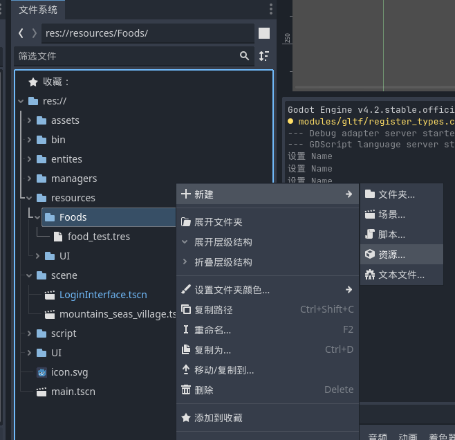

# Godot 使用说明

## 概述

- 基于C++
- GDExtension不支持Godot4以下的版本

### 一、程序参考代码

遇到不会的信息，可以参考github上Godot源码，其代码参考位置

1. 错误宏使用方法：`/core/error`
2. 使用样例：`/test/core/`

### 二、不同游戏设置数据

#### Ⅰ、Android设置

| Key                                                       | Value                                                        |
| --------------------------------------------------------- | ------------------------------------------------------------ |
| 游戏界面设置比例：19.5：9                                 | 宽度：540<br/>高度：1170<br/>窗口宽度覆盖：360<br/>窗口高度覆盖：780<br/>拉伸模式：canvas_items<br/>比例：expand |
| 异形屏幕问题                                              | 锚点全屏$\to$Control \ 锚点偏移$\to$ 顶：1170$\times$0.06    |
| 元素居中                                                  | 新建一个control节点$\to$设置锚点 \ 居中 $\to$ 将需要居中的元素（位置xy为0），变成其子节点 |
| 设置app朝向                                               | 项目$\to$显示$\to$窗口$\to$手持设备、朝向：（Landscape横屏，portralt竖屏） |
| 设置APP游戏图标：<.png>格式即可<br>项目$\to$配置$\to$图标 | 导出$\to$启动器图标$\to$Main 192$\times$192<br/>导出$\to$启动器图标$\to$Adaptive Foreground 432x432<br/>导出$\to$启动器图标$\to$Adaptive Background_432x432 |

#### Ⅱ、windows常用配置

| KEy                        | VALUE                                                        |
| -------------------------- | ------------------------------------------------------------ |
| 原图大小                   | 3200 $\times$ 2400                                           |
| 画面分辨率（视口大小）     | 640$\times$360                                               |
| 窗口大小：（窗口覆盖大小） | 1920$\times$1080：640$\times$360的3倍<br>1280$\times$720：640$\times$360的2倍 |
| 拉伸模式                   | canvas_items                                                 |
| 画面模糊                   | $项目\to 常规\to 渲染\to 纹理\to 画布纹理\to 默认纹理:Nearest$ |

#### Ⅲ、游戏人物大小

星露谷游戏大小

1. 画布：180$\times$320pix
2. 物品植物（基础单位）：16$\times$16pix
3. 角色大小（成人）：14$\times$29pix-2个基础单位大小

风来之国大小

1.  人物大小（成人）：33$\times$65pix
2.  人物大小（小朋友）：33$\times$44pix
3.  树：2倍成人、3倍成人

#### Ⅳ、自动图块

1. 需要64x96像素大小，平铺，内拐角
2. 192\*192=树木 - 画布大小384\*216 ,树木要缩小到05~0.4，0.4是成人大小
3. 0.4=76*76，
4. 人物：64*64
5. 320*240

## 常见错误 

| 关键                                                         | 说明                                                         |
| ------------------------------------------------------------ | ------------------------------------------------------------ |
| 各种空指针错误                                               | `TIdleState * m_state_idle = NULL;` 指针初始化一定要指向空，防止一些不可名状的错误 |
| AttributeError: 'NoneType' object has no attribute 'Append':<br/>File "D:\A_CodeItems\A_immortal_hero_world\SConstruct", line 8:<br/>env.Append(CPPPATH=["src/include/"]) | 有可能是godot-cpp版本问题，建议换个源码版本                  |
| error LNK2019: 无法解析的外部符号                            | 必须.cpp中文件必须实现<br>在Sconstruct文件中没有正确引入对应的.cpp文件或.h文件 |
| error LNK2001: 无法解析的外部符号                            | 若是在使用多态的时候出现错误，父类虚函数没有默认方法<br>静态方法没有初始化，静态属性初始化时没有添加类名 |
| fatal error LNK1120: 1 个无法解析的外部命令                  | 可能是函数传递错误<br>需要引用传递:`void R(AAA* b)`<br>静态方法定义时没有添加类名 |
| core/extension/gdextension.cpp:629 - <br>No GDExtension library found for current OS and architecture<br> (windows.x86_64) in configuration file: res://bin/a.gdextension<br/>Failed loading resource: res://bin/a.gdextension. Make sure resources have been imported by opening the project in the editor at least once. | 若确定.lib文件存在，则可能是编译环境错误，Godot的提示并不准确<br>验证GCC，gcc -v |
| error C2504: “TMainNode”: 未定义基类<br>error C2027: 使用了未定义类型<br>出现了循环引用错误 | 在father.h文件中声明`class child;`<br>在father.cpp中引入头文件：`#include "child.h"` |
| 成功编译，但编译后子类不存在节点中                           | `register.cpp`中要保证，父类在子类前面进行注册               |
| error C2065: “TFSCINTERFACE”: 未声明的标识符<br>error C2027: 使用了未定义类型“TMOVESTATE” | 检测头文件的引用顺序                                         |
| 使用继承创建Godot节点，子类可通过静态方法，访问父类属性、方法<br>不相关的节点只能通过get_node等方法、获取分组节点，先获取到目标节点，再调用其节点中的方法 |                                                              |

## 开发环境配置

### 一、win-SCons配置

环境配置

1. 下载Godot可执行文件

    注意：Godot可执行文件版本要与godot-cpp版本相同

2. 下载Godot-cpp源文件：[godot-cpp地址](https://github.com/godotengine/godot-cpp) 

    注意00：要下载godot-cpp项目，不是Godot的源码

    注意01：godot-cpp版本要与Godot可执行文件版本相同

3. 下载安装python（不建议使用微软商店安装）

    设置环境变量

4. 使用python安装SCons 

    > SCons是由python编写的自动化构建工具

    安装命令：`pip install SCons`  

    测试命令：`scons -v` 

5. 下载安装MSYS2

    下载路径：[Releases · niXman/mingw-builds-binaries (github.com)](https://github.com/niXman/mingw-builds-binaries/releases) 

    | 版本参数 | x86_64       | win32       | seh                         | msvcrt                                     | ucrt                                 | posix      |
    | -------- | ------------ | ----------- | --------------------------- | ------------------------------------------ | ------------------------------------ | ---------- |
    | 说明     | 64位操作系统 | windows程序 | 异常处理模型，无脑选seh即可 | 是一个过时的C++运行库，主要是C99之前的标准 | 是一个通用的C运行库，支持最新C++语法 | 可移植版本 |

6. 运行程序：MSYS2 MSYS

    更新：`pacman -Syu`

    安装GCC和make：`pacman -S --needed base-devel mingw-w64-x86_64-toolchain` 

    设置环境变量，GCC位置：`msys64\mingw64\bin` 

    验证命令：`gcc -v` 

新建项目目录

```shell
godot_project/
├── bin/                  # 编译后的可执行文件
├── src/                  # 项目源码
│   ├── core/             # 核心逻辑（与引擎无关的代码）
│   │   ├── math/         # 数学工具类
│   │   ├── utils/        # 通用工具类
│   │   └── core.cpp      # 核心逻辑实现
│   ├── game/             # 游戏逻辑
│   │   ├── entities/     # 游戏实体（角色、敌人等）
│   │   ├── levels/       # 关卡逻辑
│   │   └── game.cpp      # 游戏主逻辑
│   ├── ui/               # 用户界面
│   │   ├── widgets/      # 自定义UI组件
│   │   └── ui.cpp        # UI逻辑
│   ├── modules/          # Godot C++模块
│   │   ├── my_module/    # 自定义模块
│   │   │   ├── SCsub     # 模块构建配置
│   │   │   ├── register_types.cpp  # 模块注册
│   │   │   └── my_class.cpp        # 自定义类实现
│   │   └── other_module/ # 其他模块
│   ├── third_party/      # 第三方库
│   │   └── some_lib/     # 第三方库源码或头文件
│   └── main.cpp          # 程序入口
├── assets/               # 游戏资源
│   ├── textures/         # 纹理
│   ├── sounds/           # 音效
│   ├── fonts/            # 字体
│   └── scenes/           # Godot场景文件
├── docs/                 # 项目文档
│   ├── design/           # 设计文档
│   ├── api/              # API文档
│   └── README.md         # 项目说明
├── tests/                # 单元测试
│   ├── core/             # 核心逻辑测试
│   ├── game/             # 游戏逻辑测试
│   └── ui/               # UI测试
├── scripts/              # 构建脚本或其他脚本
│   ├── build.sh          # 构建脚本
│   └── deploy.sh         # 部署脚本
├── .gitignore            # Git忽略文件
├── SConstruct            # Godot构建配置
└── README.md             # 项目说明
```

最简单项目目录

``` shell
# 项目根目录
 ├─ demo `Godot项目目录`
 │  └─bin `dll文件目录` 
 │     └─example.gdextension #扩展启动文件
 |
 ├─Godot-cpp `Godot源码目录`
 ├─src `C++代码目录` 
 │  ├─register_types.cpp # 注册文件
 │  ├─register_types.h   # 注册文件
 │  ├─test.cpp # 开发代码
 │  └─test.h   # 开发代码
 └─SConstruct  # SCons构建脚本
```

编写代码

1. 参考SConstruct注释
2. 编写C++代码

生成动态链接库（.dll）

1. 切换到目录：SConstruct文件所在目录
2. 运行命令：`SCons -j6 -Q platform=windows`  

修改.gdextension

1. 复制生成的.dll文件到example.gdextension文件指定的位置

   若SConstruct中已经设置好路径，则不用复制

2. example.gdextension

   example名字可以修改

   .gdextension不可修改

3. 可参考文件：
   - `godot-cpp/test/example.gdextension` 
   - `godot-cpp/test/project/example.gdextension` 

``` shell
[configuration]
# entry_symbol就是register_types.cpp中example_library_init函数名
entry_symbol = "example_library_init"
# Godot4.1版本以上必须有的参数
compatibility_minimum = "4.1"

[libraries]
# 步骤5生成的lib路径
windows.debug.x86_64 = "res://libgodot.debug.x86_64.lib"
```

### 二、vscode编辑器设置

安装软件

1. 安装vscode的C/C++扩展

2. 安装LLDB扩展（CodeLLDB）

3. 安装Task Explorer：用于只编译不运行并不是必须项

4. 安装GCC编译器（配置编译器路径，若是没有提示）

   下载路径：[Releases · niXman/mingw-builds-binaries (github.com)](https://github.com/niXman/mingw-builds-binaries/releases) 

   验证命令：`gcc --version` 

配置构建任务文件：task.json

- 创建task.json文件：$Ctrl + Shift + P\to输入:configure Task\to 选择:task.json\to 选择:other$ 

``` json
{
    "version": "2.0.0",
    "tasks": [
        {
            "label": "build", // launch.json中配置对应
            "type": "shell", // 在shell中启动
            "command": "scons", //执行命令
            "args": [ // 命令参数
                "-j12",
                "target=template_debug", //debug设置
                "debug_symbols=yes"//debug设置
                "no_run=yes" // 只编译不运行
            ]
        }
    ]
}
```

配置运行和调试文件：launch.json

- 运行$Debug\to LLDB$ 创建launch.json
- 若不使用调试，可以不配置launch.json

``` json
{
    "version": "0.2.0",
    "configurations": [
        {
            "name": "Debug", // debug中显示的名称
            "type": "lldb",
            "preLaunchTask":"build",// 执行上一步的操作task.json
            "request": "launch",
            // Godot可执行文件的位置，C:\\User\\Godot.exe
            "program": "${workspaceFolder}/<executable file>",
            // 要编译的项目目录
            "args": ["--editor","--path","C:\\user\\demo"],
            "cwd": "${workspaceFolder}"
         }
    ]
}
```

配置文件导入目录：VSCode的IntelliSense

- VSCode 的 IntelliSense 依赖于 `c_cpp_properties.json` 文件来配置头文件搜索路径。
- 文件位置：`.vscode/c_cpp_properties.json` 

``` c++
{
    "configurations": [
        {
            "name": "Win32",  // 根据你的操作系统选择
            "includePath": [ // 设置头文件默认打开路径
                "${workspaceFolder}/**",  // 默认包含项目根目录
                "${workspaceFolder}/include",  // 绝对路径
            ],
           "defines": [
                "_DEBUG",
                "UNICODE",
                "_UNICODE"
            ],
            "compilerPath": "D:\\Program Files\\msys64\\mingw64\\bin\\gcc.exe",
            "cStandard": "c17",
            "cppStandard": "gnu++17",
            "intelliSenseMode": "windows-gcc-x64"
        }
    ],
    "version": 4
}
```

配置完成后，就可使用了

1. 设置Godot主场景

2. 下断点，调试项目

### 三、SCons使用

``` shell
# 推荐
# 多线程编译-6是6核应与CPU核心相同
SCons -j12 platform=windows  

# 默认去寻找VS的编译环境，找不到会寻找MinGW的编译环境
scons platform=windows  

# no_run参数：编译，不运行
scons platform=windows no_run=yes 

#-- 用不到的命令
# 强制使用mingw编译
scons platform=windows use_mingw=yes 
# 软件是64位还是32位置，bits=64 或者 bits=32
scons platform=windows bits=32 
```

## Godot核心

### 备注\说明

- 优先使用Godot自带的类，禁止使用STL [ 为啥禁用 ](https://docs.godotengine.org/zh-cn/4.x/about/faq.html#why-does-godot-not-use-stl-standard-template-library) 

  优先使用std库场景

  1. 纯C++模块，无脚本交互
  2. 高频访问的固定类型数据

  使用Godot引擎功能

  1. 序列化（基于Variant类型实现）、信号、资源管理等依赖于Variant类型
  2. 与GDScript交互时，使用Godot容器

- 当创建一个非游戏的应用程序时，确保在项目设置中启用[低处理器模式](https://docs.godotengine.org/zh-cn/4.x/classes/class_projectsettings.html#class-projectsettings-property-application-run-low-processor-mode)以减少 CPU 和 GPU 占用。

- 资源类型优先使用 `const Ref<T>&` 

  ``` c++
  void set_texture(Ref<Texture2D>& p_texture) 
  {
      // 参数传递阶段：零开销（无拷贝）。
  	// 赋值给成员变量时：发生一次拷贝（引用计数 +1）。
      texture = p_texture;
  }
  ```

- 其他类型是否推荐使用`const &`

  | **类型**       | **大小** | **拷贝成本**     | **推荐传递方式** |
  | :------------- | :------- | :--------------- | :--------------- |
  | `int`, `float` | 4-8 字节 | 极低             | 直接传值         |
  | `Vector2`      | 8 字节   | 低               | `const &` 或传值 |
  | `String`       | 变长     | 中等（引用计数） | `const &`        |
  | `Array`        | 变长     | 高（深层复制）   | `const &`        |
  | `Dictionary`   | 变长     | 高（深层复制）   | `const &`        |
  
- 关于引入头文件，避免循环引用错误

  **前向声明的本质**：编译器需要知道 `Node2D` 属于哪个命名空间，即使后续通过 `using namespace` 省略。

  **一致性要求**：Godot 的 C++ 绑定严格将类定义在 `godot` 命名空间内，前向声明必须匹配。

  ``` c++
  namespace godot {
      class Node2D;  // 前向声明（必须在 godot 命名空间内）
  }
  
  using namespace godot;  // 使用命名空间
  ```

### 一、生命周期

1. enterTree：节点添加到节点树时调用，每一个节点加入树都会调用

2. ready：`_ready`方法，优先初始化子类，再初始化父类（子类顺序是由上到下初始化）

3. process：

   1. _process每一帧都运行；delta = 1/帧数
   2. 移动距离$\times$delta可以使移动距离与帧率无关；1$\times$delta可以简单理解为每秒移动1像素

4. physic_process：物理计算一次调用，一般调用物理引擎时使用

5. exitTree：节点销毁调用

6. input：有输入时调用

   ``` c++
   /* 只要键盘或鼠标按动，就触发当前方法 */
   void _input(const Ref<InputEvent> &event);//输入按键调用
   
   void T::_input(const Ref<InputEvent> &event){
       //UtilityFunctions::print("_input");
   	// 判断p是否按下
       if(event->is_action_pressed("p")){
           UtilityFunctions::print("stop");
       }  
       //C++示例方法，转换inputevent
       const InputEventKey *key_event = Object::cast_to<const InputEventKey>(*event);
       
   }
   
   /* _unhandled_key_input */
   void T::_unhandled_key_input(const Ref<InputEvent> &event){}
   ```

其他注意事项

1. 生命周期方法，初始化顺序是从上到下
2. C++的方法与GD脚本的方法函数名相同
3. 生命周期方法需要写在public下

### 二、宏定义

错误宏

``` c++
ERR_FAIL_NULL_MSG(a, "xxxxx");    // 判断指针a是否为空,并输出错误信息，程序返回
ERR_FAIL_NULL_EDMSG(a, "xxxxx2"); // 判断指针a是否为空,并输出错误信息，程序返回

ERR_FAIL_NULL(a);     // 判断是否为空，空输出a为空
ERR_FAIL_NULL_V(a, 1);// 第2个参数不知道是什么

ERR_FAIL_V_MSG(nullptr, err); // 带返回值的，错误信息

// 通用错误宏
ERR_FAIL_MSG("Error fail msg");     // 打印错误信息，程序返回
ERR_FAIL_EDMSG("error fail edmsg"); // 错误打印，通知编辑器
ERR_FAIL_V(b); // 程序错误，并返回其值b

ERR_PRINT("Error print"); // 打印错误，程序继续执行
ERR_PRINT_ED("Error print ed"); // 通知编辑器，程序继续执行
ERR_FAIL();                     // 程序返回
```

检查宏

``` c++
// 检查类型，可以检查任何宏
CHECK(int(map["Hello"]) == 0);
```

其他宏

``` c++
CHECK_EQ(a1, a1); // compare self
CHECK_FALSE(a1 != a1);
CHECK_EQ(a1, a2); // different equivalent arrays
CHECK_FALSE(a1 != a2);
CHECK_NE(a1, other_a); // different arrays with different content
CHECK_FALSE(a1 == other_a);
```

### 三、内存分配

1. 4.3开始，Godot不能使用new、delete、malloc等C++关键字；

2. Godot提供了`memalloc()、memrealloc()、memfree()`对应C中`malloc()、realloc()、free()` 

3. `memnew()、memdelete()`对应C++中`new()、delete()` 

4. 对于动态内存, 提供了PoolVector<>模板.PoolVector是一个标准的Vector类

   PoolVectors允许快速读/写并保持锁定直到它们超出作用域.

   PoolVectors应该用于小型动态内存操作, 因为read()和write()对于大量访问来说太慢了

   ``` c++
   PoolVector<int> data; //创建PoolVector缓冲区
   // 读取
   PoolVector<int>::Read r = data.read()
   int someint = r[4];
   // 写入
   PoolVector<int>::Write w = data.write()
   w[4] = 22;
   ```

### 四、Variant类型

- Godot的万能类型，可以转换为Godot的任意类型
- 要实现序列化，就应将变量类型转换为Godot容器（Array、Dictionary等）

显示转换（适用于转Array、Dictionary、Vector2等）

- 一般要使用类型检测，不然会出错停止

``` c++
Vector2 my_v = my_variant; // 转换为vector2
Array my_a = my_variant; // my_variant是variant类型
Dictionary my_d = my_variant; // 直接转换

/* 测试 */
// 检测是不是字典类型
if (my_variant.get_type() == Variant::DICTIONARY) {
    Dictionary my_dict = my_variant;
} else {
    UtilityFunctions::print("Variant is not a Dictionary!");
}
```

使用cast_to转换

- 适用于 **`Object` 类型之间的转换**（如从 `Node`到 `CharacterBody3D`类型）。
- 基本就是Node类转换为其他Node子类
- 如果转换失败，`cast_to` 返回 `nullptr`。
- **仅适用于 `Object` 派生类**，不能用于 `int`、`float` 等基本类型。

``` c++
// 使用 Object::cast_to<T>（推荐）
Node *node = v;
// 从node转换为Node2D
Node2D *player = cast_to<Node2D>(node);
```

隐式转换，使用`=`或`Ref<>`

- 适用于 Godot 的 **`Ref<>` 智能指针系统**（如 `Ref<Resource>`, `Ref<Node>` 等）。
- 当使用Dictionary或Array保存`Ref<>`时，使用隐式转换

``` c++
/* 情况1：Variant 存储的是 Resource 类型 */ 
Variant v = ResourceLoader::get_singleton()->load("res://texture.png");
Ref<Texture2D> texture = v; // 直接赋值（隐式转换）

/* 情况2：Variant 存储的是 Node 类型 */ 
Variant node_v = get_node("Player");
Node *node = node_v; // 直接转换为 Node*
```

### 五、Dictionary

- Godot所有变量都需要使用`cast_to`转换
- 不同的Dictionary类型
  - 如果需要存储多种类型的数据，使用 `Dictionary`。
  - 如果需要存储特定类型的数据，使用 `TypedDictionary<K, V>`。
  - 如果需要保持键值对的顺序，使用 `OrderedDictionary`。
  - 如果需要高性能的密集字典，使用 `PackedDictionary` 系列。


初始化方法：没有适合方法

Dictionary使用方法

``` c++
Dictionary map;
map["Hello"] = 0;
map[StringName("HelloName")]; //使用StringName效率好像要高一些
map[Vector2(10, 20)] = 30;

map.find_key(6).get_type();
map.make_read_only();
map.size();
map.get_key_list(ptr);
Array a = map.keys(); // 获取所有key

Variant val = map.get_key_at_index(0);
if(int(val) == 4);
```

### 六、Array类型

- Array可以存放任意类型（**可同时存放不同的类型，但只能是Godot内部支持对象**）
- 需要使用`cast_to`进行类型转换
- 如果需要高性能的密集数组，使用 `PackedArray` 系列。内存紧凑，性能高。

**注意**：当使用ClassDB::add_property添加外部属性，其类型是Array的时候，对应存储变量必须是Public权限，private权限、protected权限都有可能造成Array的值只能使用1次就被释放（版本：4.4），Dictionary字典类型就可以完美保存

Array常用使用方法

``` c++
/* 创建数组 */
Array arr; // 创建空数组
Array arr = Array::make(1, 2, 3, "hello", true); // 创建带初始值的数组

/* 额外方法 */
arr.size(); 
arr.front();
arr.back();
arr.remove_at();
arr.count(2);
arr.max(); // 最大
arr.min(); // 最小
arr.slice();
arr.pick_random(); //随机获取一个数
```

Array常用使用方法-添加元素

- **`append(value)`**：在数组末尾添加一个元素。
- **`push_back(value)`**：与 `append` 相同。
- **`insert(position, value)`**：在指定位置插入一个元素。

```c++
my_array; // [1, 2, 3]
my_array.append(4);          // [1, 2, 3, 4]
my_array.push_back(5);       // [1, 2, 3, 4, 5]
my_array.insert(2, 99);      // [1, 2, 99, 3, 4, 5]
```

Array常用使用方法-删除元素

- **`remove(position)`**：删除指定位置的元素。
- **`erase(value)`**：删除第一个匹配的元素。
- **`pop_back()`**：删除并返回最后一个元素。
- **`pop_front()`**：删除并返回第一个元素。
- **`clear()`**：清空数组。

```c++
my_array.remove(2);          // 删除索引为2的元素
my_array.erase(3);           // 删除第一个值为3的元素
Variant last_element = my_array.pop_back();  // 删除并返回最后一个元素
Variant first_element = my_array.pop_front(); // 删除并返回第一个元素
my_array.clear();            // 清空数组
```

Array常用使用方法-查找元素

- **`find(value)`**：返回第一个匹配元素的索引，未找到返回 `-1`。
- **`has(value)`**：检查数组是否包含某个值。包含返回真

```c++
int index = my_array.find(2);  // 返回值为2的索引
if (my_array.has("hello")) {
    Godot::print("Found 'hello'");
}
```

Array常用使用方法-排序/ 反转

- **`sort()`**：对数组进行升序排序。
- **`sort_custom(callable)`**：使用自定义函数排序。
- **`reverse()`**：反转数组。

```
my_array.sort();  // 升序排序
my_array.reverse();  // 反转数组
```

TypedArray使用方法

- 类型安全：只能存储指定类型的元素。
- 性能优化：由于类型固定，访问元素时无需类型检查。
- 支持的类型：`Node`, `Resource`, `Object` 等

``` c++
/* 存放一般数据 */
TypedArray<int> w;
w.push_back(1);

/* 存放字典类型 */ 
Dictionary w2; // 定义一个字典
TypedArray<Dictionary> w1;
w1.push_back(w2);

/* 存放类 */
TypedArray<TResNode> w3;
w3.push_back(this);
```

### 七、GDExtension中函数返回值

**直接通过函数return返回**

1. 小型数据

   这些类型大小 ≤ 16 字节，**返回值优化（RVO/NRVO）** 会消除拷贝。

   例如：`Vector2、Vector3、Color、Rect2`

2. 常用节点的指针，如：`Node *`、`CharacterBody2D *`、`Marker2D *` 

3. Godot字符串类型

   Godot 的字符串类已优化，**复制时仅递增引用计数**，无深拷贝开销。

   例如：`String、StringName、NodePath`

4. Ref<>对象

   `Ref<>` 是智能指针，**复制时仅增减引用计数**，无性能问题。

**通过`const &`或函数参数带出**

1. Array、Dictionary类型：容器较大，避免复制开销
2. 自定义大结构体（struct、class）：避免深拷贝
3. 返回多个值时

### 八、GDExtension中可传递对象

1. 优先是使用`get_node`获取节点后再调用属性或方法，万能方法，获取节点后再获取数据
2. 不同的节点之间是相互独立的，不存在数据通用
3. 使用静态方法，变量可以在继承关系中的节点共享一份数据
4. `_ready()`中定义赋予的值，在子类是无法获取的，要在子类调用专用的赋值方法（注意，这样也只能在调用赋值方法的节点中使用数据，而在其他节点无法使用）

#### Ⅰ、普通类型

`Bool、String、int、Float、double` 自动类型

- 其值可以在子类中直接获取。
- 任何情况、任何方法都可获取父类属性。

``` c++
/* 父类TFather-定义的属性 */ 
int father_1 = 1;
double father_2 = 1.1;
String father_3 = "aa";
/* 子类-直接调用 */
UtilityFunctions::print(TFather::father_1);
UtilityFunctions::print(father_1);
```

#### Ⅱ、其他类型

`Array、Dictionary、Variant` 不能直接获取父类属性

- 直接调用父类的Array、Dictionary、Variant其值在子类为空，需要先得到父类节点才可以

- return可以返回函数内创建的Array、Dictionary的值

  ``` c++
  Array return_array()
  {
      Array a;
      a.push(1);
      return a; // 可以返回
  };
  Dictionary return_dictionary()
  {
      Dicctionary a;
      return a; // 返回属性值
  };
  // 子类可以获取其拷贝副本
  UtilityFunctions::print(TFather::return_array());
  UtilityFunctions::print(return_dictionary());
  ```

- return不能获取类属性属性（使用指针也不能获取）

  ``` c++
  /* 父类TFather-定义的属性 */ 
  Array father_1;
  Dictionary father_2;
  Array return_array()
  {
      return father_1; // 返回属性值
  };
  Dictionary return_dictionary()
  {
      return father_2; // 返回属性值
  };
  /* 子类无法获取父类属性 */
  UtilityFunctions::print(TFather::return_array());//空
  UtilityFunctions::print(return_dictionary());//空
  /* 子类获取父类节点后调用 */
  TFather * n = get_node<TFather>(".."); // 获取父类节点
  n->father_1; // 获取属性值
  ```

子类调用父类的`Dictionary、Array、Variant`赋值方法也可获取其属性（不推荐使用）

``` c++
// 赋值方法
void TFather::get_res_from_father()
{
    father_1.push_back(111); // Array
    father_2["333"] = 333;  // Dictionary
    father_3 = get_node<Node>("../Node"); // 节点
}
// 子类调用赋值方法
TFather::get_res_from_father(); 
// 然后就可以使用父类属性了
UtilityFunctions::print(TResFather::father_1);
UtilityFunctions::print(TResFather::father_2);
UtilityFunctions::print(TResFather::father_3);
```

#### Ⅲ、资源类型

**资源类型可以在子类直接获取**（全局唯一）

``` c++
/* 父类 */
Variant father_res; //父类定义的资源
/* 子类 */
UtilityFunctions::print(father_res); // 可以直接获取父类资源类
```

关于资源类型的使用

- 类属性信息：

  son类中有字段data，用于添加资源

  father类中有字段scene，用于添加资源

  res资源类有属性aa；

- 情况一：资源添加在子类节点中

  > son节点 ：“检查器”$\to$ “father类”$\to$ “字段scene”添加资源文件

  ``` c++
  /* 父类 */
  Variant father_res; //父类定义的资源
  /* 子类 */
  TRes *a = cast_to<TRes>(father_res); // Variant转换为TRes类型
  UtilityFunctions::print(a->aa); // 打印属性值
  ```

- 情况二：资源添加在父类节点中，不能获取资源，需要先获取父类节点

- 情况三：资源添加在父类节点中，在子类调用父类的赋值方法，也是可以获取属性值（不推荐使用）

### 九、信号方法

1. Godot操作方法：连接信号方法$\to$ 连接到脚本（选中自定义类）$\to$ 接受方法旁的“选取”

2. 一个信号只能连接到同一个 Callable 一次。

   如果该信号已经连接，除非该信号是使用 CONNECT_REFERENCE_COUNTED 连接的，否则该方法会返回 ERR_INVALID_PARAMETER 并推送一条错误消息。

   为防止这种情况，请首先使用 is_connected() 检查已存在的连接。

3. 操作方法：连接信号方法$\to$ 连接到脚本（选中自定义类）$\to$ 接受方法旁的“选取”

#### Ⅰ、信号使用

1. 信号定义、发射、连接方法，都可以在任意位置
2. 信号定义、发射、连接方法，都不在一个文件中，需要获取对应的节点

声明信号

- 信号声明，可以在任意文件中

``` c++
/* 创建信号 */
// 带参数信号
ADD_SIGNAL(MethodInfo(
    "game_stop",//信号名称
    PropertyInfo(Variant::STRING, "data")//信号参数
));
// 普通信号
ADD_SIGNAL(MethodInfo("game_stop"));
```

发射信号

- GDScript发射信号：需要获取定义信号的节点

``` c++
/* 发送信号 */
// 发射信号
emit_signal("信号名称");
emit_signal("信号名称", "参数1");

// 发射其他类中定义信号，需要先获取定义信号的类
get_node<Node>("节点名")->emit_signal("信号名称");

/* GDScript发射信号 */
get_node("signal")->emit_signal("xx");
```

信号的处理方法

- 一定要设置bind_method方法，不然无法触发信号处理方法

``` c++
/* 暴露信号的触发方法到GDScript */
// up: 供GDScript调用的方法名
// up_testst：up触发的C++方法
ClassDB::bind_method(D_METHOD("up"), &TTest::up_testst);

/* 设置响应方法 */
void Test::up_testst(){ //...}
```

连接信号与信号处理方法，连接方法根据不同的情况，选择不同的方法

- `connect("信号名称", Callable(类, "触发的GDScript可调用的方法"))` 
- 信号连接方法，可以在任意地方

``` c++
/* 方式一 */ 
// 1.当前类定义了信号：game_stop
// 2.触发当前类的方法
connect("game_stop", Callable(this, "up"));

/* 方式二  */
// 1.当前类定义了信号：game_stop
// 2.触发其他类方法
Node *p = get_node<Node>("aim"); // 获取其他类
connect("game_stop", Callable(p, "up"));

/* 方式三 */ 
// 1.aim类中定义了信号:game_stop
// 2.触发aim中方法up
get_node<Node>("aim") 
 	->connect("game_stop", Callable(this, "up"));

/* 方法四 */ 
// 1.当前类没有定义信号
// 2.当前类没有触发方法
Node *p = get_node<Node>("aim"); // 获取触发方法
get_node<Node>("Area2D") // 获取信号
 	->connect("game_stop", Callable(p, "up"));
```

#### Ⅱ、自定义节点属性

- 注意：`ClassDB::bind_method `方法一定要在 `ClassDB::add_property` 之前
- 需要重新打开Godot，才能显示属性
- 中文会乱码

基本用法：

``` c++
void Test::_bind_methods(){
    /* 2.将Godot界面属性与C++方法绑定 */
    // 要先定义绑定方法
    ClassDB::bind_method(D_METHOD("set_radius", "a"), &Test::set_radius);
    ClassDB::bind_method(D_METHOD("get_radius"), &Test::get_radius);
    
    /* 1.添加界面接口
    ClassDB::add_property("类名",
    	PropertyInfo(参数类型, "参数名称"),
        "参数设置方法", 
        "获取参数数值");
    */
    ClassDB::add_property("Test",
    	PropertyInfo(Variant::FLOAT, "xxxx"),
        "set_radius",
        "get_radius");
}

/* 3.设置get_radius、set_radius方法 */
double Test::get_radius(){
    return radius;
}
void Test::set_radius(double r){
    this->radius = r;
}
```

给属性添加分组

``` c++
/* 
ADD_GROUP("分组名称","分组标识");
ADD_SUBGROUP("分组名称", "分组标识");
*/
// 设置分组表示，
ADD_GROUP("Group01","first_");
// 设置分组标识，二级分组
ADD_SUBGROUP("Group02", "first_second_");

/* 添加属性到分组中 */
ClassDB::add_property("Test",
    // 添加分组标识
    PropertyInfo(Variant::FLOAT, "first_second_xxxxx"),
    "set_radius",
    "get_radius");
```

#### Ⅲ、connect方法

1. connect中Callable方法只能触发GDScript能调用的方法（使用CLassDB::bind_method绑定的方法）

2. 出现错误：

   > Cannot connect to 'animation_finished': the provided callable is not valid: 

   应检测`D_METHOD`的绑定方法与`Callable()`中的方法名是否一致

携带参数的bind方法

``` c++
/* 定义可调用方法 */ 
ClassDB::bind_method(D_METHOD("destroy_tetrominoes", "a", "b"), &aa::destroy);

/* 连接信号 */
int a = 100;
anim_player->connect(
    "animation_finished", // anim_player节点的信号
    // _on_animation_finished：触发的方法，需要在bind_method中绑定
    // bind(a)：绑定的参数，可以是任何值，节点，值都行
	Callable(this, "destroy_tetrominoes").bind( a ));

/* 调用方法 */
// const String &anim_name：AnimationPlayer的finished信号默认绑定参数
// int a：我们自定义的绑定参数
void aa::destroy(const String &anim_name, int a)
{
    // 动画节点第一个参数是默认传递的
    if (anim_name == "play") { \\...    }
}
```

Lambda绑定方式

- 有错，意义不明

``` c++
Node * sprite = get_node<Node>("Sprite");
anim_player->connect(
    "animation_finished",
    Callable::bind(
        // Lambda表达式
        [this](const String &anim_name, Node *sprite) {
            if (anim_name == "play") sprite->queue_free();
        },
        // 绑定的参数
        sprite 
    )
);
```


### 十、资源相关操作

1. 使用`@export var player_date: Resource`让节点可以加载资源文件

2. **资源类可以直接使用，他在游戏中是唯一的** 

3. 资源类中只定义数据变量，不定义方法，方法在容器中定义

4. 静态的数据，不会修改的信息，都可以写成资源（可以理解为数据库）

5. 同时，一个资源类（C++文件）代表一类资源，可用这个资源生成具体的资源文件（.tres）

   比如，编写weapen.cpp（武器资源）可生成dadao.tres（大刀）、xiaodao.tres（小刀）

资源参数说明

| 名称                    |                                                              |
| ----------------------- | ------------------------------------------------------------ |
| resource_local_to_scene | 一个资源文件应用于多个地方时，（true）可保证每一个资源都独立 |
|                         |                                                              |

#### Ⅰ、资源tres文件

- 资源节点需要在regi中注册
- 基本类型使用普通属性添加 
- Object类型可以用于其他数据类型添加，Resource类型使用Object类型

资源头文件（.h）

- 头文件：`#include <godot_cpp/classes/resource.hpp>`
- 必须继承Resource类型

``` c++
using namespace godot;
class TFood : public Resource
{
    GDCLASS(TFood, Resource);
public:
    /* 基础属性 */
    String m_name = "";
    Variant m_level;
protected:
    static void _bind_methods();

private:
    // 修改属性方法
    void set_name(const String & s);
    String get_name();
}
```

普通资源属性（.cpp）

``` c++
#include "food.h"
/* 普通属性添加 */
void TFood::_bind_methods() {
    /* 设置可在编辑器修改 */
    ClassDB::bind_method(D_METHOD("set_name", "a"), &TFood::set_name);
    ClassDB::bind_method(D_METHOD("get_name"), &TFood::get_name);
    ClassDB::add_property("TFood",
     	PropertyInfo(Variant::STRING, "Name"),
        "set_name",
        "get_name");
}
/* 在编辑器修改的具体逻辑 */
void TFood::set_level(const int & a){
     m_name = a;
};
int TFood::get_level(){
     return m_name;
}; 
```

添加Resours类型（.CPP）

``` c++
#include "food.h"

/* 其他属性添加，Resours资源添加 */
void TFood::_bind_methods() {
    ClassDB::bind_method(D_METHOD("set_name", "a"), &TFood::set_name);
    ClassDB::bind_method(D_METHOD("get_name"), &TFood::get_name);
    ClassDB::add_property("TFood",
        // 使用特殊的OBJECT类型
     	PropertyInfo(Variant::OBJECT, "Name"), // 修改地方
        "set_name",
        "get_name");
}
// 对应于不是基础类型的使用Variant类型
void TFood::set_level(const Variant & a){
     m_level = a;
};
Variant TFood::get_level(){
     return m_level;
}; 
```

#### Ⅱ、创建tres文件

使用Godot创建资源，创建后的资源类（.tres）文件，加载到其他节点即可使用



#### Ⅲ、资源转换及问题

1. Ref<>类型转换为Ref<>使用隐式转换，不使用cast_to方法

常出现的错误提示

- 出现为`<NULL>`：可能是资源没有正确添加，需要重启Godot

- Dictionary资源打印会出现：`{ "I": [Wrapped:0] }`

  `[Wrapped:0]`：并不是空，其`[]`也不意味着数组

#### Ⅳ、JSON

1. Godot内置呢JSON解析方法，不用使用jsoncpp
2. 注意：Json类型不能通过`ClassDB::add_property`方式添加进Godot

**读取/保存**本地json文件，需要`FileAccess`类

- json头文件：`#include <godot_cpp/classes/json.hpp>` 
- 文件加载类：`#include <godot_cpp/classes/file_access.hpp>` 

``` c++
Ref<FileAccess> f = FileAccess::open("Path", FileAccess::READ);
String a = f->get_as_text(); // 将FileAccess类型转换为字符串
f->close(); // 关闭文件
```

**parse**：json文本（字符串）转json对象

- `Error parse( String json_text, bool keep_text=false )`：尝试解析json文本
- `Variant parse_string( String json_string ) static`: 试图解析提供的 `json_string`，并返回解析后的数据。如果解析失败，返回 `null`。

``` c++
/* 静态方法-parse_string */
// 解析字符串，并转换为Dictionary类型
Dictionary json = JSON::parse_string(json_text);
UtilityFunctions::print(json["1"]);
json.get("1", NULL); // 字典的获取方法


/* 使用Json对象 */
JSON * j = memnew(JSON); // 创建一个新Json对象，一定要用memnew方法
j->parse(a); // 解析json字符串
Dictionary z = j->get_data(); // 获取解析到的json数据，并使用字典保存
Array z = j->get_data(); // 获取解析的json数据，使用Array保存
z.get("1", null); // 字典获取方法，没有为空
z["1"]; // 字典获取方法
```

**stringify**：json对象转json文本（字符串），用于保存本地

- `String stringify(Variant data, String indent=””, sort_keys=true, full_precision=false )`

  将Variant变量转换为 JSON 文本并返回结果。

``` c++
Dictionary data_to_send = {"name":"my_dictionary","version":"1.0.0","entities":[{"name":"entity_0","value":"value_0"},{"name":"entity_1","value":"value_1"}]}
;
// 默认转换，不带格式
JSON.stringify(my_dictionary);
/* 转换样例：带\t
{
    "name": "my_dictionary",
    "entities": [
        {
            "name": "entity_0",
            "value": "value_0"
        }
    ]
}
*/
// 将Array转换为json
JSON.stringify(data_to_send, "\t")

```

获取其属性（不推荐使用）

``` c++
// 赋值方法
void TFather::get_res_from_father()
{
    father_1.push_back(111); // Array
    father_2["333"] = 333;  // Dictionary
    father_3 = get_node<Node>("../Node"); // 节点
}
// 子类调用赋值方法
TFather::get_res_from_father(); 
// 然后就可以使用父类属性了
UtilityFunctions::print(TResFather::father_1);
UtilityFunctions::print(TResFather::father_2);
UtilityFunctions::print(TResFather::father_3);
```

#### Ⅵ、ResourceLoader

1. 头文件：`#include <godot_cpp/classes/resource_loader.hpp>` 

2. 类型头文件：

   场景资源：`#include <godot_cpp/classes/packed_scene.hpp>`

3. 类型：

   - Ref<PackedScene>：场景资源（.tscn）
   - Ref<Texture2D>：图片纹理，图片资源

4. 如果先前已加载对该资源的引用并且该引用在内存中（已实例化）, 则资源加载器将返回该引用. 这意味着只能同时从磁盘上引用的文件加载一个资源.

5. Ref<Resource> 是所有资源的基类，Ref<PackedScene> 继承自 Ref<Resource>

### 十一、Engine类使用

- 头文件：`#include <godot_cpp/classes/engine.hpp>` 

#### Ⅰ、设置进程模式

- 建议使用GDScript进行update调用
- 注意：不能在CharacterBody2D节点中使用，有些版本会有BUG，编译完成后，需要重新添加节点才有效果

``` c++
#include <godot_cpp/classes/engine.hpp>
Test::Test(){
    if(Engine::get_singleton()->is_editor_hint()) {
        // 在编辑器中，禁用_process函数
        set_process_mode(
            Node::ProcessMode::PROCESS_MODE_DISABLED);

        UtilityFunctions::print("set ok");
    }
}

```

#### Ⅱ、获取重力速度

``` c++
#include <godot_cpp/classes/project_settings.hpp>
// 获取重力加速度
Variant g = ProjectSettings::get_singleton()->get_setting("physics/2d/default_gravity");
// 保持重力速度
this->m_gravity = (float)g;
```

#### Ⅲ、减速状态

``` c++
#include <godot_cpp/classes/engine.hpp>
# 获取Engine实例，Engine::get_singleton()  
// Engine::get_singleton()->set_time_scale(0.5);
Engine *e = Engine::get_singleton();
e->set_time_scale(3);
```

#### Ⅳ、暂停游戏

``` c++
set_physics_process(false);
get_tree()->paused = true;
// 设置节点属性，Node->pause->mode-> process 设置当前节点和主场景节点不是继承关系
```

#### Ⅴ、注册实例

``` c++
Engine::get_singleton()
    ->add_singleton(Engine::Singleton("YTween", YTween::get_singleton()));
```

#### Ⅶ、程序暂停

``` c++
set_process(FAILED); // 暂停

```

### 十二、Input

1. 需要配置虚拟按键，不然会出现错误

2. 菜单栏$\to$ 项目$\to$ 项目设置$\to$ 输入映射$\to$​ 添加键位映射

3. 虚拟按键不支持中文

4. 头文件：`#include <godot_cpp/classes/input.hpp>` 

获取单个按钮按下动作

``` c++
// 获取Input静态实例
Input *ii = Input::get_singleton(); 

ii->is_action_pressed("d");// 按下d键，触发多次
ii->is_action_just_pressed("d"));// 按下按键，触发1次
ii->is_action_just_released("d"));// 松开D键
ii->is_anything_pressed();// 任意键按下
```

获取水平方向/垂直方向的动作

``` c++
// 获取Input静态实例
Input *ii = Input::get_singleton(); 

// 获取水平轴（左负右正，自动标准化到 [-1, 1]），不用使用.
float h = ii->get_axis("左", "右");
return Vector2(h, 0);

// 获取垂直轴
float v = ii->get_axis("下", "上");
return Vector2(0, v);
```

获取4个方向的动作

``` c++
Input *ii = Input::get_singleton(); 

// 位置一定对应，不然方向会出错
Vector2 dir = ii->get_vector("左","右","上","下").normalized();
dir.x !=0; // x轴
dir.y !=0; // y轴
```

其他

``` c++
Input *ii = Input::get_singleton(); 

/* 获取按下s的力量 */
float s = ii->get_action_strength("s");
```

InputMap

- 头文件：`#include <godot_cpp/classes/input_map.hpp>`
- 可以解决 this inputmap 不存在bug

``` c++
// 从Godot中的设置加载设置
InputMap* map = InputMap::get_singleton();  
map->load_from_project_settings();
```

### 十三、FileAccess

- 头文件：`#include <godot_cpp/classes/file_access.hpp>`

- 文件读取类型

  | KEY                    | v    |
  | ---------------------- | ---- |
  | FileAccess::READ       | 1    |
  | FileAccess::WRITE      | 2    |
  | FileAccess::READ_WRITE | 3    |
  | FileAccess::WRITE_READ | 7    |

``` c++
// 读取文件
Ref<FileAccess> f = FileAccess::open("Path", FileAccess::READ);
// 关闭文件
f->close(); 

String a = f->get_as_text(); // 将FileAccess类型转换为字符串
Vector<String> header = f->get_csv_line(); // Default delimiter: ","
Vector<String> row1 = f->get_csv_line("~"); // 使用"~"分割字符串
```

### 十三、存档系统

#### Ⅰ、游戏路径

关于保存游戏路径

1. `user://`：系统默认的保存位置

   通过 $项目\to 打开“用户数据”文件夹$ 可以直接打开数据存放位置

   **可读写**：无论是否导出，`user://` 目录始终可写13。

   **跨平台兼容**：路径自动适配不同操作系统（如 Windows 的 `%APPDATA%`、Linux 的 `~/.local/share`）14。

   **独立于项目**：数据保存在用户设备上，不会被打包进游戏

2. `res://`：资源目录

   **导出后 `res://` 不可写**：如果尝试在导出后写入 `res://`，会导致错误

关于游戏存档格式

1. `.tres`：人类可以看懂得保存格式（Debug会用）
2. `.res`：更好得数据安全和游戏性能

#### Ⅱ、ConfigFile

- 一般是配置文件的保存
- 简单数据保存

``` c++
var config = ConfigFile.new();
config.set_value("名称", "key", value);
config.save("user://key");

var config = ConfigFile.new();
vart re = config.load("user://");
int b = re.get_value("名称", "key");

// 加密保存
var key = "xxxx"; // 加密密钥
config.save_encrypted_pass("user://key", key);
// 解密读取
config.load_encrypted_pass("user://key", key);
```

#### Ⅲ、ResourceSave

- 头文件：`#include <godot_cpp/classes/resource_saver.hpp>`
- 继承自Resource类得资源都可以使用ResourceSave保存
- Resource可以保存一整个节点，使用PackedScene

验证是否资源文件存在

1. 直接使用`ResourceSaver::get_singleton()->load(save_path)`，若save_path不存在，会出现一个错误

2. 使用FileAccess::file_exists验证文件

   头文件：`#include <godot_cpp/classes/file_access.hpp>`

``` c++
// 验证文件是否存在
bool t = FileAccess::file_exists(save_path);
if (t) {}
```

保存方法：

1. 声明：GameData是资源类型

``` c++
/* 保存方法1 */
String save_path = "res://t_tetrominoes_data.tres";
GameData * p = cast_to<GameData>(a); // 获取数据
ResourceSaver::get_singleton()->save(game_set_data, save_path); // 保存游戏设置

/* 保存方法二，新建resource */
// 或者使用Ref<>定义资源
GameSetData * aa = memnew(GameSetData);
aa->game_level = 100; // 设置游戏等级
aa->game_max_level = 1000; // 设置最大游戏等级
// 保存游戏设置
ResourceSaver::get_singleton()->save(aa, "res://t_tetrominoes_data_001.tres"); 
```

读取方法

``` c++
// 路径
String save_path = "res://t_tetrominoes_data.tres"; 
// 加载资源
Ref<Resource> resource_loader = ResourceSaver::get_singleton()->load(save_path); 
// 类型转换，因为load方法得到的是Ref<Resource>类型
Ref<GameSetData> game_set_data = resource_loader;
// 获取数据
int a = game_set_data->game_max_level;
```

GDScript脚本保存读取

``` python
# /* 保存 */
var data = GameData.new()
data.p = 100; # 保存数据
ResourceSaver.save(data, "user://...")

# /* 读取 */
# load返回的是Resource类，需要使用 as 转换为目标类
var data = ResourceLoader.load(save_path) as GameData;
aa = data.aa # 获取数据
```


## Object对象

1. 所以类的基类，这意味Object中的方法可以直接调用

### 一、注册方法说明

1. 主要是GDExtension对GDScript中的影响，通过不同的注册方法，GDScript可以通过不同的方式调用
2. **要想在C++中使用抽象类，查看：注册抽象类（C++）**
3. 一般使用`ClassDB::register_class<T>()` 即可

#### Ⅰ、register_class

1. 普通注册：`ClassDB::register_class<T>()` 

2. 注册为不可实例化的类：`ClassDB::register_class<T>(true)` 

   不强制要求子类实现任何方法（与纯虚函数无关）

   设计意图不如 `register_abstract_class` 明确

   一般是：工具类/静态方法类容器 

#### Ⅱ、register_virtual_class

1. 标记为“可继承但不可直接实例化”
2. 可继承但无需实现所有方法
3. 典型用途：提供部分默认实现的基类

Animal.h (Godot 3/4 通用)

``` c++
class Animal : public Object {
    GDCLASS(Animal, Object) // 注意：不是 GDOBJECT()
protected:
    static void _bind_methods() {
        ClassDB::bind_virtual_method(
            "Animal", D_METHOD("make_sound"), &Animal::make_sound);
    }
    
    virtual void make_sound() { 
        print("默认声音"); // 提供默认实现
    }
};
```

在register_types.cpp中注册抽象类：` ClassDB::register_virtual_class<Animal>();`

GDScript脚本

``` python
extends Animal
# 可不实现 make_sound()，使用父类默认逻辑
```

#### Ⅲ、register_abstract_class

1. 强制要求子类实现抽象方法
2. 仅 Godot 4+ 支持
3. GDScript 必须实现所有抽象方法
4. 定义严格接口（如插件系统）

Shape.h (Godot 4+)

``` c++
class Shape : public Object {
    GDCLASS(Shape, Object)
protected:
    static void _bind_methods() {
        ClassDB::bind_method(D_METHOD("get_area"), &Shape::get_area);
    }
    
    virtual float get_area() const = 0; // 纯虚函数,子类必须实现
};
```

在register_types.cpp中注册抽象类：` ClassDB::register_abstract_class<Shape>();` 

GDScript脚本

``` python
extends Shape
func get_area():# 必须实现，否则报错
    return 0.0  
```

### 二、INT变量绑定

- 绑定只能绑定Int类型，枚举类型，因为bind_constant方法不可用

- 都是使用bind_integer_constant方法

  ``` c++
  // 绑定整数常量（专用于枚举和整型）
  static void bind_integer_constant(
      const char *p_class,      // 类名，应与类相同
      const char *p_enum,       // 枚举类型名，Int类型填空
      const char *p_name,       // 常量名
      int64_t p_constant        // 常量值
  );
  ```

使用宏定义绑定

``` c++
class MyClass : public Node {
    GDCLASS(MyClass, Node);
public:
    static const int P = 100; // 宏定义-1
    static const int PT;  //宏定义-2，需要在类外定义

protected:
    static void _bind_methods() {
        BIND_CONSTANT(P);  // 宏定义-1：绑定     
        BIND_CONSTANT(PT); // 宏定义-2：绑定   
    }
};
// 类外定义-2
const int TMainNode::PT = 200;
```

使用方法绑定

- 枚举类型只能使用bind_integer_constant方法绑定

``` c++
class MyClass : public Node {
    GDCLASS(MyClass, Node);
public:
    // 定义枚举-供枚举类型绑定
    enum MyEnum {
        ENUM_A = 0,
    };

protected:
    static void _bind_methods() {
        // 绑定枚举，枚举不能使用宏定义
        ClassDB::bind_integer_constant("MyClass", "MyEnum", "ENUM_A", ENUM_A);
        // 绑定int变量，不需要提前定义
        ClassDB::bind_integer_constant("TMainNode", "", "P", 3.14);
    }
};

```

GDScript调用

``` python
# 调用Int类型，直接使用：类名.常量名
print(TMainNode.P) 
```

### 三、属性添加

``` c++
PropertyInfo(
    Variant::Type type,            // 属性类型（如 Variant::INT, Variant::STRING）
    const String& name,            // 属性名称（显示在编辑器）
    PropertyHint hint = PROPERTY_HINT_NONE,  // 属性提示（如范围、枚举）
    const String& hint_string = "", // 提示的附加信息（如 "0,100" 表示范围）
    uint32_t usage = PROPERTY_USAGE_DEFAULT // 属性用途（如编辑、存储）
);
```

#### Ⅰ、基础类型

整数范围添加

``` c++
void MyNode::_bind_methods() {
   	/* 范围添加 */
    ADD_PROPERTY("MyNode"
        PropertyInfo(
            Variant::INT, "health", 
        	// 整数属性（带范围提示 0~100）
        	PROPERTY_HINT_RANGE, "0,100"), 
        "set_health", 
        "get_health");
}
```

浮点数范围添加

``` c++
void MyNode::_bind_methods() {
    ADD_PROPERTY("MyNode"
        PropertyInfo(
            Variant::FLOAT, "speed",
        	// 浮点数属性（步长 0.1）
        	PROPERTY_HINT_RANGE, "0.1, 10.0, 0.1"), 
        "set_speed", 
        "get_speed");
}
```

文件属性添加

``` c++
void MyNode::_bind_methods() {
	/* 文件 */
    ADD_PROPERTY("MyNode"
        PropertyInfo(
            Variant::STRING, "config_path",
        	// 字符串属性（文件路径提示）
        	PROPERTY_HINT_FILE, "*.json"), 
        "set_config_path", 
        "get_config_path");
}
```

#### Ⅱ、资源类型

添加Texture2D

``` c++
void MyNode::_bind_methods() {
    /* 添加Texture2D类型 */
    ADD_PROPERTY("MyNode"
        // 需要设置Variant::OBJECT类型
        PropertyInfo(
            Variant::OBJECT, "texture", 
        	// 纹理属性（限定类型为 Texture2D）
        	PROPERTY_HINT_RESOURCE_TYPE, "Texture2D"), 
        "set_texture",
        "get_texture");
}
```

添加PackedScene

``` c++
void MyNode::_bind_methods() {
	/* 添加PackedScene类型 */
    ADD_PROPERTY("MyNode"
        PropertyInfo(
            Variant::OBJECT, "enemy_scene",
        	// 场景属性（限定类型为 PackedScene）
        	PROPERTY_HINT_RESOURCE_TYPE, "PackedScene"), 
        "set_enemy_scene", 
        "get_enemy_scene");
}
```

#### Ⅲ、数组字典

``` c++
void MyNode::_bind_methods() {
    // 整数数组
    ADD_PROPERTY(
        PropertyInfo(Variant::ARRAY, "scores"), 
        "set_scores", "get_scores");

    // 字典（带键名提示）
    ADD_PROPERTY(
        PropertyInfo(Variant::DICTIONARY, "player_data", 
        PROPERTY_HINT_NONE, "", 
        PROPERTY_USAGE_STORAGE), // 仅存储，不在编辑器显示
        "set_player_data", "get_player_data");
}
```

#### Ⅳ、枚举类型

``` c++
// 定义枚举
enum Element { FIRE, WATER, WIND };

void MyNode::_bind_methods() {
    // 注册枚举到 Godot
    ClassDB::bind_enum("Element", "MyNode", {
        { "FIRE", Element::FIRE },
        { "WATER", Element::WATER },
        { "WIND", Element::WIND }
    });

    // 枚举属性（显示为下拉菜单）
    ADD_PROPERTY(
        PropertyInfo(Variant::INT, "element", 
        PROPERTY_HINT_ENUM, "Fire,Water,Wind"), 
        "set_element", 
        "get_element");
}
```


- .h 文件

``` c++
class Light2D : public Node2D {
	GDCLASS(Light2D, Node2D);
Public:
    /* 在类中定义枚举类型 */
	enum BlendMode {
		BLEND_MODE_ADD,
		BLEND_MODE_SUB,
		BLEND_MODE_MIX,
	};
    /* 参数修改方法 */
	void set_mode(BlendMode p_mode);
	BlendMode get_mode() const;
    /* 保存枚举类型 */
    BlendMode blend_mode = BLEND_MODE_ADD;
}
```

- .cpp 文件

``` c++
void Light2D::_bind_methods() {
    // 1.绑定方法到Godot
	ClassDB::bind_method(D_METHOD("set_mode", "mode"), &Light2D::set_mode);
	ClassDB::bind_method(D_METHOD("get_mode"), &Light2D::get_mode);
    // 2.添加参数
    ADD_PROPERTY(
        PropertyInfo(
            Variant::INT, "blend_mode", // 枚举类型只能Int
            PROPERTY_HINT_ENUM, "A,S,M"), // 枚举可选值为A、S、M
        "set_mode", 
        "get_mode");
    // 3.绑定枚举类型，需要注册到枚举才能使用
    BIND_ENUM_CONSTANT(BLEND_MODE_ADD);
	BIND_ENUM_CONSTANT(BLEND_MODE_SUB);
	BIND_ENUM_CONSTANT(BLEND_MODE_MIX);
}

// 4.保存和返回变量的方法
void Light2D::set_mode(BlendMode p_mode) {
	blend_mode = p_mode;
}
Light2D::BlendMode Light2D::get_mode() const {
	return blend_mode;
}
```

#### Ⅴ、PropertyInfo使用样例

- 优先使用`const &`与`const Ref<> &`

ARRAY数组类型定义

``` c++
/* 方法绑定 */
void TEST::_bind_methods() {
    ClassDB::bind_method(
        D_METHOD("set_enemy", "r"), &TEnemyContainer::set_enemy);
    ClassDB::bind_method(
        D_METHOD("get_enemy"), &TEnemyContainer::get_enemy);
    // 绑定元素，选择Variant::ARRAY
    ClassDB::add_property("TEST",
    	PropertyInfo(Variant::ARRAY, "Array"),
        "set_enemy",
        "get_enemy");
}
/* 保存数据的变量，Array，Godot的类型 */
Array m_enemy_array;

/* 保存Array的数据 */
void TEST::set_enemy(const Array &a){
    m_enemy_array = a;
};
Array TEST::get_enemy(){
    return m_enemy_array;
};
```

资源类型设置（以Texture2D为例）

- 资源类型众多，若出现不可访问错误，可能需要添加Ref<>

``` c++
/* 方法绑定 */
void TEST::_bind_methods() {
    ClassDB::bind_method(
        D_METHOD("set_enemy", "r"), &TEnemyContainer::set_enemy);
    ClassDB::bind_method(
        D_METHOD("get_enemy"), &TEnemyContainer::get_enemy);
    // 绑定元素，选择Variant::ARRAY
    ClassDB::add_property("TEST",
    	PropertyInfo(Variant::OBJECT, "Array"),
        "set_enemy",
        "get_enemy");
}
/* 保存数据的变量，Array，Godot的类型 */
Ref<Texture2D> m_enemy_array;

/* 保存Array的数据 */
void TEST::set_enemy(const Ref<Texture2D> &a){
    m_enemy_array = a;
};
Ref<Texture2D> TEST::get_enemy(){
    return m_enemy_array;
};
```

### 四、bind_virtual_method

相对于C++ 的 virtual 为什么使用bind_virtual_method

1. bind_virtual_method可以暴露给 Godot 脚本系统，可被引擎识别为虚方法
2. bind_virtual_method绑定的方法可以使用call方法调用
3. 不供Godot重写直接使用C++的virtual

animal.h定义一个类

``` c++
// animal.h
class Animal : public Object {
    GDCLASS(Animal, Object)
protected:
    static void _bind_methods() {
        // 绑定方法
        ClassDB::bind_virtual_method(
            "Animal", D_METHOD("make_sound"), &Animal::make_sound);
    }
    
    virtual void make_sound() { 
        print("默认声音"); 
    }
};
```

GDScript子类定义

``` python
extends Animal
func make_sound():
    print("汪汪！")  # 成功覆盖 C++ 方法
```

### 五、bind_method

#### Ⅰ、常见问题

1. 没有找到对应方法：

   应检查参数类型是不是`Variant`，参数不对应也不会显示C++方法

   需要重启Godot

2. GDScript调用方法：

   ``` python
   # 使用 @onready 方法 《推荐》
   # 拖拽节点，形成对节点的引用
   # @onready会等节点树加载完毕，防止出现不在节点树错误
   @onready var tfsc = $TFSC
   
   # 使用 New 方法
   # 此方法会开创一个新节点，此节点不在节点树中
   # 不用引入节点，需要new对象使用
   var a = Test.new();
   a.start_test();
   ```

#### Ⅱ、bind_method与&

1. 绑定的方法不能使用 &（但可以使用const &）

2. bind_method方法是值传递，使用&、const &没有特别效果

   （资源类定义时除外，资源类可使用const &）

3. bind_method方法底层都是使用Variant变量处理的，优先使用Variant定义

``` c++
// 绑定方法
ClassDB::bind_method(D_METHOD("start_test", "a"), &Test::start_test);

void Test::start_test(int & a){}; // 错误不能使用&，无法通过编译
void Test::start_test(Variant a){}; // 正确，优先使用方法
void Test::start_test(int a){}; // 正确
void Test::start_test(Dictionary a){}; // 正确
void Test::start_test(const Dictionary & a){}; // 正确，a不可修改，没有性能优势，本质还是值传递
```

#### Ⅲ、不带参数的绑定方法

``` c++
void Test::_bind_methods(){
    /* ClassDB::bind_methond(D_METHOD("函数名"), 方法地址) */
    ClassDB::bind_method(D_METHOD("start_test"), &Test::start_test);
}

// 不带参数的接收函数
void Test::start_test(){}
```

#### Ⅳ、带参数的绑定方法

``` c++
void Test::_bind_methods(){
    /* ClassDB::bind_methond(D_METHOD("调用的函数名", "参数1", "参数2"), 方法地址) */
    ClassDB::bind_method(D_METHOD("start_test", "a", "b"), &Test::start_test);
}

// 带有参数的接收函数
// 参数类型，一般都使用Variant类型
void Test::start_test(Variant a, Variant b){
   	// 使用cast_to转换为适合类型
	Area2D *t = cast_to<Area2D>(a);
    // 基本类型使用隐式转换
    Dictionary c = a;
}
```

#### Ⅴ、绑定方法的返回值

1. bind_method反正类型必须是Godot定义的类型
2. 返回类型Godot会自动转换类型
3. 优先返回具体的类型，不要使用Variant定义所有的返回值，Variant多了一层检测

``` c++
// 返回 int/float/bool 等基础类型（自动包装为 Variant）
int get_score() { return 100; }
// 返回 Godot 内置类型（隐式转换为 Variant）
Vector2 get_position() { return Vector2(10, 20); }
// 返回 Godot 对象（必须继承 Object/Resource）
Ref<Texture2D> get_texture() { return texture; }
// 返回 Array（Godot 风格）
Array get_player_info() {
    Array result;
    result.append("John");
    return result;
}
// 返回 Dictionary（更易读）
Dictionary get_stats() {
    Dictionary stats;
    stats["health"] = 80;
    return stats;
}
```

### 五、Ref资源说明

1. Ref：Reference继承自Object并保存引用计数. 它是引用计数对象类型的基础.

   >  必须使用Ref<>模板来声明它们.

2. `Ref` 的功能

   - **引用计数**：`Ref` 通过引用计数机制管理对象的生命周期。对象会自动销毁。
   - **资源管理**：`Ref` 主要用于管理 `Resource` 类型的对象（如纹理、场景、脚本等），确保资源在不再被使用时自动释放。
   - **内存安全**：通过引用计数，避免内存泄漏和悬空指针问题。

3. `Ref` 的使用场景

   - **加载资源**：从文件或网络中加载资源时，通常返回 `Ref<Resource>`。
   - **传递资源**：在函数或方法之间传递资源时，使用 `Ref` 可以避免资源被意外释放。
   - **存储资源**：在类或数据结构中存储资源时，使用 `Ref` 可以确保资源的生命周期被正确管理。

4. Ref 与 Resource 的关系

   Resource 是基类：Resource 是Godot中所有资源类型的基类（如纹理、场景、脚本等）。

   Ref 是智能指针：Ref 用于管理 Resource 对象的生命周期。

### 六、生成对象

物体乱跑（基于物理引擎，

``` c++
var box_node = box.instantiate();
get_tree().current_scene.add_child(box_node);
box_node.freeze = true; // 停止物理计算,核心

```

创建节点

- **节点类**：`Node`、`Sprite2D`、`Control` 等
- **资源类**：`Resource`、`Texture2D`、`Material` 等
- **自定义扩展类**：通过 `GDCLASS` 宏定义的类

``` c++
// 以Button为例
Button *p = memnew(Button); // 创建一个节点
p->set_text("xxxxxxxxxxx"); // 设置属性

// 向指定位置添加节点
Node *postion = get_node<Node2D>("test_node");
postion->add_child(p);
```

删除节点

- `void queue_delete(obj: Object)`：（SceneTree方法）当前节点会在帧末尾删除
- `void queue_delete()`：（NODE节点下的方法）当前节点会在帧末尾删除，其子节点也会被删除

### 七、注册抽象类（C++）

定义接口类

``` c++
// IEnemy.h
class IEnemy : public Node {
    GDCLASS(IEnemy, Node) // 必须继承自 Godot 对象（如 Node/Resource）

protected:
    // 纯虚函数：子类必须实现
    virtual void attack() = 0;
    virtual int get_damage() const = 0;

    // 注册方法和接口-不是必须的
    static void _bind_methods() {
        ClassDB::bind_method(D_METHOD("attack"), &IEnemy::attack);
        ClassDB::bind_method(D_METHOD("get_damage"), &IEnemy::get_damage);
    }

public:
    // 标记为抽象类（Godot 4+）
    virtual bool is_abstract() const override { return true; }
};
```

子类实现接口

``` c++
// Goblin.h
#include "IEnemy.h"

class Goblin : public IEnemy {
    GDCLASS(Goblin, IEnemy)

protected:
    void attack() override {
        UtilityFunctions::print("Goblin throws a rock!");
    }

    int get_damage() const override {
        return 10;
    }
};
```

在register_types.cpp中注册抽象类

- `ClassDB::register_abstract_class<IEnemy>();`注册抽象类
- `ClassDB::register_class<Goblin>();`抽象类的子类

另外的，在GDScript中，继承该类也需要实现对应的方法

``` python
# 继承IEnemy类
extends IEnemy

func attack():
    print("Dragon breathes fire!")

func get_damage() -> int:
    return 50
```

### GDExtension触发GDScript方法

方法 1：使用Call方法

- 最直接高效
- 需要确保方法名和参数完全匹配
- 格式：`call("GDScript中定义的方法名", 参数变量)` 

``` c++
// 获取目标节点
Node* target_node = get_node<Node>("/root/Main/Player");

/* 调用无参方法 */ 
target_node->call("gdscript_method");

/* 调用带参方法，向GDScript传递参数 */ 
Variant args[] = { "hello", 42 };
target_node->callv("gdscript_method_with_args", args);
```

方法2：通过信号触发，详细查看 - 信号方法

- 跨场景通信
- 避免直接引用

方法3：Callable方法

方法4：RPC方法

C++端

``` c++
// 标记为RPC方法
RPCMode rpc_mode = RPC_MODE_ANY_PEER;
ClassDB::bind_method(D_METHOD("rpc_from_cpp"), &MyClass::rpc_from_cpp, rpc_mode);

// 调用GDScript的RPC方法
target_node->rpc("gdscript_rpc_method");
```

GDScript端

``` python
@rpc
func gdscript_rpc_method():
    print("RPC调用成功")
```

### GDScript触发GDExtension方法

1. 方式一：通过`ClassDB::bind_method`注册普通方法，供GDScript调用
2. 方式二：通过`ClassDB::bind_static_method`注册静态方法，供GDScript调用

静态方法文件

``` c++
class TMainNode : public Node
{
    GDCLASS(TMainNode, Node);
public:
private:
protected:
    static void get_direction00(); // 核心，要定义为static类型
    
    static void _bind_methods()
    {
        // 注册静态方法
        ClassDB::bind_static_method(
            // ！TMainNode：类名，同时供GDScript调用
            // ！D_METHOD("get_direction")：在GDScript中触发的方法
            "TMainNode", D_METHOD("get_direction"), 
            // 实际调用的方法
            &TMainNode::get_direction00); 
    };
};

// 触发方法
Vector2 TMainNode::get_direction00() { //... };
```

GDScript脚本-静态方法

``` python
# /* GDScript中使用方法 */    
# 不需要实例，直接通过类名调用
var dir = TMainNode.get_direction()
```


## 常用类/方法说明

### 一、节点操作

#### Ⅱ、Get_node

注意事项：

1. 使用 `%` 标注场景内唯一节点，可以获取场景内任意位置的 `%` 标注的节点

   `get_node<Node>("%sprite"); // 必须携带%标注全局查找` 

2. `get_node()`中必须是`“”`，若是`‘’`，则会发生未知错误

3. `get_node<类型>("")`注意类型，**一般不能填错，填错会找不到节点**

使用方法：

``` c++
/* 获取子节点 */
// 只能获取子节点,不能得到父节点
get_node<Node>("xx");
// 通过相对路径，可以获取子节点的子节点
get_node<Node>("xxx/vvv"); 

/* 获取父节点 */ 
get_node<Node>("..");
get_parent();

// find_child会对节点进行遍历，太多节点会影响速度
Node *c0 = find_child("Test");

/*得到当前所有子节点*/ 
Array b = get_children();
UtilityFunctions::print(b[0].get_type());

/* 获取节点 */
// 获取所有节点数量
get_child_count();
get_child("节点序号");

/* 删除节点 */
c0->queue_free();
```

#### Ⅲ、节点其他操作

``` c++
is_inside_tree(); // 验证节点是否在树中
```


### 二、位置/全局位置区别

1. `get_positon`：相对于当前节点的父节点为原点，获取的坐标信息

2. `get_global_position`：相对于场景根节点（root节点）

3. 性能差距

   `get_position()`性能消耗极低，只读取节点的position属性

   `get_global_position()`性能消耗稍高

   - 节点链深度 ≤ 3，要慢1.5~2倍
   - 节点链深度 > 10，要慢3~5倍

   解决方法：一般不需要优化（单帧调用小于100次），高频调用可以使用缓存全局坐标，手动计算全局坐标

4. 当设置了Camera2D节点，对get_global_position()与get_position()没有影响

节点位置演示：

``` shell
场景根节点 (0,0)
   └── 父节点 (100,100)
       └── 子节点 position=(50,50)
               ├── get_position() → (50,50)
               └── get_global_position() → (150,150)
```

  获取位置方法

``` c++
/* 设置位置坐标 */ 
// 获取当前位置，相对与父节点
// Node中的方法
Vector2 p = get_position();
/* 获取当前向量速度 */ 
vector2 a = get_velocity();

// 全局节点
Vector2 p = get_global_position();
```

### 三、类型转换方法

- `String::num`转换的是float/double类型
- `String::num_int64`转换的是整形

数字转String

``` c++
/* 数字转换为string */
float pi = 3.14159f;

// 方法2: String::num，性能最佳
String str = String::num(pi);
// 方法1: Variant 转换
String str = Variant(pi);
// 方法3: String::num 带精度
String str = String::num(pi, 3);  // 保留3位小数
// 方法4: UtilityFunctions::str
String str = UtilityFunctions::str(pi);
```

String转数字

``` c++
/* string转换为数字 */
String my_string = "12345";

int my_int = my_string.to_int();  // 基本转换，性能最佳
int my_int = Variant(my_string);  // 自动转换为int
int my_int = UtilityFunctions::int(my_string);  // 使用UtilityFunctions
```


### 四、current_scene与root区别

### 三、动画类

#### Ⅰ、AnimatedSprite2D

- 用于动画播放，简单物品动画
- 在Godot添加自定义动画类，设置动画效果

``` c++
// 获取节点，注意是Animatedsprite2d类型
AnimatedSprite2D *a_s = get_node<AnimatedSprite2D>("/root/Node2D/A_node2d");
// 调用播放动画方法，a是Godot已经设置好的动画
a_s->play("a");
a_s->pause();//暂停
a_s->stop();//停止
a_s->is_playing();//状态
```

#### Ⅱ、AnimationPlay

- Godot所有元素都可以使用它来生成动画，包括场景中来回移动的物体，怪物等

### 四、AudioStreamPlayer

- 音频流播放器
- AudioStreamPlayer2D具有距离属性的音效

``` c++
#include <godot_cpp/classes/audio_stream_player.hpp>
/* 代码加载 */
// 加载音频资源
ResourceLoader *R = new ResourceLoader();
Ref<AudioStream> bg = R->load("res://02.mp3","AudioStream");
// 音频类
AudioStreamPlayer *a = new AudioStreamPlayer();
// 加载音频
a->set_stream(k_01);
// 播放音乐，每次从头开始播放
a->play();
// 继续播放
a->set_stream_paused(false);
// 暂停播放
a->set_stream_paused(true);
```

### 五、Vector2-向量

- 头文件：不需要引用
- Godot坐标系，其坐标原点在屏幕左上点
    - `Vector2(0, 1)` 表示 **向下**。
    - `Vector2(0, -1)` 表示 **向上**。

向量的**加法**计算

``` c++
var a = Vector2(1, 2);
var b = Vector2(3, 4);
print(a + b);  // 输出 (4, 6)
print(a - b);  // 输出 (-2, -2)
```

向量的标量乘除

``` c
var vec = Vector2(2, 4);
print(vec * 2);   // 输出 (4, 8)
print(vec / 2);   // 输出 (1, 2)

print(a.dot(b))  // 输出 1*3 + 2*4 = 11
```

向量乘法

``` c++
// Vector2(x1 * x2, y1 * y2)
print(Vector2(2, 3) * Vector2(4, 5))  // 输出 (8, 15);
```


向量操作方法

``` c++
/* 创建一个向量 */
// Vector(x轴，y轴)
Vector2 a = Vector(100, 100);

/* 获取向量x值、y值 */
Vector2 position = node->get_position();
float x_value = position.x;  // 直接访问x成员
float x_value = position.get_x();  // 使用get_x()方法
float x_value = position[0];  // 获取x值
float y_value = position[1];  // 获取x值

/* 修改向量x值、y值 */
Vector2 position = node->get_position();
position.x = 100.0f; // 方法1：直接设置成员
position.set_x(100.0f);// 方法2：使用set_x方法
position[0] = 50.0f;         // 设置x值
position[1] = 50.0f;         // 设置y值
```

获取方向（从A移动到B的方向）

- 向量A - 向量B = B指向A的向量

    > To find a vector pointing from A to B, use B - A.

``` c++
// 从 A 点指向 B 点的方向向量
Vector2 direction = (pointB - pointA).normalized();
```

向指定方向移动pixel_distance的像素

``` c++
Vector2 direction = (target - current_pos).normalized(); // 获取方向
// 方法一
Vector2 pixel_distance = Vector2(100, 0); // 移动像素，向右移动100像素
Vector2 movement = direction * pixel_distance; // 计算位移

 node->set_position(current_pos + movement);  // 当前移动位置 + 位移  

// 方法二
// 每帧移动 100 像素
set_position(get_position() + direction * 100 * delta);
```

一些属性方法


``` c++
/* a向量是否为0向量 */ 
a.is_zero_approx();
/* 向量单位化 */ 
// 得到一个向量的方向，若方向不单位化，移动像素会不准
a.normalized();

/* 设置a走向B的向量 */ 
// B：向量（方向和大小），
// C：每帧的增量
a.move_toward(B, C);

/* 在一个范围内 */ 
Vector2 direction = m_startPosition - position;
if(direction.length() > 200){}
// 返回从该向量指向 to 的归一化向量。相当于使用 (b - a).normalized()。
direction_to(to: Vector2) const
// 返回该向量与 to 之间的距离。
distance_to(to: Vector2);
```

人物移动

``` c++
// 获取输入向量
Vector2 temp_v = m_inputHandler
    ->get_vector("G_LEFT", "G_RIGHT", "G_UP", "G_DOWN").normalized();

temp_v = temp_v.move_toward(temp_v * 1000, external_move_speed * delta) ;
// 设置角色移动
m_player->set_velocity(temp_v);
m_player->move_and_slide();
```

### 六、CharacterBody2D

``` c++
// 设置当前向量
set_velocity(a);
// move_and_collide不能沿着墙滑动
// 根据set_velocity设定，自动进行碰撞体积
move_and_slide();// 可以沿着墙滑动
```

### 七、随机数

- 头文件：`#include <godot_cpp/classes/random_number_generator.hpp>` 

- 文件`utility_functions`同样包含随机方法的静态方法

- `randf_range(0.0,5.0)`：产生浮点数，0.0-5.0之间的数，不包括0.0、5.0

  ``` c++
  // 产生0~5之间的数，不包括5
  int a = utility_functions::randf_range(0.0,5.0);
  // 产生0~5之间的数，不包括0，5
  double a = utility_functions::randf_range(0.0,5.0);

- `randi_range(1, 3)`：产生整数，1-3之间的数，包括开始（1）和结束值（3）

- `randi()`：产生整数

  ``` c++
  utility_functions::randi(); // 返回0 ~ 2^32-1之间的数
  utility_functions::randi() % 20; // 返回0 ~ 19之间的数
  ```

- `randf()`：产生浮点数

  ``` c
  utility_functions::randf() * 10; //返回0 ~ 10之间的数
  ```
  
- `randomize()`：产生随机数种子

  ``` c++
  #include <godot_cpp/classes/random_number_generator.hpp>
  
  RandomNumberGenerator *r = new RandomNumberGenerator();
  r->randomize(); // 设置随机数种子
  ```

### 九、utility_functions

- 包含很多常用方法
- 头文件：`#include <godot_cpp/variant/utility_functions.hpp>`

``` c++
// 打印方法
UtilityFunctions::print("hello world");
UtilityFunctions::print("hello world");
// double
UtilityFunctions::randf();
// int64_t
UtilityFunctions::randi_range(int64_t from, int64_t to);
// double
UtilityFunctions::randf_range(double from, double to);
// double
UtilityFunctions::randfn(double mean, double deviation);
// Variant
UtilityFunctions::type_convert(const Variant &variant, int64_t type);
```

### 十、SceneTree相关方法

1. 头节点：`#include <godot_cpp/classes/scene_tree.hpp>` 

``` c++
// 获取场景树
SceneTree *tree = Node::get_tree();

// get_current_scene():获取当前场景的根节点
Node *root = tree->get_current_scene();
// 获取
SceneTree::get_singleton()->initialize();
```

#### Ⅰ、场景切换

- 只能用于游戏场景切换，因为他会释放所有节点，再新建节点，
- 场景切换要进程场景初始化操作，加载
- 头文件：scene_tree()

``` c
// 获取场景树
SceneTree *t = Node::get_tree();
// 切换场景，使用路径
t->change_scene_to_file("res://game2.tscn");
// 使用pack，节点对象
t->change_scene_to_packed(Node);
// 切换场景方法
t->call_deferred("change_scene_to_file", "res://bat2.tscn");
```

#### Ⅱ、分组

获取分组

``` c++
// 获取场景树
SceneTree * tree = get_tree();
    
// 获取分组中的所有节点
Array a = tree->get_nodes_in_group("组名");
Node * ab = cast_to<Node>(a[0]); // 转换节点，调用a[0]
ab->get_name(); // 获取节点名称
```

添加删除分组

- 需要引入SceneTree头文件

``` c++
t->add_to_group("组名"); // 将节点t添加进分组
t->remove_from_group("组名"); // 将节点t从分组删除
```

其他方法

``` c++
/* 调用分组中公共方法 */
// 获取场景树
SceneTree *t = get_tree();
// 调用分组empy的脚本中ttt1方法
t->call_group("empy", "ttt1");

/* 动态添加分组 */
/* 使用get_node获取指定节点 */
Sprite2D *root1 = get_node<Sprite2D>
    ("/root/Node2D/Test/Sprite2D");
root1->add_to_group("empy");
```

#### Ⅲ、场景实例化

1. `Ref<PackedScene>`有特殊的方法`instantiate()` 

通过节点的属性（Variant::OBJCT）添加，《场景资源会随父节点加载而加载，资源会一直存在》

- 头文件：`#include <godot_cpp/classes/packed_scene.hpp>`

``` c++
/*my_scene：Variant类型，场景对象*/
Ref<PackedScene> temp_scene = cast_to<PackedScene>(my_scene);
// 每次调用instantiate都会生成不同资源
Node * temp_player = temp_scene->instantiate();
```

通过ResourceLoader实例化场景添加，节省不必要的资源开支

- 头文件：`#include <godot_cpp/classes/resource_loader.hpp>` 

``` c++
/* 通过对象加载 */
ResourceLoader *R = new ResourceLoader();
Ref<PackedScene> PS = R->load("res://units/enemy_wolf.tscn","PackedScene");

/* 通过单例模式加载 */
Ref<PackedScene> PS = ResourceLoader::get_singleton()
    ->load("res://path/to/your/resource.tres");

// 初始化，元素初始化
Node *b = PS->instantiate();

// marker2d加载敌人素材
m1->add_child(b);

// 判断节点是否加载成功
PS.is_valid()
```

### 十二、Path2D

- 使用PATH2d在地图上画出路径
- 创建Pathfollow2d节点，pathfollow2d节点会根据path2d设置的路径行走

``` c
PathFollow2D *p = get_node<PathFollow2D>("/root/Node2D/Path2D/PathFollow2D");
// 设置移动距离，单位像素
p->set_progress(500);

// 获取当前移动坐标
Vector2 v = p->get_position();
Sprite2D *s = get_node<Sprite2D>("/root/Node2D/Sprite2D");
// 将坐标设置给精灵
s->set_position(v);
```

### 十三、RayCast2D

- 射线投射节点，用于检测碰撞不可见射线，根据设置的箭头进行碰撞检测

``` c++
is_colliding(); //检测是否发生碰撞
```

### TileMap

- 5生成地牢-25分
- 设置战争迷雾

``` c++
set_cells_terrain_connect
```

### AStarGrid2D

- AI算法，9期移动AI-05分 


### 平台跳跃移动

``` c++
int SPEED = 130;
int JUMP_VELOCITY = -400;

#include <godot_cpp/classes/project_settings.hpp>
Variant g = ProjectSettings::get_singleton()->get_setting("physics/2d/default_gravity");

if not  is_on_floor():
	velocity.y += g * delta;

if input.is_action_just_pressed("ui_accept") and is_on_floor():
	velocity.y = JUMP_VELOCITY
```


