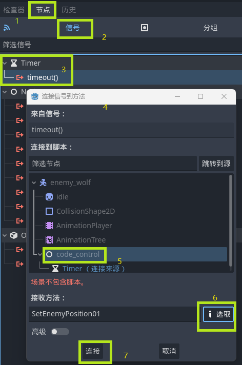

# Godot使用说明

## 概述

- 版本：4.21
- 基于C++
- GDExtension不支持Godot4以下的版本

## 开发环境配置

### 一、win-SCons配置

#### Ⅰ、环境配置

1. 下载Godot可执行文件

    注意：Godot可执行文件版本要与godot-cpp版本相同

2. 下载Godot-cpp源文件：[godot-cpp](https://github.com/godotengine/godot-cpp) 

    **《是Godot-CPP项目，不是Godot的源码》**

    注意：godot-cpp版本要与Godot可执行文件版本相同

3. 下载安装python（不建议使用微软商店安装）

    设置环境变量

4. 使用python安装SCons 

    > SCons是由python编写的自动化构建工具

    安装命令：`pip install SCons`  

    测试命令：`scons -v` 

5. 下载安装MSYS2

    下载路径：[Releases · niXman/mingw-builds-binaries (github.com)](https://github.com/niXman/mingw-builds-binaries/releases) 

6. 运行`MSYS2 MSYS` 

    更新：`pacman -Syu`

    安装GCC和make：`pacman -S --needed base-devel mingw-w64-x86_64-toolchain` 

    设置环境变量，GCC位置：`msys64\mingw64\bin` 

    验证命令：`gcc -v` 

#### Ⅱ、新建项目目录

```shell
# 项目根目录
 ├─ demo `Godot项目目录`
 │  └─bin `dll文件目录` 
 │     └─example.gdextension #扩展启动文件
 |
 ├─Godot-cpp `Godot源码目录`
 ├─src `C++代码目录` 
 │  ├─register_types.cpp # 注册文件
 │  ├─register_types.h   # 注册文件
 │  ├─test.cpp # 开发代码
 │  └─test.h   # 开发代码
 └─SConstruct  # SCons构建脚本
```

#### Ⅲ、编写SCons

参考SConstruct注释：`whiteZe\F_游戏开发\A_Godot\Godot项目目录样例\SConstruct`

#### Ⅳ、编写C++代码

1. 编写C++代码：

   参考：`whiteZe\F_游戏开发\A_Godot\Godot项目目录样例\src\t_example.cpp`

2. 注册C++代码：

   参考：`whiteZe\F_游戏开发\A_Godot\Godot项目目录样例\src\register_types.h`

   参考：`whiteZe\F_游戏开发\A_Godot\Godot项目目录样例\src\register_types.cpp`

#### Ⅴ、生成动态链接库（.dll）

1. 切换到目录：SConstruct文件所在目录
2. 运行命令：`SCons -j6 -Q platform=windows`  

``` shell
# 推荐
# 多线程编译-6是6核应与CPU核心相同
SCons -j12 platform=windows  

# 默认去寻找VS的编译环境，找不到会寻找MinGW的编译环境
scons platform=windows  

#-- 用不到的命令
# 强制使用mingw编译
scons platform=windows use_mingw=yes 
# 软件是64位还是32位置，bits=64 或者 bits=32
scons platform=windows bits=32 
```

#### Ⅴ、修改.gdextension

1. 复制生成的.dll文件到example.gdextension文件指定的位置

   若SConstruct中已经设置好路径，则不用复制

2. example.gdextension

   example名字可以修改

   .gdextension不可修改

3. 可参考文件：
   - `godot-cpp/test/example.gdextension` 
   - `godot-cpp/test/project/example.gdextension` 

``` shell
[configuration]
# entry_symbol就是register_types.cpp中example_library_init函数名
entry_symbol = "example_library_init"
# Godot4.1版本以上必须有的参数
compatibility_minimum = "4.1"

[libraries]
# 步骤5生成的lib路径
windows.debug.x86_64 = "res://libgodot.debug.x86_64.lib"
```

### 二、win-cmake配置

#### Ⅰ、环境配置
1. 下载Godot可执行文件

   注意：Godot可执行文件版本要与godot-cpp版本相同

2. 下载Godot-cpp源文件：[godot-cpp](https://github.com/godotengine/godot-cpp) 

   注意：godot-cpp版本要与Godot可执行文件版本相同

3. 下载Visual Studio，安装

   因为Visual Studio自带编译环境，简单容易

#### Ⅱ、新建项目目录

```shell
# 项目根目录
 ├─ demo `Godot项目目录`
 │   └─bin `dll文件目录` 
 │     └─example.gdextension #扩展启动文件
 |
 ├─ Godot-cpp `Godot源码目录`
 ├─ src `C++代码目录` 
 |   ├─ CMakeLists.txt  # CMake构建文件001
 |	 ├─ src
 |	 |	├─ register_types.cpp # 注册文件
 |	 |	├─ test.cpp # 开发代码
 |	 └─ include
 │   	├─ register_types.h   # 注册文件
 │   	└─ test.h   # 开发代码
 └─ CMakeLists.txt  # CMake构建文件
```

#### Ⅲ、生成VS解决方案

1. 

#### cmake文件001

``` cmake
project(gdextension)

# Automatically pick up files added to src
file(GLOB_RECURSE SOURCES CONFIGURE_DEPENDS
        "${CMAKE_CURRENT_SOURCE_DIR}/src/*.h"
        "${CMAKE_CURRENT_SOURCE_DIR}/src/*.hpp"
        "${CMAKE_CURRENT_SOURCE_DIR}/src/*.cpp")

# Add a dynamic library called gameplay - this builds gameplay.dll
add_library(${PROJECT_NAME} SHARED ${SOURCES})

target_include_directories(${PROJECT_NAME} PRIVATE "${CMAKE_CURRENT_SOURCE_DIR}/src")
target_link_libraries(${PROJECT_NAME} PUBLIC godot::cpp)

source_group(TREE "${CMAKE_CURRENT_SOURCE_DIR}/src" PREFIX src FILES ${SOURCES})
```

#### Ⅳ、cmake文件002

``` cmake
cmake_minimum_required(VERSION 3.19)
project(gdextension-tree)

set(CMAKE_CXX_STANDARD 17)
set(CMAKE_CXX_STANDARD_REQUIRED ON)
set(CMAKE_POSITION_INDEPENDENT_CODE ON)

include(FetchContent)

FetchContent_Declare(
        GDExtension
        GIT_REPOSITORY https://github.com/godotengine/godot-cpp.git
        GIT_TAG godot-4.0-stable
)

FetchContent_MakeAvailable(GDExtension)

add_subdirectory(gdextension)
```


### 三、extension配置

1. `.gdextension`与`.dll`文件是一一对应关系
2. c++语言的注册文件中，函数名应是在项目中独一无二的

### 四、编辑器配置

#### Ⅰ、vscode-scons

1. 安装vscode的C/C++扩展

2. 安装LLDB扩展（CodeLLDB）

3. 安装GCC编译器（配置编译器路径，若是没有提示）

   下载路径：[Releases · niXman/mingw-builds-binaries (github.com)](https://github.com/niXman/mingw-builds-binaries/releases) 

   验证命令：`gcc --version` 

4. 创建task.json文件

   $Ctrl + Shift + P\to输入:configure Task\to 选择:task.json\to 选择:other$​ 

   ``` json
   {
       "version": "2.0.0",
       "tasks": [
           {
               "label": "build", // launch.json中配置对应
               "type": "shell", // 在shell中启动
               "command": "scons", //执行命令
               "args": [ // 命令参数
                   "-j12",
                   "target=template_debug", //debug设置
                   "debug_symbols=yes"//debug设置
               ]
           }
       ]
   }
   ```

5. 运行$Debug\to LLDB$ 创建launch.json

   ``` json
   {
       "version": "0.2.0",
       "configurations": [
           {
               "name": "Debug", // debug中显示的名称
               "type": "lldb",
               "preLaunchTask":"build",// 执行上一步的操作task.json
               "request": "launch",
               // Godot可执行文件的位置，C:\\User\\Godot.exe
               "program": "${workspaceFolder}/<executable file>",
               // 要编译的项目目录
               "args": ["--editor","--path","C:\\user\\demo"],
               "cwd": "${workspaceFolder}"
            }
       ]
   }
   ```

6. 设置Godot主场景

7. 下断点，调试项目

#### Ⅱ、VisualStudio-scons

1. 使用vs打开项目（自动创建.vs目录）
2. 进入.vs目录，创建文件`launch.vs.json` 

``` json
{
    "version": "0.2.1",
    "defaults": {},
    "configurations": [
        {
            "type": "default",
            "name": "Godot Debug", //debug名称
            "project": "Godot可执行文件位置.exe",
            "args":["--path", "Godot项目目录"]
        }
    ]
}
```


## 常见错误 

> 各种空指针错误

- `TIdleState * m_state_idle = NULL;` 指针初始化一定要指向空，防止一些不可名状的错误

> AttributeError: 'NoneType' object has no attribute 'Append':
>   File "D:\A_CodeItems\A_immortal_hero_world\SConstruct", line 8:
>     env.Append(CPPPATH=["src/include/"])

- 有可能是godot-cpp版本问题，建议换个源码版本

> register_types.windows.template_debug.x86_64.obj : error LNK2019: 无法解析的外部符号 "private: \_\_cdecl Test::Test(void)" (??0Test@@AEAA@XZ)，函数 "private: static void * \_\_cdecl godot::ClassDB::_create_instance_func<class Test>(void *)" (??$_create_instance_func@VTest@@@ClassDB@godot@@CAPEAXPEAX@Z) 中引用了该符号
> demo\bin\libcpp.dll : fatal error LNK1120: 1 个无法解析的外部命令
> scons: *** [demo\bin\libcpp.dll] Error 1120

- 必须.cpp中文件必须实现

> core/extension/gdextension.cpp:629 - No GDExtension library found for current OS and architecture (windows.x86_64) in configuration file: res://bin/a.gdextension
> Failed loading resource: res://bin/a.gdextension. Make sure resources have been imported by opening the project in the editor at least once.

- 若确定.lib文件存在，则可能是编译环境错误，Godot的提示并不准确
- 验证GCC，gcc -v

> 父类：father.h；子类:child.h；

1. 在father.h文件中声明`class child;`
2. 在father.cpp中引入头文件：`#include "child.h"` 

> 成功编译，但编译后子类不存在节点中

- `register.cpp`中要保证，父类在子类前面进行注册

> error LNK2001: 无法解析的外部符号 "public: virtual void __cdecl TFSC::initiazlie(void)" (?initiazlie@TFSC@@UEAAXXZ)

- 若是在使用多态的时候出现错误，父类虚函数没有默认方法

> error C2039: "speak": 不是 "TMOVESTATE" 的成员

- 子类不能写virtual关键字

> 节点未找到

- 由于Godot的节点加载顺序

> error C2065: “TFSCINTERFACE”: 未声明的标识符
>
> error C2027: 使用了未定义类型“TMOVESTATE”

- 检测头文件的引用顺序

## 游戏框架设计

- Godot命名规范：

  文件名，目录名使用蛇形命名法（例如：start_state）

  类名使用大驼峰命名法

### 一、项目目录说明

``` shell
# 项目目录
├─assets # 存放外部原始资源，图像、声音、字体等等
|   ├─textures # 图像，纹理
|   └─fonts    # 文件字体
├─entites # 实体（.tscn)，游戏场景中所有可见对象
|   ├─characters 
|   |   ├─enemies
|   |   └─player # ts
|   └─pickable_object # 可拾取对象
|       ├─equipments
|       └─items
├─components # 组件，与不同的对象配合使用，实现不同行为
|   ├─AI_component # AI组件
│   └─move_component # 移动组件
├─managers # 抽象功能集合
|   ├─fsm # 有限状态机
|   ├─input_handler # 输入处理器，
|   ├─map_manager # 地图管理器，自动生成地图等
│   └─assets
├─scenes # 游戏场景（.tscn)
|   ├─One.tscn # 游戏场景一
|   └─twe.tscn # 游戏场景二
|
├─UI # 游戏UI相关
|	├─InventoryWindow.tscn # 背包窗口
|   ├─BattleScene.tscn # 战斗场景
|   └─AttributePanel.tscn # 属性面板  
|
└─resources # 所有继承godot resource的资源
    ├─character_date # 角色属性
    |	├─enemy_date # 敌人数据
    |   |	├─enemydate.c++ #
    |	├─player_date # 用户数据
    |	└─character_date.c++ # 父类节点数据
    ├─map_date # 地图数据
    ├─tile_set # 瓦片集目录
    └─characters # 角色数据
```

### 二、场景结构说明

1. 正常游戏节点

   ``` shell
   main # 主循环
   ├─ System # 系统节点
   ├─ Player # 玩家节点
   ├─ Enemy # 敌人节点
   ├─ Window # 一些常用窗口
   |	├─InventoryWindow # 装备界面
   |	└─BattleWindow # 战斗界面 
   └─ World # 世界节点 
   ```

2. System节点

   ``` shell
   System
   ├─Fsm # 状态机
   |  ├─StartState # 开始状态
   |  ├─MoveState # 移动状态 
   |  ├─ItemState # 动作状态
   |  └─CombatState # 战斗状态
   |
   ├─TSceneManager # 场景管理器，用于切换场景，加载玩家，加载敌人等等
   └─TCommonMethod # 公用方法节点
   ```

   

### 像素游戏配置

1. 画面放大3倍

    - 设置窗口

      视口高度：1152/3=384

      视口宽度：648/3=216

    - 打开高级模式

      窗口宽度覆盖：1152

      窗口高度覆盖：648

2. 拉伸模式：canvas_items

3. 画面模糊

   $项目\to 通用(General)\to Rendering\to Default Texture Filter:Nearest$ 

## 生命周期

1. 生命周期方法，初始化顺序是从上到下

2. C++的方法与GD脚本的方法函数名相同
3. 生命周期方法需要写在public下

#### Ⅰ、enterTree

1. 节点添加到节点树时调用，每一个节点加入树都会调用

#### Ⅱ、ready

1. `_ready`方法，优先初始化子类，再初始化父类（子类顺序是由上到下初始化）

#### Ⅲ、process

1. _process每一帧都运行；delta = 1/帧数
2. 移动距离$\times$delta可以使移动距离与帧率无关；1$\times$delta可以简单理解为每秒移动1像素

#### Ⅳ、physic_process

1. 物理计算一次调用，一般调用物理引擎时使用

#### Ⅴ、exitTree

1. 节点销毁调用

#### Ⅵ、input

1. 有安静输入时调用

``` c++
/* 只要键盘或鼠标按动，就触发当前方法 */
void _input(const Ref<InputEvent> &event);//输入按键调用

void T::_input(const Ref<InputEvent> &event){
    //UtilityFunctions::print("_input");
	// 判断p是否按下
    if(event->is_action_pressed("p")){
        UtilityFunctions::print("stop");
    }  
    //C++示例方法，转换inputevent
    const InputEventKey *key_event = Object::cast_to<const InputEventKey>(*event);
    
}

/* _unhandled_key_input */
void T::_unhandled_key_input(const Ref<InputEvent> &event){}
```


## 基本的数据类型

- 不用引用文件，直接使用即可

- 优先使用GODOT容器，其他情况优先使用C++容器

  将容器字段序列化，导出到引擎编辑器窗口 时

  需要将容器作为参数或其他方式提供给GODOT API

### 一、Variant

- Godot的万能类型，可以转换为Godot的任意类型
- Variant可以直接转换为其他类型，只有节点使用cast_to方法

``` c++
// 准备一个Variant类型变量
Variant temp = tg.pop_back();

/* 转换样例，cast_to方法 */
// 转换类型到Node *，
// cast_to<目标类型>(待转换的变量);
Node *t = cast_to<Node>(temp);
```

### 二、Dictionary 

``` c++
Dictionary a{
    "xx":12,
}

Dictionary datetime;
datetime[YEAR_KEY] = 2014;
datetime[MONTH_KEY] = 2;

Dictionary<int, string> aa;
```

### 三、数组

#### Ⅰ、Array

- 普通数组

``` c++
Array args;
args.push_back(p_arg1);
// 升序排列
args.sort();
// 获取数组大小
args.size();
// 从后弹出元素
args.pop_back();
// 从前面弹出元素
args.pop_front();
```

#### Ⅱ、List

- 双链表

``` c++
// Convert arguments to Godot's command-line.
List<String> args;
args.push_back();
```

#### Ⅲ、Vector

- 可变数组

``` c++
Vector<uint8_t> buffer;
buffer.resize(stereo ? wav_count * 2 : wav_count);
Vector<String> drivers;
		drivers.push_back("dummy");
```

### 四、MAP

``` c++
/* Equal to: RBMap<String, Vector<Vector<Variant>>> */
HashMap<String, Array> _signals;

BitMap
```

### 五、JSON

1. Godot内置呢JSON解析方法，不用使用jsoncpp
2. 头文件：`#include <godot_cpp/classes/json.hpp>`

``` c++
/**
 * ModeFlags 
 * FileAccess::READ = 1
 * FileAccess::WRITE = 2
 * FileAccess::READ_WRITE = 3
 * FileAccess::WRITE_READ = 7
**/
FileAccess *f = new FileAccess();
String a = f->open("res://workdiloge/work.json", FileAccess::READ)->get_as_text();

/* json这是字符串类型，可以转换为字符串 */ 
Variant json_s = JSON::parse_string(a);

/* 解析json */
JSON *json_o = new JSON();
// 解析json文本，
json_o->parse(a);
/* 获取json数据 */ 
// 这里temp可以使用array类型
// json的数据类型：
// 		[ {"name":"mali","text":"今天夜色真美"} ]
Array temp = json_o->get_data();
// 这里可以将{}文本转换为指点类型
Dictionary c = b[0];
// 调用字典方法，NULL是默认数据
c.get("name", NULL));
   
```

## GDScript

## 2D游戏类

### 一、Node

1. Node节点是大部分节点的父节点，所以Node的方法一般可用直接使用
2. 节点操作都应在_ready之后的生命周期使用


#### Ⅰ、获取向量

``` c++
/* 设置位置坐标 */ 
// 获取当前位置，相对与父节点
// Node中的方法
Vector2 p = get_position();
/* 获取当前向量速度 */ 
vector2 a = get_velocity();

// 全局节点
Vector2 p = get_global_position();
```

#### Ⅱ、Get_node

1. 使用 `%` 标注场景内唯一节点，可以获取场景内任意位置的 `%` 标注的节点

   `get_node<Node>("%sprite"); // 必须携带%标注全局查找` 

2. `get_node()`中必须是`“”`，若是`‘’`，则会发生未知错误

3. 函数方法：get_node<节点类型>(" 路径"); 

``` c++
/* 获取子节点 */
// 只能获取子节点,不能得到父节点
get_node<Node>("xx");
// 通过相对路径，可以获取子节点的子节点
get_node<Node>("xxx/vvv"); 

/* 获取父节点 */ 
get_node<Node>("..");
get_parent();

// find_child会对节点进行遍历，太多节点会影响速度
Node *c0 = find_child("Test");

/*得到当前所有子节点*/ 
Array b = get_children();
UtilityFunctions::print(b[0].get_type());

/* 获取节点 */
// 获取所有节点数量
get_child_count();
get_child("节点序号");

/* 删除节点 */
c0->queue_free();
```

#### Ⅲ、节点其他操作

``` c++
is_inside_tree(); // 验证节点是否在树中

```

### 二、Sprited2D

- 主要用于图片显示

``` c++
// 获取要修改的节点
Sprite2D *root11 = get_node<Sprite2D>
    ("/root/Node2D/Test");
// 设置新纹理
root11->set_texture(i3);
// 设置中心点
root11->set_centered(false);
// 平移
Vector2 p = Vector2(100, 100);
root11->set_offset(p);
```

### 三、动画类

#### Ⅰ、AnimatedSprite2D

- 用于动画播放，简单物品动画
- 在Godot添加自定义动画类，设置动画效果

``` c++
// 获取节点，注意是Animatedsprite2d类型
AnimatedSprite2D *a_s = get_node<AnimatedSprite2D>("/root/Node2D/A_node2d");
// 调用播放动画方法，a是Godot已经设置好的动画
a_s->play("a");
a_s->pause();//暂停
a_s->stop();//停止
a_s->is_playing();//状态
```

#### Ⅱ、AnimationPlay

- Godot所有元素都可以使用它来生成动画，包括场景中来回移动的物体，怪物等

#### Ⅲ、AnimationTree

- 头文件

    `#include <godot_cpp/classes/animation_tree.hpp>` 

    `#include <godot_cpp/classes/animation_node_state_machine_playback.hpp>` 

- AnimationRootNode：动画树节点的基本资源。通常，它不会直接使用，

- AnimationNodeBlendTree:：包含多个混合类型节点，

- AnimationNodeBlenderSpace1D: 1D空间混合

- AnimationNodeBlenderSpace2d: 在2D空间中旋转根节点

- AnimationNodeStateMachine：动画节点状态机

- AnimationNodeAnimation: 从列表中选择一个动画播放，这是最简单的根节点类型，通常不直接作为Tree Root根节点使用。

- 注意：AnimationPlay不能设置自动播放，但要设置循环

- 注意：状态机（连接线）要设置enable，如果设置auto会出现意外情况，使用travel控制播放动画

``` c++
/* 获取节点 */
// 获取动画节点
AnimationPlayer *m_animatePL = get_node<AnimationPlayer>("AnimationPlayer");
// 获取动画树节点
AnimationTree m_animateTr = get_node<AnimationTree>("../../AnimationTree");

/* 获取AnimationNodeStateMachineplayback属性 */
// 这个属性地址，可以在Godot界面查找
Variant b = m_animateTr->get("parameters/playback");
// 转为AnimationNodeStateMachineplayback
m_animationState = cast_to<AnimationNodeStateMachinePlayback>(b);

/* 启动动画树 */
// 字符串可在godot界面查找
// aoix是Input向量
m_animateTr->set("parameters/idle/blend_position", aoix);
m_animateTr->set("parameters/run/blend_position", aoix);
// 设置播放动画
m_animationState->travel("run");
```


### 四、AudioStreamPlayer

- 音频流播放器
- AudioStreamPlayer2D具有距离属性的音效

``` c++
#include <godot_cpp/classes/audio_stream_player.hpp>
/* 代码加载 */
// 加载音频资源
ResourceLoader *R = new ResourceLoader();
Ref<AudioStream> bg = R->load("res://02.mp3","AudioStream");
// 音频类
AudioStreamPlayer *a = new AudioStreamPlayer();
// 加载音频
a->set_stream(k_01);
// 播放音乐，每次从头开始播放
a->play();
// 继续播放
a->set_stream_paused(false);
// 暂停播放
a->set_stream_paused(true);
```

### 五、Vector2

- 头文件：不需要引用

- 向量A - 向量B = B指向A的向量

    > To find a vector pointing from A to B, use B - A.


``` c++
/* 创建一个向量 */
// Vector(x轴，y轴)
Vector2 a = Vector(100, 100);
// 设置x，y向量
a.x = 50;
a.y = 50;

/* a向量是否为0向量 */ 
a.is_zero_approx();
/* 向量单位化 */ 
// 得到一个向量的方向
a.normalized();

/* 设置a走向B的向量 */ 
// B：向量（方向和大小），
// C：每帧的增量
a.move_toward(B, C);

/* 在一个范围内 */ 
Vector2 direction = m_startPosition - position;
if(direction.length() > 200){}
// 返回从该向量指向 to 的归一化向量。相当于使用 (b - a).normalized()。
direction_to(to: Vector2) const
// 返回该向量与 to 之间的距离。
distance_to(to: Vector2);
```

### 六、CharacterBody2D

``` c++
// 设置当前向量
set_velocity(a);
// move_and_collide不能沿着墙滑动
// 根据set_velocity设定，自动进行碰撞体积
move_and_slide();// 可以沿着墙滑动
```

### 七、Random

- 头文件：`#include <godot_cpp/classes/random_number_generator.hpp>` 
- 文件utility_functions同样包含随机方法的静态方法

``` c++
/* Utility_functions */

// 随机方向
RandomNumberGenerator *r = new RandomNumberGenerator();
// 随机取得-1，0，1
float x = r->randf_range(-1, 1);
float y = r->randf_range(-1, 1);
```


### 八、Area2D

1. 能够检测其他节点的进入和退出，不与其他节点封装
2. worldBoundaryShape2D：可以在一个方向上无线延长的节点
3. 层（Collision/Layer）：隶属层级（显示图像、遮盖等效果）
4. 遮罩（Collision/Mask）：碰撞层级（物理碰撞）

``` c++
 // Array[Area2D] get_overlapping_areas()
 // Array[Node2D] get_overlapping_bodies()
```

攻击框

- 都是继承的Area2D节点，Hurtbox,
- 需要定义图层

### 九、utility_functions

- 包含很多常用方法
- 头文件：`#include <godot_cpp/variant/utility_functions.hpp>`

``` c++
// 打印方法
UtilityFunctions::print("hello world");
UtilityFunctions::print("hello world");
// double
UtilityFunctions::randf();
// int64_t
UtilityFunctions::randi_range(int64_t from, int64_t to);
// double
UtilityFunctions::randf_range(double from, double to);
// double
UtilityFunctions::randfn(double mean, double deviation);
// Variant
UtilityFunctions::type_convert(const Variant &variant, int64_t type);
```


### 十、SceneTree

1. 头节点：`#include <godot_cpp/classes/scene_tree.hpp>` 

``` c++
// 获取场景树
SceneTree *tree = Node::get_tree();

// get_current_scene():获取当前场景的根节点
Node *root = tree->get_current_scene();
// 获取
SceneTree::get_singleton()->initialize();
```

#### Ⅰ、场景切换

- 只能用于游戏场景切换，因为他会释放所有节点，再新建节点，
- 场景切换要进程场景初始化操作，加载
- 头文件：scene_tree()

``` c
// 获取场景树
SceneTree *t = Node::get_tree();
// 切换场景，使用路径
t->change_scene_to_file("res://game2.tscn");
// 使用pack，节点对象
t->change_scene_to_packed(Node);
// 切换场景方法
t->call_deferred("change_scene_to_file", "res://bat2.tscn");
```

#### Ⅱ、分组

``` c++
SceneTree * t = get_tree();
t->add_to_group("组名"); // 添加进分组
t->call_group("组名", "方法名"); // 调用组名中方法
t->remove_from_group(); //山粗分组

/* 获取一个分组，获取分组中的节点 */
Array a = t->get_node_in_group("组名"); // 返回一个分配给给定组的所有节点的列表
Node * ab = cast_to<Node>(a[0]); // 转换节点，调用a[0]
```

#### Ⅲ、分组操作

``` c++
/* 调用分组中公共方法 */
// 获取场景树
SceneTree *t = get_tree();
// 调用分组empy的脚本中ttt1方法
t->call_group("empy", "ttt1");

/* 动态添加分组 */
/* 使用get_node获取指定节点 */
Sprite2D *root1 = get_node<Sprite2D>
    ("/root/Node2D/Test/Sprite2D");
root1->add_to_group("empy");
```

### 十一、Object

1. 所以类的基类，这意味Object中的方法可以直接调用

#### Ⅰ、connect

1. 连接默认是连接当前类的当前方法
2. 要连接其他类，需要使用其他节点
3. `connect("信号名称", Callable(类, "触发方法"));`

``` c
/* 默认连接当前类 */ 
// game_stop：信号或自定义信号
// Callable(this, "game_stop_met")：调用方法
connect("game_stop", Callable(this, "game_stop_met"));

/* 在类中连接其他类中的其他方法 */
get_node<Area2D>("Area2D") // 获取节点
    ->connect("area_entered", Callable(ba_s, "change_state_parameter"));
```

### 十二、Path2D

- 使用PATH2d在地图上画出路径
- 创建Pathfollow2d节点，pathfollow2d节点会根据path2d设置的路径行走

``` c
PathFollow2D *p = get_node<PathFollow2D>("/root/Node2D/Path2D/PathFollow2D");
// 设置移动距离，单位像素
p->set_progress(500);

// 获取当前移动坐标
Vector2 v = p->get_position();
Sprite2D *s = get_node<Sprite2D>("/root/Node2D/Sprite2D");
// 将坐标设置给精灵
s->set_position(v);
```

### 十三、RayCast2D

- 射线投射节点，用于检测碰撞不可见射线，根据设置的箭头进行碰撞检测

``` c++
is_colliding(); //检测是否发生碰撞
```

### 十四、Input

1. 虚拟映射设置

2. 需要配置虚拟按键，不然会出现错误

3. 菜单栏$\to$ 项目$\to$ 项目设置$\to$ 输入映射$\to$​ 添加键位映射

4. 虚拟按键不支持中文

#### Ⅰ、Input

- 头文件：`#include <godot_cpp/classes/input.hpp>`

``` c++
// 获取Input静态实例
Input *ii = Input::get_singleton(); 

ii->is_action_pressed("d");// 按下d键，触发多次
ii->is_action_just_pressed("d"));// 按下按键，触发1次
ii->is_action_just_released("d"));// 松开D键
ii->is_anything_pressed();// 任意键按下

/* 获取按下s的力量 */
float s = ii->get_action_strength("s");

/* 获取x，y轴 */
// 左-1，右1
float h = ii->get_axis("左", "右");

/* 获取向量 */
// 位置一定对应，不然方向会出错
Vector2 dir = ii->get_Vector("左","右","上","下");
dir.x !=0; // x轴
dir.y !=0; // y轴
```

#### Ⅱ、InputMap

- 头文件：`#include <godot_cpp/classes/input_map.hpp>`
- 可以解决 this inputmap 不存在bug

``` c++
// 从Godot中的设置加载设置
InputMap* map = InputMap::get_singleton();  
map->load_from_project_settings();
```

### 十五、ResourceLoader

#### Ⅰ、游戏资源加载

1. 头文件：`#include <godot_cpp/classes/resource_loader.hpp>` 

2. 类型头文件：

   场景资源：`#include <godot_cpp/classes/packed_scene.hpp>`

3. 类型：

   PackedScene：场景资源（.tscn）
   Texture2D：图片纹理，图片资源

``` c++
/* 方法一
preload(); // 预加载
load("路径","类型"); // 加载
*/ 
ResourceLoader *R = new ResourceLoader();
Ref<PackedScene> scene = R->load("res://game2.tscn","PackedScene");
// 判断节点是否加载成功
scene.is_valid()
// 把资源初始化，然后就可以调用了
Node *b = scene->instantiate();
// 将b节点，添加到主场景即可显示
Node *a = get_node<Node>("%node");
a->add_child(b);
```

#### Ⅱ、文本资源加载

1. 头文件：`#include <godot_cpp/classes/file_access.hpp>`

``` c++
FileAccess *f = new FileAccess();
String a = f->open("res://workdiloge/work.json", FileAccess::READ)->get_as_text();
```

#### Ⅲ、游戏资源

- 头文件：`#include <godot_cpp/classes/Resource>` 
- 通过创建新资源，继承自定义资源类，进行资源文件tres文件

``` c++
class TResource: public Resource {
public:
    // 注意类型
    String description;
    Texture prop_texture:
}
```

### 十六、Engine

- 头文件：`#include <godot_cpp/classes/engine.hpp>` 

#### Ⅰ、设置进程模式

- 建议使用GDScript进行update调用
- 注意：不能在CharacterBody2D节点中使用，有些版本会有BUG，编译完成后，需要重新添加节点才有效果

``` c++
#include <godot_cpp/classes/engine.hpp>
Test::Test(){
    if(Engine::get_singleton()->is_editor_hint()) {
        // 在编辑器中，禁用_process函数
        set_process_mode(
            Node::ProcessMode::PROCESS_MODE_DISABLED);

        UtilityFunctions::print("set ok");
    }
}

```

#### Ⅱ、获取重力速度

``` c++
#include <godot_cpp/classes/project_settings.hpp>
// 获取重力加速度
Variant g = ProjectSettings::get_singleton()->get_setting("physics/2d/default_gravity");
// 保持重力速度
this->m_gravity = (float)g;
```

#### Ⅲ、减速状态

``` c++
#include <godot_cpp/classes/engine.hpp>
# 获取Engine实例，Engine::get_singleton()  
// Engine::get_singleton()->set_time_scale(0.5);
Engine *e = Engine::get_singleton();
e->set_time_scale(3);
```

#### Ⅳ、暂停游戏

``` c++
set_physics_process(false);
get_tree()->paused = true;
// 设置节点属性，Node->pause->mode-> process 设置当前节点和主场景节点不是继承关系
```

#### Ⅴ、注册实例

``` c++
Engine::get_singleton()
    ->add_singleton(Engine::Singleton("YTween", YTween::get_singleton()));
```

#### Ⅶ、程序暂停

``` c++
set_process(FAILED); // 暂停

```

### TileMap

- 5生成地牢-25分
- 设置战争迷雾

``` c++
set_cells_terrain_connect
```

### AStarGrid2D

- AI算法，9期移动AI-05分 

### FileAccess

``` c++
savefileforread = FileAccess.Open(path, write); // 打开
savefileforread.dispose(); //关闭句柄
```

## 软件开发控件

### 一、画布类

1. canvasLayer：新的画布，其属性独立于其他节点
2. NinePatchRect：背景图层，显示图片纹理
3. ColorRect：颜色控件
4. panelcontainer：为图像提供背景

#### Ⅰ、canvasLayer

- 头节点：`#include <godot_cpp/classes/canvas_layer.hpp>`
- 可以用于进程场景切换

``` c++
// 获取
CanvasLayer * cl = get_node<CanvasLayer>("%InventoryWindow");
cl->set_visible(TRUE); // 设置是否可见
cl->is_visible(); // 当前是否打开
cl->hide();  // 隐藏
cl->show(); // 显示
```

### 二、容器类

1. MarginContainer：边框容器，可以选居中，向左靠齐，向右靠齐，边框大小等等
   - HboxContainer：横向排列的容器，用于制作角色血条等
   - VBoxContainer：纵向排列容器
2. ViewportContainer：小窗口容器

### 三、功能类

1. Progressbar：进度条，软件常用
2. TextureProgressbar：进度条，游戏常用，可设置背景
3. Button：按钮
4. Label：标签

## 常用功能实现

### 一、_bind_methods方法

#### Ⅰ、自定义信号

1. 发射信号
2. Variant::STRING类型可参考Variant
3. 这能在Godot面板中的信号设置信号发出

不带参数的信号：

``` c++
void Test::_bind_methods(){
    // 普通信号，信号名称为：hello_signal
    ADD_SIGNAL(MethodInfo("hello_signal"));
}
void Test::xxx(String world){
    // 发射信号，hello_singal
    emit_signal("信号名称");
}
```

带参数的信号：

``` c++
void Test::_bind_methods(){
    // 携带参数的信号
    ADD_SIGNAL(MethodInfo(
        "hello_signal",//信号名称
        PropertyInfo(Variant::STRING, "data")
    ));//信号参数
}
void Test::xxx(String world){
    // 发射信号，hello_singal
    emit_signal("信号名称", "参数1");
}
```

#### Ⅱ、信号的接收方法

1. 代码方法参考：Ⅳ、方法绑定
3. 操作方法：连接信号方法$\to$ 连接到脚本（选中自定义类）$\to$​ 接受方法旁的“选取”




#### Ⅲ、自定义节点属性

- 注意：`ClassDB::bind_method `方法一定要在 `ClassDB::add_property` 之前
- 需要重新打开Godot，才能显示属性
- 中文会乱码

基本用法：

``` c++
void Test::_bind_methods(){
    /* 2.将Godot界面属性与C++方法绑定 */
    // 要先定义绑定方法
    ClassDB::bind_method(D_METHOD("set_radius", "a"), &Test::set_radius);
    ClassDB::bind_method(D_METHOD("get_radius"), &Test::get_radius);
    
    /* 1.添加界面接口
    ClassDB::add_property("类名",
    	PropertyInfo(参数类型, "参数名称"),
        "参数设置方法", 
        "获取参数数值");
    */
    ClassDB::add_property("Test",
    	PropertyInfo(Variant::FLOAT, "xxxx"),
        "set_radius",
        "get_radius");
}

/* 3.设置get_radius、set_radius方法 */
double Test::get_radius(){
    return radius;
}
void Test::set_radius(double r){
    this->radius = r;
}
```

给属性添加分组

``` c++
/* 
ADD_GROUP("分组名称","分组标识");
ADD_SUBGROUP("分组名称", "分组标识");
*/
// 设置分组表示，
ADD_GROUP("Group01","first_");
// 设置分组标识，二级分组
ADD_SUBGROUP("Group02", "first_second_");

/* 添加属性到分组中 */
ClassDB::add_property("Test",
    // 添加分组标识
    PropertyInfo(Variant::FLOAT, "first_second_xxxxx"),
    "set_radius",
    "get_radius");
```

#### Ⅳ、方法绑定

- 使用方法绑定，可以让GDScript调用C++函数

- 同时也可以变成信号接收方法，若没有相关信号，需要重启Godot

- 方法可以放到 private 中，若Godot不能识别C++方法，应检查参数类型是不是`Variant`，参数不对应也不会显示C++方法

- 调用方法：

  ``` python
  # 使用 New 方法
  # 此方法会开创一个新节点，此节点不在节点树中
  # 不用引入节点，需要new对象使用
  var a = Test.new();
  a.start_test();
  
  # 使用 @onready 方法 《推荐》
  # 拖拽节点，形成对节点的引用
  # @onready会等节点树加载完毕，防止出现不在节点树错误
  @onready var tfsc = $TFSC
  ```

不带参数的接收方法

``` c++
void Test::_bind_methods(){
    /* ClassDB::bind_methond(D_METHOD("函数名"), 方法地址) */
    ClassDB::bind_method(D_METHOD("start_test"), &Test::start_test);
}

// 不带参数的接收函数
void Test::start_test(){}
```

带参数的接收方法

``` c++
void Test::_bind_methods(){
    /***
     * ClassDB::bind_methond(D_METHOD("调用的函数名", "参数1", "参数2"), 方法地址)
     */
    ClassDB::bind_method(D_METHOD("start_test", "a", "b"), &Test::start_test);
}

// 带有参数的接收函数
// 参数类型，一般都使用Variant类型
void Test::start_test(Variant a, Variant b){
   	// 使用cast_to转换为适合类型 
    // cast_to<类型>(要转换的变量);
	Area2D *t = cast_to<Area2D>(a);
}
```

### 二、人物移动

``` c++
/**
 * 角色移动
 */
Vector2 temp_v = m_inputHandler
    ->get_vector("G_LEFT", "G_RIGHT", "G_UP", "G_DOWN").normalized();
temp_v = temp_v.move_toward(temp_v * 1000, external_move_speed * delta) ;

m_player->set_velocity(temp_v);
m_player->move_and_slide();
```

### 三、物品相关

#### Ⅰ、物品创建

1. 基于场景创建，继承关系

   物品：`PickableObject -> Item -> SmallPotion ` 

   装备：`PickableObject -> equipment -> Armour ` 

2. 结构

   ``` shell
   SmallPotion  # 物品名称，小血瓶,Node2D
   ├─Sprite2D # 物品图像
   ├─Area2D # 碰撞体积
   |  └─CollisionShape2D # 形状
   └─CombatManager # 
   ```
   

#### Ⅱ、背包系统

1. 节点构成

   ``` shell
   CanvasLayer
   └─MarginContainer
   	├─ColorRect # 遮盖层，纯黑色等
   	└─HBoxContainer # 水平排列子节点
   		├─Panel2 # 左侧面板
   		|	└─MarginContainer #
   		|		└─ScrollContainer # 滚动窗口
   		|			└─VBoxContainer # 背包物品显示单元
   		└─Panel2 # 右侧面板
   			└─MarginContainer
   				└─Label # 物品信息
   ```

2.  创建UI脚本


#### Ⅲ、物品掉落


#### Ⅳ、物品拾取

#### Ⅴ、物品逻辑

1. 主动使用物品
2. 被动效果

### 四、补间动画

- C++使用没有效果，只进行记录

  ```c++
  #include <godot_cpp/classes/tween.hpp>
  #include <godot_cpp/classes/property_tweener.hpp>
  
  Ref<Tween> tw = Node::create_tween()->set_loops();
  bool b = tw->is_valid();// 验证是否存活
  bool a = tw->is_running();// 验证是否运行
  
  Sprite2D *sp01 = get_node<Sprite2D>("../sp2");
  // 属性补间
  tw->tween_property(cr, NodePath("color:a"), 255.0, 4.0);
  ```

- 使用GD脚本编写

  `.set_delay(x)`：延迟x秒执行补间动画

  `.set_loop()`：设置补间动画循环

  `.from_current(x)`：从x状态执行到目标状态

  `.set_ease()`：设置变化曲线

  `.set_trans()`：带有物理属性

``` python
# 获取节点，4.0以上版本需要使用@字符
@onready var ax = $sp2
# 创建一个补间动画
var tween = create_tween()
# 创建属性补间动画
# ax:欲添加补间动画的对象
# "position"：初始状态
# Vector2(1000, 500)：目标状态
# 5：持续时间
tween.tween_property(ax, "position",Vector2(1000, 500), 5)
tween.interval(1.0); # 循环的补间动画的间隔
```

### 五、场景管理器

- 方法一：使用change_scens_to_file方法，将用户 资源等等传递给下一个场景，将系统场景设置为全局场景，场景切换，只能用于
- 方法二：直接使用add_child方法，将节点添加进当前节点
- 方法三：同一场景中的镜头切换，直接关闭相机，`camera.enabled = false`; 
- 方法四：背包等一些功能图层，直接使用

``` c++
```


### 六、资源创建

### 七、碰撞检测

1. 检测碰撞需要 `Area2D` 节点，被碰物体（敌人）与碰撞物体（玩家）都需要添加 `Area2D` 节点
2. 使用玩家（敌人）的信号 `area_entered` 进行碰撞后代码运行

本例是玩家 `CharacterBody2D` 中的 `Area2D` 发出信号

``` shell
# Player节点构造
Player # CharacterBody2D 类型
├─ CollisionShape2D `碰撞结构`
├─ temp # 其他节点
└─ Area2D `碰撞体检测节点` 
	└─ CollisionShape2D `碰撞结构`
```

多场景使用C++步骤流程

1. 接收信号类（对信号进行处理），暴露信号方法

   ``` c++
   ClassDB::bind_method(
       // change_state_parameter：信号
       // &TBatState::change_state_parameter：信号触发方法
       D_METHOD("change_state_parameter", "a"), &TBatState::change_state_parameter
   );
   ```

2. 连接信号

   ``` c++
   // 任意类，获取到指定 Area2D 节点，进行信号连接
   Player
       ->get_node<Area2D>("Area2D")
       // area_entered：区域进入信号Godot官方信号
       // ba_s：类，战斗节点
       // change_state_parameter：ba_s中的方法
       // 注意：这里链接的是 Area2d 节点中area_entered信号
       ->connect("area_entered", Callable(ba_s, "change_state_parameter"));
   ```

### 鼠标设置

``` c++
#include <godot_cpp/classes/input.hpp>
Test::Test() {
	// 这里可以通过ctrl查看input类
    Input *I = new Input();
    // MOUSE_MODE_HIDDEN：鼠标移入程序隐藏鼠标，同时在编辑器中也会隐藏
    I->set_mouse_mode(Input::MOUSE_MODE_HIDDEN);
};
```

### 十、相机

``` c++
tileMap.get_used_rect(); //
tilemap.tile_set.tile_side; //地图大小
camera.limit_top;//相机顶位置
camera.reset_smoothing(); //取消相机移动动画
camera.force_update_scroll();
```

### 十二、设置Y层

1. 根节点设置Y启用
2. Tilemap设置Y启用
3. Tilemap -> “层”设置Y启用
4. player节点设置Y启用
5. 设置Player层与“层”的z坐标处同一层
6. 修改贴图“选择”-“Y排序原点”
7. 修改player节点下的“Animationbody2D”节点的锚点

### 对话框dialogue

1. 创建一个control节点

2. 创建一个子节点NinePatchRect

3. 创建文本子节点（

    富文本：NinePatchRect/RichTextLabel

    普通文本：NinePatchRect/Lebel

4. 这些方法都是基于，富文本节点，LEbel节点

``` c++
set_text(); // 设置文本，每次都是新的
add_text(); // 添加文本
```


### 实现黑夜透镜效果

1. 添加CanvasLayer节点：相当于图层，

   Layer属性：改成大的，遮盖全部

   Mouse / Filter属性：阻止点击穿透，建议stop

2. 添加子节点ColorRect节点：改变颜色

3. 可以使用 SceneTree.create_tween() 或 Node.create_tween() 创建 Tween（“即用即弃”）

``` c++
/* 创建补间动画 tween类 */

```


### 回合制人员加载

1. 设置Marker2D节点，表贼元素位置

``` c++
// 得到定位节点
m1 = get_node<Marker2D>("m1");
m2 = a->get_node<Marker2D>("m2");
m3 = a->get_node<Marker2D>("p3");
// 加载敌人素材
ResourceLoader *R = new ResourceLoader();
Ref<PackedScene> wolf = R->load("res://units/enemy_wolf.tscn","PackedScene");

// 初始化，元素初始化
Node *b = wolf->instantiate();
Node *c = tree->instantiate();
// marker2d加载敌人素材
m1->add_child(b);
m2->add_child(c);
```

### 调用子类方法

``` c++
#incldue "Player"
_player = get_node<Player>("Player");
_player->set_movement_limit(_scene_size);

```

### 平台跳跃移动

``` c++
int SPEED = 130;
int JUMP_VELOCITY = -400;

#include <godot_cpp/classes/project_settings.hpp>
Variant g = ProjectSettings::get_singleton()->get_setting("physics/2d/default_gravity");

if not  is_on_floor():
	velocity.y += g * delta;

if input.is_action_just_pressed("ui_accept") and is_on_floor():
	velocity.y = JUMP_VELOCITY
```

### 动画播放实现场景移动

1. 创建场景A（任意）
2. 创建子节点AnimationPlayer（A节点的子节点）
3. 创建新动画
4. 在指定位置创建一个关键帧，在目标位置再创建一个关键帧
5. 设置播放模式，可以修改播放方式（实现往返播放）

### 自定义继承

1. 注册（`register_types.cpp`）时顺序很重要，父类一定要先注册
2. 若自定义节点没有出现，可以重启Godot软件

``` c++
// 父类
class TFSC : public Node {
    GDCLASS(TFSC, Node);
}
// 子类
class TMOVESTATE : public TFSC {
    GDCLASS(TMOVESTATE, TFSC);
}
```


