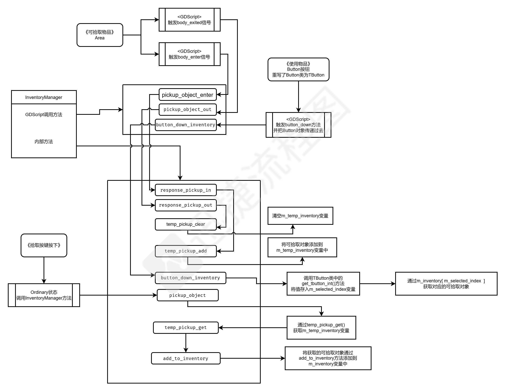

# Godot C++ 开发框架手册

## 目录结构

- Godot命名规范：

  文件名，目录名使用蛇形命名法（例如：start_state）

  类名使用大驼峰命名法

## 常见错误

1. 资源挂载节点，不显示资源位置

   应检查`D_METHOD`的方法与`PropertyInfo`方法是否一致

   应检查`add_property`后的字符是不是当前类名

2. 不显示自定义节点

   应检查节点注册顺序，父类应在子类先注册

### 一、C++项目目录

- 

``` shell
# 项目根目录
 ├─demo `Godot项目目录`
 ├─external # 第三方库
 |	└─godot-cpp
 ├─include `头文件目录` 
 ├─src `C++代码目录` 
 │  ├─component # 组件
 |	├─system # 系统目录
 |	|	├─system_node.cpp # 系统节点
 │  |	├─FSC `状态机目录`
 |	|	|	├─battery_substate `战斗子类`
 |	|	|	└─fsc.cpp #状态机文件
 │  |	└─manager `管理类目录`
 |	|		├─manager_input # 输入管理器
 |	|		├─manager_scene # 场景管理器
 |	|		├─manager_inventory # 背包管理器
 |	|		├─manager_enemy # 敌人管理器
 |	|		└─manager_player # 玩家管理器
 │  ├─pickup_object # 详细查看：可拾取物品目录结构
 |	├─characters_node `实体节点目录` 
 |	|	├─character_node.cpp # 实体父文件
 |	|	├─Players `玩家节点`
 |	|	|	├─player.cpp # 根节点
 |	|	|	├─player_character.cpp # 主角
 |	|	|	├─player_informers.cpp # 线人
 |	|	|	├─player_Antaonizers.cpp # 对抗者
 |	|	|	├─player_subangle.cpp # 副角
 |	|	|	└─player_supporter.cpp # 配角
 |	|	└─Enemys # 敌人节点
 |	|		├─Rat # 老鼠敌人挂载节点
 |	|		└─goblin # 哥布林敌人挂载节点
 |	├─resources `资源类文件夹`
 |	|	├─t_resources.cpp # 资源基类
 |	|	|
 |	|	└─entites_data  `实体数据文件夹`
 |	|		├─enemy_date  `敌人数据目录`
 |	|		|	├─enemy.cpp # 基类
 |	|		|	└─general_data.cpp #
 |	|		├─player_date `玩家数据目录`
 |	|		|	├─player.cpp # 基类
 |	|		|	└─protagonist_data.cpp #
 |	|		└─entites_data.cpp # 基类
 |	└─utils # 工具节点集合 
 |		├─t_button # 自定义Button节点
 |		├─test
 └─SConstruct  # SCons构建脚本
```

### 二、Godot目录说明

``` shell
# Godot项目目录
├─assets # 存放外部原始资源，图像、声音、字体等等
|   ├─textures # 图像，纹理
|   └─fonts    # 文件字体
├─entites # 实体（.tscn)，游戏场景中所有可见对象
|   ├─enemies # 敌人 
|   ├─players # 玩家
|   ├─equipments # 装备
|   ├─skill # 技能
|   └─items # 物品
├─components # 组件，与不同的对象配合使用，实现不同行为
|   ├─AI_component # AI组件
│   └─move_component # 移动组件
├─systems # 系统节点场景集合
├─scripts # 脚本目录
|	├─teleporter # 传送脚本
|	└─System # 系统脚本
├─scenes # 游戏场景（.tscn)
|   ├─One.tscn # 游戏场景一
|   └─twe.tscn # 游戏场景二
├─UI # 游戏UI相关
|	├─login.tscn # 登录界面
|	├─InventoryWindow.tscn # 背包窗口
|   ├─BattleScene.tscn # 战斗场景
|   └─AttributePanel.tscn # 属性面板  
└─resources # 所有继承godot resource的资源
    ├─enemy_date # 敌人数据
    |   ├─enemydate00.tres # 敌人00数据
    |	└─enemydate01.tres # 敌人01数据
    ├─player_date # 用户数据
    |   ├─playerdate00.tres # 玩家00数据
    |	└─playerdate01.tres # 玩家01数据
    └─equipments # 装备数据
```

### 三、状态机结构

回合制RPG

``` shell
TFSM # 无限状态机
  ├─TInitState # 初始化状态
  ├─TOrdinaryState # 一般状态，移动和站立 
  ├─TOpenBackpack # 背包打开，系统打开状态
  ├─TChangeScence # 切换场景状态
  └─TBatState # 战斗状态
      ├─auto_enemy # 敌人战斗状态
      ├─operate_player # 玩家操作状态
      ├─over # 战斗结束状态 
      ├─setup # 战斗初始化状态 
      ├─turn # 战斗切换状态状态
      └─verification # 验证战斗状态 
```

横板过关

``` shell
TFSM # 无限状态机
  ├─TInitState # 初始化状态
  ├─TMoveState # 移动状态 
  ├─TIdleState # 站立状态
  ├─TJumpState # 跳跃状态
  └─TChangeScence # 切换场景状态
```

### 四、管理器节点

- 管理控制器的节点一定都要是全局唯一节点（%）

``` shell
ManagermentController
	├─ TSceneManager `%` # 场景管理器，用于切换场景，加载玩家，加载敌人等等
	├─ InputManager `%` # 输入管理，将输入信号传送出去，
	├─ MapManager `%` # 随机地图生成
	├─ InventoryManager `%` # 物品管理
	├─ PlayerManager `%` # 玩家管理器
	├─ EnemyManager `%` # 敌人管理器
	└─ SignalManager `%` # 信号控制
```

### 五、主场景结构说明

1. [main] ：表示分组节点，用于不同场景中获取节点，分组名为：main
1. PlayerContainer节点为普通的Node节点，其子节点是C++定义的TPlayerNode类

``` shell
main `Node2D` # 主循环
├─TFSC `TFSC` # 系统节点
├─【main】TManagermentController `ManagermentController` # 管理器控制节点
├─【main】PlayerContainer `Node` # 玩家资源节点
|	├─Protagonist `TProtagonist` # 资源节点
|	└─Support `TProtagonist` # 配角数据
├─【main】Windows `Node` # 一些常用窗口
|	├─InventoryWindow `CanvasLayer` # 装备界面
|	└─BattleWindow `CanvasLayer` # 战斗界面 
└─【main】World `Node` # 世界节点，用于动态加载
```

### 五、world场景结构

``` shell
World # 场景
├─ BG # 背景
|	├─Sprite2D # 背景图片
|	└─Sprite2D # 背景图片
├─ PickableObjectContainer # 场景中可拾取物品，PickupObject对象
|	├─Weapon # 可拾取的物品
|	├─Item # 可拾取的药品
|	└─Equipment # 可拾取装备
|
|  # TEnemyContainer节点，保存场景中所有可遇见的敌人场景(.tres)
|  # 保存所有可遇见敌人，方便敌人动态添加
├─ TEnemyContainer:[C++] 
├─ EnemyPosition # 敌人位置marker2d位置
|	├─Marker2D
|	└─Marker2D
├─ Interaction # 交互节点
└─ Teleporter # 传送
	├─Aim # 目标传送位置
	|	└─Marked2D # 传送位置1
	└─Trigger # 传送碰撞区域、触发区域
		└─Area2D # 传送点00，为了方便使用GDScript实现传送
```

### 六、实体结构

#### Ⅰ、Player结构

- 主角团数据统一保存在main$\to$PlayerContainer节点下

``` shell
characterBody2D # 玩家
├─ Graphic[Sprite2D] # 图层
|	├─Body[Sprite2D]
|	├─ChooseIcon[Sprite2D]
|	└─Shadow[Sprite2D]
├─ CollisionShape2D # 碰撞体积
├─ Area2D # 进入区域碰撞体积
|	└─ CollisionShape2D # 碰撞体积
├─ AnimationPlayer 
└─ AnimationTree   
```

#### Ⅱ、enemy结构

``` shell
characterBody2D # 敌人
├─ CollisionShape2D # 碰撞区域
├─ AnimationPlayer # 动画
├─ Graphic
|	├─Body[Sprite2D] # 身体
|	├─ChooseIcon[Sprite2D] # 选中标识
|	└─Shadow[Sprite2D] # 影子
└─ Function  # C++功能节点
    ├─ DataNode[TGeneralEnemy] # 节点名要相同，资源挂载节点-操作资源节点
    ├─ ScriptNode<脚本> # 脚本挂载节点
    └─ Component # 组件节点
        ├─MoveComponent # 移动组件，控制玩家移动
        └─DropComponent # 物品掉落组件
```

#### Ⅲ、技能结构

``` shell
skill
├─ Graphic
|	├─ AnimationPlayer # 动画
|	└─ SkillIcon # 技能图标
├─ AnimatedSprite2D # 动画
├─ TSkillContainer # 技能挂载节点
└─ ScriptNode<脚本> # 脚本挂载节点
```

### 七、战斗场景

``` shell
BattleWindow # 战斗场景canvasLayer
├─ BG # 背景
├─ Position # 位置，玩家对象
|	├─Player # 玩家位置
|	|	├─Marker2D # 位置1
|	|	└─Marker2D # 位置2
|	└─Enemy # 敌人位置
└─ UI # 控制UI
```

## 架构

### 一、TFSC

TFSC状态机，控制核心，TFSC调用TManagerController的方法，TMangerController调用其他节点

TFSC供外部调用的方法

1. `sys_initialize`方法，初始化所有的管理类
2. `fsc_initialize`方法，初始化状态机相关
3. `update`方法，供GDScript的`_process`调用

TFSC中定义常用的各个节点的静态变量供其子类调用

- `TFSC::s_global_main`：主场景节点，

  包含主场景中`World、PlayerContainer、Windows、TManagerController`节点

  - `TFSC::s_global_main["World"]`：主场景中世界节点
  - `TFSC::s_global_main["Player"]`：主场景中玩家节点
  - `TFSC::s_global_main["Windows"]`：主场景中窗口节点

- `TFSC::s_global_player`：玩家节点

- `TFSC::s_global_inventorymanager`：仓库管理器

- `TFSC::s_global_scenemanager`：场景管理器

- `TFSC::s_global_inputmanager`：输入输出管理器

- `TFSC::s_global_inventorywindow`：背包窗口

- `TFSC::s_global_battlewindow`：战斗窗口

TFSC挂载的GDScript脚本

- 注意extends，如果是Node，就要使用onready获取TFSC节点
- 若继承自TFSC，就可以直接使用函数

``` python
# Node继承
extends Node
@onready var tfsc = $TFSC
func _ready():
	tfsc.sys_initiazlie(); # 状态机初始化
    tfsc.fsc_initiazlie();
	pass
func _process(delta):
	tfsc.update(delta)
```

### 二、状态机

1. 状态机节点，继承自TSystemNode节点

2. 状态机通过`enter_condition`条件判断是否进入状态

   默认状态为进入条件一定为真，随时可以进入

核心虚函数

``` c++
virtual String get_class_name(); // 返回名称
virtual void t_initiazlie(); // 进入状态时会调用
virtual bool enter_condition(); // 判断是否进入某种状态
virtual void t_update(double delta); // 持续执行的程序
virtual bool exit_condition(); // 判断退出条件状态
virtual void t_exit(); // 退出状态会调用
```

提供给GDScript调用的方法

``` c++
// 每一帧更新的方法
ClassDB::bind_method(D_METHOD("update", "_delta"), &TFSC::t_update);
// 初始化方法
ClassDB::bind_method(D_METHOD("initiazlie"), &TFSC::t_initiazlie);
```

初始化方法方法：`void TFSC::t_initiazlie(){}`

- 获取状态机所有状态，并保存到`m_game_state`中

``` c++
Array all_children = get_children();
for (int i = 0; i < all_children.size(); i++)
{
    TFSC *temp = cast_to<TFSC>(all_children[i]); // 转换为FSC类型
    m_game_state.push_back(temp); // 压栈到状态类
    // 设置默认状态
    String temp_s = temp->get_name();
    if (temp_s == m_default_state_name)
    {
        set_inital_state(temp); // 设置初始状态
    }
}
```

状态切换方法：`void TFSC::check_state_transitions(){}`

``` c++
String current_name = m_current_state->get_class_name();

for (int i=0; i<m_game_state.size(); i++) {
    // 获取目标类的名称，用于类的判断
    String aim_name = m_game_state[i]->get_class_name(); 
    // 验证当前类与目标类是否相同
    if (current_name != aim_name) { 
        // 目标状态是否满足进入条件
        if (m_game_state[i]->enter_condition()) { 
            // 当前类是否满足退出条件
            if(m_current_state->exit_condition()) { 
                m_current_state->t_exit();
                m_current_state = m_game_state[i]; // 切换状态
                m_current_state->t_initiazlie();
            }
        } 
    }
}
```

### 三、场景管理器类

1. 管理器节点继承自TSystemNode节点
2. 场景管理器文件夹中有`include.h`文件，用于引入所有状态的头文件，供TFSC调用、TSystemNode调用，防止出现循环引入的BUG

#### Ⅰ、InputManager

- 初始化方法加载输入按键映射

``` c++
void TInputManager::initialize()
{
    InputMap * _map_ii = InputMap::get_singleton();
    _map_ii->load_from_project_settings();
}
```

#### Ⅱ、InventoryManager

1. 拾取物品流程图

   

2. 可装备物品

``` c++
// 可拾取对象范围
ClassDB::bind_method(D_METHOD("pickup_object_enter", "object", "pickup_path"), &TInventoryManager::response_pickup_in); // 进入可拾取物品范围内

ClassDB::bind_method(D_METHOD("pickup_object_out"), &TInventoryManager::response_pickup_out); // 离开可拾取物品范围
```


#### Ⅲ、SceneManager

供外部GDScript调用方法

``` c++
// 游戏启动界面场景
ClassDB::bind_method(D_METHOD("load_scene_to_world", "s"), &TSceneManger::add_scene_to_world);

// 游戏中场景切换方法
ClassDB::bind_method(D_METHOD("scene_manager_change", "s"), &TSceneManger::change_scene);
```

#### Ⅳ、PlayerManager

- 玩家位置信息对应

  `main/TPlayerContainer`：保存的是玩家实例场景

  `main/PlayerData`：保存玩家的数据

  `TPlayerContainer`中`Player Container`的字典中保存玩家场景，其key对应PlayerData的节点名称

  `PlayerData`的节点名称与`TPlayerContainer`中的字典key相对应

## 可拾取物品对象

### 一、概述

#### Ⅰ、可拾取物品目录结构

``` shell
pickable_object # 可拾取对象
├─items # 物品文件夹
|	├─item.h # 
|	├─dead_effect_item # 死亡影响物品
|	└─consumable_item # 可消耗物品
|		├─big_potion # 血瓶
|		|	├─big_potion.h 
|		|	└─big_potion.cpp
|		└─consumable_item.h # 可消耗物品类
├─equipments # 装备
|	├─body_equipments # 身体位置 
|	├─hand_left_equipments # 左手位置
|	├─hand_right_equipments # 右手位置
|	├─helmet_equipments # 帽子位置
|	├─neck_equipments # 项链位置
|	|	├─白书_neck # 具体项链，物品
|	|	|	├─baisu.cpp 
|	|	|	└─baisu.h
|	|	├─neck_equipments.h # 项链位置类
|	|	└─neck_equipments.cpp
|	├─equipments.h # 装备类，Equipments
|	├─equipments.cpp
├─pickable_object.h # 可拾取物品对象PickableObject
└─pickable_object.cpp
```

#### Ⅱ、可拾取对象结构

``` shell
Node2D # 可拾取物品对象对应的节点
├─ Icon:Node # 图标 
|	├─Sprite2D_w # 物品图标
|	└─Sprite2D_t # 提示图标 
├─ Area2D # 碰撞区域
|	└─ CollisionShape2D # 
├─ ScriptNode<脚本> # 挂载脚本的节点，响应Area区域进入响应方法
└─ <PickableObject> # 具体的可拾取对象，实际保存的数据
```

#### Ⅲ、流程逻辑图


#### Ⅳ、ScriptNode脚本

- 挂载到<可拾取对象>$\to$<ScriptNode节点上>
- 用来响应 Area2D 的body_enter方法，和body_outer方法

``` python
extends Node
# 获取TInventoryManager节点
@onready var inventory = get_node("/root/main/TSystemNode/TInventoryManager")
# 人物进入可拾取物品范围内，显示图标
@onready var temp = get_node("Icon/Sprit2D_t"); 
# 当前节点的父类节点
@onready var father = get_node(".."); 

# 进入区域
func _on_body_entered(body):
	temp.show(); # 显示图标
    
    # 调用InventoryManager中方法
	# pickup_object_enter(父类对象, 可拾取对象节点名称/路径)
	inventory.pickup_object_enter(date, "ESword")
	pass 

# 离开区域
func _on_body_exited(body):
	temp.hide() #隐藏图标
	inventory.pickup_object_out() #清空临时变量
	pass 
```

### 二、物品拾取

#### Ⅰ、物品拾取

- 空格键按下$\to$ 调用`TSystemNode::s_global_inventorymanager->pickup_object()`$\to$ 将`m_temp_inventory`变量中的数据添加到`m_inventory` 

### 三、场景切换

#### Ⅰ、Teleporter

- Teleporter节点挂载在`World`下
- Area2D的body_entered信号Teleporter节点中方法

Teleporter节点挂载脚本

``` shell
extends Node
# 获取场景切换节点
@onready var toggle = get_node("/root/main/TSystemNode/TFSC/TChangeScenceState")
# 由Area2D的body_entered信号触发方法
func _on_body_entered():
 	# area_teleporter("目标场景", "目标场景中的mark2d名称");
	toggle.area_teleporter("secen00", "enter");
	pass 
```

### 四、物品装备

#### Ⅰ、TButton按钮

- 重写了Button，添加了属性`m_int_value`，用于存放m_inventory中对应的key

TButton按钮的GDScript

``` python
extends Button
# 获取inventoryManager管理器节点
@onready var inventory = get_node("/root/main/System/TInventoryManager")

func _on_button_down():
    # 将当前TButton对象传递到inventory中的方法中
	inventory.button_down_inventory(self)
	pass
```

#### Ⅱ、物品使用

- 使用物品流程

  `pickable_object.h` $\to$ 调用`player_character_node.h`头文件$\to$ `player_date.h`

- 由`InventoryManager`调用其虚函数`use_goods()`方法

#### Ⅲ、装备物品

- 装备流程

  `pickable_object.h` $\to$ 调用`player_character_node.h`头文件$\to$ `player_date.h`

  `player_character_node.cpp` 引用

  - `body_equipments.h`
  - `hand_left_equipments.h`
  - `hand_right_equipments.h`
  - `helmet_equipments.h`
  - `neck_equipments.h`
  - `shoes_equipments.h`

装备物品方法

- 检查当前装备是否已经装备：`is_equipment_right()`
- 设置装备引用：`equip_right(self)`
- 设置装备效果

``` c++
// 玩家节点对象，那个玩家装备当前物品
TPlayerCharacterNode *p = get_node<TPlayerCharacterNode>(m_player_path);
// 当前可拾取物品对象
ESword *self = get_node<ESword>(".");

// // 检查是否已装备物品
if (p->is_equipment_right()) {
   p->unequip_right(); // 有装备卸载装备
}
p->equip_right(self); // 装备-引用
p->add_attack(max_attack, min_incream); // 设置装备效果
```

### 五、战斗状态

#### Ⅰ、遇敌

``` python
extends Node

@onready var batstate = get_tree().get_current_scene().get_node("TSystemNode/TFSC/TBatState");
@onready var fater = get_parent()


func _on_area_2d_body_entered(body):
	# 从场景中Enemy添加
	batstate.enter_bat_state("EnemyContainer/Wolf", "EnemyContainer/Wolf/EnemyRot");
	pass # Replace with function body.
```


#### Ⅱ、角色加载

敌人加载

``` c++
```


玩家角色加载

#### Ⅲ、战斗流程

