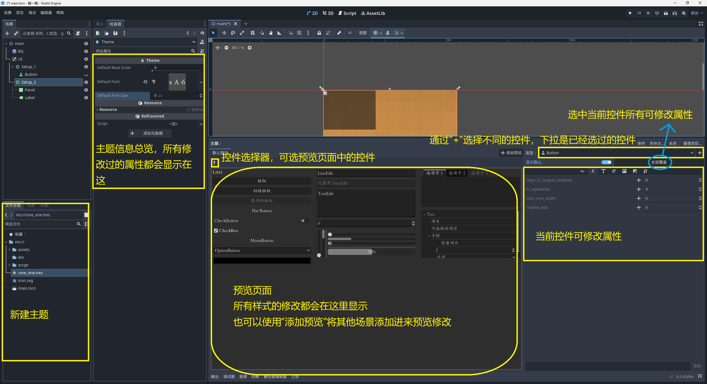

# Godot编辑器可修改内容

## Godot UI设计的一般逻辑

1. **分层结构**：通常从CanvasLayer开始，创建一个独立的UI层，确保UI元素不会被游戏场景内容遮挡
2. **容器优先**：使用容器节点作为组织UI元素的基础框架，而非手动定位每个元素
3. **自顶向下设计**：从外层容器开始，逐步向内添加更具体的容器和控件
4. **响应式布局**：利用锚点、边距和尺寸标志使UI适应不同分辨率
5. **主题与样式**：通过主题系统统一UI外观，而非逐个设置控件样式

## 推荐的标准节点布局方案

对于大多数UI界面，可以采用以下层级结构：

```shell
CanvasLayer # (UI层)
└── Control / MarginContainer # (根容器)
    └── PanelContainer #(背景面板)
        └── VBoxContainer / HBoxContainer  #(主布局容器)
            ├── Header #(标题区域)
            │   ├── HBoxContainer
            │   │   ├── Label #(标题)
            │   │   └── Button #(关闭按钮)
            ├── Content #(内容区域)
            │   └── ScrollContainer #(可滚动内容)
            │       └── GridContainer/VBoxContainer
            └── Footer #(底部区域)
                └── HBoxContainer
                    ├── Button # (确认)
                    └── Button # (取消)
```

## 常见UI模式的容器选择

**菜单/设置界面**：

```
MarginContainer
└── PanelContainer
    └── VBoxContainer
        ├── Label (标题)
        ├── HSeparator
        └── ScrollContainer
            └── GridContainer (设置项)
```

**游戏HUD**：

```
CanvasLayer
└── MarginContainer
    ├── HBoxContainer (顶部状态栏)
    │   ├── TextureProgress (血量条)
    │   └── Label (分数)
    └── CenterContainer
        └── Label (提示信息)
```

**弹窗/对话框**：

```
PanelContainer
└── VBoxContainer
    ├── Label (标题)
    ├── HSeparator
    ├── ScrollContainer (内容)
    └── HBoxContainer
        ├── Button (确定)
        └── Button (取消)
```

## 布局说明

1. 开发软件时，一般不要使用游戏开发控件，因为contol控件有些参数没有

2. 使用TextureRect替代Sprite2D节点

MarginContainer与容器Container使用

``` shell
# 优先使用方法 -----------
MarginContainer # 方法一
└── BoxContainer #

BoxContainer # 方法二
└── CenterContainer #


# 独立边距控制 ------------------
# 这种布局有明显缺点-可能会有其他优势
BoxContainer # 
└── MarginContainer # 
	└── Label # Label无法使用布局，多个Label会堆在以前
```

PanelContainer与MarginContainer

``` shell
CanvasLayer # 根节点，可设置锚点
├─ PanelContainer # 背景面板
	├─MarginContainer # 边距
	|	├─VBoxContainer # 行容器
	|	├─HBoxContainer # 列容器
	├─MarginContainer # 
```

PanelContainer与Controll使用

- 想让A节点下的子节点可以随意布局，又不符合锚点布局
- Button节点，布局模式选择锚点

``` shell
PanelContainer 
├─ Controll 
	├─Button # 随意布局
	├─Button # 随意布局
```

## 节点属性说明

### 一、通用属性说明

#### Ⅰ、Transform

- Position、Rotation、Scale都是相对于**父节点 / 锚点**进行偏移
- 一般Transform中的属性设置时固定的，不是响应式的
- **关于Size选项**：若设置了Custom Minimum Size属性，其size的值不能小于Custom Minimum Size设置的值

| 名称         | 说明                                                         |
| ------------ | ------------------------------------------------------------ |
| size         | 大小                                                         |
| Position     | 位置                                                         |
| Rotation     | 旋转角度                                                     |
| Scale        | 缩放                                                         |
| Pivot Offset | 轴心偏移，设置“小红十字”位置，<br>从而影响Position、Rotation、Scale效果 |

#### Ⅱ、Texture

手册参考位置：[Texture2D — Godot Engine (4.x) 简体中文文档](https://docs.godotengine.org/zh-cn/4.x/classes/class_texture2d.html#class-texture2d)

1. **ImageTexture**：基于 [Image](https://docs.godotengine.org/zh-cn/4.x/classes/class_image.html#class-image) 的 [Texture2D](https://docs.godotengine.org/zh-cn/4.x/classes/class_texture2d.html#class-texture2d)。

2. **AtlasTexture**：裁剪其他 Texture2D 的纹理。

3. **MeshTexture**：简单的纹理，使用一个网格来绘制自己。

4. **CanvasTexture**：是用于 2D 渲染的 [ImageTexture](https://docs.godotengine.org/zh-cn/4.x/classes/class_imagetexture.html#class-imagetexture) 的替代品

   - Texture属性选用CanvasTexture后可通过Canvaslayer / Visibility / Modulate设置颜色
   - 若只需要设置颜色，可使用ColorRect节点

5. ViewportTexture：以动态纹理的形式提供 [Viewport](https://docs.godotengine.org/zh-cn/4.x/classes/class_viewport.html#class-viewport) 的内容。

6. CompressedTexture：一种从 `.ctex` 文件加载的纹理。这种文件格式是 Godot 内部使用的；可压缩

7. PortableCompressedTexture：为磁盘和/或显存提供可移植的压缩纹理。

8. CurveTexture：一维纹理，其中像素亮度对应于曲线上的点。

9. CurveXYZTexture：一维纹理，其中红色、绿色和蓝色通道分别对应 3 条曲线上的点。

10. Gradient1dTexture：使用从 [Gradient](https://docs.godotengine.org/zh-cn/4.x/classes/class_gradient.html#class-gradient) 获得的颜色的一维纹理。

11. Gradient2dTexture：使用从 [Gradient](https://docs.godotengine.org/zh-cn/4.x/classes/class_gradient.html#class-gradient) 获得的颜色创建图案的 2D 纹理。

12. AnimatedTexture：是一种用于帧动画的资源格式

13. CameraTexture：该纹理可以访问 [CameraFeed](https://docs.godotengine.org/zh-cn/4.x/classes/class_camerafeed.html#class-camerafeed) 提供的相机纹理。

14. PlaceholderTexture：二维纹理的占位类。

15. Textured2DTexture：用于 2D 的纹理，与 [RenderingDevice](https://docs.godotengine.org/zh-cn/4.x/classes/class_renderingdevice.html#class-renderingdevice) 上创建的纹理绑定。

16. NoiseTexture：由 [Noise](https://docs.godotengine.org/zh-cn/4.x/classes/class_noise.html#class-noise) 对象生成的噪声所填充的 2D 纹理。

#### Ⅲ、StyleBox

- StyleBoxLine样式thickness属性最小应设置2，不然不会显示

| 属性名称        | 说明                               |
| --------------- | ---------------------------------- |
| StyleBoxFlat    | 平面样式框，可以自定义样式         |
| StyleBoxEmpty   | 没有样式，空                       |
| StyleBoxTexture | 纹理样式框，使用图片               |
| StyleBoxLine    | 显示一条线的样式框，水平或垂直的线 |

### 二、Control类属性说明

#### Ⅰ、Control属性

- 关于锚点系统，查看：四、Anchor系统使用说明
- Control节点还可以取消父类的大小显示，特别用法
- 关于 Focus 中设置，是按下左右方向键，可自定义往哪个控件移动（前提是有一个节点获取默认焦点）

| 名称         | 说明                                                         |
| ------------ | ------------------------------------------------------------ |
| Layout       | 布局                                                         |
|              | Clip Contents：<br>Custom Minimum Size：自定义最小尺寸<br>Layout Direction：<br>Layout Mode：布局系统<br>Anchors Preset：锚点预设<br>Transform：<通用属性> |
| Localization | 本地化                                                       |
| Tooltip      | 鼠标悬停，显示的提示信息                                     |
| Focus        | 焦点                                                         |
|              | Neighbor Left：左侧邻居<br>Neighbor Top：上方邻居<br/>Neighbor Right：右侧邻居<br/>Neighbor Bottom：下方邻居<br/>Next：<br/>Previous：<br/>Mode： |
| Mouse        | 鼠标，当点击无用时，有可能时空间遮掩，并停止了事件传递       |
|              | Filter：鼠标事件过滤<br/>Default Cursor Shape：鼠标样式      |
| Input        | 将控件添加进屏幕                                             |
| Theme        | 主题                                                         |

#### Ⅱ、CanvasLayer属性

1. CanvasLayer是固定在相机上的，假设有相机，并覆盖整个窗口

2. CanvasLayer是用于独立的UI，其定位是相对于视窗定位，不会受父类容器影响

   ``` shell
   CanvasLayer
   └── PanelContainer 
   	└── Control 
   ```

3. 不建议在子控件、在容器中使用CanvasLayer（包括场景引用）

| 属性名     | 子属性                                                       |
| ---------- | ------------------------------------------------------------ |
| Visibility | Visible：显示 <br>Modulate：可以继承的颜色 <br/>Self Modulate：只修改自己的颜色  <br/>Show behind Top Level：置顶  <br/>Clip Children Light Mask：  <br/>Light Mask：<br>Visibility Layer： |
| Ordering   | Z index：排序 <br>Z as Relative： <br/>Y Sort Enabled：Y轴排序，多用于地图设计 |
| Texture    | Filter：过滤模式 <br>Repeat：重复模式                        |
| Material： |                                                              |

代码实现：

- 头节点：`#include <godot_cpp/classes/canvas_layer.hpp>` 
- 新的画布，其属性独立于其他节点

``` c++
// 获取
CanvasLayer * cl = get_node<CanvasLayer>("%InventoryWindow");
cl->set_visible(TRUE); // 设置是否可见
cl->is_visible(); // 当前是否打开
cl->hide();  // 隐藏
cl->show(); // 显示
```

#### Ⅲ、TextEdit属性

| 名称                            | 说明                                                         |
| ------------------------------- | ------------------------------------------------------------ |
| Text                            | 默认的显示文本                                               |
| Placeholder Text                | 提示文本                                                     |
| Editable                        | 是否可编辑                                                   |
| Context Menu Enabled            | 允许右击菜单                                                 |
| ShortCut Keys Enabled           | 快捷键是否启用                                               |
| Selecting Enabled               | 文本是否允许选择                                             |
| Deselect On Focus Loss Enabled  | 没有焦点时，文本选中会取消                                   |
| Drag and Drop Selection Enabled | 文本拖放是否允许                                             |
| Virtual Keyboard Enabled        | Linux相关设置                                                |
| Middle Mouse Paste Enabled      | Linux相关设置                                                |
| Wrap Mode                       | 换行模式                                                     |
| Autowrap Mode                   | 自动换行模式                                                 |
| Indent Wrapped Lines            | 缩进                                                         |
| Use Default Word Separators     |                                                              |
| Custom Word Separators          |                                                              |
| Scroll                          | 滚动                                                         |
|                                 | Smooth：平滑滚动效果<br>V Scroll Speed：平滑滚动速度<br>Past End Of File：滚到最后一行，就不允许滚动<br>Vertical：垂直滚动值<br>Horizontal：横向滚动值<br>Fit Content Height：禁用垂直滚动 |
| MiniMap                         | 小地图                                                       |
|                                 | dray：是否启用小地图<br>Width：小地图宽度                    |
| Caret                           |                                                              |
|                                 | Type：光标形式<br>Blink：光标是否闪烁<br>Blink Interval：闪烁间隔<br>Draw When Editable Disabled：当Editable选项为假时，光标依然可见<br>Move on Right click：右击点击时，先移动光标<br>Mid Grapheme<br>Multiple：允许同时选中多行文本 |
| Highlighting                    | 高亮                                                         |
|                                 | Syntax Highlighter:<br>Highlight All Occurrences<br>highlight Current Line |
| Visual Whitespace               |                                                              |
|                                 | Control Chars：可视空格<br>Tabs：Tab显示<br>Spaces：         |

#### Ⅳ、Button属性

1. Text Behavior / Autowrap Mode详细说明
   - Arbitrary：在任意位置换行（英文会断开）
   - Word：不会断开单词（若word换行没有达到预期，可以使用word smart）
   - Word Smart：会断开单词

| 名称          | 说明                                                         |
| ------------- | ------------------------------------------------------------ |
| Text          | 文本，按钮名称                                               |
| Icon          | 按钮图标                                                     |
| Flat          | 启用后就不会有默认按钮样式                                   |
| Text Behavior | 文本行为                                                     |
|               | Alignment：按钮文字对齐方式<br>Text Overrun Behavior：文本裁剪模式（文字过长，会显示“...”号）<br>Autowrap Mode：自动换行（汉字选用Arbitrary即可）<br>Clip text：超过默认大小的文本会被剪切掉 |
| Icon Behavior | 图标行为                                                     |
|               | Icon Alignment：图标对齐方式<br>Vertical IconAlignment：垂直对齐<br>Expend Icon：拓展图标，需要设置最小大小才有效果 |
| BiDi          |                                                              |
|               | Text Dirction：文本方向<br>Language：语言                    |

#### Ⅴ、BaseButton属性

| 名称                 | 说明                                                         |
| -------------------- | ------------------------------------------------------------ |
| Disabled             | 禁用                                                         |
| Toggle Mode          | 切换模式，第一次点击激活，再次点击取消                       |
| Button Pressed       | 是否被按下，不可选用                                         |
| Action Mode          | 动作模式                                                     |
|                      | Button Press：按下即发出点击信号<br>Button Release：按下再释放，才发出点击信号 |
| Button Mask          | 鼠标左键点击，还是右键点击                                   |
| Keep Pressed Outside | 按下，并移动到按钮外面，会取消单击事件                       |
| Button Group         |                                                              |
| ShortCut             | 快捷键                                                       |

#### Ⅵ、TextureRect属性

> TextureRext就是一个Control下的Spirit2D节点

- 关于Expan Mode与Stretch Mode选择
  1. ignore size / keep Aspect：会让图片缩小到父类容器大小，填充宽高并保持比例

| 名称         | 说明                                                         |
| ------------ | ------------------------------------------------------------ |
| Texture      | 详细查看Texture属性说明                                      |
| Expand Mode  | 容器效果                                                     |
|              | keep size：保持控件的原始尺寸，最大为父类大小<br>ignore size：无视比例和原始尺寸（若没有Custom Minimum Size、Transform/size大小会看不到）<br/>fit width：水平方向拉伸至父容器宽度，垂直不变，要设置Transform/size属性<br/>fit height：垂直方向拉伸至父容器宽度，水平不变，要设置Transform/size属性<br/>fit width Proportional：与fit width相同，垂直方向按宽高比自动调整<br/>fit height Proportional：与fit height相同，水平方向按宽高比自动调整 |
| Stretch Mode | 容器内中的图片摆放方式，基于容器大小                         |
|              | scale：强制拉伸以填充目标区域<br/>tile：平铺，Custom Minimum Size设置的太小，自能显示一部分<br/>keep：保持原始尺寸<br/>keep Centered：keep基础上，居中<br/>keep Aspect：填充长或高较短的一边<br/>keep Aspect Centered：keep Aspect基础上，图片居中<br/>keep Aspect covered：keep Centered的基础上，裁剪超出的部分。 |
| Flip H       |                                                              |
| Flip V       |                                                              |

#### Ⅶ、Label属性

| 名称                  | 说明                                                         |
| --------------------- | ------------------------------------------------------------ |
| Text                  | 显示文本                                                     |
| Lable Setting         | 设置                                                         |
|                       | Line Spacing：行间距<br>Font：字体<br>outLine：轮廓<br>Shadow：阴影 |
| Horizontal Alignment  | 水平对齐方式                                                 |
| Vertical Alignment    | 垂直对齐方式                                                 |
| Autowrap Mode         | 自动换行                                                     |
| Justification Flags   | 两端对齐方式                                                 |
|                       | Kashida Justification：添加Kashida对齐<br>Word Justification：统改变<br>Justify Only After Last Tab：只对之后一个制表符之后的文本应用2端对齐<br>Skip LastLine<br>Skip last Line With Visible cha |
| clip Text             |                                                              |
| Text Overrun Behavior | 裁剪方式                                                     |
| Ellipsis char         | 忽略字符                                                     |
| uppercase             | 是否显示大写                                                 |
| Tab Stops             | 制表符对齐                                                   |

**Display Text**：文本显示

| 名称                        | 说明                         |
| --------------------------- | ---------------------------- |
| Lines Skipped               |                              |
| Max Lines Visit             |                              |
| Visible Characters          |                              |
| Visible Characters Behavior |                              |
| Visible Ratio               | 可以实现一个字一个字出现效果 |

#### Ⅷ、NinePatchRect属性

1. 多用于创建对话框

| 名称         | 说明                                                         |
| ------------ | ------------------------------------------------------------ |
| Texture      | 纹理                                                         |
| Draw Center  |                                                              |
| Region Rect  |                                                              |
| Patch Margin | 分割边距，修改其Top/Left/Right/Bottom属性值，会分割图片4角不会被拉伸<br>在编辑区域 Region Rect / Edit Region可看到当前设置 |
| Axis Stretch |                                                              |
|              | Horizontal：横向属性，可选Stretch拉伸、Tile平铺、等<br>Vertical：纵向属性，可选Stretch拉伸等 |

### 三、Node2D类属性说明

#### Ⅰ、Area2D

- Area2D主要用于检测，其本身没有碰撞体积

| 名称         | 说明                               |
| ------------ | ---------------------------------- |
| monitoring   | 检测进入退出该区域                 |
| monitorable  | 其他Area2D可以检测当前区域         |
| priority     | 优先级                             |
| Gravity      | 圆心中立，重力点在Area2d区域中间   |
| Linear Damp  | 当前Area2D会给进入物体一个相反的力 |
| Reverse Damp | 重力相反                           |


#### Ⅱ、AnimationTree

- 头文件

  `#include <godot_cpp/classes/animation_tree.hpp>` 

  `#include <godot_cpp/classes/animation_node_state_machine_playback.hpp>` 

- AnimationRootNode：动画树节点的基本资源。通常，它不会直接使用，

- AnimationNodeBlendTree:：包含多个混合类型节点，

- AnimationNodeBlenderSpace1D: 1D空间混合

- AnimationNodeBlenderSpace2d: 在2D空间中旋转根节点

- AnimationNodeStateMachine：动画节点状态机

- AnimationNodeAnimation: 从列表中选择一个动画播放，这是最简单的根节点类型，通常不直接作为Tree Root根节点使用。

- 注意：AnimationPlay不能设置自动播放，但要设置循环

- 注意：状态机（连接线）要设置enable，如果设置auto会出现意外情况，使用travel控制播放动画

``` c++
/* 获取节点 */
// 获取动画节点
AnimationPlayer *m_animatePL = get_node<AnimationPlayer>("AnimationPlayer");
// 获取动画树节点
AnimationTree m_animateTr = get_node<AnimationTree>("../../AnimationTree");

/* 获取AnimationNodeStateMachineplayback属性 */
// 这个属性地址，可以在Godot界面查找
Variant b = m_animateTr->get("parameters/playback");
// 转为AnimationNodeStateMachineplayback
m_animationState = cast_to<AnimationNodeStateMachinePlayback>(b);

/* 启动动画树 */
// 字符串可在godot界面查找
// aoix是Input向量
m_animateTr->set("parameters/idle/blend_position", aoix);
m_animateTr->set("parameters/run/blend_position", aoix);
// 设置播放动画
m_animationState->travel("run");
```

#### Ⅲ、RigidBody2D

- 通过外力产生位移
- 会受到其他物理施加的力的影响，可以对其他物体施加力

#### Ⅳ、StaticBody

- 不会因外力产生位移，不受其他物理施加的力影响，可以对其他物体施加力

#### Ⅴ、CharacterBody2D

| 名称             | 说明                                                         |
| ---------------- | ------------------------------------------------------------ |
| motion_mode      | 运动方式                                                     |
|                  | Grounded：横板<br>Floating：俯视角                           |
| Up Direction     |                                                              |
| Slide on Ceiling | 选中-滑动；不选-直接掉落                                     |
| Floor            | 地面                                                         |
|                  | Stop on slope：站在斜坡上，默认是滑动还是停止<br>Constant speed：上下坡速度是不是保持一致<br>Block on wall：只能在墙体滑动，不能行走<br>Max Angle：在多少度认为是墙体<br>Snap Length： |

### 四、容器节点

**Box容器**：可以按照x轴方向、y轴方向进行排列

| 名称                  | 说明                               |
| --------------------- | ---------------------------------- |
| Box容器-HboxContainer | 横向排列的容器，用于制作角色血条等 |
| Box容器-VBoxContainer | 纵向排列容器                       |

**PanelContainer**：面板容器，<当作背景板、父类样式节点、Tab标签页等使用>

- 可以保证其子节点，不会超出PanelContainer的容器范围

- 要想其子节点可以随意布局，应考虑使用Control / Panel节点代替PanlContainer节点，获取在PanelContainer节点下添加Control或Panel节点

- 子控件可以自动布局（不能拖拽移动布局，只能使用MarginContainer、HBox、VBox布局）

  ``` shell
  PanelContainer # 不能随意布局，需要借助HBox、VBox布局
  └── MarginContainer 
      └── HBoxContainer
          ├── Button1 (自动左对齐)
          └── Button2 (自动右对齐)
  ```

**Panel**：单纯的面板-只可以使用StyleBox设置样式

- 适合高频更新的动态 UI，需要手动拖拽节点，设置位置

- 不能保证其子节点都在Panel的范围内

- 如果只需一个背景或自由定位，需要完全控制子节点位置或独立视觉区域（如弹窗背景、游戏内交互面板）

- 典型的Panel使用

  ``` shell
  Control (根节点)
  ├── Panel (背景装饰)
  │   └── TextureRect (背景纹理)
  └── MarginContainer (实际UI内容)
      └── Label (文本内容)
  ```

---

**其他容器节点说明** 

| 名称                                 | 说明                                                         |
| ------------------------------------ | ------------------------------------------------------------ |
| MarginContainer                      | 边框容器，<可进行边距设置>                                   |
| ViewPortContainer                    | 小窗口容器，<小地图>                                         |
| AspectRatioContainer                 | 长宽比固定，保持一定的长宽比，一般用不到                     |
| FlowContainer                        | 流动容器，将元素从右向左放置，会自动换行                     |
| GridContainer                        | 九宫格容器，<需要设置Columns才能看见效果>                    |
| HSplitContainer                      | 分割容器，划分屏幕左右，可拖拽                               |
| VSplitContainer                      | 分割容器，划分屏幕上下，可拖拽                               |
| ScrollContainer                      | 滚动条，必须在Vbox或Hbox中才能正常工作，且其子节点应设置最小大小，不应设置扩展模式 |
| CenterContainer                      | 居中容器，在容器中使用，需要设置最小大小                     |
| TapContainer                         | 选项卡容器                                                   |
| SubViewportContainer <br>SubViewport | 用于制作小地图的容器                                         |

---

**其他功能节点**  

| 名称               | 说明                                     |
| ------------------ | ---------------------------------------- |
| Progressbar        | 进度条，软件常用                         |
| TextureProgressbar | 进度条，游戏常用，可设置背景             |
| Label              | 标签-查看Labe属性                        |
| RichTextLabel      | 富文本标签，启用BBCode就可以显示动态文字 |
| ColorRect          | 颜色矩形，用于显示颜色                   |
| VideoStreamPlayer  | 视频流播放器                             |
| HSeparator         | 分隔符                                   |
| NinePatchRect      | 九宫格矩形，保存纹理被边角不变           |
| ItemList           | 列表 （文件夹的效果）                    |
| Tree               | 树形列表                                 |
| CodeEdit           | 代码编辑器                               |
| LineEdit           | 普通的行编辑器，密码输入框，账号名输入等 |
| ReferenceRect      | 不可见节点，测试用                       |

### 五、Anchor系统使用说明

#### Ⅰ、锚点使用

使用锚点系统：$Layout \to Layout Mode \to Anchor$   

使用定位系统：$Layout \to Layout Mode \to Position$  

三种锚点情况说明

- 点：保证子类图形距离锚点的相对位置不变（核心：位置）
- 线：保证锚点组成的线不会被拉伸（核心：长或款）
- 面：保证锚点围成的面大小比例一致（核心：面积，长和宽）

#### Ⅱ、属性说明

1. 工具栏倒数第二个图案（船锚图案）效果：

   选中后：拖动图案，锚点会跟着移动（修改的是Anchor Position属性）

   取消后：拖动图案，锚点不会移动（修改的是Anchor Offsets属性）

2. 设置锚点预设模式：

   方式一：$Layout \to Anchors Preset$ 选择想选的模式   

   方式二：工具栏$\to$ 倒数第3个图标（圈十字图案）

3. Anchors Preset选择自定义其属性说明

   Anchor Points：设置锚点的位置

   - 可设置Left、Top、Right、Bottom，都设置为1的化，锚点会铺满整个窗口
   - 这4个属性可选项只有0~1之间的数（包括0，1）
   - Top设置为0.25，Top占整个窗口的1/4
   - 通过设置这4个属性可以让节点固定到屏幕相对位置

   Anchor Offsets：锚点偏移

   - 可以精确的设置当前节点相对于锚点的偏移量

   Grow Diection：伸长方向

   - 当设置Custom Minimum Size属性时，当前大小不满足Custom Minimum Size，就可以移动图片

#### Ⅲ、容器与锚点

1. 当使用了容器节点，其字节的的Layout、Transform等属性是没有效果的

2. 单独多出来的属性Container Sizing

   Horizontal：水平填充

   Vertical：垂直填充

   Expand：扩展

   - 启用：占用所以空间（启用的控件会尽可能多的获取空间），若当前容器都设置了Expand，且空间大小正好是控件的N倍，控件之间会平分空间

   - 不启用：要设置Custom Minimum Size最小尺寸才能看到图形，

   Stretch Ration：拉伸比例，可以调整当前节点占用的空间（不需要设置Custom Minimum Size属性）

3. 当想突破当前Control设置的面积区域时，可以再添加一个Control节点（特别用法）

4. 容器节点可以把子类的Transform（Layout / Transform转换）信息提升到父类容器节点修改

5. 使用control节点优势：子节点（ `Control` 子类型）的位置和大小由 **锚点** 和 **边距** 决定，适合响应式 UI

当父类使用`锚点预设`$\to$` 整个矩形`时（三种锚点情况中“面”的情况），其子类可以在这个矩形范围内进行 “锚点预设”

- 当锚点的父类是Node或Node2D节点，就不能进行锚点拖拽（此时锚点就只能是一个定位点）

  解决方案：将锚点的父类替换为其他节点（优先选CanvasLayer）

- CanvasLayer-Control选择

  对需要 **固定显示** 或 **全局存在** 的 UI，优先使用 `CanvasLayer`为父节点。

  对需要 **动态布局** 或 **复杂交互** 的 UI，使用纯 `Control` 嵌套。

- 一般的Control结构

  ``` shell
  CanvasLayer # 图层，可以有多个Control节点
  	└─Control # 锚点预设使用“整个矩形”其子类可以使用锚点预设设置位置
  		└─Container # 容器，各种不同的容器，进一步划分场景
  			└─TextureRect # 实际用的节点
  ```

其他问题：

1. 锚点是一个点的时候，子类不要选“整个图形”，这样需要设置最小大小才能显示区域

### 六、主题

1. theme与theme override

   调用顺序：theme override$\to$theme $\to$ 父类的theme节点样式$\to$项目设置、GUI、Theme中设置

2. **主题**应在**根节点**设置，这样其子节点就可以继承其设置的样式

3. 主题可以新建主题（与新建资源相同，Resource中有Theme）

4. 样式盒子说明：参考通用属性-StyleBox


主题界面说明



## 不常用控件

### 一、FileDialog控件

- `FileDialog` 是一个功能强大的控件，用于让用户选择文件或目录。

常用属性说明

| 属性                    | 说明                                       | 示例值                                                       |
| :---------------------- | :----------------------------------------- | :----------------------------------------------------------- |
| **`file_mode`**         | 对话框模式                                 | FILE_MODE_OPEN_FILE：该对话框只允许选择一个文件<br>FILE_MODE_OPEN_FILES：该对话框允许选择多个文件。<br>FILE_MODE_OPEN_DIR：该对话框只允许选择一个目录，不允许选择任何文件。<br> FILE_MODE_OPEN_ANY：该对话框允许选择一个文件或目录。<br> FILE_MODE_SAVE_FILE：当文件存在时，对话框会发出警告。 |
| **`access`**            | 访问权限                                   | ACCESS_RESOURCES：该对话框只允许访问 Resource 路径下的文件（res://）。<br>ACCESS_USERDATA：该对话框只允许访问用户数据路径（user://）下的文件。<br>ACCESS_FILESYSTEM：该对话框允许访问文件系统上的文件。 |
| **`filters`**           | 文件类型过滤（只显示特定扩展名的文件）     | `["*.png; PNG 图片", "*.js; JavaScript 文件"]`               |
| **`current_dir`**       | 默认打开的目录                             | `"C:/Users/Name/Documents"`                                  |
| **`current_file`**      | 默认选中的文件名                           | `"example.js"`                                               |
| **`show_hidden_files`** | 是否显示隐藏文件                           | `true` / `false`                                             |
| **`file_mode`**         | 文件选择模式（单个文件、多个文件、目录等） | `FileDialog.FILE_MODE_OPEN_FILE`                             |

GDScript使用

``` python
func _ready():
    var file_dialog = $FileDialog
    
    # 设置对话框属性
    file_dialog.file_mode = FileDialog.FILE_MODE_OPEN_FILE
    file_dialog.access = FileDialog.ACCESS_FILESYSTEM
    file_dialog.filters = ["*.js; JavaScript 文件"]
    file_dialog.current_dir = "C:/"  # 默认打开 C 盘
    # 打开当前应用名别
    filedialog.current_dir = OS.get_executable_path().get_base_dir()
    
    # 连接信号
    file_dialog.file_selected.connect(_on_file_selected)
    file_dialog.canceled.connect(_on_canceled)

    # 点击按钮打开对话框
    $Button.pressed.connect(file_dialog.popup_centered)

func _on_file_selected(path: String):
    print("选中的文件:", path)

func _on_canceled():
    print("用户取消了选择")
```

### 二、MenuButton

- menuButton的子项信号需要代码控制

``` python
@onready var menu_btu: MenuButton = $MenuButton

// 
var pop = menu_btn.get_popup();
# 连接id_pressed信号,写法一
pop.id_pressed.connect(
	func(id:int):
    	print("menu click id:", id)
)

# 其他方法-一般在connect回调函数种使用
var idx = pop.get_item_index(id)
```

通过代码添加子菜单，也可在Godot编辑器种设置

``` python
var sub = PopupMenu.new()
sub.add_item("sub1", 0)
sub.add_check_item("sub checkbox", 1)
sub.add_separator("", 2)

var pop = menu_btn.get_popup();
pop.add_submenu_node_item("sub", sub)
```

### 三、MenuBar

- 其子项需要使用`PopupMenu`添加子项

## 其他项，雷区

### 一、关于Control

1. 多场景布局，使用Control是可以的

   ``` shell
   Main 
   └─ Node_A  
   	├─ scene_A `场景A，父节点是Control`  
   	└─ scene_B `场景B，父节点是Control`
   ```

2. 当场景是以`Control`为父节点的时候，为了让其能包括在`BoxContainer`容器内，应设置`custom_minimum_size` 大小，若不设置，则会有奇怪的布局现象发生

3. 关于修改图片大小，没有达到预期效果

   `Control`只提供一个方块，这个方块内可以填充图片，其子节点有图片类型的节点，就会显示

   若要调整图片大小，应修改Control大小与图片大小，这样才能正确显示

### 二、关于容器

1. VBoxContainer / HBoxContainer在使用时，其内容可以会重叠在一起，原因其父类应是VBox或HBox来告诉子类应该怎么排列，不如Vbox与hbox就会重叠
