# QT

1、支持平台windows、Unix/X11、MAC OS 、Embedded

# 基本

## 新建项目

QWidget -- 空窗口

QMainWindow-- 提供工具栏、状态栏、侧边栏

QDialog -- 对话框

 

##                 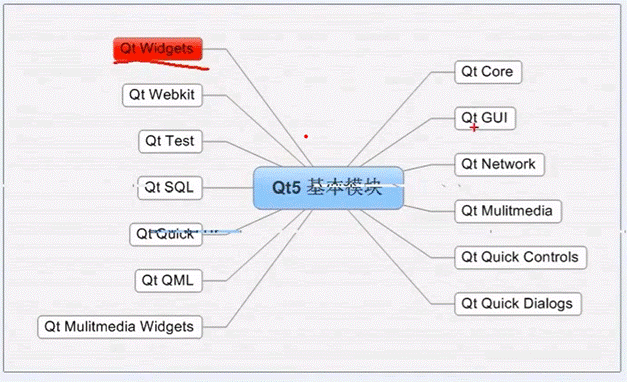      QT基本模块

 

## main函数

 

 

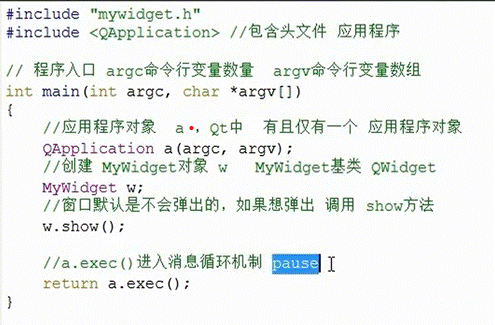

 

 

 

 

 

 

 

 

 

 

 

 

## pro文件

QT += core gui //QT包含模块

greaterThan(QT_MAJOR_VERSION, 4): QT += widgets //大于4版本 包含widget模块

TARGET = 01_Qt_First //目标 生成exe可执行文件的名称

TEMPLATE = app //模板 应用程序

SOURCES += main.cpp \ //源文件

HEADERS += mywidget.h //包含的头文件

 

### TEMPLATE 

app 建立一个应用程序的makefile,默认值app

lib 建立一个库的makefile

vann 建立一个应用程序的VisualStudio项目文件

vclib 建立一个库的VisualStudio项目文件

subdirs 这是一个特殊模板，它可以创建一个能进入特定目录并且为一个项目文件生成makefile并且为他调用的makefile

 

 

## 快捷键

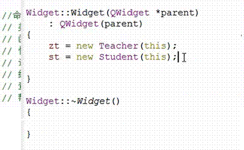

 

 

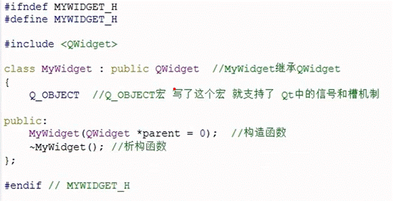

## 资源自动回收

创建一个QObject对象时，可以提供一个父类，我们创建QObject对象时会自动添加到父类对象的children列表中，这个列表会自动析构。

所有**new****出来的对象**，不用处理析构，原因children表中的对象会在窗口关闭后释放

## 自定义类释放

class Teach: public QObject{}

 

Teach zh = new Teach(this); **//****添加this****将自动释放**

# 窗体参数设置

可直接使用方法，也可使用this->确定指定

## 设置窗体名称

setWindowTitle(“sss”)

## 窗体图标

setWindowIcon(QPixmap(“:/images/t.png”))

## 窗体大小

setFixedSize(400, 300)

**设置当前窗体大小，当前代码所在的窗体**

this->resize(600,400)

## 窗体事件

void closeEvent(QCloseEvent *) //窗体关闭时，系统触发的关闭方法

 

# QT内置对象

## QPixmap -用于加载图片

QPixmap(“:/images/time.png”)

 

**样例**

btn->setIcon(QPixmap(“:/image/time.png”))

## QVector -容器

QVector<QToolBotton *> vToolBtn;

vToolBtn.push_back(btn); //将btn添加进容器

## QTList

QList<QString> namelist; //QList类型数组

nameList << “sss” << “添加数据”;

nameList[1]; 使用

 

**可用方法**

.lenght() 长度

 

## QTStringList

QStringList iconNameList; //字符串数组

iconNameList << “这样添加数据” ;

iconNameList.at(1); 使用数据

 

## QString

QString str //声明

//格式化字符串

QString(“:/images/%1.png”).arg(nameList[1]);

 

str.toInt() //转数字

str.toUtf8() // 转QByteArray类型

## QByteArray 

**可隐式转换为QString****类型**

QByteArray array = QByteArray(size, 0);

## 类型转换

.toUtf8() //转QByteArray类型

.toInt()

## 组件方法

ui->QLine

ui->**QTextEdit/QPlainTextEdit** ->toPlainText() //输入框内简单文本， QString

ui->**QTextEdit**->toHtml() //带有样式的内容

 

ui->text->clear() //情况输入框

ui->text->setFocus() //返回光标

 

# 组件使用方法

## QPushButton-按钮

\#include <QPushButton>

### 创建窗口

*第一种方法*

QPushButton *btn = new QPushButton

*第二种方法*

QPushButton *btn = new QPushButton(“xx”, this)

### 设置文字

btn->setText(“ss”)

### 移动

btn->move(100, 100)

### 调整大小

btn->resive(50,50) 重置btn大小

### 显示到窗体哪个位置

btn->show()      //顶层弹出，要想在指定窗口弹出要依赖窗口

btn->setParent(this) //显示在当前窗体

**ui->vLayout->addWidget(btn) //****向布局vLayout****中添加**

 

 

# 信号量

## 信号槽

使用观察者模式实现；

发出的信号是一种广播，只有对信号感兴趣的才做处理

### 新建信号

 

class Teach: public QObject

{

// 自定义信号必须在 signals

// 返回类型必须时 void

// 信号只需要声明，不用实现

// 信号可以有参数，可以重载

 

signals:

void closeWidget(); // 自定义函数，自定义方法

}

}

### 新建槽点

class Test: public QObject

{

public:

public slots:

//自定义槽函数，也可写到public下

//槽函数需要实现

void treat() //自定义的槽函数，需要实现

}

**将信号处理方法与信号捆绑**

// 信号发送者QObject对象

// 信号发送者，发送的信号，信号的接收者，处理的槽函数

**//** **绑定myButn****发送的信号clicked****，处理方法是this****中的treat****方法**

connect(myButn, &Mybutten::clicked, this， &Test::treat)

// 第二种写法,

connect(myButn, &Mybutten::clicked, [=](){ // 这里直接写处理方法 })

### 触发指定信号

**连接信号槽点**

connect(w, &Widget::closeWidget, [=](){

.... // 当触发closeWidget事件后处理的方法

})

**使用emit****方法触发信号**

void Test::closeEvent(QCloseEvent *)

{

// 手动触发信号closeWidget

emit this->closeWidget()； // closeWidget是自定义信号

}

 

## 传递参数的信号

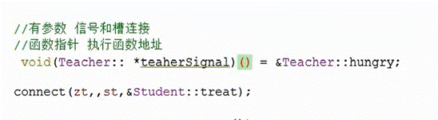

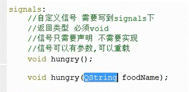

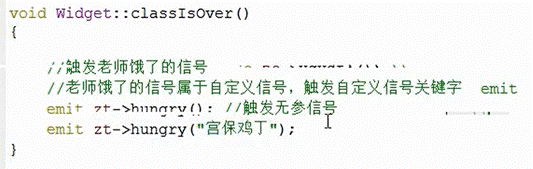

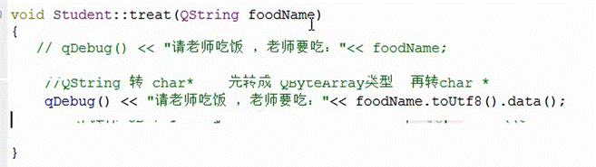

​                                      

## 带参数的信号

void(Teacher:: *noTeacherSignal)(void) = &Teacher::hungry;

void(Student:: *noStSlot)(void) = &Student::treat;

 

connect(zt, noTeacherSignal, st, noStSlot);

connect(btn, &QPushButton::clicked, zt, noTeacherSignal);

## 系统信号

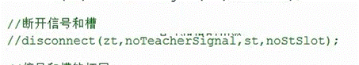

QAbstractButton::clicked 点击信号 

## 扩展

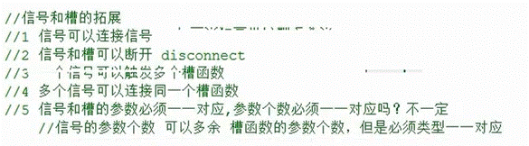

 

## lambda表达式

CONFIG + c++11 //添加qt支持，如果不支持

 

{}() 最后的()是调用

 mutable{} （值传递可修改变量）

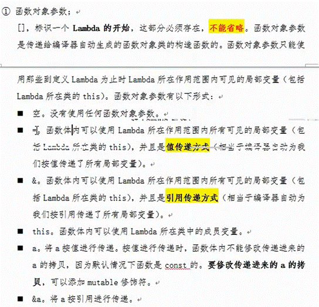

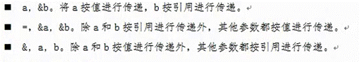

int a = ->{return 0} //返回值

 

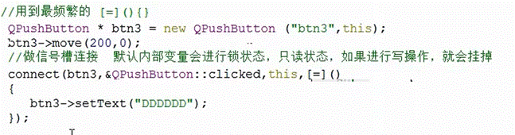 

 

 

# QMainWindows

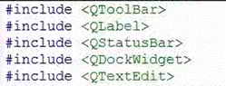

QMenuBar *bar = menuBar();

this->setMenuBar(bar)

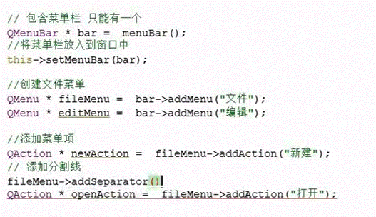

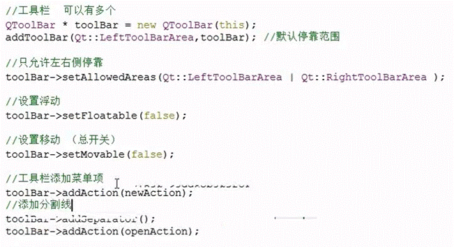

## 状态栏

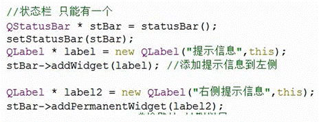

## 铆接

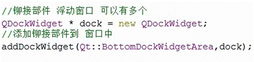

## 核心部件

 

# 使用ui

 

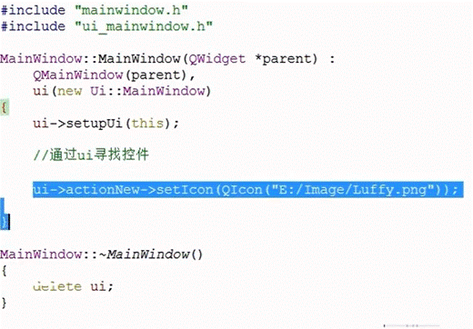

 

## 设置模态框

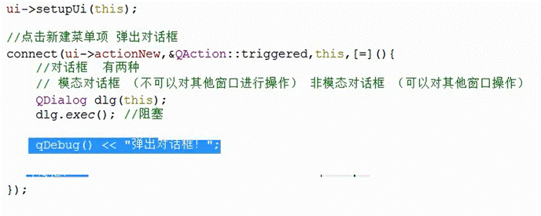

非模态

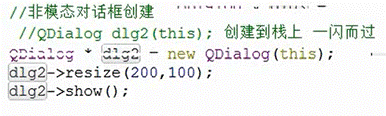

## 对话框

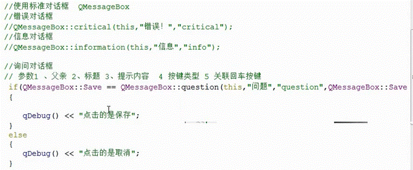

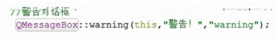

## 选择颜色

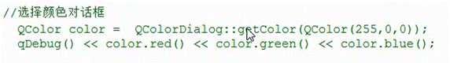

## 文件对话框

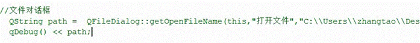

## 单选框

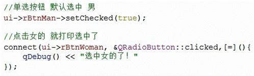

## 多选框

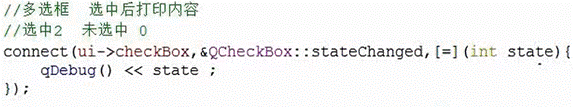

## listwidget

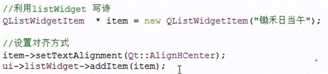

## treewidget

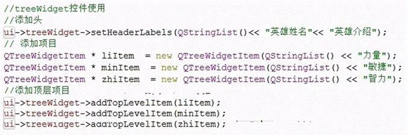

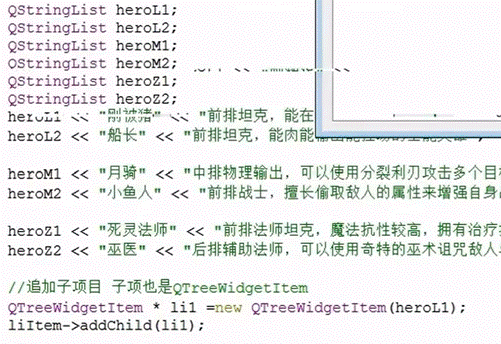

## tablewidget

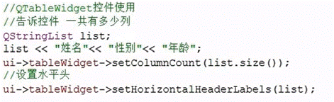

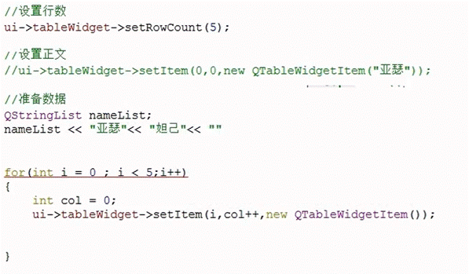

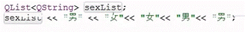

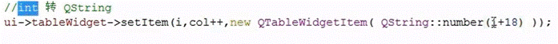

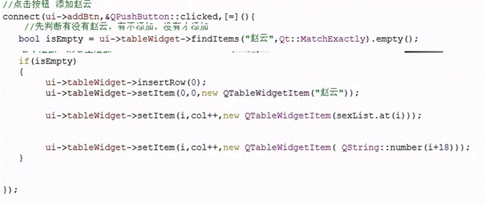

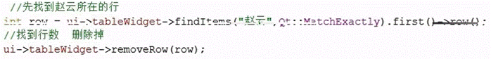

## 栈容器

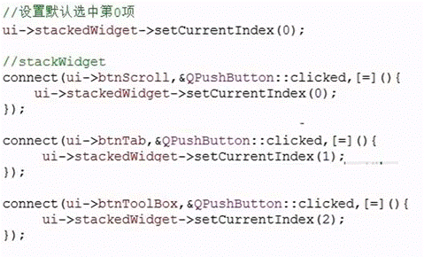

 

## 下拉框

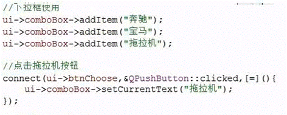

 

## Qlabel显示图片

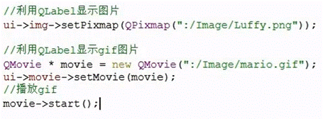

# 封装控件

1、项目添加新闻文件

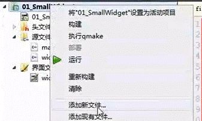

2、添加QT ui界面

Qt->Qt 设计师界面类

3、选者界面

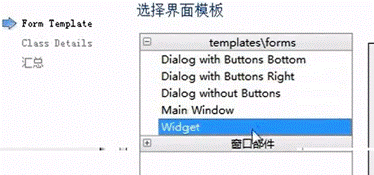

4、修改设计界面名称

5、添加想要封装的界面功能

6、主界面添加Widget容器

7、右击容器->提升为

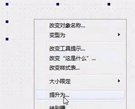

8、设置提升为类名称，

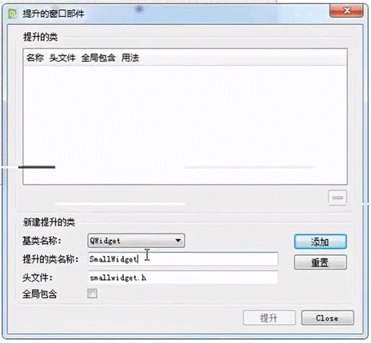

9、全局包含+提升

全局包含后可以不用修改该

10、 

# 鼠标事件

使用提升使用自定义的事件

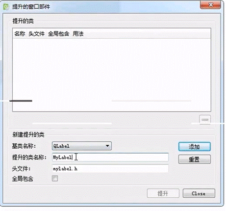

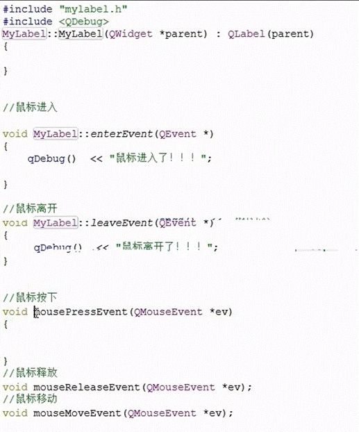

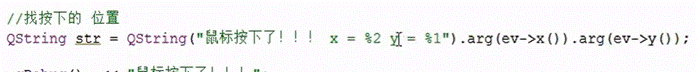

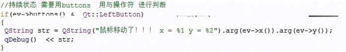

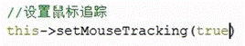

 

# 定时器事件

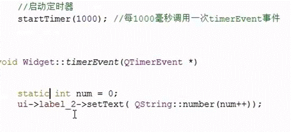

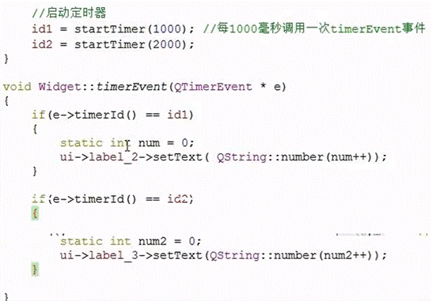 

# 事件拦截

在组文件中

# 绘图

 

 

# 绘图设备

# 文件系统

## 读取文件信息

## 文件流-数据少

当前文件exe文件目录

## 数据流-数据大

对于不同的块，使用不同的方法读取

# Socket

udp = QudpSocket(this);

udp->bind();

udp->writeDatagram(“wenben”, QHostAddress(192.168..), 111）；

 

接收数据

connect(udp, &QUdpSocket::readyRead, [=](){

qint64 size = udp->pendingDatagramSize();

QByteArray array = QByteArray(size, 0);

udp->readDatagram(array.data(), size);

})

 