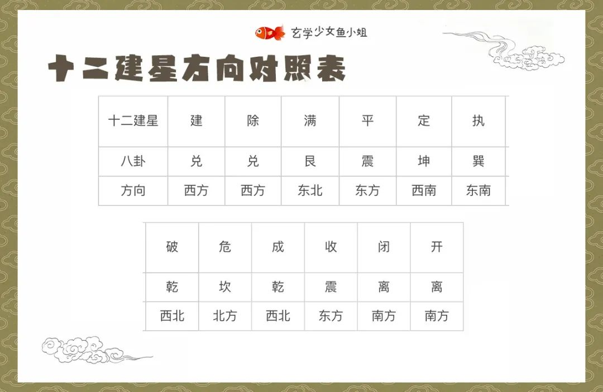
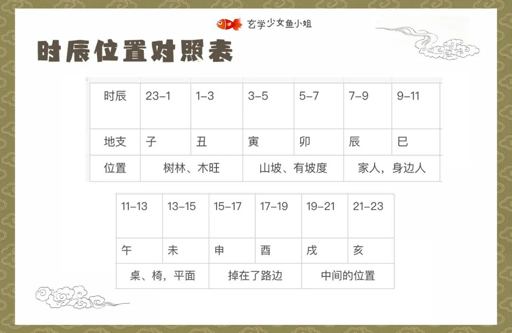

# 玄学寻失物口诀

## 一、找失物的步骤

1、你要知道**丢东西的时间**。如果实在记不清，就按你发现这个东西丢了那个时间来算。

2、并不是所有东西都能找回来的，要先**测这个东西有没有落空**，落空了就找不回来了。

3、测东西**丢失的方向**。

4、测这个东西**丢失的位置**，进一步聚焦定位。

5、如果以都上不行，那就丢了

## 二、查看是否落空

> **甲己**申酉**最为愁，**乙庚午未**不须求；**
>
> 丙辛**之日空**辰巳**，**丁壬寅卯**一场空；** 
>
> 戊癸子丑**何劳问，若犯空亡百事休。

**甲己申酉最为愁**：

如果丢东西的日干是甲或己，时辰是申或酉(15-19点)，那么就是遇到了空亡，可能找不回来了。

**乙庚午未不须求**：

如果丢东西的日干是乙或庚，时辰是午或未(11-15点)，那么也是遇到了空亡，大概率找不回来了。

**丙辛日干辰巳时**(7-11点)；**丁壬日干寅卯时**(3-7点)；**戊癸日干子丑时**(23-3点)：

这些都属于空亡的时间，失物基本都是找不回来的。

## 三、查看能否找回

### 1、口诀

加黑字体为建除十二神

> **满成定执**自归家
>
> **危收**在近**开除**远
>
> **建平破闭**莫寻他

**满成定执自归家**:

意思是，如果是**满成定执**这四天，那就算你不找，它自己都能回来。

**危收在近开除远**:

如果是**危收**这两天，就丢在了近处；如果是**开除**这两天，就丢在了远处。

**建平破闭莫寻他**：

但如果是建平破闭，那就莫寻，别找了，估计很难找到了。

### 2、建除十二神

## 四、测试失物方位

> **建除**在兑**破成**乾
>
> **开闭**离宫**危**坎原
>
> **定**坤**执**巽**满**在艮
>
> **平收**震上无人问

## 五、测试位置

> **子丑**林中串，**寅卯**上山坡
>
> **辰巳**亲人见，**午未**寺台搁
>
> **申酉**顺道走，**戌亥**落腰窝

**子丑林中串**:

如果是子时、丑时丢的东西，就要到**树林里**，或者**木旺的地方**去找，回想一下自己有没有去过这类地方，或者往丢东西的方向去找，看看有没有这种场景。

**寅卯上山坡**

如果是寅时卯时丢的东西，到**山坡**，或者是**有坡度**，或者是**稍微高一点的地方**去找。

**辰巳亲人见**:

如果是辰巳时丢的，那就**问你的家人**，**问身边的人**，**问熟悉的人**，他们说不定有见过。

**午未寺台搁**:

如果是午时未时丢的，你就在桌子、椅子，或者其他这种**平面的地方**找。

**申酉顺道走**:

如果是申时、酉时丢的，你就**顺着你走过的路去找**，一般是掉在了路边，或者你顺着原路走，问一问，也说不定能问到，可能会被人捡到。

**戌亥落腰窝**:

如果是戌时或者亥时丢的东西，你就**在半空的、悬空的位置去找**。意思是说，这个东西，没有落在地上，按照空间位置来说，应该是在一个中间的位置。

