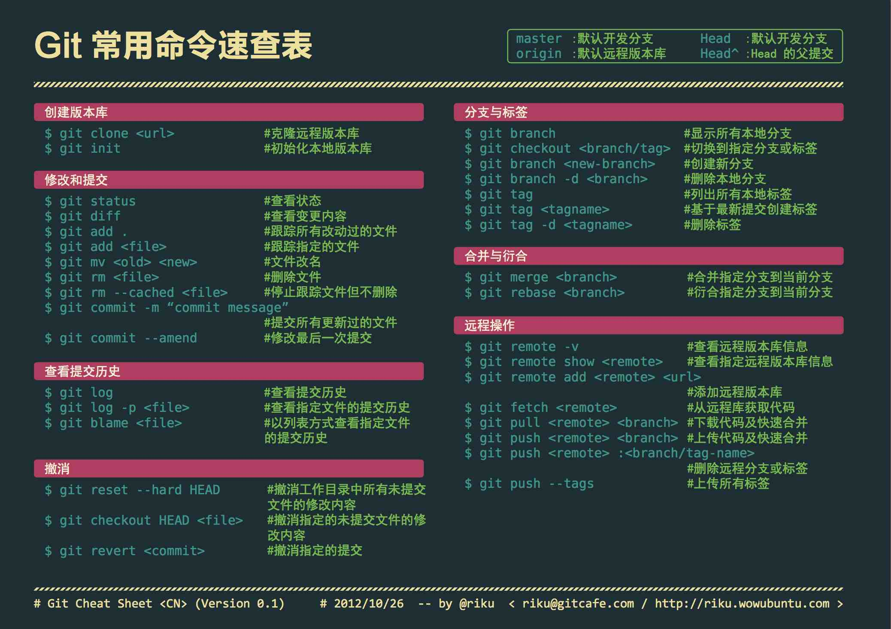

# Git使用

## 工作区说明


| 名称            | 说明                                                        |
| ------------- | --------------------------------------------------------- |
| Workspace     | 工作区，就是你平时存放项目代码的地方。                                       |
| Index / Stage | 暂存区，用于临时存放你的改动，事实上它只是一个文件，保存即将提交到文件列表信息。                  |
| Repository    | 仓库区（或版本库），就是安全存放数据的位置，这里面有你提交到所有版本的数据。其中 HEAD 指向最新放入仓库的版本 |
| Remote        | 远程仓库                                                      |

## 分支说明

| 名称    | 说明                |
| ------- | ------------------- |
| origin  | 源,远程服务器，默认 |
| master  | 主分支              |
| hotfix  | 修补bug             |
| release | 发放版本            |
| develop | 开发版本            |
| feature | 功能版本            |

## 回滚参数说明

| 状态 | 说明              |
| ---- | ----------------- |
| HEAD | 最新版本          |
| ~    | 上一个版本        |
| ~n   | 上n个版本         |
| ^    | 步数，一个^，一步 |

## 常用命令



## 常用功能

### 一、强制更新本地

``` shell
#--- 
# 普通更新
git pull origin master/develop 

#--- 
# 强制跟新本地
git fetch --all
# 将head指向origin master
git reset --hard origin/master
```

### 二、回滚


### 三、版本比较

命令：git diff [OPTION]

``` shell 
git diff  # workspace 与 index
```

OPTION

```shell
--chche 版本号 # 对比 index 与 Repository 中指定版本
--chche # 对比 index 与 Repository 

HEAD # workspace 与 Repository

版本号 # 对比 workspace 与 Repository

```

### 四、更新远程分支到本地

#### Ⅰ、直接克隆分支

1. 克隆项目：`git clone -b <分支名> <项目路径>` 
2. 查看分支：`git branch -a` 

#### Ⅱ、通过fetch命令

1. 克隆项目：`git clone <项目路径>` 
2. 切换到项目路径下
3. 拉取远程分支：`git fetch` 
4. 切换到目标分支：`git checkout <分支名称>` 
5.  查看分支：`git branch -a` 

#### Ⅲ、通过checkout命令

1. 克隆项目：`git clone <项目路径>` 
2. 切换到项目路径下
3. 拉取远程分支：`git checkout -b <本地分支名> <origin/远程分支名称>` 
4. 下载分支代码：`git pull origin <分支名称>` 
5.  查看分支：`git branch -a` 

## 使用SSH Key

1. 生成ssk公钥

    `ssh-keygen -t rsa -C "添加注释，一般为邮箱" -f "指定用来保存密钥的文件名"`

2. 确定密钥保存位置

    ```shell
    Enter file in which to save the key
    (/Users/your_user_directory/.ssh/id_rsa): 按回车键
    ```

3. 输入密码密码

    ``` shell
    Enter same passphrase again: 再次输入密码
    shellEnter passphrase (empty for no passphrase): 输入密码(一般不输入密码，直接回车)
    ```

4. 查看公钥内容

    ``` shell
    # LINUX
    cat ~/.ssh/id_rsa.pub
    
    # WINDOWS
    # 直接使用记事本打开
    ```

5. 测试GIT是否成功

    ``` shell
    # github
    ssh -T git@github.com
    # 返回
    Hi WillOfTree! You've successfully authenticated, but GitHub does not provide shell access.
    ```

6. github修改配置文件

    ```shell
    # 位置：.git 文件夹下 config 中的url
    [remote "origin"]
    url = https://github.com/humingx/humingx.github.io.git
    fetch = +refs/heads/*:refs/remotes/origin/*
    # 将https地址修改为ssh的地址
    [remote "origin"]
    url = git@github.com:humingx/humingx.github.io.git
    fetch = +refs/heads/*:refs/remotes/origin/*
    ```

## 错误信息

### 1、SECURITY WARNING

```shell
warning: ----------------- SECURITY WARNING ----------------
warning: | TLS certificate verification has been disabled! |
warning: ---------------------------------------------------
warning: HTTPS connections may not be secure. See https://aka.ms/gcm/tlsverify for more information.
```

解决方法：

```shell
git config --global http.sslVerify true
```

### 2、中文乱码

```shell
git config --global core.quotepath false
```

### 3、443错误

```shell
fatal: unable to access 'https://github.com/WillOfTree/whiteZe.git/': Failed to connect to github.com port 443 after 21133 ms: Timed out
```

解决方法一：使用代理服务

解决方法二：取消代理服务

```shell
git config --global --unset http.proxy
git config --global --unset https.proxy
```
