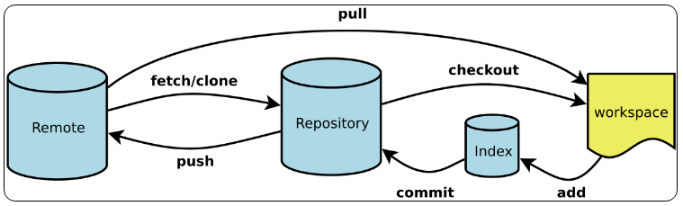

# Git使用

## 工作区说明



| 名称            | 说明                                                        |
| ------------- | --------------------------------------------------------- |
| Workspace     | 工作区，就是你平时存放项目代码的地方。                                       |
| Index / Stage | 暂存区，用于临时存放你的改动，事实上它只是一个文件，保存即将提交到文件列表信息。                  |
| Repository    | 仓库区（或版本库），就是安全存放数据的位置，这里面有你提交到所有版本的数据。其中 HEAD 指向最新放入仓库的版本 |
| Remote        | 远程仓库                                                      |

## 常用命令

```shell
git status # 查看工作状态
git diff   # 查看修改
git log    # 日志
git log --decorate --all --oneline --graph
```

### 一、在github中创建项目

1. New repository（创建新仓库）
2. 填写仓库名称（repository name）
3. 填写desscription（描述）【可不填】
4. 默认选择public（公开），付费可选择private（私有）
5. 是否添加readme文件【可不填】
6. Create repository

### 二、克隆远程项目

1. 得到项目地址。
2. 创建项目文件夹，进入项目文件夹。
3. git clone 项目地址

### 三、本地有项目

1. 在本地创建项目文件
2. Git init
3. Git config user.email “邮箱地址”【配置邮箱地址】（也可以一开始就配置）
4. Git add 文件名【添加文件】
5. Git commit -m “记录”【添加日志】
6. git remote add origin  github地址【向github添加文件】
7. Git push origin master

### 四、上传文件到github

1. Git add README.md【添加readme文件】

2. Git commit -m “xxxx” 【添加备注信息】

3. git push -u origin master【上传文件】

    -u 是下次不用填写origin master

### 五、更新本地

``` shell
#--- 
# 普通更新
git pull origin master/develop 

#--- 
# 强制跟新本地
git fetch --all
# 将head指向origin master
git reset --hard origin/master
```

## 退回

### 1、回滚指针

当向前滚动时，可使用 git checkout 将已经删除的文件生成

**命令：**git reset [OPTION] [time]

**参数：**OPTION

```shell
--soft  # 移动 head 指针，不会改变 workspace 和 index 的内容

--mixed # 移动 head 指针，不会改变 workspace , 改变 index 内容, 默认

--hard  # 当前 head 指针、workspace 和 index 内容全部改变
```

**参数：**[time]

| 状态   | 说明        |
| ---- | --------- |
| HEAD | 最新版本      |
| \~   | 上一个版本     |
| \~n  | 上n个版本     |
| ^    | 步数，一个^，一步 |

**例子**

```shell
git reset HEAD~ # 退回上一个版本
git reset 版本号 文件名 # 回滚个别文件
git reset 版本号 # 回到指定版本，版本号可略写
```

**回看版本**

```shell
git reflog
```

### 2、git checkout [OPTION| file]

```shell
git checkout .  # 用 index 内容覆盖 workspace 内容
git checkout -- <file> # 用 index 内容覆盖 workspace 内容
```

## 版本比较

命令：git diff [OPTION]

``` shell 
git diff  # workspace 与 index
```

OPTION

```shell
--chche 版本号 # 对比 index 与 Repository 中指定版本
--chche # 对比 index 与 Repository 

HEAD # workspace 与 Repository

版本号 # 对比 workspace 与 Repository

```

## 修改最后一次提交

```shell
git commit --amend # 修改提交说明
git commit --amend -m "xxx" # 修改提交说明
```

## 删除文件

```shell
git rm <file>
```

## 分支命令

| 名称      | 说明         |
| ------- | ---------- |
| origin  | 源,远程服务器，默认 |
| master  | 主分支        |
| hotfix  | 修补bug      |
| release | 发放版本       |
| develop | 开发版本       |
| feature | 功能版本       |

### 1、创建

```shell
git branch <name>  # 创建分支
git branch - <name> # 删除分支

git checkout <name> # 切换分支
    git checkout -b <name> # 创建分支，并切换

git merge <name> # 合并指定分支
```

### 2、冲突

git 会给冲突的文件标示冲突的位置

> <<<<<<<<<< HEAD
> 
> 文件1冲突内容
> 
> ====
> 文件2冲突内容
> 
> \>\>\>\>\>\>feature

### 3、匿名分支

内容不会被保存

```shell
git checkout HEAD~ # 会生成匿名分支，
```

## 创建github的个人页面

1. 进入项目
2. Setting【设置】
3. GitHub Pages【github页面】
4. Source选项下的master branch选项
5. Save
6. Source旁会出现一个github域名的url地址

## 使用SSH Key

1. 生成ssk公钥

    `ssh-keygen -t rsa -C "添加注释，一般为邮箱" -f "指定用来保存密钥的文件名"`

2. 确定密钥保存位置

    ```shell
    Enter file in which to save the key
    (/Users/your_user_directory/.ssh/id_rsa): 按回车键
    ```

3. 输入密码密码

    ``` shell
    Enter same passphrase again: 再次输入密码
    shellEnter passphrase (empty for no passphrase): 输入密码(一般不输入密码，直接回车)
    ```

4. 查看公钥内容

    ``` shell
    # LINUX
    cat ~/.ssh/id_rsa.pub
    
    # WINDOWS
    # 直接使用记事本打开
    ```

5. 测试GIT是否成功

    ``` shell
    # github
    ssh -T git@github.com
    # 返回
    Hi WillOfTree! You've successfully authenticated, but GitHub does not provide shell access.
    ```

6. github修改配置文件

    ```shell
    # 位置：.git 文件夹下 config 中的url
    [remote "origin"]
    url = https://github.com/humingx/humingx.github.io.git
    fetch = +refs/heads/*:refs/remotes/origin/*
    # 将https地址修改为ssh的地址
    [remote "origin"]
    url = git@github.com:humingx/humingx.github.io.git
    fetch = +refs/heads/*:refs/remotes/origin/*
    ```

## 错误信息

### 1、SECURITY WARNING

```shell
warning: ----------------- SECURITY WARNING ----------------
warning: | TLS certificate verification has been disabled! |
warning: ---------------------------------------------------
warning: HTTPS connections may not be secure. See https://aka.ms/gcm/tlsverify for more information.
```

解决方法：

```shell
git config --global http.sslVerify true
```

### 2、中文乱码

```shell
git config --global core.quotepath false
```

### 3、443错误

```shell
fatal: unable to access 'https://github.com/WillOfTree/whiteZe.git/': Failed to connect to github.com port 443 after 21133 ms: Timed out
```

解决方法一：使用代理服务

解决方法二：取消代理服务

```shell
git config --global --unset http.proxy
git config --global --unset https.proxy
```
